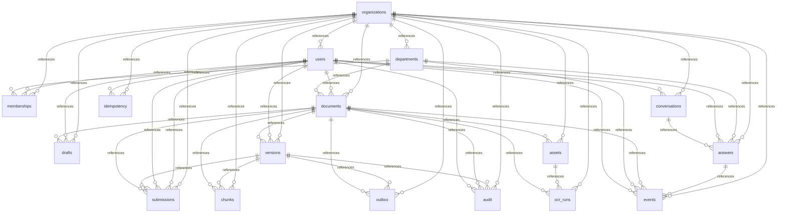

<!-- 実装から生成。直接編集しない。入力SHA256: 8ddb6b8d66f674570acb431243c0b3f3887134895acc19f3980f35e395ebe090 -->

# 実装データモデル

17テーブル。manifest/evidence/OCRを検証付きJSONとして固定します。企画段階の33テーブル案を統合しました。複合参照制約とAPI認可で保護します。

## organizations

| 属性・制約 | DDL |
| --- | --- |
| columndef | id VARCHAR(36) NOT NULL |
| columndef | organization_id VARCHAR(36) NOT NULL |
| columndef | name TEXT NOT NULL |
| columndef | revision BIGINT NOT NULL |
| columndef | suspended BOOLEAN NOT NULL |
| primarykey | PRIMARY KEY (id) |
| uniquecolumnconstraint | UNIQUE (organization_id, id) |

| access pattern | 操作 |
| --- | --- |
| organizations_fence | UPDATE |
| organizations_get | SELECT |
| organizations_insert | INSERT |
| organizations_list | SELECT |
| organizations_update | UPDATE |

## users

| 属性・制約 | DDL |
| --- | --- |
| columndef | id VARCHAR(36) NOT NULL |
| columndef | organization_id VARCHAR(36) NOT NULL |
| columndef | subject TEXT NOT NULL |
| columndef | display_name TEXT NOT NULL |
| columndef | active BOOLEAN NOT NULL |
| columndef | operator BOOLEAN NOT NULL |
| primarykey | PRIMARY KEY (id) |
| uniquecolumnconstraint | UNIQUE (organization_id, id) |
| uniquecolumnconstraint | UNIQUE (organization_id, subject) |
| foreignkey | FOREIGN KEY (organization_id) REFERENCES organizations (id) |

| access pattern | 操作 |
| --- | --- |
| users_get | SELECT |
| users_insert | INSERT |
| users_list | SELECT |
| users_update | UPDATE |

## departments

| 属性・制約 | DDL |
| --- | --- |
| columndef | id VARCHAR(36) NOT NULL |
| columndef | organization_id VARCHAR(36) NOT NULL |
| columndef | name TEXT NOT NULL |
| columndef | active BOOLEAN NOT NULL |
| primarykey | PRIMARY KEY (id) |
| uniquecolumnconstraint | UNIQUE (organization_id, id) |
| foreignkey | FOREIGN KEY (organization_id) REFERENCES organizations (id) |

| access pattern | 操作 |
| --- | --- |
| departments_get | SELECT |
| departments_insert | INSERT |
| departments_list | SELECT |
| departments_update | UPDATE |

## memberships

| 属性・制約 | DDL |
| --- | --- |
| columndef | id VARCHAR(36) NOT NULL |
| columndef | organization_id VARCHAR(36) NOT NULL |
| columndef | department_id VARCHAR(36) NOT NULL |
| columndef | user_id VARCHAR(36) NOT NULL |
| columndef | leader BOOLEAN NOT NULL |
| columndef | can_author BOOLEAN NOT NULL |
| columndef | can_review BOOLEAN NOT NULL |
| columndef | active BOOLEAN NOT NULL |
| primarykey | PRIMARY KEY (id) |
| uniquecolumnconstraint | UNIQUE (organization_id, id) |
| uniquecolumnconstraint | UNIQUE (organization_id, department_id, user_id) |
| foreignkey | FOREIGN KEY (organization_id, department_id) REFERENCES departments (organization_id, id) |
| foreignkey | FOREIGN KEY (organization_id, user_id) REFERENCES users (organization_id, id) |
| foreignkey | FOREIGN KEY (organization_id) REFERENCES organizations (id) |

| access pattern | 操作 |
| --- | --- |
| memberships_delete | DELETE |
| memberships_get | SELECT |
| memberships_insert | INSERT |
| memberships_list | SELECT |
| memberships_update | UPDATE |

## documents

| 属性・制約 | DDL |
| --- | --- |
| columndef | id VARCHAR(36) NOT NULL |
| columndef | organization_id VARCHAR(36) NOT NULL |
| columndef | department_id VARCHAR(36) NOT NULL |
| columndef | title TEXT NOT NULL |
| columndef | created_by VARCHAR(36) NOT NULL |
| columndef | visibility VARCHAR(20) NOT NULL |
| columndef | shared_departments TEXT NOT NULL |
| columndef | status VARCHAR(20) NOT NULL |
| columndef | revision BIGINT NOT NULL |
| columndef | next_version BIGINT NOT NULL |
| columndef | latest_version_id VARCHAR(36) |
| columndef | updated_at TIMESTAMPTZ NOT NULL |
| primarykey | PRIMARY KEY (id) |
| uniquecolumnconstraint | UNIQUE (organization_id, id) |
| foreignkey | FOREIGN KEY (organization_id, department_id) REFERENCES departments (organization_id, id) |
| foreignkey | FOREIGN KEY (organization_id, created_by) REFERENCES users (organization_id, id) |
| checkcolumnconstraint | CHECK (visibility IN ('department', 'selected', 'organization')) |
| checkcolumnconstraint | CHECK (status IN ('active', 'withdrawn', 'deleted')) |
| foreignkey | FOREIGN KEY (organization_id) REFERENCES organizations (id) |

| access pattern | 操作 |
| --- | --- |
| documents_delete | DELETE |
| documents_get | SELECT |
| documents_insert | INSERT |
| documents_list | SELECT |
| documents_update | UPDATE |

## drafts

| 属性・制約 | DDL |
| --- | --- |
| columndef | id VARCHAR(36) NOT NULL |
| columndef | organization_id VARCHAR(36) NOT NULL |
| columndef | document_id VARCHAR(36) NOT NULL |
| columndef | body_key TEXT NOT NULL |
| columndef | body_hash VARCHAR(64) NOT NULL |
| columndef | placements TEXT NOT NULL |
| columndef | revision BIGINT NOT NULL |
| columndef | updated_by VARCHAR(36) NOT NULL |
| primarykey | PRIMARY KEY (id) |
| uniquecolumnconstraint | UNIQUE (organization_id, id) |
| uniquecolumnconstraint | UNIQUE (organization_id, document_id) |
| foreignkey | FOREIGN KEY (organization_id, document_id) REFERENCES documents (organization_id, id) |
| foreignkey | FOREIGN KEY (organization_id, updated_by) REFERENCES users (organization_id, id) |
| foreignkey | FOREIGN KEY (organization_id) REFERENCES organizations (id) |

| access pattern | 操作 |
| --- | --- |
| drafts_delete | DELETE |
| drafts_get | SELECT |
| drafts_insert | INSERT |
| drafts_list | SELECT |
| drafts_update | UPDATE |

## versions

| 属性・制約 | DDL |
| --- | --- |
| columndef | id VARCHAR(36) NOT NULL |
| columndef | organization_id VARCHAR(36) NOT NULL |
| columndef | document_id VARCHAR(36) NOT NULL |
| columndef | number BIGINT NOT NULL |
| columndef | title TEXT NOT NULL |
| columndef | body_key TEXT NOT NULL |
| columndef | body_hash VARCHAR(64) NOT NULL |
| columndef | manifest TEXT NOT NULL |
| columndef | manifest_hash VARCHAR(64) NOT NULL |
| columndef | created_by VARCHAR(36) NOT NULL |
| columndef | created_at TIMESTAMPTZ NOT NULL |
| primarykey | PRIMARY KEY (id) |
| uniquecolumnconstraint | UNIQUE (organization_id, id) |
| uniquecolumnconstraint | UNIQUE (organization_id, document_id, id) |
| uniquecolumnconstraint | UNIQUE (organization_id, document_id, number) |
| foreignkey | FOREIGN KEY (organization_id, document_id) REFERENCES documents (organization_id, id) |
| foreignkey | FOREIGN KEY (organization_id, created_by) REFERENCES users (organization_id, id) |
| foreignkey | FOREIGN KEY (organization_id) REFERENCES organizations (id) |

| access pattern | 操作 |
| --- | --- |
| versions_delete | DELETE |
| versions_get | SELECT |
| versions_insert | INSERT |
| versions_list | SELECT |

## submissions

| 属性・制約 | DDL |
| --- | --- |
| columndef | id VARCHAR(36) NOT NULL |
| columndef | organization_id VARCHAR(36) NOT NULL |
| columndef | document_id VARCHAR(36) NOT NULL |
| columndef | version_id VARCHAR(36) NOT NULL |
| columndef | requested_by VARCHAR(36) NOT NULL |
| columndef | status VARCHAR(20) NOT NULL |
| columndef | manifest_hash VARCHAR(64) NOT NULL |
| columndef | decided_by VARCHAR(36) |
| columndef | reason TEXT NOT NULL |
| columndef | created_at TIMESTAMPTZ NOT NULL |
| columndef | decided_at TIMESTAMPTZ |
| primarykey | PRIMARY KEY (id) |
| uniquecolumnconstraint | UNIQUE (organization_id, id) |
| uniquecolumnconstraint | UNIQUE (organization_id, version_id) |
| foreignkey | FOREIGN KEY (organization_id, document_id) REFERENCES documents (organization_id, id) |
| foreignkey | FOREIGN KEY (organization_id, document_id, version_id) REFERENCES versions (organization_id, document_id, id) |
| foreignkey | FOREIGN KEY (organization_id, requested_by) REFERENCES users (organization_id, id) |
| foreignkey | FOREIGN KEY (organization_id, decided_by) REFERENCES users (organization_id, id) |
| checkcolumnconstraint | CHECK (status IN ('pending', 'approved', 'rejected')) |
| foreignkey | FOREIGN KEY (organization_id) REFERENCES organizations (id) |

| access pattern | 操作 |
| --- | --- |
| submissions_delete | DELETE |
| submissions_get | SELECT |
| submissions_insert | INSERT |
| submissions_list | SELECT |
| submissions_update | UPDATE |

## assets

| 属性・制約 | DDL |
| --- | --- |
| columndef | id VARCHAR(36) NOT NULL |
| columndef | organization_id VARCHAR(36) NOT NULL |
| columndef | document_id VARCHAR(36) NOT NULL |
| columndef | object_key TEXT NOT NULL |
| columndef | sha256 VARCHAR(64) NOT NULL |
| columndef | media_type VARCHAR(20) NOT NULL |
| columndef | width BIGINT NOT NULL |
| columndef | height BIGINT NOT NULL |
| columndef | size BIGINT NOT NULL |
| columndef | created_at TIMESTAMPTZ NOT NULL |
| primarykey | PRIMARY KEY (id) |
| uniquecolumnconstraint | UNIQUE (organization_id, id) |
| uniquecolumnconstraint | UNIQUE (organization_id, document_id, id) |
| foreignkey | FOREIGN KEY (organization_id, document_id) REFERENCES documents (organization_id, id) |
| foreignkey | FOREIGN KEY (organization_id) REFERENCES organizations (id) |

| access pattern | 操作 |
| --- | --- |
| assets_delete | DELETE |
| assets_get | SELECT |
| assets_insert | INSERT |
| assets_list | SELECT |

## ocr_runs

| 属性・制約 | DDL |
| --- | --- |
| columndef | id VARCHAR(36) NOT NULL |
| columndef | organization_id VARCHAR(36) NOT NULL |
| columndef | document_id VARCHAR(36) NOT NULL |
| columndef | asset_id VARCHAR(36) NOT NULL |
| columndef | result_key TEXT NOT NULL |
| columndef | result_hash VARCHAR(64) NOT NULL |
| columndef | engine TEXT NOT NULL |
| columndef | status VARCHAR(20) NOT NULL |
| columndef | confirmed BOOLEAN NOT NULL |
| columndef | created_at TIMESTAMPTZ NOT NULL |
| primarykey | PRIMARY KEY (id) |
| uniquecolumnconstraint | UNIQUE (organization_id, id) |
| foreignkey | FOREIGN KEY (organization_id, document_id) REFERENCES documents (organization_id, id) |
| foreignkey | FOREIGN KEY (organization_id, document_id, asset_id) REFERENCES assets (organization_id, document_id, id) |
| foreignkey | FOREIGN KEY (organization_id) REFERENCES organizations (id) |

| access pattern | 操作 |
| --- | --- |
| ocr_runs_delete | DELETE |
| ocr_runs_get | SELECT |
| ocr_runs_insert | INSERT |
| ocr_runs_list | SELECT |

## chunks

| 属性・制約 | DDL |
| --- | --- |
| columndef | id VARCHAR(36) NOT NULL |
| columndef | organization_id VARCHAR(36) NOT NULL |
| columndef | document_id VARCHAR(36) NOT NULL |
| columndef | version_id VARCHAR(36) NOT NULL |
| columndef | body_key TEXT NOT NULL |
| columndef | sha256 VARCHAR(64) NOT NULL |
| columndef | heading TEXT NOT NULL |
| columndef | placements TEXT NOT NULL |
| columndef | manifest_hash VARCHAR(64) NOT NULL |
| columndef | ready BOOLEAN NOT NULL |
| primarykey | PRIMARY KEY (id) |
| uniquecolumnconstraint | UNIQUE (organization_id, id) |
| foreignkey | FOREIGN KEY (organization_id, document_id) REFERENCES documents (organization_id, id) |
| foreignkey | FOREIGN KEY (organization_id, document_id, version_id) REFERENCES versions (organization_id, document_id, id) |
| foreignkey | FOREIGN KEY (organization_id) REFERENCES organizations (id) |

| access pattern | 操作 |
| --- | --- |
| chunks_delete | DELETE |
| chunks_get | SELECT |
| chunks_insert | INSERT |
| chunks_list | SELECT |
| chunks_update | UPDATE |

## outbox

| 属性・制約 | DDL |
| --- | --- |
| columndef | id VARCHAR(36) NOT NULL |
| columndef | organization_id VARCHAR(36) NOT NULL |
| columndef | document_id VARCHAR(36) NOT NULL |
| columndef | version_id VARCHAR(36) |
| columndef | kind VARCHAR(20) NOT NULL |
| columndef | status VARCHAR(20) NOT NULL |
| columndef | attempts BIGINT NOT NULL |
| columndef | error_code TEXT NOT NULL |
| columndef | created_at TIMESTAMPTZ NOT NULL |
| primarykey | PRIMARY KEY (id) |
| uniquecolumnconstraint | UNIQUE (organization_id, id) |
| foreignkey | FOREIGN KEY (organization_id, document_id) REFERENCES documents (organization_id, id) |
| foreignkey | FOREIGN KEY (organization_id, document_id, version_id) REFERENCES versions (organization_id, document_id, id) |
| foreignkey | FOREIGN KEY (organization_id) REFERENCES organizations (id) |

| access pattern | 操作 |
| --- | --- |
| outbox_delete | DELETE |
| outbox_get | SELECT |
| outbox_insert | INSERT |
| outbox_list | SELECT |
| outbox_update | UPDATE |

## conversations

| 属性・制約 | DDL |
| --- | --- |
| columndef | id VARCHAR(36) NOT NULL |
| columndef | organization_id VARCHAR(36) NOT NULL |
| columndef | user_id VARCHAR(36) NOT NULL |
| columndef | created_at TIMESTAMPTZ NOT NULL |
| primarykey | PRIMARY KEY (id) |
| uniquecolumnconstraint | UNIQUE (organization_id, id) |
| foreignkey | FOREIGN KEY (organization_id, user_id) REFERENCES users (organization_id, id) |
| foreignkey | FOREIGN KEY (organization_id) REFERENCES organizations (id) |

| access pattern | 操作 |
| --- | --- |
| conversations_delete | DELETE |
| conversations_get | SELECT |
| conversations_insert | INSERT |
| conversations_list | SELECT |
| conversations_update | UPDATE |

## answers

| 属性・制約 | DDL |
| --- | --- |
| columndef | id VARCHAR(36) NOT NULL |
| columndef | organization_id VARCHAR(36) NOT NULL |
| columndef | conversation_id VARCHAR(36) NOT NULL |
| columndef | user_id VARCHAR(36) NOT NULL |
| columndef | department_id VARCHAR(36) NOT NULL |
| columndef | question_key TEXT NOT NULL |
| columndef | answer_key TEXT NOT NULL |
| columndef | evidence TEXT NOT NULL |
| columndef | status VARCHAR(20) NOT NULL |
| columndef | model TEXT NOT NULL |
| columndef | created_at TIMESTAMPTZ NOT NULL |
| primarykey | PRIMARY KEY (id) |
| uniquecolumnconstraint | UNIQUE (organization_id, id) |
| foreignkey | FOREIGN KEY (organization_id, conversation_id) REFERENCES conversations (organization_id, id) |
| foreignkey | FOREIGN KEY (organization_id, user_id) REFERENCES users (organization_id, id) |
| foreignkey | FOREIGN KEY (organization_id, department_id) REFERENCES departments (organization_id, id) |
| foreignkey | FOREIGN KEY (organization_id) REFERENCES organizations (id) |

| access pattern | 操作 |
| --- | --- |
| answers_delete | DELETE |
| answers_get | SELECT |
| answers_insert | INSERT |
| answers_list | SELECT |
| answers_update | UPDATE |

## events

| 属性・制約 | DDL |
| --- | --- |
| columndef | id VARCHAR(36) NOT NULL |
| columndef | organization_id VARCHAR(36) NOT NULL |
| columndef | user_id VARCHAR(36) NOT NULL |
| columndef | department_id VARCHAR(36) NOT NULL |
| columndef | document_id VARCHAR(36) |
| columndef | answer_id VARCHAR(36) |
| columndef | kind VARCHAR(20) NOT NULL |
| columndef | outcome VARCHAR(20) NOT NULL |
| columndef | created_at TIMESTAMPTZ NOT NULL |
| primarykey | PRIMARY KEY (id) |
| uniquecolumnconstraint | UNIQUE (organization_id, id) |
| foreignkey | FOREIGN KEY (organization_id, user_id) REFERENCES users (organization_id, id) |
| foreignkey | FOREIGN KEY (organization_id, department_id) REFERENCES departments (organization_id, id) |
| foreignkey | FOREIGN KEY (organization_id, document_id) REFERENCES documents (organization_id, id) |
| foreignkey | FOREIGN KEY (organization_id, answer_id) REFERENCES answers (organization_id, id) |
| foreignkey | FOREIGN KEY (organization_id) REFERENCES organizations (id) |

| access pattern | 操作 |
| --- | --- |
| events_get | SELECT |
| events_insert | INSERT |
| events_list | SELECT |

## idempotency

| 属性・制約 | DDL |
| --- | --- |
| columndef | id VARCHAR(36) NOT NULL |
| columndef | organization_id VARCHAR(36) NOT NULL |
| columndef | user_id VARCHAR(36) NOT NULL |
| columndef | operation TEXT NOT NULL |
| columndef | request_hash VARCHAR(64) NOT NULL |
| columndef | response TEXT NOT NULL |
| primarykey | PRIMARY KEY (id) |
| uniquecolumnconstraint | UNIQUE (organization_id, id) |
| foreignkey | FOREIGN KEY (organization_id, user_id) REFERENCES users (organization_id, id) |
| foreignkey | FOREIGN KEY (organization_id) REFERENCES organizations (id) |

| access pattern | 操作 |
| --- | --- |
| idempotency_get | SELECT |
| idempotency_insert | INSERT |
| idempotency_list | SELECT |

## audit

| 属性・制約 | DDL |
| --- | --- |
| columndef | id VARCHAR(36) NOT NULL |
| columndef | organization_id VARCHAR(36) NOT NULL |
| columndef | user_id VARCHAR(36) NOT NULL |
| columndef | document_id VARCHAR(36) |
| columndef | version_id VARCHAR(36) |
| columndef | action VARCHAR(30) NOT NULL |
| columndef | before_state TEXT NOT NULL |
| columndef | after_state TEXT NOT NULL |
| columndef | reason TEXT NOT NULL |
| columndef | created_at TIMESTAMPTZ NOT NULL |
| primarykey | PRIMARY KEY (id) |
| uniquecolumnconstraint | UNIQUE (organization_id, id) |
| foreignkey | FOREIGN KEY (organization_id, user_id) REFERENCES users (organization_id, id) |
| foreignkey | FOREIGN KEY (organization_id, document_id) REFERENCES documents (organization_id, id) |
| foreignkey | FOREIGN KEY (organization_id, version_id) REFERENCES versions (organization_id, id) |
| foreignkey | FOREIGN KEY (organization_id) REFERENCES organizations (id) |

| access pattern | 操作 |
| --- | --- |
| audit_get | SELECT |
| audit_insert | INSERT |
| audit_list | SELECT |
