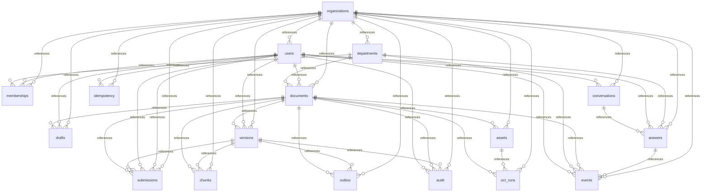

<!-- 実装から生成。直接編集しない。入力SHA256: dc958b6e6841a9f29856eb932e8271e37a6d4416a3266624301c411c89949f81 -->

# 実装データモデル

17テーブル。manifest/evidence/OCRを検証付きJSONとして固定します。企画段階の33テーブル案を統合しました。複合参照制約とAPI認可で保護します。

## organizations

| 属性・制約 | DDL |
| --- | --- |
| columndef | id VARCHAR(36) NOT NULL |
| columndef | organization_id VARCHAR(36) NOT NULL |
| columndef | name TEXT NOT NULL |
| columndef | revision BIGINT NOT NULL |
| columndef | suspended BOOLEAN NOT NULL |
| primarykey | PRIMARY KEY (id) |
| uniquecolumnconstraint | UNIQUE (organization_id, id) |

| access pattern | 操作 |
| --- | --- |
| kotorelay.operations.system.authorization.generated.queries.organizations_fence | UPDATE |
| kotorelay.operations.system.authorization.generated.queries.organizations_get | SELECT |
| kotorelay.operations.system.bootstrap.generated.queries.organizations_get | SELECT |
| kotorelay.operations.system.bootstrap.generated.queries.organizations_insert | INSERT |

## users

| 属性・制約 | DDL |
| --- | --- |
| columndef | id VARCHAR(36) NOT NULL |
| columndef | organization_id VARCHAR(36) NOT NULL |
| columndef | subject TEXT NOT NULL |
| columndef | display_name TEXT NOT NULL |
| columndef | active BOOLEAN NOT NULL |
| columndef | operator BOOLEAN NOT NULL |
| primarykey | PRIMARY KEY (id) |
| uniquecolumnconstraint | UNIQUE (organization_id, id) |
| uniquecolumnconstraint | UNIQUE (organization_id, subject) |
| foreignkey | FOREIGN KEY (organization_id) REFERENCES organizations (id) |

| access pattern | 操作 |
| --- | --- |
| kotorelay.operations.groups.change_membership.generated.queries.users_get | SELECT |
| kotorelay.operations.groups.list_members.generated.queries.users_list | SELECT |
| kotorelay.operations.reviews.list_reviews.generated.queries.users_list | SELECT |
| kotorelay.operations.system.authorization.generated.queries.users_list | SELECT |
| kotorelay.operations.system.bootstrap.generated.queries.users_insert | INSERT |

## departments

| 属性・制約 | DDL |
| --- | --- |
| columndef | id VARCHAR(36) NOT NULL |
| columndef | organization_id VARCHAR(36) NOT NULL |
| columndef | name TEXT NOT NULL |
| columndef | active BOOLEAN NOT NULL |
| primarykey | PRIMARY KEY (id) |
| uniquecolumnconstraint | UNIQUE (organization_id, id) |
| foreignkey | FOREIGN KEY (organization_id) REFERENCES organizations (id) |

| access pattern | 操作 |
| --- | --- |
| kotorelay.operations.documents.change_policy.generated.queries.departments_list | SELECT |
| kotorelay.operations.groups.change_membership.generated.queries.departments_get | SELECT |
| kotorelay.operations.groups.get_identity.generated.queries.departments_list | SELECT |
| kotorelay.operations.reviews.list_reviews.generated.queries.departments_list | SELECT |
| kotorelay.operations.system.authorization.generated.queries.departments_list | SELECT |
| kotorelay.operations.system.bootstrap.generated.queries.departments_insert | INSERT |

## memberships

| 属性・制約 | DDL |
| --- | --- |
| columndef | id VARCHAR(36) NOT NULL |
| columndef | organization_id VARCHAR(36) NOT NULL |
| columndef | department_id VARCHAR(36) NOT NULL |
| columndef | user_id VARCHAR(36) NOT NULL |
| columndef | leader BOOLEAN NOT NULL |
| columndef | can_author BOOLEAN NOT NULL |
| columndef | can_review BOOLEAN NOT NULL |
| columndef | active BOOLEAN NOT NULL |
| primarykey | PRIMARY KEY (id) |
| uniquecolumnconstraint | UNIQUE (organization_id, id) |
| uniquecolumnconstraint | UNIQUE (organization_id, department_id, user_id) |
| foreignkey | FOREIGN KEY (organization_id, department_id) REFERENCES departments (organization_id, id) |
| foreignkey | FOREIGN KEY (organization_id, user_id) REFERENCES users (organization_id, id) |
| foreignkey | FOREIGN KEY (organization_id) REFERENCES organizations (id) |

| access pattern | 操作 |
| --- | --- |
| kotorelay.operations.groups.change_membership.generated.queries.memberships_insert | INSERT |
| kotorelay.operations.groups.change_membership.generated.queries.memberships_list | SELECT |
| kotorelay.operations.groups.change_membership.generated.queries.memberships_update | UPDATE |
| kotorelay.operations.groups.list_members.generated.queries.memberships_list | SELECT |
| kotorelay.operations.system.authorization.generated.queries.memberships_list | SELECT |
| kotorelay.operations.system.bootstrap.generated.queries.memberships_insert | INSERT |

## documents

| 属性・制約 | DDL |
| --- | --- |
| columndef | id VARCHAR(36) NOT NULL |
| columndef | organization_id VARCHAR(36) NOT NULL |
| columndef | department_id VARCHAR(36) NOT NULL |
| columndef | title TEXT NOT NULL |
| columndef | created_by VARCHAR(36) NOT NULL |
| columndef | visibility VARCHAR(20) NOT NULL |
| columndef | shared_departments TEXT NOT NULL |
| columndef | status VARCHAR(20) NOT NULL |
| columndef | revision BIGINT NOT NULL |
| columndef | next_version BIGINT NOT NULL |
| columndef | latest_version_id VARCHAR(36) |
| columndef | updated_at TIMESTAMPTZ NOT NULL |
| primarykey | PRIMARY KEY (id) |
| uniquecolumnconstraint | UNIQUE (organization_id, id) |
| foreignkey | FOREIGN KEY (organization_id, department_id) REFERENCES departments (organization_id, id) |
| foreignkey | FOREIGN KEY (organization_id, created_by) REFERENCES users (organization_id, id) |
| checkcolumnconstraint | CHECK (visibility IN ('department', 'selected', 'organization')) |
| checkcolumnconstraint | CHECK (status IN ('active', 'withdrawn', 'deleted')) |
| foreignkey | FOREIGN KEY (organization_id) REFERENCES organizations (id) |

| access pattern | 操作 |
| --- | --- |
| kotorelay.operations.chat.ask_question.generated.queries.documents_list | SELECT |
| kotorelay.operations.chat.shared.generated.queries.documents_get | SELECT |
| kotorelay.operations.documents.change_policy.generated.queries.documents_update | UPDATE |
| kotorelay.operations.documents.create_document.generated.queries.documents_insert | INSERT |
| kotorelay.operations.documents.list_documents.generated.queries.documents_by_department | SELECT |
| kotorelay.operations.documents.list_documents.generated.queries.documents_list | SELECT |
| kotorelay.operations.documents.read_document.generated.queries.documents_get | SELECT |
| kotorelay.operations.documents.save_draft.generated.queries.documents_update | UPDATE |
| kotorelay.operations.documents.submit_version.generated.queries.documents_update | UPDATE |
| kotorelay.operations.images.get_ocr.generated.queries.documents_get | SELECT |
| kotorelay.operations.images.shared.generated.queries.documents_get | SELECT |
| kotorelay.operations.indexing.list_jobs.generated.queries.documents_list | SELECT |
| kotorelay.operations.indexing.reconcile_index.generated.queries.documents_list | SELECT |
| kotorelay.operations.indexing.shared.generated.queries.documents_get | SELECT |
| kotorelay.operations.indexing.shared.generated.queries.documents_list | SELECT |
| kotorelay.operations.metrics.department_metrics.generated.queries.documents_list | SELECT |
| kotorelay.operations.reviews.decide_review.generated.queries.documents_update | UPDATE |
| kotorelay.operations.reviews.list_reviews.generated.queries.documents_list | SELECT |
| kotorelay.operations.system.authorization.generated.queries.documents_get | SELECT |

## drafts

| 属性・制約 | DDL |
| --- | --- |
| columndef | id VARCHAR(36) NOT NULL |
| columndef | organization_id VARCHAR(36) NOT NULL |
| columndef | document_id VARCHAR(36) NOT NULL |
| columndef | body_key TEXT NOT NULL |
| columndef | body_hash VARCHAR(64) NOT NULL |
| columndef | placements TEXT NOT NULL |
| columndef | revision BIGINT NOT NULL |
| columndef | updated_by VARCHAR(36) NOT NULL |
| primarykey | PRIMARY KEY (id) |
| uniquecolumnconstraint | UNIQUE (organization_id, id) |
| uniquecolumnconstraint | UNIQUE (organization_id, document_id) |
| foreignkey | FOREIGN KEY (organization_id, document_id) REFERENCES documents (organization_id, id) |
| foreignkey | FOREIGN KEY (organization_id, updated_by) REFERENCES users (organization_id, id) |
| foreignkey | FOREIGN KEY (organization_id) REFERENCES organizations (id) |

| access pattern | 操作 |
| --- | --- |
| kotorelay.operations.documents.create_document.generated.queries.drafts_insert | INSERT |
| kotorelay.operations.documents.save_draft.generated.queries.drafts_list | SELECT |
| kotorelay.operations.documents.save_draft.generated.queries.drafts_update | UPDATE |
| kotorelay.operations.documents.shared.generated.queries.drafts_list | SELECT |
| kotorelay.operations.documents.submit_version.generated.queries.drafts_list | SELECT |
| kotorelay.operations.indexing.shared.generated.queries.drafts_delete | DELETE |
| kotorelay.operations.indexing.shared.generated.queries.drafts_list | SELECT |

## versions

| 属性・制約 | DDL |
| --- | --- |
| columndef | id VARCHAR(36) NOT NULL |
| columndef | organization_id VARCHAR(36) NOT NULL |
| columndef | document_id VARCHAR(36) NOT NULL |
| columndef | number BIGINT NOT NULL |
| columndef | title TEXT NOT NULL |
| columndef | body_key TEXT NOT NULL |
| columndef | body_hash VARCHAR(64) NOT NULL |
| columndef | manifest TEXT NOT NULL |
| columndef | manifest_hash VARCHAR(64) NOT NULL |
| columndef | created_by VARCHAR(36) NOT NULL |
| columndef | created_at TIMESTAMPTZ NOT NULL |
| primarykey | PRIMARY KEY (id) |
| uniquecolumnconstraint | UNIQUE (organization_id, id) |
| uniquecolumnconstraint | UNIQUE (organization_id, document_id, id) |
| uniquecolumnconstraint | UNIQUE (organization_id, document_id, number) |
| foreignkey | FOREIGN KEY (organization_id, document_id) REFERENCES documents (organization_id, id) |
| foreignkey | FOREIGN KEY (organization_id, created_by) REFERENCES users (organization_id, id) |
| foreignkey | FOREIGN KEY (organization_id) REFERENCES organizations (id) |

| access pattern | 操作 |
| --- | --- |
| kotorelay.operations.chat.ask_question.generated.queries.versions_get | SELECT |
| kotorelay.operations.chat.shared.generated.queries.versions_get | SELECT |
| kotorelay.operations.documents.list_documents.generated.queries.versions_list | SELECT |
| kotorelay.operations.documents.submit_version.generated.queries.versions_insert | INSERT |
| kotorelay.operations.documents.version_history.generated.queries.versions_list | SELECT |
| kotorelay.operations.indexing.list_jobs.generated.queries.versions_list | SELECT |
| kotorelay.operations.indexing.shared.generated.queries.versions_get | SELECT |
| kotorelay.operations.indexing.shared.generated.queries.versions_list | SELECT |
| kotorelay.operations.reviews.decide_review.generated.queries.versions_get | SELECT |
| kotorelay.operations.reviews.list_reviews.generated.queries.versions_list | SELECT |
| kotorelay.operations.system.authorization.generated.queries.versions_get | SELECT |

## submissions

| 属性・制約 | DDL |
| --- | --- |
| columndef | id VARCHAR(36) NOT NULL |
| columndef | organization_id VARCHAR(36) NOT NULL |
| columndef | document_id VARCHAR(36) NOT NULL |
| columndef | version_id VARCHAR(36) NOT NULL |
| columndef | requested_by VARCHAR(36) NOT NULL |
| columndef | status VARCHAR(20) NOT NULL |
| columndef | manifest_hash VARCHAR(64) NOT NULL |
| columndef | decided_by VARCHAR(36) |
| columndef | reason TEXT NOT NULL |
| columndef | created_at TIMESTAMPTZ NOT NULL |
| columndef | decided_at TIMESTAMPTZ |
| primarykey | PRIMARY KEY (id) |
| uniquecolumnconstraint | UNIQUE (organization_id, id) |
| uniquecolumnconstraint | UNIQUE (organization_id, version_id) |
| foreignkey | FOREIGN KEY (organization_id, document_id) REFERENCES documents (organization_id, id) |
| foreignkey | FOREIGN KEY (organization_id, document_id, version_id) REFERENCES versions (organization_id, document_id, id) |
| foreignkey | FOREIGN KEY (organization_id, requested_by) REFERENCES users (organization_id, id) |
| foreignkey | FOREIGN KEY (organization_id, decided_by) REFERENCES users (organization_id, id) |
| checkcolumnconstraint | CHECK (status IN ('pending', 'approved', 'rejected')) |
| foreignkey | FOREIGN KEY (organization_id) REFERENCES organizations (id) |

| access pattern | 操作 |
| --- | --- |
| kotorelay.operations.documents.list_documents.generated.queries.submissions_list | SELECT |
| kotorelay.operations.documents.submit_version.generated.queries.submissions_insert | INSERT |
| kotorelay.operations.documents.version_history.generated.queries.submissions_list | SELECT |
| kotorelay.operations.reviews.decide_review.generated.queries.submissions_get | SELECT |
| kotorelay.operations.reviews.decide_review.generated.queries.submissions_update | UPDATE |
| kotorelay.operations.reviews.list_reviews.generated.queries.submissions_list | SELECT |

## assets

| 属性・制約 | DDL |
| --- | --- |
| columndef | id VARCHAR(36) NOT NULL |
| columndef | organization_id VARCHAR(36) NOT NULL |
| columndef | document_id VARCHAR(36) NOT NULL |
| columndef | object_key TEXT NOT NULL |
| columndef | sha256 VARCHAR(64) NOT NULL |
| columndef | media_type VARCHAR(20) NOT NULL |
| columndef | width BIGINT NOT NULL |
| columndef | height BIGINT NOT NULL |
| columndef | size BIGINT NOT NULL |
| columndef | created_at TIMESTAMPTZ NOT NULL |
| primarykey | PRIMARY KEY (id) |
| uniquecolumnconstraint | UNIQUE (organization_id, id) |
| uniquecolumnconstraint | UNIQUE (organization_id, document_id, id) |
| foreignkey | FOREIGN KEY (organization_id, document_id) REFERENCES documents (organization_id, id) |
| foreignkey | FOREIGN KEY (organization_id) REFERENCES organizations (id) |

| access pattern | 操作 |
| --- | --- |
| kotorelay.operations.chat.ask_question.generated.queries.assets_get | SELECT |
| kotorelay.operations.chat.shared.generated.queries.assets_get | SELECT |
| kotorelay.operations.documents.save_draft.generated.queries.assets_get | SELECT |
| kotorelay.operations.documents.submit_version.generated.queries.assets_get | SELECT |
| kotorelay.operations.images.correct_ocr.generated.queries.assets_get | SELECT |
| kotorelay.operations.images.shared.generated.queries.assets_get | SELECT |
| kotorelay.operations.images.upload_image.generated.queries.assets_insert | INSERT |
| kotorelay.operations.images.upload_image.generated.queries.assets_list | SELECT |
| kotorelay.operations.indexing.shared.generated.queries.assets_delete | DELETE |
| kotorelay.operations.indexing.shared.generated.queries.assets_get | SELECT |
| kotorelay.operations.indexing.shared.generated.queries.assets_list | SELECT |

## ocr_runs

| 属性・制約 | DDL |
| --- | --- |
| columndef | id VARCHAR(36) NOT NULL |
| columndef | organization_id VARCHAR(36) NOT NULL |
| columndef | document_id VARCHAR(36) NOT NULL |
| columndef | asset_id VARCHAR(36) NOT NULL |
| columndef | result_key TEXT NOT NULL |
| columndef | result_hash VARCHAR(64) NOT NULL |
| columndef | engine TEXT NOT NULL |
| columndef | status VARCHAR(20) NOT NULL |
| columndef | confirmed BOOLEAN NOT NULL |
| columndef | created_at TIMESTAMPTZ NOT NULL |
| primarykey | PRIMARY KEY (id) |
| uniquecolumnconstraint | UNIQUE (organization_id, id) |
| foreignkey | FOREIGN KEY (organization_id, document_id) REFERENCES documents (organization_id, id) |
| foreignkey | FOREIGN KEY (organization_id, document_id, asset_id) REFERENCES assets (organization_id, document_id, id) |
| foreignkey | FOREIGN KEY (organization_id) REFERENCES organizations (id) |

| access pattern | 操作 |
| --- | --- |
| kotorelay.operations.chat.shared.generated.queries.ocr_runs_get | SELECT |
| kotorelay.operations.documents.save_draft.generated.queries.ocr_runs_get | SELECT |
| kotorelay.operations.documents.submit_version.generated.queries.ocr_runs_get | SELECT |
| kotorelay.operations.images.correct_ocr.generated.queries.ocr_runs_insert | INSERT |
| kotorelay.operations.images.get_ocr.generated.queries.ocr_runs_get | SELECT |
| kotorelay.operations.images.upload_image.generated.queries.ocr_runs_insert | INSERT |
| kotorelay.operations.indexing.shared.generated.queries.ocr_runs_delete | DELETE |
| kotorelay.operations.indexing.shared.generated.queries.ocr_runs_get | SELECT |
| kotorelay.operations.indexing.shared.generated.queries.ocr_runs_list | SELECT |

## chunks

| 属性・制約 | DDL |
| --- | --- |
| columndef | id VARCHAR(36) NOT NULL |
| columndef | organization_id VARCHAR(36) NOT NULL |
| columndef | document_id VARCHAR(36) NOT NULL |
| columndef | version_id VARCHAR(36) NOT NULL |
| columndef | body_key TEXT NOT NULL |
| columndef | sha256 VARCHAR(64) NOT NULL |
| columndef | heading TEXT NOT NULL |
| columndef | placements TEXT NOT NULL |
| columndef | manifest_hash VARCHAR(64) NOT NULL |
| columndef | ready BOOLEAN NOT NULL |
| primarykey | PRIMARY KEY (id) |
| uniquecolumnconstraint | UNIQUE (organization_id, id) |
| foreignkey | FOREIGN KEY (organization_id, document_id) REFERENCES documents (organization_id, id) |
| foreignkey | FOREIGN KEY (organization_id, document_id, version_id) REFERENCES versions (organization_id, document_id, id) |
| foreignkey | FOREIGN KEY (organization_id) REFERENCES organizations (id) |

| access pattern | 操作 |
| --- | --- |
| kotorelay.operations.chat.ask_question.generated.queries.chunks_list | SELECT |
| kotorelay.operations.chat.shared.generated.queries.chunks_get | SELECT |
| kotorelay.operations.documents.list_documents.generated.queries.chunks_list | SELECT |
| kotorelay.operations.documents.read_document.generated.queries.chunks_list | SELECT |
| kotorelay.operations.indexing.reconcile_index.generated.queries.chunks_list | SELECT |
| kotorelay.operations.indexing.shared.generated.queries.chunks_delete | DELETE |
| kotorelay.operations.indexing.shared.generated.queries.chunks_insert | INSERT |
| kotorelay.operations.indexing.shared.generated.queries.chunks_list | SELECT |
| kotorelay.operations.indexing.shared.generated.queries.chunks_update | UPDATE |

## outbox

| 属性・制約 | DDL |
| --- | --- |
| columndef | id VARCHAR(36) NOT NULL |
| columndef | organization_id VARCHAR(36) NOT NULL |
| columndef | document_id VARCHAR(36) NOT NULL |
| columndef | version_id VARCHAR(36) |
| columndef | kind VARCHAR(20) NOT NULL |
| columndef | status VARCHAR(20) NOT NULL |
| columndef | attempts BIGINT NOT NULL |
| columndef | error_code TEXT NOT NULL |
| columndef | created_at TIMESTAMPTZ NOT NULL |
| primarykey | PRIMARY KEY (id) |
| uniquecolumnconstraint | UNIQUE (organization_id, id) |
| foreignkey | FOREIGN KEY (organization_id, document_id) REFERENCES documents (organization_id, id) |
| foreignkey | FOREIGN KEY (organization_id, document_id, version_id) REFERENCES versions (organization_id, document_id, id) |
| foreignkey | FOREIGN KEY (organization_id) REFERENCES organizations (id) |

| access pattern | 操作 |
| --- | --- |
| kotorelay.operations.documents.change_policy.generated.queries.outbox_insert | INSERT |
| kotorelay.operations.indexing.list_jobs.generated.queries.outbox_list | SELECT |
| kotorelay.operations.indexing.shared.generated.queries.outbox_get | SELECT |
| kotorelay.operations.indexing.shared.generated.queries.outbox_update | UPDATE |
| kotorelay.operations.reviews.decide_review.generated.queries.outbox_insert | INSERT |
| kotorelay.operations.system.dispatch.generated.queries.outbox_list | SELECT |

## conversations

| 属性・制約 | DDL |
| --- | --- |
| columndef | id VARCHAR(36) NOT NULL |
| columndef | organization_id VARCHAR(36) NOT NULL |
| columndef | user_id VARCHAR(36) NOT NULL |
| columndef | created_at TIMESTAMPTZ NOT NULL |
| primarykey | PRIMARY KEY (id) |
| uniquecolumnconstraint | UNIQUE (organization_id, id) |
| foreignkey | FOREIGN KEY (organization_id, user_id) REFERENCES users (organization_id, id) |
| foreignkey | FOREIGN KEY (organization_id) REFERENCES organizations (id) |

| access pattern | 操作 |
| --- | --- |
| kotorelay.operations.chat.ask_question.generated.queries.conversations_get | SELECT |
| kotorelay.operations.chat.ask_question.generated.queries.conversations_insert | INSERT |
| kotorelay.operations.chat.chat_history.generated.queries.conversations_get | SELECT |

## answers

| 属性・制約 | DDL |
| --- | --- |
| columndef | id VARCHAR(36) NOT NULL |
| columndef | organization_id VARCHAR(36) NOT NULL |
| columndef | conversation_id VARCHAR(36) NOT NULL |
| columndef | user_id VARCHAR(36) NOT NULL |
| columndef | department_id VARCHAR(36) NOT NULL |
| columndef | question_key TEXT NOT NULL |
| columndef | answer_key TEXT NOT NULL |
| columndef | evidence TEXT NOT NULL |
| columndef | status VARCHAR(20) NOT NULL |
| columndef | model TEXT NOT NULL |
| columndef | created_at TIMESTAMPTZ NOT NULL |
| primarykey | PRIMARY KEY (id) |
| uniquecolumnconstraint | UNIQUE (organization_id, id) |
| foreignkey | FOREIGN KEY (organization_id, conversation_id) REFERENCES conversations (organization_id, id) |
| foreignkey | FOREIGN KEY (organization_id, user_id) REFERENCES users (organization_id, id) |
| foreignkey | FOREIGN KEY (organization_id, department_id) REFERENCES departments (organization_id, id) |
| foreignkey | FOREIGN KEY (organization_id) REFERENCES organizations (id) |

| access pattern | 操作 |
| --- | --- |
| kotorelay.operations.chat.ask_question.generated.queries.answers_get | SELECT |
| kotorelay.operations.chat.ask_question.generated.queries.answers_insert | INSERT |
| kotorelay.operations.chat.ask_question.generated.queries.answers_list | SELECT |
| kotorelay.operations.chat.chat_history.generated.queries.answers_list | SELECT |
| kotorelay.operations.indexing.shared.generated.queries.answers_list | SELECT |

## events

| 属性・制約 | DDL |
| --- | --- |
| columndef | id VARCHAR(36) NOT NULL |
| columndef | organization_id VARCHAR(36) NOT NULL |
| columndef | user_id VARCHAR(36) NOT NULL |
| columndef | department_id VARCHAR(36) NOT NULL |
| columndef | document_id VARCHAR(36) |
| columndef | answer_id VARCHAR(36) |
| columndef | kind VARCHAR(20) NOT NULL |
| columndef | outcome VARCHAR(20) NOT NULL |
| columndef | created_at TIMESTAMPTZ NOT NULL |
| primarykey | PRIMARY KEY (id) |
| uniquecolumnconstraint | UNIQUE (organization_id, id) |
| foreignkey | FOREIGN KEY (organization_id, user_id) REFERENCES users (organization_id, id) |
| foreignkey | FOREIGN KEY (organization_id, department_id) REFERENCES departments (organization_id, id) |
| foreignkey | FOREIGN KEY (organization_id, document_id) REFERENCES documents (organization_id, id) |
| foreignkey | FOREIGN KEY (organization_id, answer_id) REFERENCES answers (organization_id, id) |
| foreignkey | FOREIGN KEY (organization_id) REFERENCES organizations (id) |

| access pattern | 操作 |
| --- | --- |
| kotorelay.operations.chat.ask_question.generated.queries.events_insert | INSERT |
| kotorelay.operations.chat.ask_question.generated.queries.events_list | SELECT |
| kotorelay.operations.metrics.department_metrics.generated.queries.events_list | SELECT |
| kotorelay.operations.metrics.record_view.generated.queries.events_get | SELECT |
| kotorelay.operations.metrics.record_view.generated.queries.events_insert | INSERT |

## idempotency

| 属性・制約 | DDL |
| --- | --- |
| columndef | id VARCHAR(36) NOT NULL |
| columndef | organization_id VARCHAR(36) NOT NULL |
| columndef | user_id VARCHAR(36) NOT NULL |
| columndef | operation TEXT NOT NULL |
| columndef | request_hash VARCHAR(64) NOT NULL |
| columndef | response TEXT NOT NULL |
| primarykey | PRIMARY KEY (id) |
| uniquecolumnconstraint | UNIQUE (organization_id, id) |
| foreignkey | FOREIGN KEY (organization_id, user_id) REFERENCES users (organization_id, id) |
| foreignkey | FOREIGN KEY (organization_id) REFERENCES organizations (id) |

| access pattern | 操作 |
| --- | --- |
| kotorelay.operations.system.authorization.generated.queries.idempotency_get | SELECT |
| kotorelay.operations.system.authorization.generated.queries.idempotency_insert | INSERT |

## audit

| 属性・制約 | DDL |
| --- | --- |
| columndef | id VARCHAR(36) NOT NULL |
| columndef | organization_id VARCHAR(36) NOT NULL |
| columndef | user_id VARCHAR(36) NOT NULL |
| columndef | document_id VARCHAR(36) |
| columndef | version_id VARCHAR(36) |
| columndef | action VARCHAR(30) NOT NULL |
| columndef | before_state TEXT NOT NULL |
| columndef | after_state TEXT NOT NULL |
| columndef | reason TEXT NOT NULL |
| columndef | created_at TIMESTAMPTZ NOT NULL |
| primarykey | PRIMARY KEY (id) |
| uniquecolumnconstraint | UNIQUE (organization_id, id) |
| foreignkey | FOREIGN KEY (organization_id, user_id) REFERENCES users (organization_id, id) |
| foreignkey | FOREIGN KEY (organization_id, document_id) REFERENCES documents (organization_id, id) |
| foreignkey | FOREIGN KEY (organization_id, version_id) REFERENCES versions (organization_id, id) |
| foreignkey | FOREIGN KEY (organization_id) REFERENCES organizations (id) |

| access pattern | 操作 |
| --- | --- |
| kotorelay.operations.system.authorization.generated.queries.audit_insert | INSERT |
