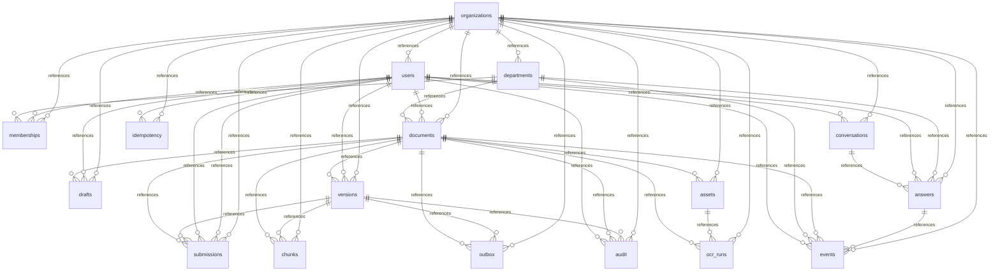

<!-- 実装から生成。直接編集しない。入力SHA256: f473ec4902a9e7cc973e702d4fbb05a99ce8c26a324da9a1f4592aab94dbd60c -->

# 実装データモデル

17テーブル。manifest/evidence/OCRを検証付きJSONとして固定します。企画段階の33テーブル案を統合しました。複合参照制約とAPI認可で保護します。



## 組織（organizations）

組織の名称、改訂番号、利用停止状態を管理します。

| 属性・制約 | 和名 | DDL |
| --- | --- | --- |
| columndef | 組織ID | id VARCHAR(36) NOT NULL |
| columndef | 組織ID | organization_id VARCHAR(36) NOT NULL |
| columndef | 名称 | name TEXT NOT NULL |
| columndef | 改訂番号 | revision BIGINT NOT NULL |
| columndef | 利用停止 | suspended BOOLEAN NOT NULL |
| primarykey | 制約 | PRIMARY KEY (id) |
| uniquecolumnconstraint | 制約 | UNIQUE (organization_id, id) |


```sql
-- 組織 (organizations)
-- 組織の名称、改訂番号、利用停止状態を管理します。
-- id: 組織ID — このレコードを一意に識別します。
-- organization_id: 組織ID — 所属する組織の識別子です。
-- name: 名称 — 表示に使用する名称です。
-- revision: 改訂番号 — 更新の競合を検出するための改訂番号です。
-- suspended: 利用停止 — 組織の利用が停止されているかを表します。
-- organizationsの正本と組織内参照整合性を定義する。
CREATE TABLE organizations (
    id varchar(36) NOT NULL,
    organization_id varchar(36) NOT NULL,
    name text NOT NULL,
    revision bigint NOT NULL,
    suspended boolean NOT NULL,
    PRIMARY KEY (id),
    UNIQUE (organization_id, id)
);

```

| access pattern | 操作 |
| --- | --- |
| kotorelay.operations.system.authorization.generated.queries.organizations_fence | UPDATE |
| kotorelay.operations.system.authorization.generated.queries.organizations_get | SELECT |
| kotorelay.operations.system.bootstrap.generated.queries.organizations_get | SELECT |
| kotorelay.operations.system.bootstrap.generated.queries.organizations_insert | INSERT |

## 利用者（users）

組織に属する認証利用者と運用権限を管理します。

| 属性・制約 | 和名 | DDL |
| --- | --- | --- |
| columndef | 利用者ID | id VARCHAR(36) NOT NULL |
| columndef | 組織ID | organization_id VARCHAR(36) NOT NULL |
| columndef | 認証主体 | subject TEXT NOT NULL |
| columndef | 表示名 | display_name TEXT NOT NULL |
| columndef | 有効状態 | active BOOLEAN NOT NULL |
| columndef | 運用者権限 | operator BOOLEAN NOT NULL |
| primarykey | 制約 | PRIMARY KEY (id) |
| uniquecolumnconstraint | 制約 | UNIQUE (organization_id, id) |
| uniquecolumnconstraint | 制約 | UNIQUE (organization_id, subject) |
| foreignkey | 制約 | FOREIGN KEY (organization_id) REFERENCES organizations (id) |


```sql
-- 利用者 (users)
-- 組織に属する認証利用者と運用権限を管理します。
-- id: 利用者ID — このレコードを一意に識別します。
-- organization_id: 組織ID — 所属する組織の識別子です。
-- subject: 認証主体 — 認証トークンの主体に対応する値です。
-- display_name: 表示名 — 利用者の表示名です。
-- active: 有効状態 — 利用可能な状態かを表します。
-- operator: 運用者権限 — 組織の運用操作を許可するかを表します。
-- usersの正本と組織内参照整合性を定義する。
CREATE TABLE users (
    id varchar(36) NOT NULL,
    organization_id varchar(36) NOT NULL,
    subject text NOT NULL,
    display_name text NOT NULL,
    active boolean NOT NULL,
    operator boolean NOT NULL,
    PRIMARY KEY (id),
    UNIQUE (organization_id, id),
    UNIQUE (organization_id, subject),
    FOREIGN KEY (organization_id) REFERENCES organizations (id)
);

```

| access pattern | 操作 |
| --- | --- |
| kotorelay.operations.groups.change_membership.generated.queries.users_get | SELECT |
| kotorelay.operations.groups.list_members.generated.queries.users_list | SELECT |
| kotorelay.operations.reviews.list_reviews.generated.queries.users_list | SELECT |
| kotorelay.operations.system.authorization.generated.queries.users_list | SELECT |
| kotorelay.operations.system.bootstrap.generated.queries.users_insert | INSERT |

## 部署（departments）

文書の所有・共有と利用者の所属に使う部署です。

| 属性・制約 | 和名 | DDL |
| --- | --- | --- |
| columndef | 部署ID | id VARCHAR(36) NOT NULL |
| columndef | 組織ID | organization_id VARCHAR(36) NOT NULL |
| columndef | 名称 | name TEXT NOT NULL |
| columndef | 有効状態 | active BOOLEAN NOT NULL |
| primarykey | 制約 | PRIMARY KEY (id) |
| uniquecolumnconstraint | 制約 | UNIQUE (organization_id, id) |
| foreignkey | 制約 | FOREIGN KEY (organization_id) REFERENCES organizations (id) |


```sql
-- 部署 (departments)
-- 文書の所有・共有と利用者の所属に使う部署です。
-- id: 部署ID — このレコードを一意に識別します。
-- organization_id: 組織ID — 所属する組織の識別子です。
-- name: 名称 — 表示に使用する名称です。
-- active: 有効状態 — 利用可能な状態かを表します。
-- departmentsの正本と組織内参照整合性を定義する。
CREATE TABLE departments (
    id varchar(36) NOT NULL,
    organization_id varchar(36) NOT NULL,
    name text NOT NULL,
    active boolean NOT NULL,
    PRIMARY KEY (id),
    UNIQUE (organization_id, id),
    FOREIGN KEY (organization_id) REFERENCES organizations (id)
);

```

| access pattern | 操作 |
| --- | --- |
| kotorelay.operations.documents.change_policy.generated.queries.departments_list | SELECT |
| kotorelay.operations.groups.change_membership.generated.queries.departments_get | SELECT |
| kotorelay.operations.groups.get_identity.generated.queries.departments_list | SELECT |
| kotorelay.operations.reviews.list_reviews.generated.queries.departments_list | SELECT |
| kotorelay.operations.system.authorization.generated.queries.departments_list | SELECT |
| kotorelay.operations.system.bootstrap.generated.queries.departments_insert | INSERT |

## 部署所属（memberships）

部署と利用者を結び、執筆・承認の権限を管理します。

| 属性・制約 | 和名 | DDL |
| --- | --- | --- |
| columndef | 部署所属ID | id VARCHAR(36) NOT NULL |
| columndef | 組織ID | organization_id VARCHAR(36) NOT NULL |
| columndef | 部署ID | department_id VARCHAR(36) NOT NULL |
| columndef | 利用者ID | user_id VARCHAR(36) NOT NULL |
| columndef | 部署責任者 | leader BOOLEAN NOT NULL |
| columndef | 執筆権限 | can_author BOOLEAN NOT NULL |
| columndef | 承認権限 | can_review BOOLEAN NOT NULL |
| columndef | 有効状態 | active BOOLEAN NOT NULL |
| primarykey | 制約 | PRIMARY KEY (id) |
| uniquecolumnconstraint | 制約 | UNIQUE (organization_id, id) |
| uniquecolumnconstraint | 制約 | UNIQUE (organization_id, department_id, user_id) |
| foreignkey | 制約 | FOREIGN KEY (organization_id, department_id) REFERENCES departments (organization_id, id) |
| foreignkey | 制約 | FOREIGN KEY (organization_id, user_id) REFERENCES users (organization_id, id) |
| foreignkey | 制約 | FOREIGN KEY (organization_id) REFERENCES organizations (id) |


```sql
-- 部署所属 (memberships)
-- 部署と利用者を結び、執筆・承認の権限を管理します。
-- id: 部署所属ID — このレコードを一意に識別します。
-- organization_id: 組織ID — 所属する組織の識別子です。
-- department_id: 部署ID — 対象部署の識別子です。
-- user_id: 利用者ID — 対象利用者の識別子です。
-- leader: 部署責任者 — 部署責任者として扱うかを表します。
-- can_author: 執筆権限 — この部署で文書を執筆できるかを表します。
-- can_review: 承認権限 — この部署で文書を承認できるかを表します。
-- active: 有効状態 — 利用可能な状態かを表します。
-- membershipsの正本と組織内参照整合性を定義する。
CREATE TABLE memberships (
    id varchar(36) NOT NULL,
    organization_id varchar(36) NOT NULL,
    department_id varchar(36) NOT NULL,
    user_id varchar(36) NOT NULL,
    leader boolean NOT NULL,
    can_author boolean NOT NULL,
    can_review boolean NOT NULL,
    active boolean NOT NULL,
    PRIMARY KEY (id),
    UNIQUE (organization_id, id),
    UNIQUE (organization_id, department_id, user_id),
    FOREIGN KEY (organization_id, department_id) REFERENCES departments (organization_id, id),
    FOREIGN KEY (organization_id, user_id) REFERENCES users (organization_id, id),
    FOREIGN KEY (organization_id) REFERENCES organizations (id)
);

```

| access pattern | 操作 |
| --- | --- |
| kotorelay.operations.groups.change_membership.generated.queries.memberships_insert | INSERT |
| kotorelay.operations.groups.change_membership.generated.queries.memberships_list | SELECT |
| kotorelay.operations.groups.change_membership.generated.queries.memberships_update | UPDATE |
| kotorelay.operations.groups.list_members.generated.queries.memberships_list | SELECT |
| kotorelay.operations.system.authorization.generated.queries.memberships_list | SELECT |
| kotorelay.operations.system.bootstrap.generated.queries.memberships_insert | INSERT |

## 文書（documents）

文書の公開範囲、状態、最新版への参照を管理します。

| 属性・制約 | 和名 | DDL |
| --- | --- | --- |
| columndef | 文書ID | id VARCHAR(36) NOT NULL |
| columndef | 組織ID | organization_id VARCHAR(36) NOT NULL |
| columndef | 所有部署ID | department_id VARCHAR(36) NOT NULL |
| columndef | 文書タイトル | title TEXT NOT NULL |
| columndef | 作成者ID | created_by VARCHAR(36) NOT NULL |
| columndef | 公開範囲 | visibility VARCHAR(20) NOT NULL |
| columndef | 共有先部署 | shared_departments TEXT NOT NULL |
| columndef | 文書状態 | status VARCHAR(20) NOT NULL |
| columndef | 改訂番号 | revision BIGINT NOT NULL |
| columndef | 次回版番号 | next_version BIGINT NOT NULL |
| columndef | 最新版ID | latest_version_id VARCHAR(36) |
| columndef | 更新日時 | updated_at TIMESTAMPTZ NOT NULL |
| primarykey | 制約 | PRIMARY KEY (id) |
| uniquecolumnconstraint | 制約 | UNIQUE (organization_id, id) |
| foreignkey | 制約 | FOREIGN KEY (organization_id, department_id) REFERENCES departments (organization_id, id) |
| foreignkey | 制約 | FOREIGN KEY (organization_id, created_by) REFERENCES users (organization_id, id) |
| checkcolumnconstraint | 制約 | CHECK (visibility IN ('department', 'selected', 'organization')) |
| checkcolumnconstraint | 制約 | CHECK (status IN ('active', 'withdrawn', 'deleted')) |
| foreignkey | 制約 | FOREIGN KEY (organization_id) REFERENCES organizations (id) |


```sql
-- 文書 (documents)
-- 文書の公開範囲、状態、最新版への参照を管理します。
-- id: 文書ID — このレコードを一意に識別します。
-- organization_id: 組織ID — 所属する組織の識別子です。
-- department_id: 所有部署ID — 文書を所有する部署の識別子です。
-- title: 文書タイトル — 文書の表示タイトルです。
-- created_by: 作成者ID — 作成した利用者の識別子です。
-- visibility: 公開範囲 — department（所有部署）、selected（指定部署）、organization（組織全体）を区別します。
-- shared_departments: 共有先部署 — 指定部署へ公開するときの部署一覧をJSONで保持します。
-- status: 文書状態 — active（有効）、withdrawn（撤回）、deleted（削除）を区別します。
-- revision: 改訂番号 — 更新の競合を検出するための改訂番号です。
-- next_version: 次回版番号 — 次に作成する文書版の番号です。
-- latest_version_id: 最新版ID — 文書の最新版の識別子です。DDLでは外部キーが宣言されていません。
-- updated_at: 更新日時 — 最後に更新した日時です。
-- documentsの正本と組織内参照整合性を定義する。
CREATE TABLE documents (
    id varchar(36) NOT NULL,
    organization_id varchar(36) NOT NULL,
    department_id varchar(36) NOT NULL,
    title text NOT NULL,
    created_by varchar(36) NOT NULL,
    visibility varchar(20) NOT NULL,
    shared_departments text NOT NULL,
    status varchar(20) NOT NULL,
    revision bigint NOT NULL,
    next_version bigint NOT NULL,
    latest_version_id varchar(36),
    updated_at timestamptz NOT NULL,
    PRIMARY KEY (id),
    UNIQUE (organization_id, id),
    FOREIGN KEY (organization_id, department_id) REFERENCES departments (organization_id, id),
    FOREIGN KEY (organization_id, created_by) REFERENCES users (organization_id, id),
    CHECK (visibility IN ('department', 'selected', 'organization')),
    CHECK (status IN ('active', 'withdrawn', 'deleted')),
    FOREIGN KEY (organization_id) REFERENCES organizations (id)
);

```

| access pattern | 操作 |
| --- | --- |
| kotorelay.operations.chat.ask_question.generated.queries.documents_list | SELECT |
| kotorelay.operations.chat.shared.generated.queries.documents_get | SELECT |
| kotorelay.operations.documents.change_policy.generated.queries.documents_update | UPDATE |
| kotorelay.operations.documents.create_document.generated.queries.documents_insert | INSERT |
| kotorelay.operations.documents.list_documents.generated.queries.documents_by_department | SELECT |
| kotorelay.operations.documents.list_documents.generated.queries.documents_list | SELECT |
| kotorelay.operations.documents.read_document.generated.queries.documents_get | SELECT |
| kotorelay.operations.documents.save_draft.generated.queries.documents_update | UPDATE |
| kotorelay.operations.documents.submit_version.generated.queries.documents_update | UPDATE |
| kotorelay.operations.images.get_ocr.generated.queries.documents_get | SELECT |
| kotorelay.operations.images.shared.generated.queries.documents_get | SELECT |
| kotorelay.operations.indexing.list_jobs.generated.queries.documents_list | SELECT |
| kotorelay.operations.indexing.reconcile_index.generated.queries.documents_list | SELECT |
| kotorelay.operations.indexing.shared.generated.queries.documents_get | SELECT |
| kotorelay.operations.indexing.shared.generated.queries.documents_list | SELECT |
| kotorelay.operations.metrics.department_metrics.generated.queries.documents_list | SELECT |
| kotorelay.operations.reviews.decide_review.generated.queries.documents_update | UPDATE |
| kotorelay.operations.reviews.list_reviews.generated.queries.documents_list | SELECT |
| kotorelay.operations.system.authorization.generated.queries.documents_get | SELECT |

## 下書き（drafts）

編集可能な本文と画像配置を文書ごとに保持します。

| 属性・制約 | 和名 | DDL |
| --- | --- | --- |
| columndef | 下書きID | id VARCHAR(36) NOT NULL |
| columndef | 組織ID | organization_id VARCHAR(36) NOT NULL |
| columndef | 文書ID | document_id VARCHAR(36) NOT NULL |
| columndef | 本文保存キー | body_key TEXT NOT NULL |
| columndef | 本文ハッシュ | body_hash VARCHAR(64) NOT NULL |
| columndef | 画像配置 | placements TEXT NOT NULL |
| columndef | 改訂番号 | revision BIGINT NOT NULL |
| columndef | 更新者ID | updated_by VARCHAR(36) NOT NULL |
| primarykey | 制約 | PRIMARY KEY (id) |
| uniquecolumnconstraint | 制約 | UNIQUE (organization_id, id) |
| uniquecolumnconstraint | 制約 | UNIQUE (organization_id, document_id) |
| foreignkey | 制約 | FOREIGN KEY (organization_id, document_id) REFERENCES documents (organization_id, id) |
| foreignkey | 制約 | FOREIGN KEY (organization_id, updated_by) REFERENCES users (organization_id, id) |
| foreignkey | 制約 | FOREIGN KEY (organization_id) REFERENCES organizations (id) |


```sql
-- 下書き (drafts)
-- 編集可能な本文と画像配置を文書ごとに保持します。
-- id: 下書きID — このレコードを一意に識別します。
-- organization_id: 組織ID — 所属する組織の識別子です。
-- document_id: 文書ID — 対象文書の識別子です。
-- body_key: 本文保存キー — オブジェクト保存先にある本文のキーです。
-- body_hash: 本文ハッシュ — 本文の整合性を確認するハッシュ値です。
-- placements: 画像配置 — 本文内の画像配置情報をJSONで保持します。
-- revision: 改訂番号 — 更新の競合を検出するための改訂番号です。
-- updated_by: 更新者ID — 最後に更新した利用者の識別子です。
-- draftsの正本と組織内参照整合性を定義する。
CREATE TABLE drafts (
    id varchar(36) NOT NULL,
    organization_id varchar(36) NOT NULL,
    document_id varchar(36) NOT NULL,
    body_key text NOT NULL,
    body_hash varchar(64) NOT NULL,
    placements text NOT NULL,
    revision bigint NOT NULL,
    updated_by varchar(36) NOT NULL,
    PRIMARY KEY (id),
    UNIQUE (organization_id, id),
    UNIQUE (organization_id, document_id),
    FOREIGN KEY (organization_id, document_id) REFERENCES documents (organization_id, id),
    FOREIGN KEY (organization_id, updated_by) REFERENCES users (organization_id, id),
    FOREIGN KEY (organization_id) REFERENCES organizations (id)
);

```

| access pattern | 操作 |
| --- | --- |
| kotorelay.operations.documents.create_document.generated.queries.drafts_insert | INSERT |
| kotorelay.operations.documents.save_draft.generated.queries.drafts_list | SELECT |
| kotorelay.operations.documents.save_draft.generated.queries.drafts_update | UPDATE |
| kotorelay.operations.documents.shared.generated.queries.drafts_list | SELECT |
| kotorelay.operations.documents.submit_version.generated.queries.drafts_list | SELECT |
| kotorelay.operations.indexing.shared.generated.queries.drafts_delete | DELETE |
| kotorelay.operations.indexing.shared.generated.queries.drafts_list | SELECT |

## 文書版（versions）

承認対象となる本文とマニフェストの版を保持します。

| 属性・制約 | 和名 | DDL |
| --- | --- | --- |
| columndef | 文書版ID | id VARCHAR(36) NOT NULL |
| columndef | 組織ID | organization_id VARCHAR(36) NOT NULL |
| columndef | 文書ID | document_id VARCHAR(36) NOT NULL |
| columndef | 版番号 | number BIGINT NOT NULL |
| columndef | 文書タイトル | title TEXT NOT NULL |
| columndef | 本文保存キー | body_key TEXT NOT NULL |
| columndef | 本文ハッシュ | body_hash VARCHAR(64) NOT NULL |
| columndef | マニフェスト | manifest TEXT NOT NULL |
| columndef | マニフェストハッシュ | manifest_hash VARCHAR(64) NOT NULL |
| columndef | 作成者ID | created_by VARCHAR(36) NOT NULL |
| columndef | 作成日時 | created_at TIMESTAMPTZ NOT NULL |
| primarykey | 制約 | PRIMARY KEY (id) |
| uniquecolumnconstraint | 制約 | UNIQUE (organization_id, id) |
| uniquecolumnconstraint | 制約 | UNIQUE (organization_id, document_id, id) |
| uniquecolumnconstraint | 制約 | UNIQUE (organization_id, document_id, number) |
| foreignkey | 制約 | FOREIGN KEY (organization_id, document_id) REFERENCES documents (organization_id, id) |
| foreignkey | 制約 | FOREIGN KEY (organization_id, created_by) REFERENCES users (organization_id, id) |
| foreignkey | 制約 | FOREIGN KEY (organization_id) REFERENCES organizations (id) |


```sql
-- 文書版 (versions)
-- 承認対象となる本文とマニフェストの版を保持します。
-- id: 文書版ID — このレコードを一意に識別します。
-- organization_id: 組織ID — 所属する組織の識別子です。
-- document_id: 文書ID — 対象文書の識別子です。
-- number: 版番号 — 文書内で一意となる版の番号です。
-- title: 文書タイトル — 文書の表示タイトルです。
-- body_key: 本文保存キー — オブジェクト保存先にある本文のキーです。
-- body_hash: 本文ハッシュ — 本文の整合性を確認するハッシュ値です。
-- manifest: マニフェスト — 本文・画像などの版構成をJSONで保持します。
-- manifest_hash: マニフェストハッシュ — 版構成の整合性を確認するハッシュ値です。
-- created_by: 作成者ID — 作成した利用者の識別子です。
-- created_at: 作成日時 — レコードを作成した日時です。
-- versionsの正本と組織内参照整合性を定義する。
CREATE TABLE versions (
    id varchar(36) NOT NULL,
    organization_id varchar(36) NOT NULL,
    document_id varchar(36) NOT NULL,
    number bigint NOT NULL,
    title text NOT NULL,
    body_key text NOT NULL,
    body_hash varchar(64) NOT NULL,
    manifest text NOT NULL,
    manifest_hash varchar(64) NOT NULL,
    created_by varchar(36) NOT NULL,
    created_at timestamptz NOT NULL,
    PRIMARY KEY (id),
    UNIQUE (organization_id, id),
    UNIQUE (organization_id, document_id, id),
    UNIQUE (organization_id, document_id, number),
    FOREIGN KEY (organization_id, document_id) REFERENCES documents (organization_id, id),
    FOREIGN KEY (organization_id, created_by) REFERENCES users (organization_id, id),
    FOREIGN KEY (organization_id) REFERENCES organizations (id)
);

```

| access pattern | 操作 |
| --- | --- |
| kotorelay.operations.chat.ask_question.generated.queries.versions_get | SELECT |
| kotorelay.operations.chat.shared.generated.queries.versions_get | SELECT |
| kotorelay.operations.documents.list_documents.generated.queries.versions_list | SELECT |
| kotorelay.operations.documents.submit_version.generated.queries.versions_insert | INSERT |
| kotorelay.operations.documents.version_history.generated.queries.versions_list | SELECT |
| kotorelay.operations.indexing.list_jobs.generated.queries.versions_list | SELECT |
| kotorelay.operations.indexing.shared.generated.queries.versions_get | SELECT |
| kotorelay.operations.indexing.shared.generated.queries.versions_list | SELECT |
| kotorelay.operations.reviews.decide_review.generated.queries.versions_get | SELECT |
| kotorelay.operations.reviews.list_reviews.generated.queries.versions_list | SELECT |
| kotorelay.operations.system.authorization.generated.queries.versions_get | SELECT |

## 承認申請（submissions）

文書版の申請と承認・却下の判断を記録します。

| 属性・制約 | 和名 | DDL |
| --- | --- | --- |
| columndef | 承認申請ID | id VARCHAR(36) NOT NULL |
| columndef | 組織ID | organization_id VARCHAR(36) NOT NULL |
| columndef | 文書ID | document_id VARCHAR(36) NOT NULL |
| columndef | 文書版ID | version_id VARCHAR(36) NOT NULL |
| columndef | 申請者ID | requested_by VARCHAR(36) NOT NULL |
| columndef | 申請状態 | status VARCHAR(20) NOT NULL |
| columndef | マニフェストハッシュ | manifest_hash VARCHAR(64) NOT NULL |
| columndef | 判断者ID | decided_by VARCHAR(36) |
| columndef | 理由 | reason TEXT NOT NULL |
| columndef | 作成日時 | created_at TIMESTAMPTZ NOT NULL |
| columndef | 判断日時 | decided_at TIMESTAMPTZ |
| primarykey | 制約 | PRIMARY KEY (id) |
| uniquecolumnconstraint | 制約 | UNIQUE (organization_id, id) |
| uniquecolumnconstraint | 制約 | UNIQUE (organization_id, version_id) |
| foreignkey | 制約 | FOREIGN KEY (organization_id, document_id) REFERENCES documents (organization_id, id) |
| foreignkey | 制約 | FOREIGN KEY (organization_id, document_id, version_id) REFERENCES versions (organization_id, document_id, id) |
| foreignkey | 制約 | FOREIGN KEY (organization_id, requested_by) REFERENCES users (organization_id, id) |
| foreignkey | 制約 | FOREIGN KEY (organization_id, decided_by) REFERENCES users (organization_id, id) |
| checkcolumnconstraint | 制約 | CHECK (status IN ('pending', 'approved', 'rejected')) |
| foreignkey | 制約 | FOREIGN KEY (organization_id) REFERENCES organizations (id) |


```sql
-- 承認申請 (submissions)
-- 文書版の申請と承認・却下の判断を記録します。
-- id: 承認申請ID — このレコードを一意に識別します。
-- organization_id: 組織ID — 所属する組織の識別子です。
-- document_id: 文書ID — 対象文書の識別子です。
-- version_id: 文書版ID — 対象文書版の識別子です。
-- requested_by: 申請者ID — 承認を申請した利用者の識別子です。
-- status: 申請状態 — pending（申請中）、approved（承認）、rejected（却下）を区別します。
-- manifest_hash: マニフェストハッシュ — 版構成の整合性を確認するハッシュ値です。
-- decided_by: 判断者ID — 承認または却下を判断した利用者の識別子です。
-- reason: 理由 — 操作または判断の理由です。
-- created_at: 作成日時 — レコードを作成した日時です。
-- decided_at: 判断日時 — 承認または却下を判断した日時です。
-- submissionsの正本と組織内参照整合性を定義する。
CREATE TABLE submissions (
    id varchar(36) NOT NULL,
    organization_id varchar(36) NOT NULL,
    document_id varchar(36) NOT NULL,
    version_id varchar(36) NOT NULL,
    requested_by varchar(36) NOT NULL,
    status varchar(20) NOT NULL,
    manifest_hash varchar(64) NOT NULL,
    decided_by varchar(36),
    reason text NOT NULL,
    created_at timestamptz NOT NULL,
    decided_at timestamptz,
    PRIMARY KEY (id),
    UNIQUE (organization_id, id),
    UNIQUE (organization_id, version_id),
    FOREIGN KEY (organization_id, document_id) REFERENCES documents (organization_id, id),
    FOREIGN KEY (organization_id, document_id, version_id)
    REFERENCES versions (organization_id, document_id, id),
    FOREIGN KEY (organization_id, requested_by) REFERENCES users (organization_id, id),
    FOREIGN KEY (organization_id, decided_by) REFERENCES users (organization_id, id),
    CHECK (status IN ('pending', 'approved', 'rejected')),
    FOREIGN KEY (organization_id) REFERENCES organizations (id)
);

```

| access pattern | 操作 |
| --- | --- |
| kotorelay.operations.documents.list_documents.generated.queries.submissions_list | SELECT |
| kotorelay.operations.documents.submit_version.generated.queries.submissions_insert | INSERT |
| kotorelay.operations.documents.version_history.generated.queries.submissions_list | SELECT |
| kotorelay.operations.reviews.decide_review.generated.queries.submissions_get | SELECT |
| kotorelay.operations.reviews.decide_review.generated.queries.submissions_update | UPDATE |
| kotorelay.operations.reviews.list_reviews.generated.queries.submissions_list | SELECT |

## 添付画像（assets）

文書に添付する画像の保存先と属性を管理します。

| 属性・制約 | 和名 | DDL |
| --- | --- | --- |
| columndef | 添付画像ID | id VARCHAR(36) NOT NULL |
| columndef | 組織ID | organization_id VARCHAR(36) NOT NULL |
| columndef | 文書ID | document_id VARCHAR(36) NOT NULL |
| columndef | 画像保存キー | object_key TEXT NOT NULL |
| columndef | SHA-256ハッシュ | sha256 VARCHAR(64) NOT NULL |
| columndef | メディア種別 | media_type VARCHAR(20) NOT NULL |
| columndef | 画像幅 | width BIGINT NOT NULL |
| columndef | 画像高さ | height BIGINT NOT NULL |
| columndef | 画像サイズ | size BIGINT NOT NULL |
| columndef | 作成日時 | created_at TIMESTAMPTZ NOT NULL |
| primarykey | 制約 | PRIMARY KEY (id) |
| uniquecolumnconstraint | 制約 | UNIQUE (organization_id, id) |
| uniquecolumnconstraint | 制約 | UNIQUE (organization_id, document_id, id) |
| foreignkey | 制約 | FOREIGN KEY (organization_id, document_id) REFERENCES documents (organization_id, id) |
| foreignkey | 制約 | FOREIGN KEY (organization_id) REFERENCES organizations (id) |


```sql
-- 添付画像 (assets)
-- 文書に添付する画像の保存先と属性を管理します。
-- id: 添付画像ID — このレコードを一意に識別します。
-- organization_id: 組織ID — 所属する組織の識別子です。
-- document_id: 文書ID — 対象文書の識別子です。
-- object_key: 画像保存キー — オブジェクト保存先にある画像のキーです。
-- sha256: SHA-256ハッシュ — 内容の整合性を確認するSHA-256ハッシュ値です。
-- media_type: メディア種別 — 画像のメディア種別です。
-- width: 画像幅 — 画像の横幅をピクセル数で表します。
-- height: 画像高さ — 画像の高さをピクセル数で表します。
-- size: 画像サイズ — 画像のデータ量をバイト数で表します。
-- created_at: 作成日時 — レコードを作成した日時です。
-- assetsの正本と組織内参照整合性を定義する。
CREATE TABLE assets (
    id varchar(36) NOT NULL,
    organization_id varchar(36) NOT NULL,
    document_id varchar(36) NOT NULL,
    object_key text NOT NULL,
    sha256 varchar(64) NOT NULL,
    media_type varchar(20) NOT NULL,
    width bigint NOT NULL,
    height bigint NOT NULL,
    size bigint NOT NULL,
    created_at timestamptz NOT NULL,
    PRIMARY KEY (id),
    UNIQUE (organization_id, id),
    UNIQUE (organization_id, document_id, id),
    FOREIGN KEY (organization_id, document_id) REFERENCES documents (organization_id, id),
    FOREIGN KEY (organization_id) REFERENCES organizations (id)
);

```

| access pattern | 操作 |
| --- | --- |
| kotorelay.operations.chat.ask_question.generated.queries.assets_get | SELECT |
| kotorelay.operations.chat.shared.generated.queries.assets_get | SELECT |
| kotorelay.operations.documents.save_draft.generated.queries.assets_get | SELECT |
| kotorelay.operations.documents.submit_version.generated.queries.assets_get | SELECT |
| kotorelay.operations.images.correct_ocr.generated.queries.assets_get | SELECT |
| kotorelay.operations.images.shared.generated.queries.assets_get | SELECT |
| kotorelay.operations.images.upload_image.generated.queries.assets_insert | INSERT |
| kotorelay.operations.images.upload_image.generated.queries.assets_list | SELECT |
| kotorelay.operations.indexing.shared.generated.queries.assets_delete | DELETE |
| kotorelay.operations.indexing.shared.generated.queries.assets_get | SELECT |
| kotorelay.operations.indexing.shared.generated.queries.assets_list | SELECT |

## OCR実行（ocr_runs）

添付画像の文字認識結果と確認状態を管理します。

| 属性・制約 | 和名 | DDL |
| --- | --- | --- |
| columndef | OCR実行ID | id VARCHAR(36) NOT NULL |
| columndef | 組織ID | organization_id VARCHAR(36) NOT NULL |
| columndef | 文書ID | document_id VARCHAR(36) NOT NULL |
| columndef | 添付画像ID | asset_id VARCHAR(36) NOT NULL |
| columndef | 認識結果保存キー | result_key TEXT NOT NULL |
| columndef | 認識結果ハッシュ | result_hash VARCHAR(64) NOT NULL |
| columndef | OCRエンジン | engine TEXT NOT NULL |
| columndef | OCR処理状態 | status VARCHAR(20) NOT NULL |
| columndef | 確認済み | confirmed BOOLEAN NOT NULL |
| columndef | 作成日時 | created_at TIMESTAMPTZ NOT NULL |
| primarykey | 制約 | PRIMARY KEY (id) |
| uniquecolumnconstraint | 制約 | UNIQUE (organization_id, id) |
| foreignkey | 制約 | FOREIGN KEY (organization_id, document_id) REFERENCES documents (organization_id, id) |
| foreignkey | 制約 | FOREIGN KEY (organization_id, document_id, asset_id) REFERENCES assets (organization_id, document_id, id) |
| foreignkey | 制約 | FOREIGN KEY (organization_id) REFERENCES organizations (id) |


```sql
-- OCR実行 (ocr_runs)
-- 添付画像の文字認識結果と確認状態を管理します。
-- id: OCR実行ID — このレコードを一意に識別します。
-- organization_id: 組織ID — 所属する組織の識別子です。
-- document_id: 文書ID — 対象文書の識別子です。
-- asset_id: 添付画像ID — 文字認識の対象となる画像の識別子です。
-- result_key: 認識結果保存キー — 文字認識結果のオブジェクト保存キーです。
-- result_hash: 認識結果ハッシュ — 文字認識結果の整合性を確認するハッシュ値です。
-- engine: OCRエンジン — 文字認識に使用したエンジンです。
-- status: OCR処理状態 — 文字認識処理の結果状態です。
-- confirmed: 確認済み — 文字認識結果が確認済みかを表します。
-- created_at: 作成日時 — レコードを作成した日時です。
-- ocr_runsの正本と組織内参照整合性を定義する。
CREATE TABLE ocr_runs (
    id varchar(36) NOT NULL,
    organization_id varchar(36) NOT NULL,
    document_id varchar(36) NOT NULL,
    asset_id varchar(36) NOT NULL,
    result_key text NOT NULL,
    result_hash varchar(64) NOT NULL,
    engine text NOT NULL,
    status varchar(20) NOT NULL,
    confirmed boolean NOT NULL,
    created_at timestamptz NOT NULL,
    PRIMARY KEY (id),
    UNIQUE (organization_id, id),
    FOREIGN KEY (organization_id, document_id) REFERENCES documents (organization_id, id),
    FOREIGN KEY (organization_id, document_id, asset_id)
    REFERENCES assets (organization_id, document_id, id),
    FOREIGN KEY (organization_id) REFERENCES organizations (id)
);

```

| access pattern | 操作 |
| --- | --- |
| kotorelay.operations.chat.shared.generated.queries.ocr_runs_get | SELECT |
| kotorelay.operations.documents.save_draft.generated.queries.ocr_runs_get | SELECT |
| kotorelay.operations.documents.submit_version.generated.queries.ocr_runs_get | SELECT |
| kotorelay.operations.images.correct_ocr.generated.queries.ocr_runs_insert | INSERT |
| kotorelay.operations.images.get_ocr.generated.queries.ocr_runs_get | SELECT |
| kotorelay.operations.images.upload_image.generated.queries.ocr_runs_insert | INSERT |
| kotorelay.operations.indexing.shared.generated.queries.ocr_runs_delete | DELETE |
| kotorelay.operations.indexing.shared.generated.queries.ocr_runs_get | SELECT |
| kotorelay.operations.indexing.shared.generated.queries.ocr_runs_list | SELECT |

## 検索チャンク（chunks）

公開版を分割した検索用本文と画像配置を管理します。

| 属性・制約 | 和名 | DDL |
| --- | --- | --- |
| columndef | 検索チャンクID | id VARCHAR(36) NOT NULL |
| columndef | 組織ID | organization_id VARCHAR(36) NOT NULL |
| columndef | 文書ID | document_id VARCHAR(36) NOT NULL |
| columndef | 文書版ID | version_id VARCHAR(36) NOT NULL |
| columndef | 本文保存キー | body_key TEXT NOT NULL |
| columndef | SHA-256ハッシュ | sha256 VARCHAR(64) NOT NULL |
| columndef | 見出し | heading TEXT NOT NULL |
| columndef | 画像配置 | placements TEXT NOT NULL |
| columndef | マニフェストハッシュ | manifest_hash VARCHAR(64) NOT NULL |
| columndef | 検索準備完了 | ready BOOLEAN NOT NULL |
| primarykey | 制約 | PRIMARY KEY (id) |
| uniquecolumnconstraint | 制約 | UNIQUE (organization_id, id) |
| foreignkey | 制約 | FOREIGN KEY (organization_id, document_id) REFERENCES documents (organization_id, id) |
| foreignkey | 制約 | FOREIGN KEY (organization_id, document_id, version_id) REFERENCES versions (organization_id, document_id, id) |
| foreignkey | 制約 | FOREIGN KEY (organization_id) REFERENCES organizations (id) |


```sql
-- 検索チャンク (chunks)
-- 公開版を分割した検索用本文と画像配置を管理します。
-- id: 検索チャンクID — このレコードを一意に識別します。
-- organization_id: 組織ID — 所属する組織の識別子です。
-- document_id: 文書ID — 対象文書の識別子です。
-- version_id: 文書版ID — 対象文書版の識別子です。
-- body_key: 本文保存キー — オブジェクト保存先にある本文のキーです。
-- sha256: SHA-256ハッシュ — 内容の整合性を確認するSHA-256ハッシュ値です。
-- heading: 見出し — 検索チャンクに対応する見出しです。
-- placements: 画像配置 — 本文内の画像配置情報をJSONで保持します。
-- manifest_hash: マニフェストハッシュ — 版構成の整合性を確認するハッシュ値です。
-- ready: 検索準備完了 — 検索に使用できる状態かを表します。
-- chunksの正本と組織内参照整合性を定義する。
CREATE TABLE chunks (
    id varchar(36) NOT NULL,
    organization_id varchar(36) NOT NULL,
    document_id varchar(36) NOT NULL,
    version_id varchar(36) NOT NULL,
    body_key text NOT NULL,
    sha256 varchar(64) NOT NULL,
    heading text NOT NULL,
    placements text NOT NULL,
    manifest_hash varchar(64) NOT NULL,
    ready boolean NOT NULL,
    PRIMARY KEY (id),
    UNIQUE (organization_id, id),
    FOREIGN KEY (organization_id, document_id) REFERENCES documents (organization_id, id),
    FOREIGN KEY (organization_id, document_id, version_id)
    REFERENCES versions (organization_id, document_id, id),
    FOREIGN KEY (organization_id) REFERENCES organizations (id)
);

```

| access pattern | 操作 |
| --- | --- |
| kotorelay.operations.chat.ask_question.generated.queries.chunks_list | SELECT |
| kotorelay.operations.chat.shared.generated.queries.chunks_get | SELECT |
| kotorelay.operations.documents.list_documents.generated.queries.chunks_list | SELECT |
| kotorelay.operations.documents.read_document.generated.queries.chunks_list | SELECT |
| kotorelay.operations.indexing.reconcile_index.generated.queries.chunks_list | SELECT |
| kotorelay.operations.indexing.shared.generated.queries.chunks_delete | DELETE |
| kotorelay.operations.indexing.shared.generated.queries.chunks_insert | INSERT |
| kotorelay.operations.indexing.shared.generated.queries.chunks_list | SELECT |
| kotorelay.operations.indexing.shared.generated.queries.chunks_update | UPDATE |

## 非同期処理キュー（outbox）

索引更新などの配送対象と試行状態を管理します。

| 属性・制約 | 和名 | DDL |
| --- | --- | --- |
| columndef | 非同期処理キューID | id VARCHAR(36) NOT NULL |
| columndef | 組織ID | organization_id VARCHAR(36) NOT NULL |
| columndef | 文書ID | document_id VARCHAR(36) NOT NULL |
| columndef | 文書版ID | version_id VARCHAR(36) |
| columndef | 配送種別 | kind VARCHAR(20) NOT NULL |
| columndef | 配送状態 | status VARCHAR(20) NOT NULL |
| columndef | 試行回数 | attempts BIGINT NOT NULL |
| columndef | エラーコード | error_code TEXT NOT NULL |
| columndef | 作成日時 | created_at TIMESTAMPTZ NOT NULL |
| primarykey | 制約 | PRIMARY KEY (id) |
| uniquecolumnconstraint | 制約 | UNIQUE (organization_id, id) |
| foreignkey | 制約 | FOREIGN KEY (organization_id, document_id) REFERENCES documents (organization_id, id) |
| foreignkey | 制約 | FOREIGN KEY (organization_id, document_id, version_id) REFERENCES versions (organization_id, document_id, id) |
| foreignkey | 制約 | FOREIGN KEY (organization_id) REFERENCES organizations (id) |


```sql
-- 非同期処理キュー (outbox)
-- 索引更新などの配送対象と試行状態を管理します。
-- id: 非同期処理キューID — このレコードを一意に識別します。
-- organization_id: 組織ID — 所属する組織の識別子です。
-- document_id: 文書ID — 対象文書の識別子です。
-- version_id: 文書版ID — 対象文書版の識別子です。
-- kind: 配送種別 — 索引への登録・削除などの配送処理の種類です。
-- status: 配送状態 — 配送処理の進行状態です。
-- attempts: 試行回数 — 処理の試行回数です。
-- error_code: エラーコード — 処理失敗の理由を識別するコードです。
-- created_at: 作成日時 — レコードを作成した日時です。
-- outboxの正本と組織内参照整合性を定義する。
CREATE TABLE outbox (
    id varchar(36) NOT NULL,
    organization_id varchar(36) NOT NULL,
    document_id varchar(36) NOT NULL,
    version_id varchar(36),
    kind varchar(20) NOT NULL,
    status varchar(20) NOT NULL,
    attempts bigint NOT NULL,
    error_code text NOT NULL,
    created_at timestamptz NOT NULL,
    PRIMARY KEY (id),
    UNIQUE (organization_id, id),
    FOREIGN KEY (organization_id, document_id) REFERENCES documents (organization_id, id),
    FOREIGN KEY (organization_id, document_id, version_id)
    REFERENCES versions (organization_id, document_id, id),
    FOREIGN KEY (organization_id) REFERENCES organizations (id)
);

```

| access pattern | 操作 |
| --- | --- |
| kotorelay.operations.documents.change_policy.generated.queries.outbox_insert | INSERT |
| kotorelay.operations.indexing.list_jobs.generated.queries.outbox_list | SELECT |
| kotorelay.operations.indexing.shared.generated.queries.outbox_get | SELECT |
| kotorelay.operations.indexing.shared.generated.queries.outbox_update | UPDATE |
| kotorelay.operations.reviews.decide_review.generated.queries.outbox_insert | INSERT |
| kotorelay.operations.system.dispatch.generated.queries.outbox_list | SELECT |

## 会話（conversations）

利用者の質問・回答をまとめる会話です。

| 属性・制約 | 和名 | DDL |
| --- | --- | --- |
| columndef | 会話ID | id VARCHAR(36) NOT NULL |
| columndef | 組織ID | organization_id VARCHAR(36) NOT NULL |
| columndef | 利用者ID | user_id VARCHAR(36) NOT NULL |
| columndef | 作成日時 | created_at TIMESTAMPTZ NOT NULL |
| primarykey | 制約 | PRIMARY KEY (id) |
| uniquecolumnconstraint | 制約 | UNIQUE (organization_id, id) |
| foreignkey | 制約 | FOREIGN KEY (organization_id, user_id) REFERENCES users (organization_id, id) |
| foreignkey | 制約 | FOREIGN KEY (organization_id) REFERENCES organizations (id) |


```sql
-- 会話 (conversations)
-- 利用者の質問・回答をまとめる会話です。
-- id: 会話ID — このレコードを一意に識別します。
-- organization_id: 組織ID — 所属する組織の識別子です。
-- user_id: 利用者ID — 対象利用者の識別子です。
-- created_at: 作成日時 — レコードを作成した日時です。
-- conversationsの正本と組織内参照整合性を定義する。
CREATE TABLE conversations (
    id varchar(36) NOT NULL,
    organization_id varchar(36) NOT NULL,
    user_id varchar(36) NOT NULL,
    created_at timestamptz NOT NULL,
    PRIMARY KEY (id),
    UNIQUE (organization_id, id),
    FOREIGN KEY (organization_id, user_id) REFERENCES users (organization_id, id),
    FOREIGN KEY (organization_id) REFERENCES organizations (id)
);

```

| access pattern | 操作 |
| --- | --- |
| kotorelay.operations.chat.ask_question.generated.queries.conversations_get | SELECT |
| kotorelay.operations.chat.ask_question.generated.queries.conversations_insert | INSERT |
| kotorelay.operations.chat.chat_history.generated.queries.conversations_get | SELECT |

## 回答（answers）

質問、生成回答、根拠と利用モデルを記録します。

| 属性・制約 | 和名 | DDL |
| --- | --- | --- |
| columndef | 回答ID | id VARCHAR(36) NOT NULL |
| columndef | 組織ID | organization_id VARCHAR(36) NOT NULL |
| columndef | 会話ID | conversation_id VARCHAR(36) NOT NULL |
| columndef | 利用者ID | user_id VARCHAR(36) NOT NULL |
| columndef | 部署ID | department_id VARCHAR(36) NOT NULL |
| columndef | 質問保存キー | question_key TEXT NOT NULL |
| columndef | 回答保存キー | answer_key TEXT NOT NULL |
| columndef | 回答根拠 | evidence TEXT NOT NULL |
| columndef | 回答状態 | status VARCHAR(20) NOT NULL |
| columndef | 生成モデル | model TEXT NOT NULL |
| columndef | 作成日時 | created_at TIMESTAMPTZ NOT NULL |
| primarykey | 制約 | PRIMARY KEY (id) |
| uniquecolumnconstraint | 制約 | UNIQUE (organization_id, id) |
| foreignkey | 制約 | FOREIGN KEY (organization_id, conversation_id) REFERENCES conversations (organization_id, id) |
| foreignkey | 制約 | FOREIGN KEY (organization_id, user_id) REFERENCES users (organization_id, id) |
| foreignkey | 制約 | FOREIGN KEY (organization_id, department_id) REFERENCES departments (organization_id, id) |
| foreignkey | 制約 | FOREIGN KEY (organization_id) REFERENCES organizations (id) |


```sql
-- 回答 (answers)
-- 質問、生成回答、根拠と利用モデルを記録します。
-- id: 回答ID — このレコードを一意に識別します。
-- organization_id: 組織ID — 所属する組織の識別子です。
-- conversation_id: 会話ID — この回答を含む会話の識別子です。
-- user_id: 利用者ID — 対象利用者の識別子です。
-- department_id: 部署ID — 対象部署の識別子です。
-- question_key: 質問保存キー — 質問本文のオブジェクト保存キーです。
-- answer_key: 回答保存キー — 回答本文のオブジェクト保存キーです。
-- evidence: 回答根拠 — 回答の根拠となる文書・引用情報をJSONで保持します。
-- status: 回答状態 — 回答生成の結果状態です。
-- model: 生成モデル — 回答の生成に使用したモデルです。
-- created_at: 作成日時 — レコードを作成した日時です。
-- answersの正本と組織内参照整合性を定義する。
CREATE TABLE answers (
    id varchar(36) NOT NULL,
    organization_id varchar(36) NOT NULL,
    conversation_id varchar(36) NOT NULL,
    user_id varchar(36) NOT NULL,
    department_id varchar(36) NOT NULL,
    question_key text NOT NULL,
    answer_key text NOT NULL,
    evidence text NOT NULL,
    status varchar(20) NOT NULL,
    model text NOT NULL,
    created_at timestamptz NOT NULL,
    PRIMARY KEY (id),
    UNIQUE (organization_id, id),
    FOREIGN KEY (organization_id, conversation_id) REFERENCES conversations (organization_id, id),
    FOREIGN KEY (organization_id, user_id) REFERENCES users (organization_id, id),
    FOREIGN KEY (organization_id, department_id) REFERENCES departments (organization_id, id),
    FOREIGN KEY (organization_id) REFERENCES organizations (id)
);

```

| access pattern | 操作 |
| --- | --- |
| kotorelay.operations.chat.ask_question.generated.queries.answers_get | SELECT |
| kotorelay.operations.chat.ask_question.generated.queries.answers_insert | INSERT |
| kotorelay.operations.chat.ask_question.generated.queries.answers_list | SELECT |
| kotorelay.operations.chat.chat_history.generated.queries.answers_list | SELECT |
| kotorelay.operations.indexing.shared.generated.queries.answers_list | SELECT |

## 利用イベント（events）

利用者の操作種別と結果を記録します。

| 属性・制約 | 和名 | DDL |
| --- | --- | --- |
| columndef | 利用イベントID | id VARCHAR(36) NOT NULL |
| columndef | 組織ID | organization_id VARCHAR(36) NOT NULL |
| columndef | 利用者ID | user_id VARCHAR(36) NOT NULL |
| columndef | 部署ID | department_id VARCHAR(36) NOT NULL |
| columndef | 文書ID | document_id VARCHAR(36) |
| columndef | 回答ID | answer_id VARCHAR(36) |
| columndef | 種別 | kind VARCHAR(20) NOT NULL |
| columndef | 操作結果 | outcome VARCHAR(20) NOT NULL |
| columndef | 作成日時 | created_at TIMESTAMPTZ NOT NULL |
| primarykey | 制約 | PRIMARY KEY (id) |
| uniquecolumnconstraint | 制約 | UNIQUE (organization_id, id) |
| foreignkey | 制約 | FOREIGN KEY (organization_id, user_id) REFERENCES users (organization_id, id) |
| foreignkey | 制約 | FOREIGN KEY (organization_id, department_id) REFERENCES departments (organization_id, id) |
| foreignkey | 制約 | FOREIGN KEY (organization_id, document_id) REFERENCES documents (organization_id, id) |
| foreignkey | 制約 | FOREIGN KEY (organization_id, answer_id) REFERENCES answers (organization_id, id) |
| foreignkey | 制約 | FOREIGN KEY (organization_id) REFERENCES organizations (id) |


```sql
-- 利用イベント (events)
-- 利用者の操作種別と結果を記録します。
-- id: 利用イベントID — このレコードを一意に識別します。
-- organization_id: 組織ID — 所属する組織の識別子です。
-- user_id: 利用者ID — 対象利用者の識別子です。
-- department_id: 部署ID — 対象部署の識別子です。
-- document_id: 文書ID — 対象文書の識別子です。
-- answer_id: 回答ID — 対象回答の識別子です。
-- kind: 種別 — 処理またはイベントの種類を表します。
-- outcome: 操作結果 — イベントに対応する操作の結果です。
-- created_at: 作成日時 — レコードを作成した日時です。
-- eventsの正本と組織内参照整合性を定義する。
CREATE TABLE events (
    id varchar(36) NOT NULL,
    organization_id varchar(36) NOT NULL,
    user_id varchar(36) NOT NULL,
    department_id varchar(36) NOT NULL,
    document_id varchar(36),
    answer_id varchar(36),
    kind varchar(20) NOT NULL,
    outcome varchar(20) NOT NULL,
    created_at timestamptz NOT NULL,
    PRIMARY KEY (id),
    UNIQUE (organization_id, id),
    FOREIGN KEY (organization_id, user_id) REFERENCES users (organization_id, id),
    FOREIGN KEY (organization_id, department_id) REFERENCES departments (organization_id, id),
    FOREIGN KEY (organization_id, document_id) REFERENCES documents (organization_id, id),
    FOREIGN KEY (organization_id, answer_id) REFERENCES answers (organization_id, id),
    FOREIGN KEY (organization_id) REFERENCES organizations (id)
);

```

| access pattern | 操作 |
| --- | --- |
| kotorelay.operations.chat.ask_question.generated.queries.events_insert | INSERT |
| kotorelay.operations.chat.ask_question.generated.queries.events_list | SELECT |
| kotorelay.operations.metrics.department_metrics.generated.queries.events_list | SELECT |
| kotorelay.operations.metrics.record_view.generated.queries.events_get | SELECT |
| kotorelay.operations.metrics.record_view.generated.queries.events_insert | INSERT |

## 冪等性記録（idempotency）

同一要求の再実行時に応答を再利用するための記録です。

| 属性・制約 | 和名 | DDL |
| --- | --- | --- |
| columndef | 冪等性記録ID | id VARCHAR(36) NOT NULL |
| columndef | 組織ID | organization_id VARCHAR(36) NOT NULL |
| columndef | 利用者ID | user_id VARCHAR(36) NOT NULL |
| columndef | API操作 | operation TEXT NOT NULL |
| columndef | 要求ハッシュ | request_hash VARCHAR(64) NOT NULL |
| columndef | 保存応答 | response TEXT NOT NULL |
| primarykey | 制約 | PRIMARY KEY (id) |
| uniquecolumnconstraint | 制約 | UNIQUE (organization_id, id) |
| foreignkey | 制約 | FOREIGN KEY (organization_id, user_id) REFERENCES users (organization_id, id) |
| foreignkey | 制約 | FOREIGN KEY (organization_id) REFERENCES organizations (id) |


```sql
-- 冪等性記録 (idempotency)
-- 同一要求の再実行時に応答を再利用するための記録です。
-- id: 冪等性記録ID — このレコードを一意に識別します。
-- organization_id: 組織ID — 所属する組織の識別子です。
-- user_id: 利用者ID — 対象利用者の識別子です。
-- operation: API操作 — 冪等性を管理するAPI操作の識別名です。
-- request_hash: 要求ハッシュ — 同じキーで異なる要求が送られたことを検出するハッシュ値です。
-- response: 保存応答 — 再送時に返す応答をJSONで保持します。
-- idempotencyの正本と組織内参照整合性を定義する。
CREATE TABLE idempotency (
    id varchar(36) NOT NULL,
    organization_id varchar(36) NOT NULL,
    user_id varchar(36) NOT NULL,
    operation text NOT NULL,
    request_hash varchar(64) NOT NULL,
    response text NOT NULL,
    PRIMARY KEY (id),
    UNIQUE (organization_id, id),
    FOREIGN KEY (organization_id, user_id) REFERENCES users (organization_id, id),
    FOREIGN KEY (organization_id) REFERENCES organizations (id)
);

```

| access pattern | 操作 |
| --- | --- |
| kotorelay.operations.system.authorization.generated.queries.idempotency_get | SELECT |
| kotorelay.operations.system.authorization.generated.queries.idempotency_insert | INSERT |

## 監査記録（audit）

操作前後の状態と操作理由を記録します。

| 属性・制約 | 和名 | DDL |
| --- | --- | --- |
| columndef | 監査記録ID | id VARCHAR(36) NOT NULL |
| columndef | 組織ID | organization_id VARCHAR(36) NOT NULL |
| columndef | 利用者ID | user_id VARCHAR(36) NOT NULL |
| columndef | 文書ID | document_id VARCHAR(36) |
| columndef | 文書版ID | version_id VARCHAR(36) |
| columndef | 監査操作 | action VARCHAR(30) NOT NULL |
| columndef | 変更前状態 | before_state TEXT NOT NULL |
| columndef | 変更後状態 | after_state TEXT NOT NULL |
| columndef | 理由 | reason TEXT NOT NULL |
| columndef | 作成日時 | created_at TIMESTAMPTZ NOT NULL |
| primarykey | 制約 | PRIMARY KEY (id) |
| uniquecolumnconstraint | 制約 | UNIQUE (organization_id, id) |
| foreignkey | 制約 | FOREIGN KEY (organization_id, user_id) REFERENCES users (organization_id, id) |
| foreignkey | 制約 | FOREIGN KEY (organization_id, document_id) REFERENCES documents (organization_id, id) |
| foreignkey | 制約 | FOREIGN KEY (organization_id, version_id) REFERENCES versions (organization_id, id) |
| foreignkey | 制約 | FOREIGN KEY (organization_id) REFERENCES organizations (id) |


```sql
-- 監査記録 (audit)
-- 操作前後の状態と操作理由を記録します。
-- id: 監査記録ID — このレコードを一意に識別します。
-- organization_id: 組織ID — 所属する組織の識別子です。
-- user_id: 利用者ID — 対象利用者の識別子です。
-- document_id: 文書ID — 対象文書の識別子です。
-- version_id: 文書版ID — 対象文書版の識別子です。
-- action: 監査操作 — 監査対象となる操作の種類です。
-- before_state: 変更前状態 — 操作前の状態をJSONで保持します。
-- after_state: 変更後状態 — 操作後の状態をJSONで保持します。
-- reason: 理由 — 操作または判断の理由です。
-- created_at: 作成日時 — レコードを作成した日時です。
-- auditの正本と組織内参照整合性を定義する。
CREATE TABLE audit (
    id varchar(36) NOT NULL,
    organization_id varchar(36) NOT NULL,
    user_id varchar(36) NOT NULL,
    document_id varchar(36),
    version_id varchar(36),
    action varchar(30) NOT NULL,
    before_state text NOT NULL,
    after_state text NOT NULL,
    reason text NOT NULL,
    created_at timestamptz NOT NULL,
    PRIMARY KEY (id),
    UNIQUE (organization_id, id),
    FOREIGN KEY (organization_id, user_id) REFERENCES users (organization_id, id),
    FOREIGN KEY (organization_id, document_id) REFERENCES documents (organization_id, id),
    FOREIGN KEY (organization_id, version_id) REFERENCES versions (organization_id, id),
    FOREIGN KEY (organization_id) REFERENCES organizations (id)
);

```

| access pattern | 操作 |
| --- | --- |
| kotorelay.operations.system.authorization.generated.queries.audit_insert | INSERT |
