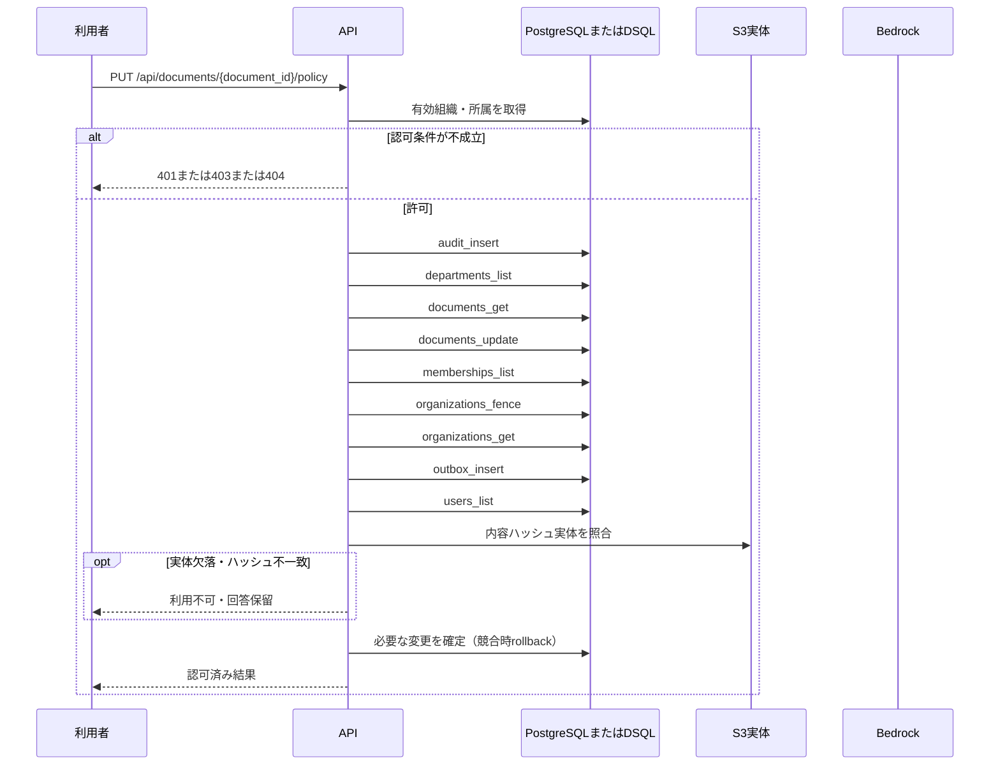

<!-- 実装から生成。直接編集しない。入力SHA256: 209f2912c47883d8fdc722aafdde6cf403dff105c2efced6770337a06a320dd2 -->

# リーダーが公開範囲・公開停止・削除を管理 — sequence

## 制御順序（関数内の行順）

| 関数 | 行 | 要素 | 条件・早期終了・例外 |
| --- | --- | --- | --- |
| kotorelay.context.Context.document | 90 | Return | doc |
| kotorelay.context.new_id | 22 | Return | str(uuid4()) |
| kotorelay.context.now | 18 | Return | datetime.now(UTC) |
| kotorelay.errors.require | 13 | If | not condition |
| kotorelay.errors.require | 14 | Raise | Raise |
| kotorelay.operations.documents.functions.policy | 337 | Return | updated |
| kotorelay.operations.documents.router.change_policy | 82 | Return | f.policy(ctx, str(document_id), data) |
