<!-- 実装から生成。直接編集しない。入力SHA256: 1c655589065a087f66d0ae05a6e0b777b889337ba2d8cca7542a2988c7248164 -->

# 最新承認版の根拠で回答 — シーケンス

章構成: [lazunex API帳票](https://github.com/tsuji-tomonori/lazunex/tree/096e1e580ab1c0670c57e4febad2bd9fdd4698ee/docs/spec/40.apis)。

```mermaid
sequenceDiagram
    participant U as 利用者
    participant A as API router
    participant F as 個別処理 functions
    participant D as PostgreSQLまたはDSQL
    participant S as 内容ハッシュ実体
    participant M as モデル・検索エンジン
    U->>A: POST /api/chat
    rect rgb(245, 247, 250)
    Note over A: 例外を捕捉する処理範囲
    rect rgb(235, 245, 255)
    Note over A,D: transaction開始・例外時rollback
    A->>D: 現在の組織の組織名・改訂番号・利用停止状態を取得する。
    A->>F: require
    alt not condition
    Note over A: 例外を送出し通常経路を終了
    end
    A->>D: 現在の組織に属する利用者を識別子順に一覧取得する。
    A->>F: require
    alt not condition
    Note over A: 例外を送出し通常経路を終了
    end
    A->>D: 現在の組織に属する部署を識別子順に一覧取得する。
    A->>D: 現在の組織に属する部署所属を識別子順に一覧取得する。
    A->>F: 質問先部署への現在の所属を確認する。
    A->>F: member
    A->>F: require
    alt not condition
    Note over A: 例外を送出し通常経路を終了
    end
    A->>F: stable_id
    A->>F: 現在の組織に属する指定の回答履歴について、質問・回答の保存先と根拠・回答状態を取得する。
    A->>D: 現在の組織に属する指定の回答履歴について、質問・回答の保存先と根拠・回答状態を取得する。
    alt prior
    A->>F: 同じ冪等キーの質問内容・部署・会話が一致することを確認する。
    opt 前条件が成立
    A->>S: 実体を取得・ハッシュ照合
    end
    A->>F: require
    alt not condition
    Note over A: 例外を送出し通常経路を終了
    end
    Note over A: 例外を送出し通常経路を終了
    end
    A->>F: 要求内容の一致を確認して同じ冪等キーの記録済み結果を取得する。
    A->>F: idempotent_result
    A->>F: stable_id
    A->>D: 現在の組織に属する指定の再送判定の記録について、実行済み操作の入力ハッシュと応答を取得する。
    opt 前条件が成立
    A->>F: digest
    end
    A->>F: require
    alt not condition
    Note over A: 例外を送出し通常経路を終了
    end
    A->>F: 現在の組織に属する利用イベントを識別子順に一覧取得する。
    A->>D: 現在の組織に属する利用イベントを識別子順に一覧取得する。
    A->>F: 再開要求を除いて利用者の当日質問数の上限を確認する。
    A->>F: require
    alt not condition
    Note over A: 例外を送出し通常経路を終了
    end
    alt resumed is not None
    else 条件不成立
    alt data.conversation_id
    A->>F: 現在の組織に属する指定の会話について、会話の所有者と開始日時を取得する。
    A->>D: 現在の組織に属する指定の会話について、会話の所有者と開始日時を取得する。
    A->>F: 会話が存在し現在の利用者が所有することを確認する。
    A->>F: require
    alt not condition
    Note over A: 例外を送出し通常経路を終了
    end
    A->>F: 会話内の回答が同じ部署に帰属することを確認する。
    A->>D: 現在の組織に属する回答履歴を識別子順に一覧取得する。
    A->>F: require
    alt not condition
    Note over A: 例外を送出し通常経路を終了
    end
    else 条件不成立
    A->>F: new_id
    A->>F: 現在の組織の会話を、所有者と開始日時を指定して登録する。
    A->>F: now
    A->>D: 現在の組織の会話を、所有者と開始日時を指定して登録する。
    end
    end
    A->>F: 最新承認版を持ち現在閲覧できる文書を識別子別に取得する。
    A->>D: 現在の組織に属する文書を識別子順に一覧取得する。
    loop q.documents_list(ctx.db, q.DocumentsListParams(organization_id=ctx.org))
    opt 前条件が成立
    A->>F: can_read
    end
    end
    A->>F: 閲覧可能な文書の範囲で質問に関連する断片を検索する。
    A->>M: search
    A->>F: 現在の組織に属する検索用の文書断片を識別子順に一覧取得する。
    A->>D: 現在の組織に属する検索用の文書断片を識別子順に一覧取得する。
    loop f.chunks_list(ctx)
    A->>F: 閲覧可能な最新承認版の反映済み断片でないかを判定する。
    alt f.is_unavailable_chunk(docs, chunk)
    Note over A: 次の反復へ
    end
    A->>F: 検索エンジンの候補に含まれない断片かを判定する。
    alt f.is_outside_search_results(vector_keys, chunk)
    Note over A: 次の反復へ
    end
    rect rgb(245, 247, 250)
    Note over A: 例外を捕捉する処理範囲
    A->>F: 断片実体のハッシュを照合して本文を取得する。
    A->>S: 実体を取得・ハッシュ照合
    end
    opt 例外発生：Problem
    Note over A: 次の反復へ
    end
    A->>F: 検索順位があれば順位を使い、ローカル検索では質問と本文の共通語数を得点にする。
    alt vector_keys is None
    A->>F: terms
    A->>F: terms
    else 条件不成立
    end
    A->>F: 質問と断片の関連度が採用基準を満たすかを判定する。
    opt 前条件が成立
    opt 前条件が不成立
    A->>F: terms
    end
    end
    end
    A->>F: 得点の降順と識別子の昇順で根拠候補を並べ、上位十件を取り出す。
    loop f.rank_candidates(scored)
    A->>F: 現在の組織に属する指定の文書版について、確定した本文の保存先と画像構成・検証用ハッシュを取得する。
    A->>D: 現在の組織に属する指定の文書版について、確定した本文の保存先と画像構成・検証用ハッシュを取得する。
    A->>F: 取得時点の文書・版・断片とハッシュを回答根拠の参照値にまとめる。
    A->>F: validate_citation
    A->>D: 現在の組織に属する指定の文書について、文書の所有部署・公開範囲・状態・公開版の参照を取得する。
    A->>F: can_read
    A->>D: 現在の組織に属する指定の文書版について、確定した本文の保存先と画像構成・検証用ハッシュを取得する。
    A->>D: 現在の組織に属する指定の検索用の文書断片について、本文の保存先・出典の版・画像配置・索引反映状態を取得する。
    A->>F: digest
    rect rgb(245, 247, 250)
    Note over A: 例外を捕捉する処理範囲
    A->>S: 実体を取得・ハッシュ照合
    A->>S: 実体を取得・ハッシュ照合
    loop manifest.images
    alt image.placement.id in json.loads(chunk.placements)
    A->>D: 現在の組織に属する指定の添付画像について、画像の保存先・形式・寸法・検証用ハッシュを取得する。
    A->>D: 現在の組織に属する指定の文字認識の実行記録について、認識結果の保存先・検証用ハッシュ・確認状態を取得する。
    A->>S: 実体を取得・ハッシュ照合
    A->>S: 実体を取得・ハッシュ照合
    end
    end
    end
    alt not validate_citation(ctx, citation)
    Note over A: 次の反復へ
    end
    A->>F: 確定版に記録された本文と画像の構成を読み取る。
    A->>F: 検索断片に関連付けられた画像だけを取り出す。
    A->>F: 根拠画像を追加するとモデル入力の画像数上限を超えるかを判定する。
    alt f.exceeds_image_limit(images, related, ctx)
    Note over A: 次の反復へ
    end
    loop related
    A->>F: 現在の組織に属する指定の添付画像について、画像の保存先・形式・寸法・検証用ハッシュを取得する。
    A->>D: 現在の組織に属する指定の添付画像について、画像の保存先・形式・寸法・検証用ハッシュを取得する。
    A->>F: 根拠画像のハッシュを照合してモデル入力用の実体を取得する。
    A->>S: 実体を取得・ハッシュ照合
    end
    A->>F: 回答に使用する根拠が五件に達したかを判定する。
    alt f.has_enough_citations(citations)
    Note over A: 反復を終了
    end
    end
    A->>F: 既存の受付記録を再開する要求ではないかを判定する。
    alt f.is_new_question(resumed)
    A->>F: 現在の組織の利用イベントとして、利用者・帰属部署・閲覧や質問の対象・結果・発生日時を登録する。
    A->>F: now
    A->>D: 現在の組織の利用イベントとして、利用者・帰属部署・閲覧や質問の対象・結果・発生日時を登録する。
    A->>F: 同じ要求を安全に再試行できるよう冪等キーと結果を記録する。
    A->>F: remember
    A->>F: stable_id
    A->>F: digest
    A->>D: 現在の組織の操作の再送を判定するため、実行済み操作の入力ハッシュと応答を登録する。
    end
    A->>F: 組織の更新競合を検出するための書込みフェンスを更新する。
    A->>F: fence
    A->>D: 組織の改訂番号が一致する場合だけ番号を進め、認可判定と権限失効の競合を検出する。
    A->>F: require
    alt not condition
    Note over A: 例外を送出し通常経路を終了
    end
    Note over A: この処理からreturn
    Note over A,D: 正常終了時commit・競合時rollback
    end
    end
    opt 例外発生：Problem
    A->>F: 既存回答の再表示以外の例外かを判定する。
    alt f.is_unhandled_problem(exc)
    Note over A: 例外を送出し通常経路を終了
    end
    rect rgb(235, 245, 255)
    Note over A,D: transaction開始・例外時rollback
    A->>D: 現在の組織の組織名・改訂番号・利用停止状態を取得する。
    A->>F: require
    alt not condition
    Note over A: 例外を送出し通常経路を終了
    end
    A->>D: 現在の組織に属する利用者を識別子順に一覧取得する。
    A->>F: require
    alt not condition
    Note over A: 例外を送出し通常経路を終了
    end
    A->>D: 現在の組織に属する部署を識別子順に一覧取得する。
    A->>D: 現在の組織に属する部署所属を識別子順に一覧取得する。
    A->>F: 現在の組織に属する指定の回答履歴について、質問・回答の保存先と根拠・回答状態を取得する。
    A->>D: 現在の組織に属する指定の回答履歴について、質問・回答の保存先と根拠・回答状態を取得する。
    A->>F: present
    A->>F: require
    alt not condition
    Note over A: 例外を送出し通常経路を終了
    end
    loop evidence.citations
    A->>F: validate_citation
    A->>D: 現在の組織に属する指定の文書について、文書の所有部署・公開範囲・状態・公開版の参照を取得する。
    A->>F: can_read
    A->>D: 現在の組織に属する指定の文書版について、確定した本文の保存先と画像構成・検証用ハッシュを取得する。
    A->>D: 現在の組織に属する指定の検索用の文書断片について、本文の保存先・出典の版・画像配置・索引反映状態を取得する。
    A->>F: digest
    rect rgb(245, 247, 250)
    Note over A: 例外を捕捉する処理範囲
    A->>S: 実体を取得・ハッシュ照合
    A->>S: 実体を取得・ハッシュ照合
    loop manifest.images
    alt image.placement.id in json.loads(chunk.placements)
    A->>D: 現在の組織に属する指定の添付画像について、画像の保存先・形式・寸法・検証用ハッシュを取得する。
    A->>D: 現在の組織に属する指定の文字認識の実行記録について、認識結果の保存先・検証用ハッシュ・確認状態を取得する。
    A->>S: 実体を取得・ハッシュ照合
    A->>S: 実体を取得・ハッシュ照合
    end
    end
    end
    end
    A->>S: 実体を取得・ハッシュ照合
    alt valid
    A->>S: 実体を取得・ハッシュ照合
    else 条件不成立
    end
    A->>F: 公開する応答型で業務結果を検証し、レスポンスの境界を保証する。
    Note over A: この処理からreturn
    Note over A,D: 正常終了時commit・競合時rollback
    end
    end
    alt prepared.citations
    rect rgb(235, 245, 255)
    Note over A,D: transaction開始・例外時rollback
    A->>D: 現在の組織の組織名・改訂番号・利用停止状態を取得する。
    A->>F: require
    alt not condition
    Note over A: 例外を送出し通常経路を終了
    end
    A->>D: 現在の組織に属する利用者を識別子順に一覧取得する。
    A->>F: require
    alt not condition
    Note over A: 例外を送出し通常経路を終了
    end
    A->>D: 現在の組織に属する部署を識別子順に一覧取得する。
    A->>D: 現在の組織に属する部署所属を識別子順に一覧取得する。
    loop prepared.citations
    A->>F: validate_citation
    A->>D: 現在の組織に属する指定の文書について、文書の所有部署・公開範囲・状態・公開版の参照を取得する。
    A->>F: can_read
    A->>D: 現在の組織に属する指定の文書版について、確定した本文の保存先と画像構成・検証用ハッシュを取得する。
    A->>D: 現在の組織に属する指定の検索用の文書断片について、本文の保存先・出典の版・画像配置・索引反映状態を取得する。
    A->>F: digest
    rect rgb(245, 247, 250)
    Note over A: 例外を捕捉する処理範囲
    A->>S: 実体を取得・ハッシュ照合
    A->>S: 実体を取得・ハッシュ照合
    loop manifest.images
    alt image.placement.id in json.loads(chunk.placements)
    A->>D: 現在の組織に属する指定の添付画像について、画像の保存先・形式・寸法・検証用ハッシュを取得する。
    A->>D: 現在の組織に属する指定の文字認識の実行記録について、認識結果の保存先・検証用ハッシュ・確認状態を取得する。
    A->>S: 実体を取得・ハッシュ照合
    A->>S: 実体を取得・ハッシュ照合
    end
    end
    end
    end
    alt not all((validate_citation(ctx, c) for c in prepared.citations))
    A->>F: 失効した根拠とその本文・画像をモデル入力から除く。
    end
    Note over A,D: 正常終了時commit・競合時rollback
    end
    alt prepared.citations
    rect rgb(245, 247, 250)
    Note over A: 例外を捕捉する処理範囲
    A->>F: 準備済みの本文と画像をモデルへ送り回答を取得する。
    A->>M: generate
    end
    end
    end
    rect rgb(235, 245, 255)
    Note over A,D: transaction開始・例外時rollback
    A->>D: 現在の組織の組織名・改訂番号・利用停止状態を取得する。
    A->>F: require
    alt not condition
    Note over A: 例外を送出し通常経路を終了
    end
    A->>D: 現在の組織に属する利用者を識別子順に一覧取得する。
    A->>F: require
    alt not condition
    Note over A: 例外を送出し通常経路を終了
    end
    A->>D: 現在の組織に属する部署を識別子順に一覧取得する。
    A->>D: 現在の組織に属する部署所属を識別子順に一覧取得する。
    A->>F: 回答確定時点でも質問先部署への所属が有効であることを確認する。
    A->>F: member
    A->>F: require
    alt not condition
    Note over A: 例外を送出し通常経路を終了
    end
    opt 前条件が成立
    loop prepared.citations
    A->>F: validate_citation
    A->>D: 現在の組織に属する指定の文書について、文書の所有部署・公開範囲・状態・公開版の参照を取得する。
    A->>F: can_read
    A->>D: 現在の組織に属する指定の文書版について、確定した本文の保存先と画像構成・検証用ハッシュを取得する。
    A->>D: 現在の組織に属する指定の検索用の文書断片について、本文の保存先・出典の版・画像配置・索引反映状態を取得する。
    A->>F: digest
    rect rgb(245, 247, 250)
    Note over A: 例外を捕捉する処理範囲
    A->>S: 実体を取得・ハッシュ照合
    A->>S: 実体を取得・ハッシュ照合
    loop manifest.images
    alt image.placement.id in json.loads(chunk.placements)
    A->>D: 現在の組織に属する指定の添付画像について、画像の保存先・形式・寸法・検証用ハッシュを取得する。
    A->>D: 現在の組織に属する指定の文字認識の実行記録について、認識結果の保存先・検証用ハッシュ・確認状態を取得する。
    A->>S: 実体を取得・ハッシュ照合
    A->>S: 実体を取得・ハッシュ照合
    end
    end
    end
    end
    end
    A->>F: 生成失敗と根拠の有効性から回答状態・公開する根拠・利用者向け本文を決める。
    A->>F: 回答状態に対応する質問・回答実体の保存先と根拠の行を組み立てる。
    A->>S: 実体を保存
    A->>S: 実体を保存
    A->>F: now
    A->>F: 現在の組織の回答履歴として、質問者・利用部署・質問と回答の保存先・根拠を登録する。
    A->>D: 現在の組織の回答履歴として、質問者・利用部署・質問と回答の保存先・根拠を登録する。
    A->>F: 現在の組織の利用イベントとして、利用者・帰属部署・閲覧や質問の対象・結果・発生日時を登録する。
    A->>F: stable_id
    A->>F: now
    A->>D: 現在の組織の利用イベントとして、利用者・帰属部署・閲覧や質問の対象・結果・発生日時を登録する。
    A->>F: 回答根拠に寄与した文書の識別子を重複なく取り出す。
    loop f.collect_contributing_documents(citations)
    A->>F: 現在の組織の利用イベントとして、利用者・帰属部署・閲覧や質問の対象・結果・発生日時を登録する。
    A->>F: stable_id
    A->>F: now
    A->>D: 現在の組織の利用イベントとして、利用者・帰属部署・閲覧や質問の対象・結果・発生日時を登録する。
    end
    A->>F: 実行した変更の対象と結果を監査記録へ追加する。
    A->>F: audit
    A->>F: new_id
    A->>F: now
    A->>D: 現在の組織の監査記録として、操作した利用者・対象・変更前後の状態・理由を登録する。
    A->>F: 組織の更新競合を検出するための書込みフェンスを更新する。
    A->>F: fence
    A->>D: 組織の改訂番号が一致する場合だけ番号を進め、認可判定と権限失効の競合を検出する。
    A->>F: require
    alt not condition
    Note over A: 例外を送出し通常経路を終了
    end
    A->>F: present
    A->>F: require
    alt not condition
    Note over A: 例外を送出し通常経路を終了
    end
    loop evidence.citations
    A->>F: validate_citation
    A->>D: 現在の組織に属する指定の文書について、文書の所有部署・公開範囲・状態・公開版の参照を取得する。
    A->>F: can_read
    A->>D: 現在の組織に属する指定の文書版について、確定した本文の保存先と画像構成・検証用ハッシュを取得する。
    A->>D: 現在の組織に属する指定の検索用の文書断片について、本文の保存先・出典の版・画像配置・索引反映状態を取得する。
    A->>F: digest
    rect rgb(245, 247, 250)
    Note over A: 例外を捕捉する処理範囲
    A->>S: 実体を取得・ハッシュ照合
    A->>S: 実体を取得・ハッシュ照合
    loop manifest.images
    alt image.placement.id in json.loads(chunk.placements)
    A->>D: 現在の組織に属する指定の添付画像について、画像の保存先・形式・寸法・検証用ハッシュを取得する。
    A->>D: 現在の組織に属する指定の文字認識の実行記録について、認識結果の保存先・検証用ハッシュ・確認状態を取得する。
    A->>S: 実体を取得・ハッシュ照合
    A->>S: 実体を取得・ハッシュ照合
    end
    end
    end
    end
    A->>S: 実体を取得・ハッシュ照合
    alt valid
    A->>S: 実体を取得・ハッシュ照合
    else 条件不成立
    end
    Note over A: この処理からreturn
    A->>F: 公開する応答型で業務結果を検証し、レスポンスの境界を保証する。
    Note over A: この処理からreturn
    Note over A,D: 正常終了時commit・競合時rollback
    end
    A-->>U: HTTP応答
```

**制御順序（関数内の行順）**

| 関数 | 行 | 要素 | 条件・早期終了・例外 |
| --- | --- | --- | --- |
| kotorelay.context.Context.can_read | 89 | If | doc.status != 'active' or not self.memberships |
| kotorelay.context.Context.can_read | 90 | Return | False |
| kotorelay.context.Context.can_read | 91 | If | doc.visibility == 'organization' |
| kotorelay.context.Context.can_read | 92 | Return | True |
| kotorelay.context.Context.can_read | 93 | If | self.member(doc.department_id) |
| kotorelay.context.Context.can_read | 94 | Return | True |
| kotorelay.context.Context.can_read | 95 | Return | doc.visibility == 'selected' and any((self.member(department) for department in json.loads(doc.shared_departments))) |
| kotorelay.context.Context.idempotent_result | 153 | If | not rows |
| kotorelay.context.Context.idempotent_result | 154 | Return | None |
| kotorelay.context.Context.idempotent_result | 161 | Return | record.response |
| kotorelay.context.Context.member | 75 | Return | any((m.department_id == department_id for m in self.memberships)) |
| kotorelay.context.new_id | 23 | Return | str(uuid4()) |
| kotorelay.context.now | 19 | Return | datetime.now(UTC) |
| kotorelay.context.stable_id | 27 | Return | str(uuid5(NAMESPACE_URL, 'kotorelay:' + value)) |
| kotorelay.engines.terms | 30 | Return | {value[i:i + 2] for i in range(max(0, len(value) - 1))} &#124; set(re.findall('[a-z0-9]+', value)) |
| kotorelay.errors.require | 13 | If | not condition |
| kotorelay.errors.require | 14 | Raise | Raise |
| kotorelay.objects.digest | 17 | Return | hashlib.sha256(data).hexdigest() |
| kotorelay.operations.chat.ask_question.functions.answers_get | 30 | Return | q.answers_get(ctx.db, q.AnswersGetParams(organization_id=ctx.org, id=exc.message)) |
| kotorelay.operations.chat.ask_question.functions.answers_get_2 | 50 | Return | q.answers_get(ctx.db, q.AnswersGetParams(organization_id=ctx.org, id=answer_id)) |
| kotorelay.operations.chat.ask_question.functions.answers_insert | 298 | Return | q.answers_insert(ctx.db, q.AnswersInsertParams.model_validate(row, from_attributes=True)) |
| kotorelay.operations.chat.ask_question.functions.assets_get | 215 | Return | q.assets_get(ctx.db, q.AssetsGetParams(organization_id=ctx.org, id=image.placement.asset_id)) |
| kotorelay.operations.chat.ask_question.functions.build_answer_record | 281 | Return | models.AnswersRow(id=prepared.answer_id, organization_id=ctx.org, conversation_id=prepared.conversation_id, user_id=ctx.user.id, department_id=prepared.department_id, question_key=ctx.objects.put(prepared.question.encode()), answer_key=ctx.objects.put(text.encode()), evidence=Evidence(citations=citations).model_dump_json(), status=status, model=engine.name, created_at=now()) |
| kotorelay.operations.chat.ask_question.functions.build_citation | 368 | Return | shared_schemas.Citation(document_id=doc.id, version_id=version.id, version_number=version.number, has_images=bool(json.loads(chunk.placements)), chunk_id=chunk.id, title=version.title, heading=chunk.heading, manifest_hash=version.manifest_hash, chunk_hash=chunk.sha256, document_revision=doc.revision) |
| kotorelay.operations.chat.ask_question.functions.check_concurrent_access | 264 | Return | ctx.fence() |
| kotorelay.operations.chat.ask_question.functions.chunks_list | 156 | Return | q.chunks_list(ctx.db, q.ChunksListParams(organization_id=ctx.org)) |
| kotorelay.operations.chat.ask_question.functions.collect_contributing_documents | 323 | Return | {c.document_id for c in citations} |
| kotorelay.operations.chat.ask_question.functions.conversations_get | 101 | Return | q.conversations_get(ctx.db, q.ConversationsGetParams(organization_id=ctx.org, id=conversation_id)) |
| kotorelay.operations.chat.ask_question.functions.conversations_insert | 130 | Return | q.conversations_insert(ctx.db, q.ConversationsInsertParams(id=conversation_id, organization_id=ctx.org, user_id=ctx.user.id, created_at=now())) |
| kotorelay.operations.chat.ask_question.functions.discard_invalid_evidence | 35 | Return | prepared.model_copy(update={'citations': [], 'texts': [], 'images': []}) |
| kotorelay.operations.chat.ask_question.functions.enforce_daily_question_limit | 84 | Return | require(resumed is not None or sum((1 for e in events if e.user_id == ctx.user.id and e.kind == 'question' and (e.created_at.date() == today))) < ctx.settings.max_questions_per_day, 'limit', 429) |
| kotorelay.operations.chat.ask_question.functions.events_insert | 239 | Return | q.events_insert(ctx.db, q.EventsInsertParams(id=answer_id, organization_id=ctx.org, user_id=ctx.user.id, department_id=data.department_id, document_id=None, answer_id=None, kind='question', outcome='accepted', created_at=now())) |
| kotorelay.operations.chat.ask_question.functions.events_insert_2 | 305 | Return | q.events_insert(ctx.db, q.EventsInsertParams(id=stable_id(row.id + 'outcome'), organization_id=ctx.org, user_id=ctx.user.id, department_id=prepared.department_id, document_id=None, answer_id=row.id, kind='outcome', outcome=status, created_at=now())) |
| kotorelay.operations.chat.ask_question.functions.events_insert_3 | 334 | Return | q.events_insert(ctx.db, q.EventsInsertParams(id=stable_id(row.id + document_id), organization_id=ctx.org, user_id=ctx.user.id, department_id=prepared.department_id, document_id=document_id, answer_id=row.id, kind='contribution', outcome=status, created_at=now())) |
| kotorelay.operations.chat.ask_question.functions.events_list | 74 | Return | q.events_list(ctx.db, q.EventsListParams(organization_id=ctx.org)) |
| kotorelay.operations.chat.ask_question.functions.exceeds_image_limit | 208 | Return | bool(len(images) + len(related) > ctx.settings.max_model_images) |
| kotorelay.operations.chat.ask_question.functions.find_previous_result | 69 | Return | ctx.idempotent_result(key, 'ask', request) |
| kotorelay.operations.chat.ask_question.functions.generate_answer | 40 | Return | rt.engine.generate(prepared.question, prepared.texts, prepared.images) |
| kotorelay.operations.chat.ask_question.functions.has_enough_citations | 229 | Return | bool(len(citations) >= 5) |
| kotorelay.operations.chat.ask_question.functions.has_sufficient_relevance | 182 | Return | bool(score > 0 and (vector_keys is not None or score >= max(1, len(terms(data.question)) * 0.3))) |
| kotorelay.operations.chat.ask_question.functions.is_new_question | 234 | Return | bool(resumed is None) |
| kotorelay.operations.chat.ask_question.functions.is_outside_search_results | 170 | Return | bool(vector_keys is not None and chunk.id not in vector_keys) |
| kotorelay.operations.chat.ask_question.functions.is_unavailable_chunk | 161 | Return | bool(chunk.document_id not in docs or chunk.version_id != docs[chunk.document_id].latest_version_id or (not chunk.ready)) |
| kotorelay.operations.chat.ask_question.functions.is_unhandled_problem | 25 | Return | bool(exc.code != 'already_answered') |
| kotorelay.operations.chat.ask_question.functions.load_chunk_text | 175 | Return | ctx.objects.get(chunk.body_key, chunk.sha256).decode() |
| kotorelay.operations.chat.ask_question.functions.load_citation_image | 224 | Return | ctx.objects.get(asset.object_key, image.image_hash) |
| kotorelay.operations.chat.ask_question.functions.load_readable_documents | 140 | Return | {d.id: d for d in q.documents_list(ctx.db, q.DocumentsListParams(organization_id=ctx.org)) if d.latest_version_id and ctx.can_read(d)} |
| kotorelay.operations.chat.ask_question.functions.parse_manifest | 194 | Return | Manifest.model_validate_json(version.manifest) |
| kotorelay.operations.chat.ask_question.functions.rank_candidates | 386 | Return | sorted(scored, key=lambda item: (-item[0], item[1].id))[:10] |
| kotorelay.operations.chat.ask_question.functions.record_finalize_audit | 352 | Return | ctx.audit('answer', after=status) |
| kotorelay.operations.chat.ask_question.functions.remember_prepare_result | 259 | Return | ctx.remember(key, 'ask', request, conversation_id) |
| kotorelay.operations.chat.ask_question.functions.require_conversation_owner | 110 | Return | require(bool(conversations) and conversations[0].user_id == ctx.user.id) |
| kotorelay.operations.chat.ask_question.functions.require_current_membership | 269 | Return | require(ctx.member(prepared.department_id), 'forbidden', 403) |
| kotorelay.operations.chat.ask_question.functions.require_question_membership | 45 | Return | require(ctx.member(data.department_id), 'forbidden', 403) |
| kotorelay.operations.chat.ask_question.functions.require_same_department | 117 | Return | require(all((a.department_id == data.department_id for a in q.answers_list(ctx.db, q.AnswersListParams(organization_id=ctx.org)) if a.conversation_id == conversation_id)), 'conversation_department', 409) |
| kotorelay.operations.chat.ask_question.functions.resolve_answer_outcome | 394 | Return | (status, evidence if status == 'answered' else [], answer if status == 'answered' else '現在利用できる根拠が不足しているため、回答を保留しました。') |
| kotorelay.operations.chat.ask_question.functions.score_chunk | 357 | Return | float(len(terms(question) & terms(text))) if vector_keys is None else float(len(vector_keys) - vector_keys.index(chunk_id)) |
| kotorelay.operations.chat.ask_question.functions.search_vector_keys | 151 | Return | engine.search(data.question, list(docs)) |
| kotorelay.operations.chat.ask_question.functions.select_citation_images | 201 | Return | [i for i in manifest.images if i.placement.id in json.loads(chunk.placements)] |
| kotorelay.operations.chat.ask_question.functions.validate_repeated_question | 57 | Return | require(prior[0].user_id == ctx.user.id and ctx.objects.get(prior[0].question_key).decode() == data.question and (prior[0].department_id == data.department_id) and (data.conversation_id is None or data.conversation_id == prior[0].conversation_id), 'idempotency_conflict', 409) |
| kotorelay.operations.chat.ask_question.functions.versions_get | 189 | Return | q.versions_get(ctx.db, q.VersionsGetParams(organization_id=ctx.org, id=chunk.version_id)) |
| kotorelay.operations.chat.ask_question.response_builders.build_response | 10 | Return | TypeAdapter(ResponseData).validate_python(value) |
| kotorelay.operations.chat.ask_question.router.ask_question | 34 | Try | Try |
| kotorelay.operations.chat.ask_question.router.ask_question | 37 | ExceptHandler | Problem |
| kotorelay.operations.chat.ask_question.router.ask_question | 38 | If | f.is_unhandled_problem(exc) |
| kotorelay.operations.chat.ask_question.router.ask_question | 39 | Raise | Raise |
| kotorelay.operations.chat.ask_question.router.ask_question | 41 | Return | build_response(present(ctx, f.answers_get(ctx, exc)[0])) |
| kotorelay.operations.chat.ask_question.router.ask_question | 44 | If | prepared.citations |
| kotorelay.operations.chat.ask_question.router.ask_question | 46 | If | not all((validate_citation(ctx, c) for c in prepared.citations)) |
| kotorelay.operations.chat.ask_question.router.ask_question | 48 | If | prepared.citations |
| kotorelay.operations.chat.ask_question.router.ask_question | 49 | Try | Try |
| kotorelay.operations.chat.ask_question.router.ask_question | 51 | ExceptHandler | (BotoCoreError, ClientError, TimeoutError) |
| kotorelay.operations.chat.ask_question.router.ask_question | 54 | Return | build_response(finalize(ctx, prepared, answer, rt.engine, failed)) |
| kotorelay.operations.chat.ask_question.router.finalize | 139 | For | For |
| kotorelay.operations.chat.ask_question.router.finalize | 143 | Return | present(ctx, row) |
| kotorelay.operations.chat.ask_question.router.prepare | 61 | If | prior |
| kotorelay.operations.chat.ask_question.router.prepare | 63 | Raise | Raise |
| kotorelay.operations.chat.ask_question.router.prepare | 69 | If | resumed is not None |
| kotorelay.operations.chat.ask_question.router.prepare | 71 | If | data.conversation_id |
| kotorelay.operations.chat.ask_question.router.prepare | 83 | For | For |
| kotorelay.operations.chat.ask_question.router.prepare | 84 | If | f.is_unavailable_chunk(docs, chunk) |
| kotorelay.operations.chat.ask_question.router.prepare | 86 | If | f.is_outside_search_results(vector_keys, chunk) |
| kotorelay.operations.chat.ask_question.router.prepare | 88 | Try | Try |
| kotorelay.operations.chat.ask_question.router.prepare | 90 | ExceptHandler | Problem |
| kotorelay.operations.chat.ask_question.router.prepare | 93 | If | f.has_sufficient_relevance(score, vector_keys, data) |
| kotorelay.operations.chat.ask_question.router.prepare | 98 | For | For |
| kotorelay.operations.chat.ask_question.router.prepare | 102 | If | not validate_citation(ctx, citation) |
| kotorelay.operations.chat.ask_question.router.prepare | 106 | If | f.exceeds_image_limit(images, related, ctx) |
| kotorelay.operations.chat.ask_question.router.prepare | 108 | For | For |
| kotorelay.operations.chat.ask_question.router.prepare | 113 | If | f.has_enough_citations(citations) |
| kotorelay.operations.chat.ask_question.router.prepare | 115 | If | f.is_new_question(resumed) |
| kotorelay.operations.chat.ask_question.router.prepare | 119 | Return | Prepared(answer_id=answer_id, conversation_id=conversation_id, question=data.question, department_id=data.department_id, citations=citations, texts=texts, images=images) |
| kotorelay.operations.chat.shared.functions.present | 74 | Return | AnswerView(id=answer.id, conversation_id=answer.conversation_id, question=ctx.objects.get(answer.question_key).decode(), answer=ctx.objects.get(answer.answer_key).decode() if valid else '権限または公開版が変更されたため、この回答は表示できません。', status=answer.status if valid else 'hidden', citations=evidence.citations if valid else [], model=answer.model, created_at=answer.created_at) |
| kotorelay.operations.chat.shared.functions.validate_citation | 19 | If | not docs |
| kotorelay.operations.chat.shared.functions.validate_citation | 20 | Return | False |
| kotorelay.operations.chat.shared.functions.validate_citation | 22 | If | not ctx.can_read(doc) or doc.latest_version_id != citation.version_id or doc.revision != citation.document_revision |
| kotorelay.operations.chat.shared.functions.validate_citation | 27 | Return | False |
| kotorelay.operations.chat.shared.functions.validate_citation | 32 | If | not versions or not chunks |
| kotorelay.operations.chat.shared.functions.validate_citation | 33 | Return | False |
| kotorelay.operations.chat.shared.functions.validate_citation | 35 | If | not (digest(version.manifest.encode()) == version.manifest_hash and version.document_id == doc.id and chunk.ready and (chunk.version_id == version.id) and (chunk.document_id == doc.id) and (chunk.manifest_hash == version.manifest_hash == citation.manifest_hash) and (chunk.sha256 == citation.chunk_hash)) |
| kotorelay.operations.chat.shared.functions.validate_citation | 44 | Return | False |
| kotorelay.operations.chat.shared.functions.validate_citation | 45 | Try | Try |
| kotorelay.operations.chat.shared.functions.validate_citation | 50 | If | placements - {image.placement.id for image in manifest.images} |
| kotorelay.operations.chat.shared.functions.validate_citation | 51 | Return | False |
| kotorelay.operations.chat.shared.functions.validate_citation | 52 | For | For |
| kotorelay.operations.chat.shared.functions.validate_citation | 53 | If | image.placement.id in json.loads(chunk.placements) |
| kotorelay.operations.chat.shared.functions.validate_citation | 61 | If | not assets or not runs or (not runs[0].confirmed) or (runs[0].status != 'ready') |
| kotorelay.operations.chat.shared.functions.validate_citation | 62 | Return | False |
| kotorelay.operations.chat.shared.functions.validate_citation | 65 | Return | True |
| kotorelay.operations.chat.shared.functions.validate_citation | 66 | ExceptHandler | (Problem, ValueError) |
| kotorelay.operations.chat.shared.functions.validate_citation | 67 | Return | False |
