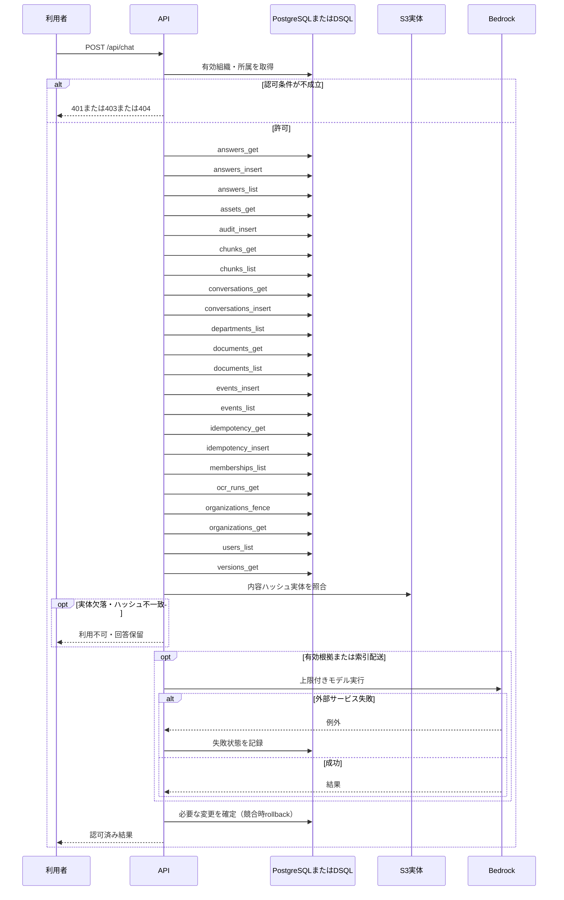

<!-- 実装から生成。直接編集しない。入力SHA256: 4c18ae62a9b9de513581947abfc60f1ec45b9f631019a142a812724b4695a84b -->

# 最新承認版の根拠で回答 — シーケンス

章構成: [lazunex API帳票](https://github.com/tsuji-tomonori/lazunex/tree/096e1e580ab1c0670c57e4febad2bd9fdd4698ee/docs/spec/40.apis)。

**制御順序（関数内の行順）**

| 関数 | 行 | 要素 | 条件・早期終了・例外 |
| --- | --- | --- | --- |
| kotorelay.context.Context.can_read | 70 | If | doc.status != 'active' or not self.memberships |
| kotorelay.context.Context.can_read | 71 | Return | False |
| kotorelay.context.Context.can_read | 72 | If | doc.visibility == 'organization' |
| kotorelay.context.Context.can_read | 73 | Return | True |
| kotorelay.context.Context.can_read | 74 | If | self.member(doc.department_id) |
| kotorelay.context.Context.can_read | 75 | Return | True |
| kotorelay.context.Context.can_read | 76 | Return | doc.visibility == 'selected' and any((self.member(department) for department in json.loads(doc.shared_departments))) |
| kotorelay.context.Context.idempotent_result | 129 | If | not rows |
| kotorelay.context.Context.idempotent_result | 130 | Return | None |
| kotorelay.context.Context.idempotent_result | 137 | Return | record.response |
| kotorelay.context.Context.member | 56 | Return | any((m.department_id == department_id for m in self.memberships)) |
| kotorelay.context.new_id | 22 | Return | str(uuid4()) |
| kotorelay.context.now | 18 | Return | datetime.now(UTC) |
| kotorelay.context.stable_id | 26 | Return | str(uuid5(NAMESPACE_URL, 'kotorelay:' + value)) |
| kotorelay.engines.terms | 30 | Return | {value[i:i + 2] for i in range(max(0, len(value) - 1))} &#124; set(re.findall('[a-z0-9]+', value)) |
| kotorelay.errors.require | 13 | If | not condition |
| kotorelay.errors.require | 14 | Raise | Raise |
| kotorelay.objects.digest | 17 | Return | hashlib.sha256(data).hexdigest() |
| kotorelay.operations.chat.functions.finalize | 254 | For | For |
| kotorelay.operations.chat.functions.finalize | 271 | Return | present(ctx, row) |
| kotorelay.operations.chat.functions.prepare | 78 | If | prior |
| kotorelay.operations.chat.functions.prepare | 87 | Raise | Raise |
| kotorelay.operations.chat.functions.prepare | 103 | If | resumed is not None |
| kotorelay.operations.chat.functions.prepare | 105 | If | data.conversation_id |
| kotorelay.operations.chat.functions.prepare | 133 | For | For |
| kotorelay.operations.chat.functions.prepare | 134 | If | chunk.document_id not in docs or chunk.version_id != docs[chunk.document_id].latest_version_id or (not chunk.ready) |
| kotorelay.operations.chat.functions.prepare | 140 | If | vector_keys is not None and chunk.id not in vector_keys |
| kotorelay.operations.chat.functions.prepare | 142 | Try | Try |
| kotorelay.operations.chat.functions.prepare | 144 | ExceptHandler | Problem |
| kotorelay.operations.chat.functions.prepare | 151 | If | score > 0 and (vector_keys is not None or score >= max(1, len(terms(data.question)) * 0.3)) |
| kotorelay.operations.chat.functions.prepare | 158 | For | For |
| kotorelay.operations.chat.functions.prepare | 173 | If | not validate_citation(ctx, citation) |
| kotorelay.operations.chat.functions.prepare | 177 | If | len(images) + len(related) > ctx.settings.max_model_images |
| kotorelay.operations.chat.functions.prepare | 179 | For | For |
| kotorelay.operations.chat.functions.prepare | 184 | If | len(citations) >= 5 |
| kotorelay.operations.chat.functions.prepare | 186 | If | resumed is None |
| kotorelay.operations.chat.functions.prepare | 203 | Return | Prepared(answer_id=answer_id, conversation_id=conversation_id, question=data.question, department_id=data.department_id, citations=citations, texts=texts, images=images) |
| kotorelay.operations.chat.functions.present | 278 | Return | AnswerView(id=answer.id, conversation_id=answer.conversation_id, question=ctx.objects.get(answer.question_key).decode(), answer=ctx.objects.get(answer.answer_key).decode() if valid else '権限または公開版が変更されたため、この回答は表示できません。', status=answer.status if valid else 'hidden', citations=evidence.citations if valid else [], model=answer.model, created_at=answer.created_at) |
| kotorelay.operations.chat.functions.validate_citation | 30 | If | not docs |
| kotorelay.operations.chat.functions.validate_citation | 31 | Return | False |
| kotorelay.operations.chat.functions.validate_citation | 33 | If | not ctx.can_read(doc) or doc.latest_version_id != citation.version_id or doc.revision != citation.document_revision |
| kotorelay.operations.chat.functions.validate_citation | 38 | Return | False |
| kotorelay.operations.chat.functions.validate_citation | 41 | If | not versions or not chunks |
| kotorelay.operations.chat.functions.validate_citation | 42 | Return | False |
| kotorelay.operations.chat.functions.validate_citation | 44 | If | not (digest(version.manifest.encode()) == version.manifest_hash and version.document_id == doc.id and chunk.ready and (chunk.version_id == version.id) and (chunk.document_id == doc.id) and (chunk.manifest_hash == version.manifest_hash == citation.manifest_hash) and (chunk.sha256 == citation.chunk_hash)) |
| kotorelay.operations.chat.functions.validate_citation | 53 | Return | False |
| kotorelay.operations.chat.functions.validate_citation | 54 | Try | Try |
| kotorelay.operations.chat.functions.validate_citation | 59 | If | placements - {image.placement.id for image in manifest.images} |
| kotorelay.operations.chat.functions.validate_citation | 60 | Return | False |
| kotorelay.operations.chat.functions.validate_citation | 61 | For | For |
| kotorelay.operations.chat.functions.validate_citation | 62 | If | image.placement.id in json.loads(chunk.placements) |
| kotorelay.operations.chat.functions.validate_citation | 65 | If | not assets or not runs or (not runs[0].confirmed) or (runs[0].status != 'ready') |
| kotorelay.operations.chat.functions.validate_citation | 66 | Return | False |
| kotorelay.operations.chat.functions.validate_citation | 69 | Return | True |
| kotorelay.operations.chat.functions.validate_citation | 70 | ExceptHandler | (Problem, ValueError) |
| kotorelay.operations.chat.functions.validate_citation | 71 | Return | False |
| kotorelay.operations.chat.router.ask_question | 18 | Return | service.ask(rt, subject, data, str(key)) |
| kotorelay.operations.chat.service.ask | 13 | Try | Try |
| kotorelay.operations.chat.service.ask | 16 | ExceptHandler | Problem |
| kotorelay.operations.chat.service.ask | 17 | If | exc.code != 'already_answered' |
| kotorelay.operations.chat.service.ask | 18 | Raise | Raise |
| kotorelay.operations.chat.service.ask | 20 | Return | f.present(ctx, q.answers_get(ctx.db, ctx.org, exc.message)[0]) |
| kotorelay.operations.chat.service.ask | 23 | If | prepared.citations |
| kotorelay.operations.chat.service.ask | 26 | If | not all((f.validate_citation(ctx, c) for c in prepared.citations)) |
| kotorelay.operations.chat.service.ask | 28 | If | prepared.citations |
| kotorelay.operations.chat.service.ask | 29 | Try | Try |
| kotorelay.operations.chat.service.ask | 31 | ExceptHandler | (BotoCoreError, ClientError, TimeoutError) |
| kotorelay.operations.chat.service.ask | 34 | Return | f.finalize(ctx, prepared, answer, rt.engine, failed) |
