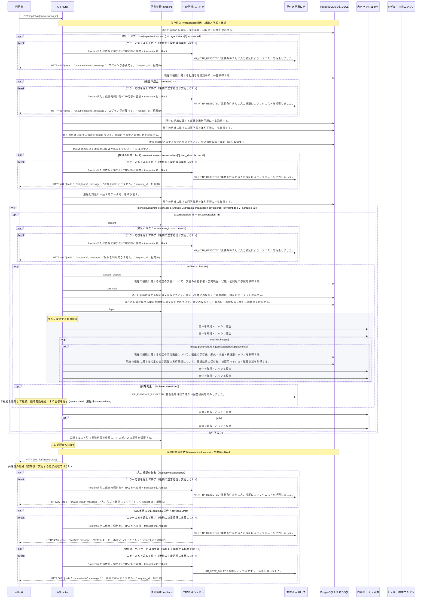

<!-- 実装から生成。直接編集しない。入力SHA256: 7ce322b2bb5c68dab4c51499ae55d5e49bae34d22b47e21dd6264975362b5d49 -->

# 現行認可で会話履歴を再表示 — シーケンス

章構成: [lazunex API帳票](https://github.com/tsuji-tomonori/lazunex/tree/096e1e580ab1c0670c57e4febad2bd9fdd4698ee/docs/spec/40.apis)。

**例外応答一覧（HTTP境界へ到達した場合）**

| HTTP | code | message | 相関ID |
| --- | --- | --- | --- |
| 401 | unauthenticated | ログインが必要です。 | request_id |
| 404 | not_found | 対象を利用できません。 | request_id |
| 409 | conflict | 競合しました。再読込してください。 | request_id |
| 422 | invalid_input | 入力形式を確認してください。 | request_id |
| 503 | unavailable | 一時的に利用できません。 | request_id |

**制御順序（関数内の行順）**

| 関数 | 行 | 要素 | 条件・早期終了・例外 |
| --- | --- | --- | --- |
| kotorelay.context.Context.can_read | 89 | If | doc.status != 'active' or not self.memberships |
| kotorelay.context.Context.can_read | 90 | Return | False |
| kotorelay.context.Context.can_read | 91 | If | doc.visibility == 'organization' |
| kotorelay.context.Context.can_read | 92 | Return | True |
| kotorelay.context.Context.can_read | 93 | If | self.member(doc.department_id) |
| kotorelay.context.Context.can_read | 94 | Return | True |
| kotorelay.context.Context.can_read | 95 | Return | doc.visibility == 'selected' and any((self.member(department) for department in json.loads(doc.shared_departments))) |
| kotorelay.errors.require | 13 | If | not condition |
| kotorelay.errors.require | 14 | Raise | Raise |
| kotorelay.objects.digest | 17 | Return | hashlib.sha256(data).hexdigest() |
| kotorelay.operational_logging.continuation_context | 150 | Return | OperationalLogContext(request_id=REQUEST_ID.get(), exception_type=type(error).__name__, status=None, code=(error.code if isinstance(error, Problem) else 'external_failure') if message_id == MessageId.INDEX_FAILED else None, message=CATALOG[message_id].response) |
| kotorelay.operations.chat.chat_history.functions.conversations_get | 18 | Return | q.conversations_get(ctx.db, q.ConversationsGetParams(organization_id=ctx.org, id=str(conversation_id))) |
| kotorelay.operations.chat.chat_history.functions.require_conversation_owner | 27 | Return | require(bool(conversations) and conversations[0].user_id == ctx.user.id) |
| kotorelay.operations.chat.chat_history.functions.select_chat_history | 34 | Return | [present(ctx, a) for a in sorted(q.answers_list(ctx.db, q.AnswersListParams(organization_id=ctx.org)), key=lambda a: a.created_at) if a.conversation_id == str(conversation_id)] |
| kotorelay.operations.chat.chat_history.response_builders.build_response | 10 | Return | TypeAdapter(ResponseData).validate_python(value) |
| kotorelay.operations.chat.chat_history.router.chat_history | 28 | Return | build_response(f.select_chat_history(ctx, conversation_id)) |
| kotorelay.operations.chat.shared.functions.present | 79 | Return | AnswerView(id=answer.id, conversation_id=answer.conversation_id, question=ctx.objects.get(answer.question_key).decode(), answer=ctx.objects.get(answer.answer_key).decode() if valid else '権限または公開版が変更されたため、この回答は表示できません。', status=answer.status if valid else 'hidden', citations=evidence.citations if valid else [], model=answer.model, created_at=answer.created_at) |
| kotorelay.operations.chat.shared.functions.validate_citation | 20 | If | not docs |
| kotorelay.operations.chat.shared.functions.validate_citation | 21 | Return | False |
| kotorelay.operations.chat.shared.functions.validate_citation | 23 | If | not ctx.can_read(doc) or doc.latest_version_id != citation.version_id or doc.revision != citation.document_revision |
| kotorelay.operations.chat.shared.functions.validate_citation | 28 | Return | False |
| kotorelay.operations.chat.shared.functions.validate_citation | 33 | If | not versions or not chunks |
| kotorelay.operations.chat.shared.functions.validate_citation | 34 | Return | False |
| kotorelay.operations.chat.shared.functions.validate_citation | 36 | If | not (digest(version.manifest.encode()) == version.manifest_hash and version.document_id == doc.id and chunk.ready and (chunk.version_id == version.id) and (chunk.document_id == doc.id) and (chunk.manifest_hash == version.manifest_hash == citation.manifest_hash) and (chunk.sha256 == citation.chunk_hash)) |
| kotorelay.operations.chat.shared.functions.validate_citation | 45 | Return | False |
| kotorelay.operations.chat.shared.functions.validate_citation | 46 | Try | Try |
| kotorelay.operations.chat.shared.functions.validate_citation | 51 | If | placements - {image.placement.id for image in manifest.images} |
| kotorelay.operations.chat.shared.functions.validate_citation | 52 | Return | False |
| kotorelay.operations.chat.shared.functions.validate_citation | 53 | For | For |
| kotorelay.operations.chat.shared.functions.validate_citation | 54 | If | image.placement.id in json.loads(chunk.placements) |
| kotorelay.operations.chat.shared.functions.validate_citation | 62 | If | not assets or not runs or (not runs[0].confirmed) or (runs[0].status != 'ready') |
| kotorelay.operations.chat.shared.functions.validate_citation | 63 | Return | False |
| kotorelay.operations.chat.shared.functions.validate_citation | 66 | Return | True |
| kotorelay.operations.chat.shared.functions.validate_citation | 67 | ExceptHandler | (Problem, ValueError) |
| kotorelay.operations.chat.shared.functions.validate_citation | 72 | Return | False |
