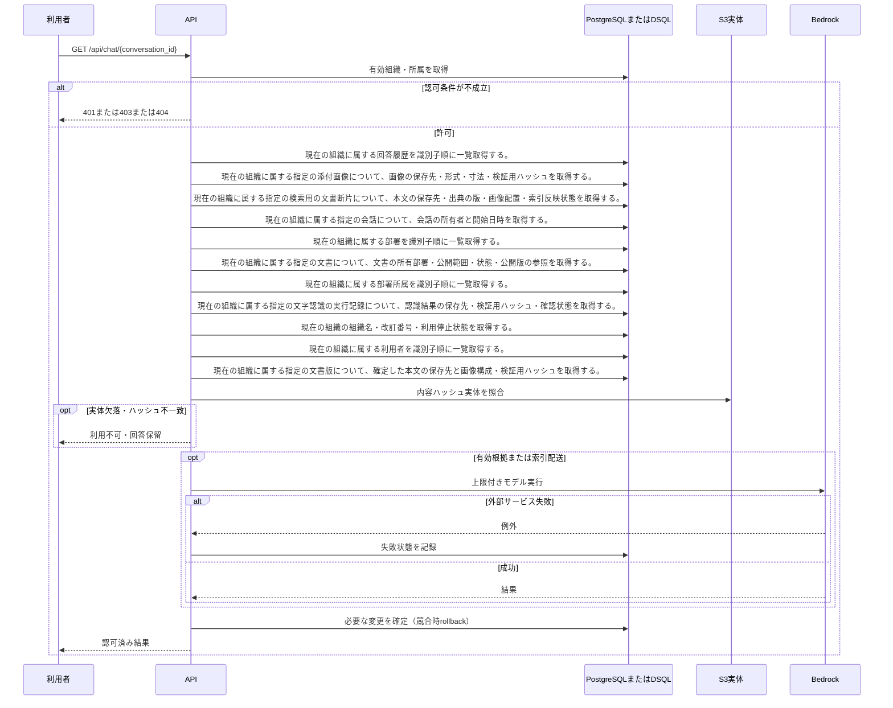

<!-- 実装から生成。直接編集しない。入力SHA256: 31de213f242d3d7bf0d4f5957d4ef327aaacb2267a973d8e0adce1f1531ac7e1 -->

# 現行認可で会話履歴を再表示 — シーケンス

章構成: [lazunex API帳票](https://github.com/tsuji-tomonori/lazunex/tree/096e1e580ab1c0670c57e4febad2bd9fdd4698ee/docs/spec/40.apis)。

**制御順序（関数内の行順）**

| 関数 | 行 | 要素 | 条件・早期終了・例外 |
| --- | --- | --- | --- |
| kotorelay.context.Context.can_read | 70 | If | doc.status != 'active' or not self.memberships |
| kotorelay.context.Context.can_read | 71 | Return | False |
| kotorelay.context.Context.can_read | 72 | If | doc.visibility == 'organization' |
| kotorelay.context.Context.can_read | 73 | Return | True |
| kotorelay.context.Context.can_read | 74 | If | self.member(doc.department_id) |
| kotorelay.context.Context.can_read | 75 | Return | True |
| kotorelay.context.Context.can_read | 76 | Return | doc.visibility == 'selected' and any((self.member(department) for department in json.loads(doc.shared_departments))) |
| kotorelay.errors.require | 13 | If | not condition |
| kotorelay.errors.require | 14 | Raise | Raise |
| kotorelay.objects.digest | 17 | Return | hashlib.sha256(data).hexdigest() |
| kotorelay.operations.chat.functions.history | 295 | Return | [present(ctx, a) for a in sorted(q.answers_list(ctx.db, ctx.org), key=lambda a: a.created_at) if a.conversation_id == conversation_id] |
| kotorelay.operations.chat.functions.present | 278 | Return | AnswerView(id=answer.id, conversation_id=answer.conversation_id, question=ctx.objects.get(answer.question_key).decode(), answer=ctx.objects.get(answer.answer_key).decode() if valid else '権限または公開版が変更されたため、この回答は表示できません。', status=answer.status if valid else 'hidden', citations=evidence.citations if valid else [], model=answer.model, created_at=answer.created_at) |
| kotorelay.operations.chat.functions.validate_citation | 30 | If | not docs |
| kotorelay.operations.chat.functions.validate_citation | 31 | Return | False |
| kotorelay.operations.chat.functions.validate_citation | 33 | If | not ctx.can_read(doc) or doc.latest_version_id != citation.version_id or doc.revision != citation.document_revision |
| kotorelay.operations.chat.functions.validate_citation | 38 | Return | False |
| kotorelay.operations.chat.functions.validate_citation | 41 | If | not versions or not chunks |
| kotorelay.operations.chat.functions.validate_citation | 42 | Return | False |
| kotorelay.operations.chat.functions.validate_citation | 44 | If | not (digest(version.manifest.encode()) == version.manifest_hash and version.document_id == doc.id and chunk.ready and (chunk.version_id == version.id) and (chunk.document_id == doc.id) and (chunk.manifest_hash == version.manifest_hash == citation.manifest_hash) and (chunk.sha256 == citation.chunk_hash)) |
| kotorelay.operations.chat.functions.validate_citation | 53 | Return | False |
| kotorelay.operations.chat.functions.validate_citation | 54 | Try | Try |
| kotorelay.operations.chat.functions.validate_citation | 59 | If | placements - {image.placement.id for image in manifest.images} |
| kotorelay.operations.chat.functions.validate_citation | 60 | Return | False |
| kotorelay.operations.chat.functions.validate_citation | 61 | For | For |
| kotorelay.operations.chat.functions.validate_citation | 62 | If | image.placement.id in json.loads(chunk.placements) |
| kotorelay.operations.chat.functions.validate_citation | 65 | If | not assets or not runs or (not runs[0].confirmed) or (runs[0].status != 'ready') |
| kotorelay.operations.chat.functions.validate_citation | 66 | Return | False |
| kotorelay.operations.chat.functions.validate_citation | 69 | Return | True |
| kotorelay.operations.chat.functions.validate_citation | 70 | ExceptHandler | (Problem, ValueError) |
| kotorelay.operations.chat.functions.validate_citation | 71 | Return | False |
| kotorelay.operations.chat.router.chat_history | 23 | Return | f.history(ctx, str(conversation_id)) |
