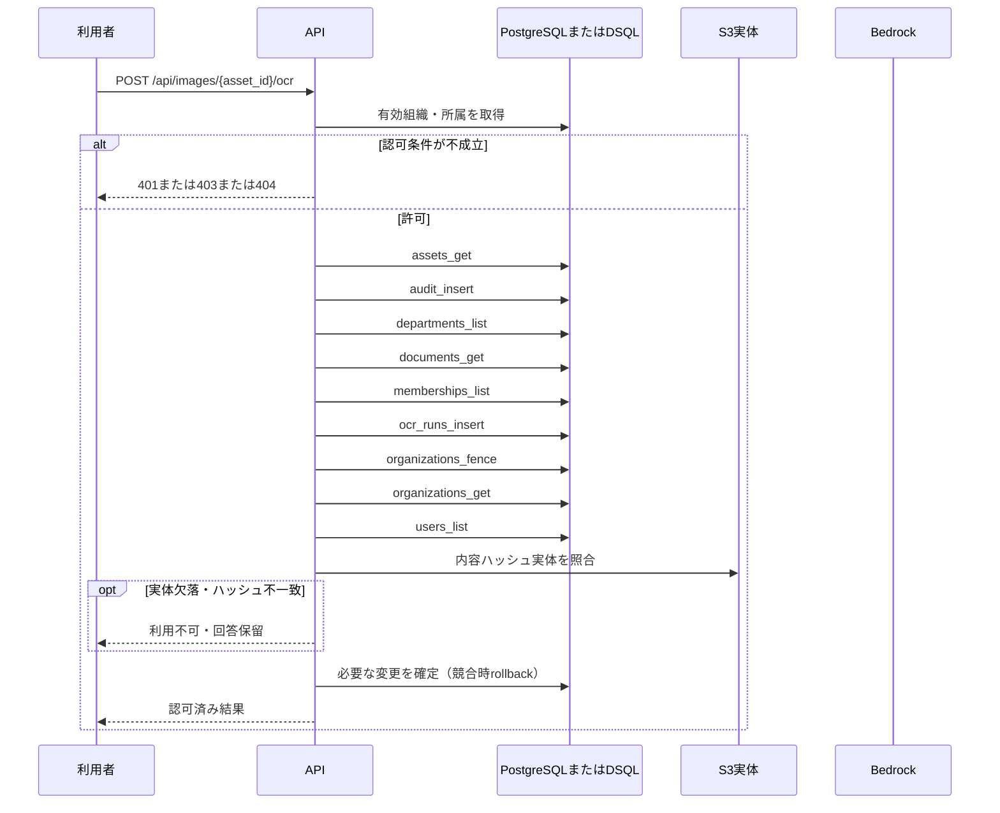

<!-- 実装から生成。直接編集しない。入力SHA256: f4209c4ed7b292c6ed57aa300cf25000f8931a1f59b1fb43cfeb436b1d949dbe -->

# OCRを訂正し新しいrunを保存 — sequence

## 制御順序（関数内の行順）

| 関数 | 行 | 要素 | 条件・早期終了・例外 |
| --- | --- | --- | --- |
| kotorelay.context.Context.document | 90 | Return | doc |
| kotorelay.context.new_id | 22 | Return | str(uuid4()) |
| kotorelay.context.now | 18 | Return | datetime.now(UTC) |
| kotorelay.errors.require | 13 | If | not condition |
| kotorelay.errors.require | 14 | Raise | Raise |
| kotorelay.operations.images.functions.correct | 118 | For | For |
| kotorelay.operations.images.functions.correct | 141 | Return | {'ocr_run': run, 'ocr': result} |
| kotorelay.operations.images.router.correct_ocr | 39 | Return | f.correct(ctx, str(asset_id), data) |
