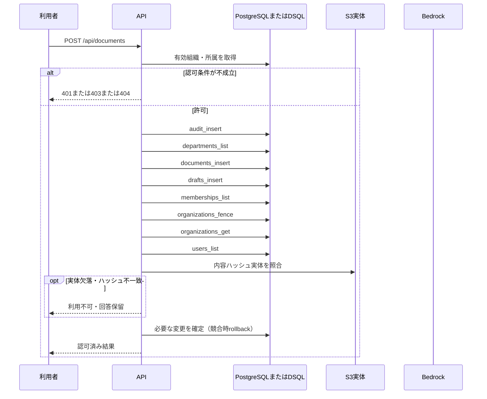

<!-- 実装から生成。直接編集しない。入力SHA256: f4209c4ed7b292c6ed57aa300cf25000f8931a1f59b1fb43cfeb436b1d949dbe -->

# 文書を作成 — sequence

## 制御順序（関数内の行順）

| 関数 | 行 | 要素 | 条件・早期終了・例外 |
| --- | --- | --- | --- |
| kotorelay.context.Context.permission | 59 | For | For |
| kotorelay.context.Context.permission | 60 | If | m.department_id == department_id |
| kotorelay.context.Context.permission | 61 | Return | {'author': m.can_author, 'review': m.can_review, 'manage': m.leader, 'draft': m.can_author or m.can_review}.get(operation, False) |
| kotorelay.context.Context.permission | 67 | Return | False |
| kotorelay.context.new_id | 22 | Return | str(uuid4()) |
| kotorelay.context.now | 18 | Return | datetime.now(UTC) |
| kotorelay.errors.require | 13 | If | not condition |
| kotorelay.errors.require | 14 | Raise | Raise |
| kotorelay.operations.documents.functions.create | 56 | Return | doc |
| kotorelay.operations.documents.router.create_document | 30 | Return | f.create(ctx, data) |
