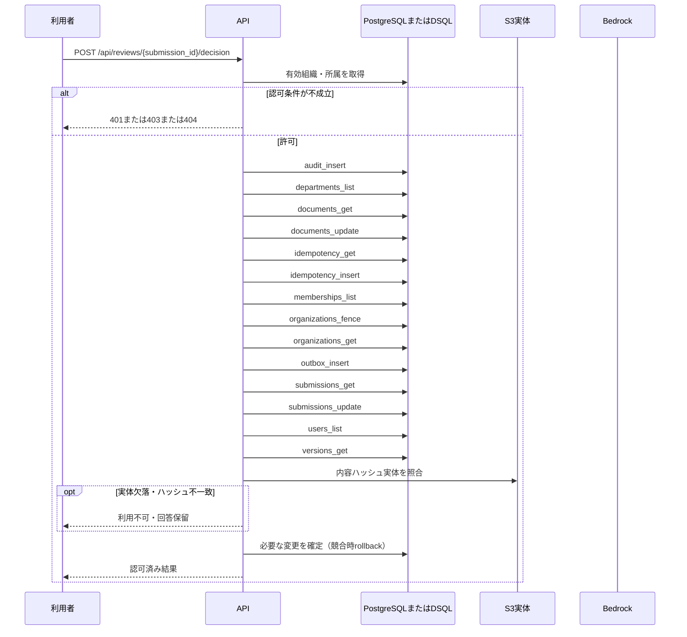

<!-- 実装から生成。直接編集しない。入力SHA256: 209f2912c47883d8fdc722aafdde6cf403dff105c2efced6770337a06a320dd2 -->

# manifestを確認して承認・却下 — sequence

## 制御順序（関数内の行順）

| 関数 | 行 | 要素 | 条件・早期終了・例外 |
| --- | --- | --- | --- |
| kotorelay.context.Context.document | 90 | Return | doc |
| kotorelay.context.Context.idempotent_result | 129 | If | not rows |
| kotorelay.context.Context.idempotent_result | 130 | Return | None |
| kotorelay.context.Context.idempotent_result | 137 | Return | record.response |
| kotorelay.context.Context.version | 96 | If | not self.permission(doc.department_id, 'draft') |
| kotorelay.context.Context.version | 100 | Return | version |
| kotorelay.context.new_id | 22 | Return | str(uuid4()) |
| kotorelay.context.now | 18 | Return | datetime.now(UTC) |
| kotorelay.context.stable_id | 26 | Return | str(uuid5(NAMESPACE_URL, 'kotorelay:' + value)) |
| kotorelay.errors.require | 13 | If | not condition |
| kotorelay.errors.require | 14 | Raise | Raise |
| kotorelay.objects.digest | 17 | Return | hashlib.sha256(data).hexdigest() |
| kotorelay.operations.reviews.functions.decide | 43 | If | cached |
| kotorelay.operations.reviews.functions.decide | 44 | Return | q.SubmissionsRow.model_validate_json(cached) |
| kotorelay.operations.reviews.functions.decide | 61 | If | data.decision == 'approved' |
| kotorelay.operations.reviews.functions.decide | 65 | If | not previous or previous[0].number < version.number |
| kotorelay.operations.reviews.functions.decide | 93 | Return | updated |
| kotorelay.operations.reviews.router.decide_review | 27 | Return | f.decide(ctx, str(submission_id), data, str(key)) |
