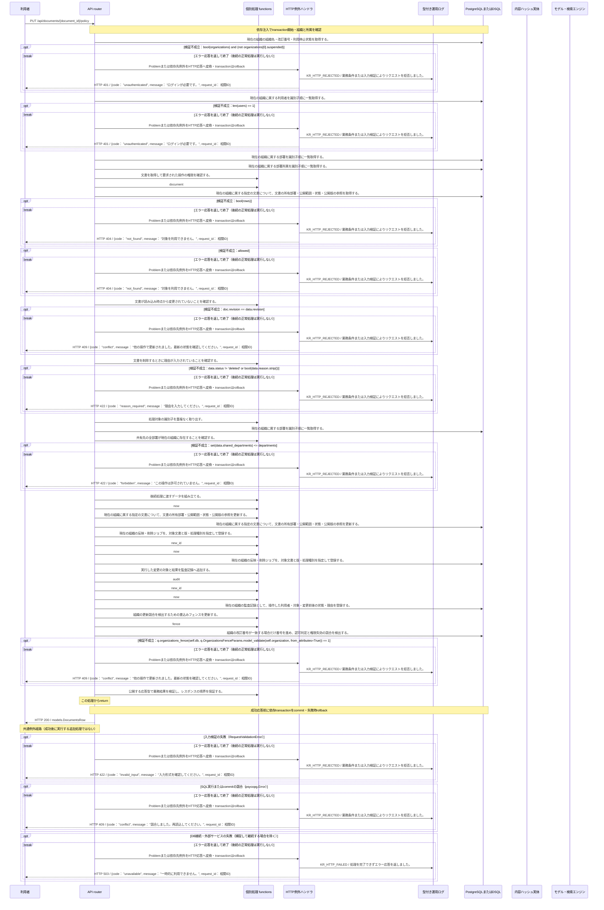

<!-- 実装から生成。直接編集しない。入力SHA256: 7ce322b2bb5c68dab4c51499ae55d5e49bae34d22b47e21dd6264975362b5d49 -->

# リーダーが公開範囲・公開停止・削除を管理 — シーケンス

章構成: [lazunex API帳票](https://github.com/tsuji-tomonori/lazunex/tree/096e1e580ab1c0670c57e4febad2bd9fdd4698ee/docs/spec/40.apis)。

**例外応答一覧（HTTP境界へ到達した場合）**

| HTTP | code | message | 相関ID |
| --- | --- | --- | --- |
| 401 | unauthenticated | ログインが必要です。 | request_id |
| 404 | not_found | 対象を利用できません。 | request_id |
| 409 | conflict | 他の操作で更新されました。最新の状態を確認してください。 | request_id |
| 409 | conflict | 競合しました。再読込してください。 | request_id |
| 422 | forbidden | この操作は許可されていません。 | request_id |
| 422 | invalid_input | 入力形式を確認してください。 | request_id |
| 422 | reason_required | 理由を入力してください。 | request_id |
| 503 | unavailable | 一時的に利用できません。 | request_id |

**制御順序（関数内の行順）**

| 関数 | 行 | 要素 | 条件・早期終了・例外 |
| --- | --- | --- | --- |
| kotorelay.context.Context.document | 111 | Return | doc |
| kotorelay.context.new_id | 23 | Return | str(uuid4()) |
| kotorelay.context.now | 19 | Return | datetime.now(UTC) |
| kotorelay.errors.require | 13 | If | not condition |
| kotorelay.errors.require | 14 | Raise | Raise |
| kotorelay.operations.documents.change_policy.functions.build_updated | 51 | Return | doc.model_copy(update={'visibility': data.visibility, 'shared_departments': json.dumps(data.shared_departments), 'status': data.status, 'revision': doc.revision + 1, 'updated_at': now()}) |
| kotorelay.operations.documents.change_policy.functions.check_concurrent_access | 98 | Return | ctx.fence() |
| kotorelay.operations.documents.change_policy.functions.collect_departments | 35 | Return | {d.id for d in q.departments_list(ctx.db, q.DepartmentsListParams(organization_id=ctx.org)) if d.active} |
| kotorelay.operations.documents.change_policy.functions.document_doc | 18 | Return | ctx.document(str(document_id), 'manage') |
| kotorelay.operations.documents.change_policy.functions.documents_update | 64 | Return | q.documents_update(ctx.db, q.DocumentsUpdateParams.model_validate(updated, from_attributes=True)) |
| kotorelay.operations.documents.change_policy.functions.outbox_insert | 73 | Return | q.outbox_insert(ctx.db, q.OutboxInsertParams(id=new_id(), organization_id=ctx.org, document_id=doc.id, version_id=doc.latest_version_id, kind='purge' if data.status == 'deleted' else 'index', status='pending', attempts=0, error_code='', created_at=now())) |
| kotorelay.operations.documents.change_policy.functions.record_change_policy_audit | 93 | Return | ctx.audit('policy', doc.id, before=doc.status, after=data.status, reason=data.reason) |
| kotorelay.operations.documents.change_policy.functions.require_deletion_reason | 30 | Return | require(data.status != 'deleted' or bool(data.reason.strip()), 'reason_required', 422) |
| kotorelay.operations.documents.change_policy.functions.validate_document_revision | 25 | Return | require(doc.revision == data.revision, 'conflict', 409) |
| kotorelay.operations.documents.change_policy.functions.validate_shared_departments | 44 | Return | require(set(data.shared_departments) <= departments, 'forbidden', 422) |
| kotorelay.operations.documents.change_policy.response_builders.build_response | 10 | Return | TypeAdapter(ResponseData).validate_python(value) |
| kotorelay.operations.documents.change_policy.router.change_policy | 37 | Return | build_response(updated) |
