<!-- 実装から生成。直接編集しない。入力SHA256: ac3b8a89c10fb6f4c0a9456ea4fb59251414105722d4188a0beaca0d8b493f26 -->

# 文書を作成 — シーケンス

章構成: [lazunex API帳票](https://github.com/tsuji-tomonori/lazunex/tree/096e1e580ab1c0670c57e4febad2bd9fdd4698ee/docs/spec/40.apis)。

```mermaid
sequenceDiagram
    participant U as 利用者
    participant A as API router
    participant F as 個別処理 functions
    participant L as 型付き運用ログ
    participant D as PostgreSQLまたはDSQL
    participant S as 内容ハッシュ実体
    participant M as モデル・検索エンジン
    U->>A: POST /api/documents
    opt 認証に失敗した場合
    break エラー応答を返して終了
    A->>L: KR_HTTP_REJECTED
    A-->>U: HTTP 401 / ログインが必要です。
    end
    end
    opt リクエストの入力形式が不正な場合
    break エラー応答を返して終了
    A->>L: KR_HTTP_REJECTED
    A-->>U: HTTP 422 / 入力形式を確認してください。
    end
    end
    A->>D: 依存注入でtransaction開始・組織と所属を確認
    opt DB接続で競合が発生した場合
    break エラー応答を返して終了
    A->>L: KR_HTTP_REJECTED
    A-->>U: HTTP 409 / 競合しました。再読込してください。
    end
    end
    opt DB接続でDBを利用できない場合
    break エラー応答を返して終了
    A->>L: KR_HTTP_FAILED
    A-->>U: HTTP 503 / 一時的に利用できません。
    end
    end
    A->>D: 現在の組織の組織名・改訂番号・利用停止状態を取得する。
    opt SQL実行で競合が発生した場合
    break エラー応答を返して終了
    A->>L: KR_HTTP_REJECTED
    A-->>U: HTTP 409 / 競合しました。再読込してください。
    end
    end
    opt SQL実行でDBを利用できない場合
    break エラー応答を返して終了
    A->>L: KR_HTTP_FAILED
    A-->>U: HTTP 503 / 一時的に利用できません。
    end
    end
    opt 検証不成立：有効な組織と利用者を確認し、最新の所属を読み込む。
    break エラー応答を返して終了
    A->>L: KR_HTTP_REJECTED
    A-->>U: HTTP 401 / ログインが必要です。
    end
    end
    A->>D: 現在の組織に属する利用者を識別子順に一覧取得する。
    opt SQL実行で競合が発生した場合
    break エラー応答を返して終了
    A->>L: KR_HTTP_REJECTED
    A-->>U: HTTP 409 / 競合しました。再読込してください。
    end
    end
    opt SQL実行でDBを利用できない場合
    break エラー応答を返して終了
    A->>L: KR_HTTP_FAILED
    A-->>U: HTTP 503 / 一時的に利用できません。
    end
    end
    opt 検証不成立：有効な組織と利用者を確認し、最新の所属を読み込む。
    break エラー応答を返して終了
    A->>L: KR_HTTP_REJECTED
    A-->>U: HTTP 401 / ログインが必要です。
    end
    end
    A->>D: 現在の組織に属する部署を識別子順に一覧取得する。
    opt SQL実行で競合が発生した場合
    break エラー応答を返して終了
    A->>L: KR_HTTP_REJECTED
    A-->>U: HTTP 409 / 競合しました。再読込してください。
    end
    end
    opt SQL実行でDBを利用できない場合
    break エラー応答を返して終了
    A->>L: KR_HTTP_FAILED
    A-->>U: HTTP 503 / 一時的に利用できません。
    end
    end
    A->>D: 現在の組織に属する部署所属を識別子順に一覧取得する。
    opt SQL実行で競合が発生した場合
    break エラー応答を返して終了
    A->>L: KR_HTTP_REJECTED
    A-->>U: HTTP 409 / 競合しました。再読込してください。
    end
    end
    opt SQL実行でDBを利用できない場合
    break エラー応答を返して終了
    A->>L: KR_HTTP_FAILED
    A-->>U: HTTP 503 / 一時的に利用できません。
    end
    end
    A->>F: 作成先部署で文書を執筆できる権限を確認する。
    A->>F: 指定した部署で要求された操作を実行できる。
    opt 検証不成立：作成先部署で文書を執筆できる権限を確認する。
    break エラー応答を返して終了
    A->>L: KR_HTTP_REJECTED
    A-->>U: HTTP 403 / この操作は許可されていません。
    end
    end
    A->>F: 部署・所有者・初期公開範囲を指定して文書の初期状態を組み立てる。
    A->>F: new_id
    A->>F: now
    A->>F: 現在の組織の文書を、所有部署・公開範囲・状態を指定して登録する。
    A->>D: 現在の組織の文書を、所有部署・公開範囲・状態を指定して登録する。
    opt SQL実行で競合が発生した場合
    break エラー応答を返して終了
    A->>L: KR_HTTP_REJECTED
    A-->>U: HTTP 409 / 競合しました。再読込してください。
    end
    end
    opt SQL実行でDBを利用できない場合
    break エラー応答を返して終了
    A->>L: KR_HTTP_FAILED
    A-->>U: HTTP 503 / 一時的に利用できません。
    end
    end
    A->>F: 新規下書きの空の本文実体を保存する。
    A->>S: 実体を保存
    opt 実体の入出力が失敗した場合
    break エラー応答を返して終了
    A->>L: KR_HTTP_FAILED
    A-->>U: HTTP 503 / 一時的に利用できません。
    end
    end
    opt 実体サービスが失敗した場合
    break エラー応答を返して終了
    A->>L: KR_HTTP_FAILED
    A-->>U: HTTP 503 / 一時的に利用できません。
    end
    end
    A->>F: 現在の組織の文書の下書きを、本文の保存先・画像配置・改訂番号を指定して登録する。
    A->>F: new_id
    A->>D: 現在の組織の文書の下書きを、本文の保存先・画像配置・改訂番号を指定して登録する。
    opt SQL実行で競合が発生した場合
    break エラー応答を返して終了
    A->>L: KR_HTTP_REJECTED
    A-->>U: HTTP 409 / 競合しました。再読込してください。
    end
    end
    opt SQL実行でDBを利用できない場合
    break エラー応答を返して終了
    A->>L: KR_HTTP_FAILED
    A-->>U: HTTP 503 / 一時的に利用できません。
    end
    end
    A->>F: 実行した変更の対象と結果を監査記録へ追加する。
    A->>F: audit
    A->>F: new_id
    A->>F: now
    A->>D: 現在の組織の監査記録として、操作した利用者・対象・変更前後の状態・理由を登録する。
    opt SQL実行で競合が発生した場合
    break エラー応答を返して終了
    A->>L: KR_HTTP_REJECTED
    A-->>U: HTTP 409 / 競合しました。再読込してください。
    end
    end
    opt SQL実行でDBを利用できない場合
    break エラー応答を返して終了
    A->>L: KR_HTTP_FAILED
    A-->>U: HTTP 503 / 一時的に利用できません。
    end
    end
    A->>F: 組織の更新競合を検出するための書込みフェンスを更新する。
    A->>F: 処理中に組織の状態が変更されていないことを確認する。
    A->>D: 組織の改訂番号が一致する場合だけ番号を進め、認可判定と権限失効の競合を検出する。
    opt SQL実行で競合が発生した場合
    break エラー応答を返して終了
    A->>L: KR_HTTP_REJECTED
    A-->>U: HTTP 409 / 競合しました。再読込してください。
    end
    end
    opt SQL実行でDBを利用できない場合
    break エラー応答を返して終了
    A->>L: KR_HTTP_FAILED
    A-->>U: HTTP 503 / 一時的に利用できません。
    end
    end
    opt 検証不成立：処理中に組織の状態が変更されていないことを確認する。
    break エラー応答を返して終了
    A->>L: KR_HTTP_REJECTED
    A-->>U: HTTP 409 / 他の操作で更新されました。最新の状態を確認してください。
    end
    end
    A->>F: 公開する応答型で業務結果を検証し、レスポンスの境界を保証する。
    break 応答を返して終了
    A->>D: transactionをcommit
    opt commitで競合が発生した場合
    break エラー応答を返して終了
    A->>L: KR_HTTP_REJECTED
    A-->>U: HTTP 409 / 競合しました。再読込してください。
    end
    end
    opt commitでDBを利用できない場合
    break エラー応答を返して終了
    A->>L: KR_HTTP_FAILED
    A-->>U: HTTP 503 / 一時的に利用できません。
    end
    end
    A-->>U: HTTP 201 / models.DocumentsRow
    end
```

**例外応答一覧（HTTP境界へ到達した場合）**

| HTTP | code | message | 相関ID |
| --- | --- | --- | --- |
| 401 | unauthenticated | ログインが必要です。 | request_id |
| 403 | forbidden | この操作は許可されていません。 | request_id |
| 409 | conflict | 他の操作で更新されました。最新の状態を確認してください。 | request_id |
| 409 | conflict | 競合しました。再読込してください。 | request_id |
| 422 | invalid_input | 入力形式を確認してください。 | request_id |
| 503 | unavailable | 一時的に利用できません。 | request_id |

**制御順序（関数内の行順）**

| 関数 | 行 | 要素 | 条件・早期終了・例外 |
| --- | --- | --- | --- |
| kotorelay.context.Context.permission | 83 | For | For |
| kotorelay.context.Context.permission | 84 | If | m.department_id == department_id |
| kotorelay.context.Context.permission | 85 | Return | {'author': m.can_author, 'review': m.can_review, 'manage': m.leader, 'draft': m.can_author or m.can_review}.get(operation, False) |
| kotorelay.context.Context.permission | 91 | Return | False |
| kotorelay.context.new_id | 24 | Return | str(uuid4()) |
| kotorelay.context.now | 20 | Return | datetime.now(UTC) |
| kotorelay.errors.require | 13 | If | not condition |
| kotorelay.errors.require | 14 | Raise | Raise |
| kotorelay.operations.documents.create_document.functions.check_concurrent_access | 76 | Return | ctx.fence() |
| kotorelay.operations.documents.create_document.functions.documents_insert | 42 | Return | q.documents_insert(ctx.db, q.DocumentsInsertParams.model_validate(doc, from_attributes=True)) |
| kotorelay.operations.documents.create_document.functions.drafts_insert | 54 | Return | q.drafts_insert(ctx.db, q.DraftsInsertParams(id=new_id(), organization_id=ctx.org, document_id=doc.id, body_key=key, body_hash=key, placements='[]', revision=1, updated_by=ctx.user.id)) |
| kotorelay.operations.documents.create_document.functions.initialize_document | 24 | Return | models.DocumentsRow(id=new_id(), organization_id=ctx.org, department_id=data.department_id, title=data.title, created_by=ctx.user.id, visibility='department', shared_departments='[]', status='active', revision=1, next_version=1, latest_version_id=None, updated_at=now()) |
| kotorelay.operations.documents.create_document.functions.record_create_document_audit | 71 | Return | ctx.audit('create', doc.id) |
| kotorelay.operations.documents.create_document.functions.require_author_permission | 17 | Return | require(ctx.permission(data.department_id, 'author'), 'forbidden', 403) |
| kotorelay.operations.documents.create_document.functions.save_empty_body | 49 | Return | ctx.objects.put(b'') |
| kotorelay.operations.documents.create_document.response_builders.build_response | 10 | Return | TypeAdapter(ResponseData).validate_python(value) |
| kotorelay.operations.documents.create_document.router.create_document | 33 | Return | build_response(doc) |
