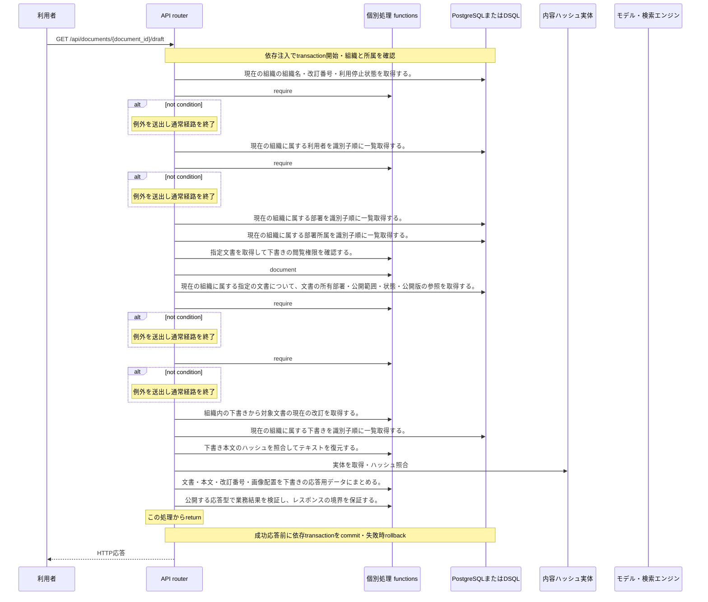

<!-- 実装から生成。直接編集しない。入力SHA256: 1c655589065a087f66d0ae05a6e0b777b889337ba2d8cca7542a2988c7248164 -->

# 下書きを取得 — シーケンス

章構成: [lazunex API帳票](https://github.com/tsuji-tomonori/lazunex/tree/096e1e580ab1c0670c57e4febad2bd9fdd4698ee/docs/spec/40.apis)。

**制御順序（関数内の行順）**

| 関数 | 行 | 要素 | 条件・早期終了・例外 |
| --- | --- | --- | --- |
| kotorelay.context.Context.document | 111 | Return | doc |
| kotorelay.errors.require | 13 | If | not condition |
| kotorelay.errors.require | 14 | Raise | Raise |
| kotorelay.operations.documents.get_draft.response_builders.build_response | 10 | Return | TypeAdapter(ResponseData).validate_python(value) |
| kotorelay.operations.documents.get_draft.router.get_draft | 29 | Return | build_response(draft_functions.build_draft_data(current_document, current_draft, body)) |
| kotorelay.operations.documents.shared.functions.authorize_draft | 12 | Return | ctx.document(document_id, 'draft') |
| kotorelay.operations.documents.shared.functions.build_draft_data | 33 | Return | {'document': doc, 'body': body, 'revision': row.revision, 'placements': json.loads(row.placements)} |
| kotorelay.operations.documents.shared.functions.load_draft_body | 26 | Return | ctx.objects.get(row.body_key, row.body_hash).decode() |
| kotorelay.operations.documents.shared.functions.load_draft_row | 17 | Return | next((row for row in q.drafts_list(ctx.db, q.DraftsListParams(organization_id=ctx.org)) if row.document_id == document_id)) |
