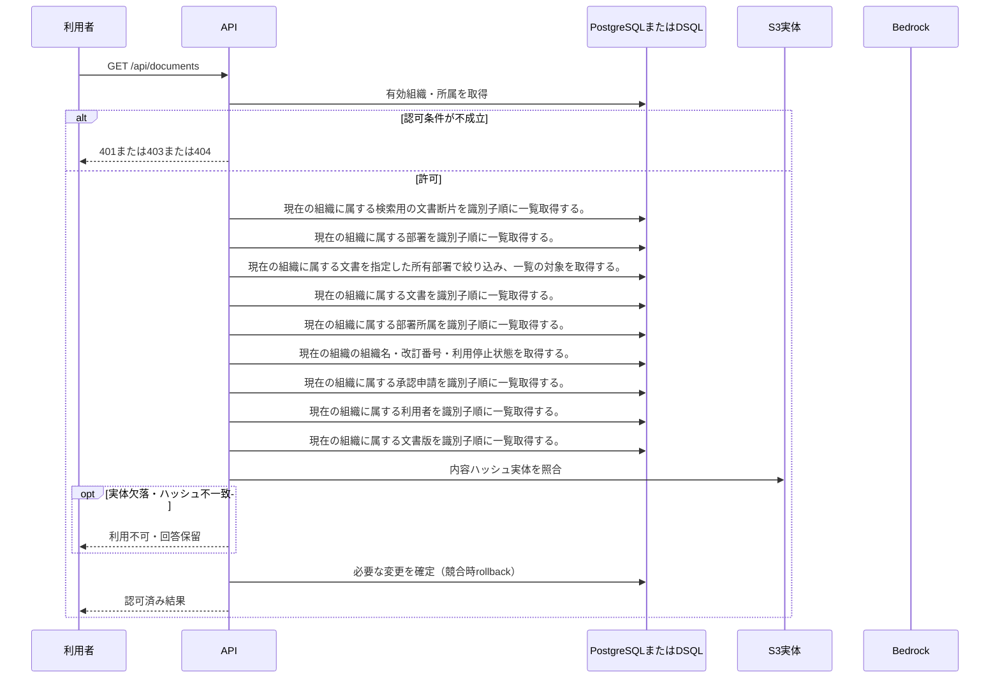

<!-- 実装から生成。直接編集しない。入力SHA256: 31de213f242d3d7bf0d4f5957d4ef327aaacb2267a973d8e0adce1f1531ac7e1 -->

# 閲覧可能な文書を検索 — シーケンス

章構成: [lazunex API帳票](https://github.com/tsuji-tomonori/lazunex/tree/096e1e580ab1c0670c57e4febad2bd9fdd4698ee/docs/spec/40.apis)。

**制御順序（関数内の行順）**

| 関数 | 行 | 要素 | 条件・早期終了・例外 |
| --- | --- | --- | --- |
| kotorelay.context.Context.can_read | 70 | If | doc.status != 'active' or not self.memberships |
| kotorelay.context.Context.can_read | 71 | Return | False |
| kotorelay.context.Context.can_read | 72 | If | doc.visibility == 'organization' |
| kotorelay.context.Context.can_read | 73 | Return | True |
| kotorelay.context.Context.can_read | 74 | If | self.member(doc.department_id) |
| kotorelay.context.Context.can_read | 75 | Return | True |
| kotorelay.context.Context.can_read | 76 | Return | doc.visibility == 'selected' and any((self.member(department) for department in json.loads(doc.shared_departments))) |
| kotorelay.context.Context.permission | 59 | For | For |
| kotorelay.context.Context.permission | 60 | If | m.department_id == department_id |
| kotorelay.context.Context.permission | 61 | Return | {'author': m.can_author, 'review': m.can_review, 'manage': m.leader, 'draft': m.can_author or m.can_review}.get(operation, False) |
| kotorelay.context.Context.permission | 67 | Return | False |
| kotorelay.errors.require | 13 | If | not condition |
| kotorelay.errors.require | 14 | Raise | Raise |
| kotorelay.operations.documents.functions.document_page | 115 | For | For |
| kotorelay.operations.documents.functions.document_page | 138 | Return | {'items': items, 'has_next': len(docs) > limit} |
| kotorelay.operations.documents.functions.list_documents | 68 | If | department_id and scope in {'manage', 'work'} |
| kotorelay.operations.documents.functions.list_documents | 79 | If | scope == 'manage' |
| kotorelay.operations.documents.functions.list_documents | 81 | If | scope == 'work' |
| kotorelay.operations.documents.functions.list_documents | 98 | Return | sorted(docs, key=lambda d: d.updated_at, reverse=True)[offset:offset + limit] |
| kotorelay.operations.documents.router.list_documents | 29 | If | page |
| kotorelay.operations.documents.router.list_documents | 30 | Return | f.document_page(ctx, scope, offset, limit, search, department, status) |
| kotorelay.operations.documents.router.list_documents | 31 | Return | f.list_documents(ctx, scope, offset, limit, search, department, status) |
