<!-- 実装から生成。直接編集しない。入力SHA256: 7ce322b2bb5c68dab4c51499ae55d5e49bae34d22b47e21dd6264975362b5d49 -->

# 閲覧可能な文書を検索 — シーケンス

章構成: [lazunex API帳票](https://github.com/tsuji-tomonori/lazunex/tree/096e1e580ab1c0670c57e4febad2bd9fdd4698ee/docs/spec/40.apis)。

```mermaid
sequenceDiagram
    participant U as 利用者
    participant A as API router
    participant F as 個別処理 functions
    participant E as HTTP例外ハンドラ
    participant L as 型付き運用ログ
    participant D as PostgreSQLまたはDSQL
    participant S as 内容ハッシュ実体
    participant M as モデル・検索エンジン
    U->>A: GET /api/documents
    Note over A,D: 依存注入でtransaction開始・組織と所属を確認
    A->>D: 現在の組織の組織名・改訂番号・利用停止状態を取得する。
    opt 検証不成立：bool(organizations) and (not organizations[0].suspended)
    break エラー応答を返して終了（後続の正常処理は実行しない）
    A->>E: Problemまたは依存先例外をHTTP応答へ変換・transactionはrollback
    E->>L: KR_HTTP_REJECTED / 業務条件または入力検証によりリクエストを拒否しました。
    E-->>U: HTTP 401 / {code： "unauthenticated", message： "ログインが必要です。", request_id： 相関ID}
    end
    end
    A->>D: 現在の組織に属する利用者を識別子順に一覧取得する。
    opt 検証不成立：len(users) == 1
    break エラー応答を返して終了（後続の正常処理は実行しない）
    A->>E: Problemまたは依存先例外をHTTP応答へ変換・transactionはrollback
    E->>L: KR_HTTP_REJECTED / 業務条件または入力検証によりリクエストを拒否しました。
    E-->>U: HTTP 401 / {code： "unauthenticated", message： "ログインが必要です。", request_id： 相関ID}
    end
    end
    A->>D: 現在の組織に属する部署を識別子順に一覧取得する。
    A->>D: 現在の組織に属する部署所属を識別子順に一覧取得する。
    alt page
    opt 前条件が成立
    A->>F: 部署指定の管理用または執筆用の一覧かを判定する。
    end
    alt department_id and f.requires_department_permission(department_id, scope)
    A->>F: 指定した一覧の用途に対応する部署権限を確認する。
    A->>F: permission
    opt 検証不成立：ctx.permission(department_id, 'manage' if scope == 'manage' else 'draft')
    break エラー応答を返して終了（後続の正常処理は実行しない）
    A->>E: Problemまたは依存先例外をHTTP応答へ変換・transactionはrollback
    E->>L: KR_HTTP_REJECTED / 業務条件または入力検証によりリクエストを拒否しました。
    E-->>U: HTTP 403 / {code： "forbidden", message： "この操作は許可されていません。", request_id： 相関ID}
    end
    end
    end
    alt department_id
    A->>F: 現在の組織に属する文書を指定した所有部署で絞り込み、一覧の対象を取得する。
    A->>D: 現在の組織に属する文書を指定した所有部署で絞り込み、一覧の対象を取得する。
    else 条件不成立
    A->>F: 現在の組織に属する文書を識別子順に一覧取得する。
    A->>D: 現在の組織に属する文書を識別子順に一覧取得する。
    end
    A->>F: 管理用の文書一覧を要求しているかを判定する。
    alt f.is_management_scope(scope)
    A->>F: 用途と対象に一致するデータだけを取り出す。
    loop docs
    A->>F: permission
    end
    else 条件不成立
    A->>F: 執筆用の文書一覧を要求しているかを判定する。
    alt f.is_authoring_scope(scope)
    A->>F: 用途と対象に一致するデータだけを取り出す。
    loop docs
    opt 前条件が成立
    A->>F: permission
    end
    end
    else 条件不成立
    A->>F: 用途と対象に一致するデータだけを取り出す。
    loop docs
    opt 前条件が成立
    A->>F: can_read
    end
    end
    A->>F: 取得したデータを識別子別に参照できる辞書へ変換する。
    A->>D: 現在の組織に属する文書版を識別子順に一覧取得する。
    A->>F: 用途と対象に一致するデータだけを取り出す。
    end
    end
    A->>F: 用途と対象に一致するデータだけを取り出す。
    Note over A: この処理からreturn
    A->>F: 取得したデータを識別子別に参照できる辞書へ変換する。
    A->>D: 現在の組織に属する文書版を識別子順に一覧取得する。
    A->>F: 現在の組織に属する承認申請を識別子順に一覧取得する。
    A->>D: 現在の組織に属する承認申請を識別子順に一覧取得する。
    A->>F: 現在の組織に属する検索用の文書断片を識別子順に一覧取得する。
    A->>D: 現在の組織に属する検索用の文書断片を識別子順に一覧取得する。
    loop docs[：limit]
    A->>F: 公開版・承認状態・索引状態・本文要約を一覧の一行へ組み立てる。
    A->>F: 用途と対象に一致するデータだけを取り出す。
    A->>F: 後続処理に渡すデータを組み立てる。
    alt version and scope == 'read'
    A->>S: 実体を取得・ハッシュ照合
    else 条件不成立
    end
    end
    A->>F: 後続処理に渡すデータを組み立てる。
    Note over A: この処理からreturn
    A->>F: 公開する応答型で業務結果を検証し、レスポンスの境界を保証する。
    Note over A: この処理からreturn
    end
    opt 前条件が成立
    A->>F: 部署指定の管理用または執筆用の一覧かを判定する。
    end
    alt department_id and f.requires_department_permission(department_id, scope)
    A->>F: 指定した一覧の用途に対応する部署権限を確認する。
    A->>F: permission
    opt 検証不成立：ctx.permission(department_id, 'manage' if scope == 'manage' else 'draft')
    break エラー応答を返して終了（後続の正常処理は実行しない）
    A->>E: Problemまたは依存先例外をHTTP応答へ変換・transactionはrollback
    E->>L: KR_HTTP_REJECTED / 業務条件または入力検証によりリクエストを拒否しました。
    E-->>U: HTTP 403 / {code： "forbidden", message： "この操作は許可されていません。", request_id： 相関ID}
    end
    end
    end
    alt department_id
    A->>F: 現在の組織に属する文書を指定した所有部署で絞り込み、一覧の対象を取得する。
    A->>D: 現在の組織に属する文書を指定した所有部署で絞り込み、一覧の対象を取得する。
    else 条件不成立
    A->>F: 現在の組織に属する文書を識別子順に一覧取得する。
    A->>D: 現在の組織に属する文書を識別子順に一覧取得する。
    end
    A->>F: 管理用の文書一覧を要求しているかを判定する。
    alt f.is_management_scope(scope)
    A->>F: 用途と対象に一致するデータだけを取り出す。
    loop docs
    A->>F: permission
    end
    else 条件不成立
    A->>F: 執筆用の文書一覧を要求しているかを判定する。
    alt f.is_authoring_scope(scope)
    A->>F: 用途と対象に一致するデータだけを取り出す。
    loop docs
    opt 前条件が成立
    A->>F: permission
    end
    end
    else 条件不成立
    A->>F: 用途と対象に一致するデータだけを取り出す。
    loop docs
    opt 前条件が成立
    A->>F: can_read
    end
    end
    A->>F: 取得したデータを識別子別に参照できる辞書へ変換する。
    A->>D: 現在の組織に属する文書版を識別子順に一覧取得する。
    A->>F: 用途と対象に一致するデータだけを取り出す。
    end
    end
    A->>F: 用途と対象に一致するデータだけを取り出す。
    Note over A: この処理からreturn
    A->>F: 公開する応答型で業務結果を検証し、レスポンスの境界を保証する。
    Note over A: この処理からreturn
    Note over A,D: 成功応答前に依存transactionをcommit・失敗時rollback
    A-->>U: HTTP 200 / list[models.DocumentsRow] | dict[str, object]
    Note over A,U: 共通例外経路（成功後に実行する追加処理ではない）
    opt 入力検証の失敗（RequestValidationError）
    break エラー応答を返して終了（後続の正常処理は実行しない）
    A->>E: Problemまたは依存先例外をHTTP応答へ変換・transactionはrollback
    E->>L: KR_HTTP_REJECTED / 業務条件または入力検証によりリクエストを拒否しました。
    E-->>U: HTTP 422 / {code： "invalid_input", message： "入力形式を確認してください。", request_id： 相関ID}
    end
    end
    opt SQL実行またはcommitの競合（psycopg.Error）
    break エラー応答を返して終了（後続の正常処理は実行しない）
    A->>E: Problemまたは依存先例外をHTTP応答へ変換・transactionはrollback
    E->>L: KR_HTTP_REJECTED / 業務条件または入力検証によりリクエストを拒否しました。
    E-->>U: HTTP 409 / {code： "conflict", message： "競合しました。再読込してください。", request_id： 相関ID}
    end
    end
    opt DB接続・外部サービスの失敗（捕捉して継続する場合を除く）
    break エラー応答を返して終了（後続の正常処理は実行しない）
    A->>E: Problemまたは依存先例外をHTTP応答へ変換・transactionはrollback
    E->>L: KR_HTTP_FAILED / 処理を完了できずエラー応答を返しました。
    E-->>U: HTTP 503 / {code： "unavailable", message： "一時的に利用できません。", request_id： 相関ID}
    end
    end
```

**例外応答一覧（HTTP境界へ到達した場合）**

| HTTP | code | message | 相関ID |
| --- | --- | --- | --- |
| 401 | unauthenticated | ログインが必要です。 | request_id |
| 403 | forbidden | この操作は許可されていません。 | request_id |
| 409 | conflict | 競合しました。再読込してください。 | request_id |
| 422 | invalid_input | 入力形式を確認してください。 | request_id |
| 503 | unavailable | 一時的に利用できません。 | request_id |

**制御順序（関数内の行順）**

| 関数 | 行 | 要素 | 条件・早期終了・例外 |
| --- | --- | --- | --- |
| kotorelay.context.Context.can_read | 89 | If | doc.status != 'active' or not self.memberships |
| kotorelay.context.Context.can_read | 90 | Return | False |
| kotorelay.context.Context.can_read | 91 | If | doc.visibility == 'organization' |
| kotorelay.context.Context.can_read | 92 | Return | True |
| kotorelay.context.Context.can_read | 93 | If | self.member(doc.department_id) |
| kotorelay.context.Context.can_read | 94 | Return | True |
| kotorelay.context.Context.can_read | 95 | Return | doc.visibility == 'selected' and any((self.member(department) for department in json.loads(doc.shared_departments))) |
| kotorelay.context.Context.permission | 78 | For | For |
| kotorelay.context.Context.permission | 79 | If | m.department_id == department_id |
| kotorelay.context.Context.permission | 80 | Return | {'author': m.can_author, 'review': m.can_review, 'manage': m.leader, 'draft': m.can_author or m.can_review}.get(operation, False) |
| kotorelay.context.Context.permission | 86 | Return | False |
| kotorelay.errors.require | 13 | If | not condition |
| kotorelay.errors.require | 14 | Raise | Raise |
| kotorelay.operations.documents.list_documents.functions.build_document_item | 167 | Return | item |
| kotorelay.operations.documents.list_documents.functions.build_document_page | 131 | Return | {'published_number': version.number if version else None, 'approved_at': approval.decided_at if approval else None, 'index_ready': bool(version and any((c.version_id == version.id and c.ready for c in chunks))), 'summary': ctx.objects.get(version.body_key, version.body_hash).decode()[:180] if version and scope == 'read' else '', 'review_status': latest.status if latest and scope != 'read' else None, 'review_number': versions[latest.version_id].number if latest and scope != 'read' else None} |
| kotorelay.operations.documents.list_documents.functions.build_document_page_2 | 149 | Return | {'items': items, 'has_next': len(docs) > limit} |
| kotorelay.operations.documents.list_documents.functions.chunks_list | 111 | Return | q.chunks_list(ctx.db, q.ChunksListParams(organization_id=ctx.org)) |
| kotorelay.operations.documents.list_documents.functions.documents_by_department | 31 | Return | q.documents_by_department(ctx.db, q.DocumentsByDepartmentParams(organization_id=ctx.org, department_id=department_id)) |
| kotorelay.operations.documents.list_documents.functions.documents_list | 38 | Return | q.documents_list(ctx.db, q.DocumentsListParams(organization_id=ctx.org)) |
| kotorelay.operations.documents.list_documents.functions.is_authoring_scope | 55 | Return | bool(scope == 'work') |
| kotorelay.operations.documents.list_documents.functions.is_management_scope | 43 | Return | bool(scope == 'manage') |
| kotorelay.operations.documents.list_documents.functions.map_versions | 74 | Return | {v.id: v for v in q.versions_list(ctx.db, q.VersionsListParams(organization_id=ctx.org))} |
| kotorelay.operations.documents.list_documents.functions.map_versions_2 | 101 | Return | {v.id: v for v in q.versions_list(ctx.db, q.VersionsListParams(organization_id=ctx.org))} |
| kotorelay.operations.documents.list_documents.functions.require_department_permission | 22 | Return | require(ctx.permission(department_id, 'manage' if scope == 'manage' else 'draft'), 'forbidden', 403) |
| kotorelay.operations.documents.list_documents.functions.requires_department_permission | 15 | Return | bool(department_id and scope in {'manage', 'work'}) |
| kotorelay.operations.documents.list_documents.functions.select_docs | 50 | Return | [d for d in docs if ctx.permission(d.department_id, 'manage')] |
| kotorelay.operations.documents.list_documents.functions.select_docs_2 | 62 | Return | [d for d in docs if d.status != 'deleted' and ctx.permission(d.department_id, 'draft')] |
| kotorelay.operations.documents.list_documents.functions.select_docs_3 | 69 | Return | [d for d in docs if d.latest_version_id and ctx.can_read(d)] |
| kotorelay.operations.documents.list_documents.functions.select_docs_4 | 81 | Return | [d.model_copy(update={'title': versions[d.latest_version_id].title}) for d in docs if d.latest_version_id in versions] |
| kotorelay.operations.documents.list_documents.functions.select_docs_5 | 92 | Return | [d for d in docs if search.casefold() in d.title.casefold() and (not status or d.status == status)] |
| kotorelay.operations.documents.list_documents.functions.select_history | 118 | Return | [s for s in submissions if s.document_id == doc.id] |
| kotorelay.operations.documents.list_documents.functions.submissions_list | 106 | Return | q.submissions_list(ctx.db, q.SubmissionsListParams(organization_id=ctx.org)) |
| kotorelay.operations.documents.list_documents.response_builders.build_response | 10 | Return | TypeAdapter(ResponseData).validate_python(value) |
| kotorelay.operations.documents.list_documents.router._select_documents | 52 | If | department_id and f.requires_department_permission(department_id, scope) |
| kotorelay.operations.documents.list_documents.router._select_documents | 57 | If | f.is_management_scope(scope) |
| kotorelay.operations.documents.list_documents.router._select_documents | 59 | If | f.is_authoring_scope(scope) |
| kotorelay.operations.documents.list_documents.router._select_documents | 66 | Return | sorted(docs, key=lambda d: d.updated_at, reverse=True)[offset:offset + limit] |
| kotorelay.operations.documents.list_documents.router.document_page | 83 | For | For |
| kotorelay.operations.documents.list_documents.router.document_page | 85 | Return | f.build_document_page_2(items, limit, docs) |
| kotorelay.operations.documents.list_documents.router.list_documents | 38 | If | page |
| kotorelay.operations.documents.list_documents.router.list_documents | 39 | Return | build_response(document_page(ctx, scope, offset, limit, search, department, status)) |
| kotorelay.operations.documents.list_documents.router.list_documents | 40 | Return | build_response(_select_documents(ctx, scope, offset, limit, search, department, status)) |
