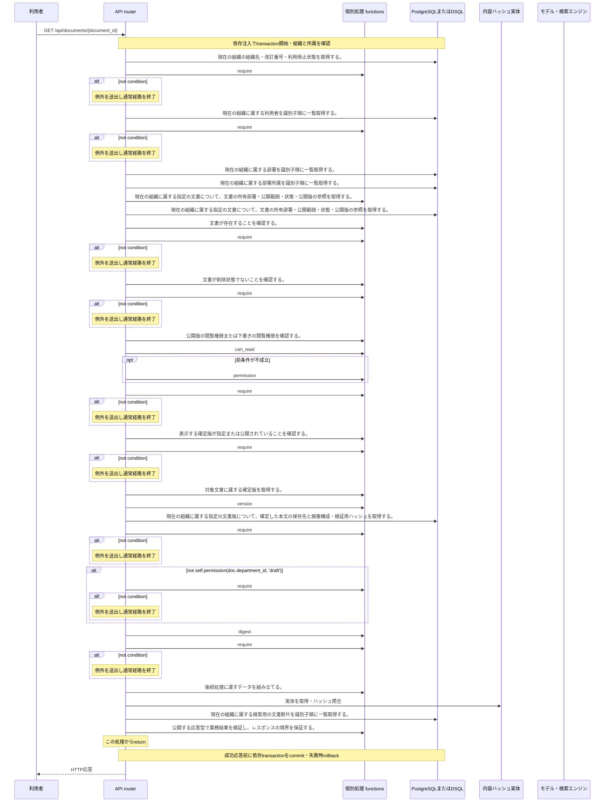

<!-- 実装から生成。直接編集しない。入力SHA256: 1c655589065a087f66d0ae05a6e0b777b889337ba2d8cca7542a2988c7248164 -->

# 承認版または担当版を表示 — シーケンス

章構成: [lazunex API帳票](https://github.com/tsuji-tomonori/lazunex/tree/096e1e580ab1c0670c57e4febad2bd9fdd4698ee/docs/spec/40.apis)。

**制御順序（関数内の行順）**

| 関数 | 行 | 要素 | 条件・早期終了・例外 |
| --- | --- | --- | --- |
| kotorelay.context.Context.can_read | 89 | If | doc.status != 'active' or not self.memberships |
| kotorelay.context.Context.can_read | 90 | Return | False |
| kotorelay.context.Context.can_read | 91 | If | doc.visibility == 'organization' |
| kotorelay.context.Context.can_read | 92 | Return | True |
| kotorelay.context.Context.can_read | 93 | If | self.member(doc.department_id) |
| kotorelay.context.Context.can_read | 94 | Return | True |
| kotorelay.context.Context.can_read | 95 | Return | doc.visibility == 'selected' and any((self.member(department) for department in json.loads(doc.shared_departments))) |
| kotorelay.context.Context.permission | 78 | For | For |
| kotorelay.context.Context.permission | 79 | If | m.department_id == department_id |
| kotorelay.context.Context.permission | 80 | Return | {'author': m.can_author, 'review': m.can_review, 'manage': m.leader, 'draft': m.can_author or m.can_review}.get(operation, False) |
| kotorelay.context.Context.permission | 86 | Return | False |
| kotorelay.context.Context.version | 117 | If | not self.permission(doc.department_id, 'draft') |
| kotorelay.context.Context.version | 121 | Return | version |
| kotorelay.errors.require | 13 | If | not condition |
| kotorelay.errors.require | 14 | Raise | Raise |
| kotorelay.objects.digest | 17 | Return | hashlib.sha256(data).hexdigest() |
| kotorelay.operations.documents.read_document.functions.build_read_document | 51 | Return | {'document': doc.model_copy(update={'title': version.title}), 'version': version, 'body': ctx.objects.get(version.body_key, version.body_hash).decode(), 'index_ready': any((c.version_id == version.id and c.ready for c in q.chunks_list(ctx.db, q.ChunksListParams(organization_id=ctx.org))))} |
| kotorelay.operations.documents.read_document.functions.documents_get | 15 | Return | q.documents_get(ctx.db, q.DocumentsGetParams(organization_id=ctx.org, id=str(document_id))) |
| kotorelay.operations.documents.read_document.functions.require_document | 22 | Return | require(bool(rows)) |
| kotorelay.operations.documents.read_document.functions.require_read_permission | 32 | Return | require(ctx.can_read(doc) or ctx.permission(doc.department_id, 'draft')) |
| kotorelay.operations.documents.read_document.functions.require_retained_document | 27 | Return | require(doc.status != 'deleted') |
| kotorelay.operations.documents.read_document.functions.require_selected_version | 37 | Return | require(chosen is not None) |
| kotorelay.operations.documents.read_document.functions.version_version | 44 | Return | ctx.version(doc, str(chosen)) |
| kotorelay.operations.documents.read_document.response_builders.build_response | 10 | Return | TypeAdapter(ResponseData).validate_python(value) |
| kotorelay.operations.documents.read_document.router.read_document | 33 | Return | build_response(f.build_read_document(version, doc, ctx)) |
