<!-- 実装から生成。直接編集しない。入力SHA256: ac3b8a89c10fb6f4c0a9456ea4fb59251414105722d4188a0beaca0d8b493f26 -->

# 承認版または担当版を表示 — シーケンス

章構成: [lazunex API帳票](https://github.com/tsuji-tomonori/lazunex/tree/096e1e580ab1c0670c57e4febad2bd9fdd4698ee/docs/spec/40.apis)。

```mermaid
sequenceDiagram
    participant U as 利用者
    participant A as API router
    participant F as 個別処理 functions
    participant L as 型付き運用ログ
    participant D as PostgreSQLまたはDSQL
    participant S as 内容ハッシュ実体
    participant M as モデル・検索エンジン
    U->>A: GET /api/documents/{document_id}
    opt 認証に失敗した場合
    break エラー応答を返して終了
    A->>L: KR_HTTP_REJECTED
    A-->>U: HTTP 401 / ログインが必要です。
    end
    end
    opt リクエストの入力形式が不正な場合
    break エラー応答を返して終了
    A->>L: KR_HTTP_REJECTED
    A-->>U: HTTP 422 / 入力形式を確認してください。
    end
    end
    A->>D: 依存注入でtransaction開始・組織と所属を確認
    opt DB接続で競合が発生した場合
    break エラー応答を返して終了
    A->>L: KR_HTTP_REJECTED
    A-->>U: HTTP 409 / 競合しました。再読込してください。
    end
    end
    opt DB接続でDBを利用できない場合
    break エラー応答を返して終了
    A->>L: KR_HTTP_FAILED
    A-->>U: HTTP 503 / 一時的に利用できません。
    end
    end
    A->>D: 現在の組織の組織名・改訂番号・利用停止状態を取得する。
    opt SQL実行で競合が発生した場合
    break エラー応答を返して終了
    A->>L: KR_HTTP_REJECTED
    A-->>U: HTTP 409 / 競合しました。再読込してください。
    end
    end
    opt SQL実行でDBを利用できない場合
    break エラー応答を返して終了
    A->>L: KR_HTTP_FAILED
    A-->>U: HTTP 503 / 一時的に利用できません。
    end
    end
    opt 検証不成立：有効な組織と利用者を確認し、最新の所属を読み込む。
    break エラー応答を返して終了
    A->>L: KR_HTTP_REJECTED
    A-->>U: HTTP 401 / ログインが必要です。
    end
    end
    A->>D: 現在の組織に属する利用者を識別子順に一覧取得する。
    opt SQL実行で競合が発生した場合
    break エラー応答を返して終了
    A->>L: KR_HTTP_REJECTED
    A-->>U: HTTP 409 / 競合しました。再読込してください。
    end
    end
    opt SQL実行でDBを利用できない場合
    break エラー応答を返して終了
    A->>L: KR_HTTP_FAILED
    A-->>U: HTTP 503 / 一時的に利用できません。
    end
    end
    opt 検証不成立：有効な組織と利用者を確認し、最新の所属を読み込む。
    break エラー応答を返して終了
    A->>L: KR_HTTP_REJECTED
    A-->>U: HTTP 401 / ログインが必要です。
    end
    end
    A->>D: 現在の組織に属する部署を識別子順に一覧取得する。
    opt SQL実行で競合が発生した場合
    break エラー応答を返して終了
    A->>L: KR_HTTP_REJECTED
    A-->>U: HTTP 409 / 競合しました。再読込してください。
    end
    end
    opt SQL実行でDBを利用できない場合
    break エラー応答を返して終了
    A->>L: KR_HTTP_FAILED
    A-->>U: HTTP 503 / 一時的に利用できません。
    end
    end
    A->>D: 現在の組織に属する部署所属を識別子順に一覧取得する。
    opt SQL実行で競合が発生した場合
    break エラー応答を返して終了
    A->>L: KR_HTTP_REJECTED
    A-->>U: HTTP 409 / 競合しました。再読込してください。
    end
    end
    opt SQL実行でDBを利用できない場合
    break エラー応答を返して終了
    A->>L: KR_HTTP_FAILED
    A-->>U: HTTP 503 / 一時的に利用できません。
    end
    end
    A->>F: 現在の組織に属する指定の文書について、文書の所有部署・公開範囲・状態・公開版の参照を取得する。
    A->>D: 現在の組織に属する指定の文書について、文書の所有部署・公開範囲・状態・公開版の参照を取得する。
    opt SQL実行で競合が発生した場合
    break エラー応答を返して終了
    A->>L: KR_HTTP_REJECTED
    A-->>U: HTTP 409 / 競合しました。再読込してください。
    end
    end
    opt SQL実行でDBを利用できない場合
    break エラー応答を返して終了
    A->>L: KR_HTTP_FAILED
    A-->>U: HTTP 503 / 一時的に利用できません。
    end
    end
    A->>F: 文書が存在することを確認する。
    opt 検証不成立：文書が存在することを確認する。
    break エラー応答を返して終了
    A->>L: KR_HTTP_REJECTED
    A-->>U: HTTP 404 / 対象を利用できません。
    end
    end
    A->>F: 文書が削除状態でないことを確認する。
    opt 検証不成立：文書が削除状態でないことを確認する。
    break エラー応答を返して終了
    A->>L: KR_HTTP_REJECTED
    A-->>U: HTTP 404 / 対象を利用できません。
    end
    end
    A->>F: 公開版の閲覧権限または下書きの閲覧権限を確認する。
    A->>F: 現在の所属と公開範囲で文書を閲覧できる。
    A->>F: 指定した部署に現在も所属している。
    opt 前条件が成立
    loop json.loads(doc.shared_departments)
    A->>F: 指定した部署に現在も所属している。
    end
    end
    opt 前条件が不成立
    A->>F: 指定した部署で要求された操作を実行できる。
    end
    opt 検証不成立：公開版の閲覧権限または下書きの閲覧権限を確認する。
    break エラー応答を返して終了
    A->>L: KR_HTTP_REJECTED
    A-->>U: HTTP 404 / 対象を利用できません。
    end
    end
    A->>F: 表示する版が指定されている。
    A->>F: 表示する確定版が指定または公開されていることを確認する。
    opt 検証不成立：表示する確定版が指定または公開されていることを確認する。
    break エラー応答を返して終了
    A->>L: KR_HTTP_REJECTED
    A-->>U: HTTP 404 / 対象を利用できません。
    end
    end
    A->>F: 対象文書に属する確定版を取得する。
    A->>F: 文書の版が存在し、閲覧権限と実体の整合性が有効なことを確認する。
    A->>D: 現在の組織に属する指定の文書版について、確定した本文の保存先と画像構成・検証用ハッシュを取得する。
    opt SQL実行で競合が発生した場合
    break エラー応答を返して終了
    A->>L: KR_HTTP_REJECTED
    A-->>U: HTTP 409 / 競合しました。再読込してください。
    end
    end
    opt SQL実行でDBを利用できない場合
    break エラー応答を返して終了
    A->>L: KR_HTTP_FAILED
    A-->>U: HTTP 503 / 一時的に利用できません。
    end
    end
    opt 検証不成立：文書の版が存在し、閲覧権限と実体の整合性が有効なことを確認する。
    break エラー応答を返して終了
    A->>L: KR_HTTP_REJECTED
    A-->>U: HTTP 404 / 対象を利用できません。
    end
    end
    A->>F: 指定した部署で要求された操作を実行できる。
    alt 不成立：（指定した部署で要求された操作を実行できる。）
    A->>F: 現在の所属と公開範囲で文書を閲覧できる。
    A->>F: 指定した部署に現在も所属している。
    opt 前条件が成立
    loop json.loads(doc.shared_departments)
    A->>F: 指定した部署に現在も所属している。
    end
    end
    opt 検証不成立：文書の版が存在し、閲覧権限と実体の整合性が有効なことを確認する。
    break エラー応答を返して終了
    A->>L: KR_HTTP_REJECTED
    A-->>U: HTTP 404 / 対象を利用できません。
    end
    end
    end
    A->>F: digest
    opt 検証不成立：文書の版が存在し、閲覧権限と実体の整合性が有効なことを確認する。
    break エラー応答を返して終了
    A->>L: KR_HTTP_FAILED
    A-->>U: HTTP 503 / 保存内容の整合性を確認できません。
    end
    end
    A->>F: 後続処理に渡すデータを組み立てる。
    A->>S: 実体を取得・ハッシュ照合
    opt 実体の欠落・ハッシュ不一致の場合
    break エラー応答を返して終了
    A->>L: KR_HTTP_FAILED
    A-->>U: HTTP 503 / 保存内容の整合性を確認できません。
    end
    end
    opt 実体の入出力が失敗した場合
    break エラー応答を返して終了
    A->>L: KR_HTTP_FAILED
    A-->>U: HTTP 503 / 一時的に利用できません。
    end
    end
    opt 実体サービスが失敗した場合
    break エラー応答を返して終了
    A->>L: KR_HTTP_FAILED
    A-->>U: HTTP 503 / 一時的に利用できません。
    end
    end
    A->>D: 現在の組織に属する検索用の文書断片を識別子順に一覧取得する。
    opt SQL実行で競合が発生した場合
    break エラー応答を返して終了
    A->>L: KR_HTTP_REJECTED
    A-->>U: HTTP 409 / 競合しました。再読込してください。
    end
    end
    opt SQL実行でDBを利用できない場合
    break エラー応答を返して終了
    A->>L: KR_HTTP_FAILED
    A-->>U: HTTP 503 / 一時的に利用できません。
    end
    end
    A->>F: 公開する応答型で業務結果を検証し、レスポンスの境界を保証する。
    break 応答を返して終了
    A->>D: transactionをcommit
    opt commitで競合が発生した場合
    break エラー応答を返して終了
    A->>L: KR_HTTP_REJECTED
    A-->>U: HTTP 409 / 競合しました。再読込してください。
    end
    end
    opt commitでDBを利用できない場合
    break エラー応答を返して終了
    A->>L: KR_HTTP_FAILED
    A-->>U: HTTP 503 / 一時的に利用できません。
    end
    end
    A-->>U: HTTP 200 / dict[str, object]
    end
```

**例外応答一覧（HTTP境界へ到達した場合）**

| HTTP | code | message | 相関ID |
| --- | --- | --- | --- |
| 401 | unauthenticated | ログインが必要です。 | request_id |
| 404 | not_found | 対象を利用できません。 | request_id |
| 409 | conflict | 競合しました。再読込してください。 | request_id |
| 422 | invalid_input | 入力形式を確認してください。 | request_id |
| 503 | integrity | 保存内容の整合性を確認できません。 | request_id |
| 503 | unavailable | 一時的に利用できません。 | request_id |

**制御順序（関数内の行順）**

| 関数 | 行 | 要素 | 条件・早期終了・例外 |
| --- | --- | --- | --- |
| kotorelay.context.Context.can_read | 95 | If | doc.status != 'active' or not self.memberships |
| kotorelay.context.Context.can_read | 96 | Return | False |
| kotorelay.context.Context.can_read | 97 | If | doc.visibility == 'organization' |
| kotorelay.context.Context.can_read | 98 | Return | True |
| kotorelay.context.Context.can_read | 99 | If | self.member(doc.department_id) |
| kotorelay.context.Context.can_read | 100 | Return | True |
| kotorelay.context.Context.can_read | 101 | Return | doc.visibility == 'selected' and any((self.member(department) for department in json.loads(doc.shared_departments))) |
| kotorelay.context.Context.permission | 83 | For | For |
| kotorelay.context.Context.permission | 84 | If | m.department_id == department_id |
| kotorelay.context.Context.permission | 85 | Return | {'author': m.can_author, 'review': m.can_review, 'manage': m.leader, 'draft': m.can_author or m.can_review}.get(operation, False) |
| kotorelay.context.Context.permission | 91 | Return | False |
| kotorelay.context.Context.version | 125 | If | not self.permission(doc.department_id, 'draft') |
| kotorelay.context.Context.version | 129 | Return | version |
| kotorelay.errors.require | 13 | If | not condition |
| kotorelay.errors.require | 14 | Raise | Raise |
| kotorelay.objects.digest | 17 | Return | hashlib.sha256(data).hexdigest() |
| kotorelay.operations.documents.read_document.functions.build_read_document | 51 | Return | {'document': doc.model_copy(update={'title': version.title}), 'version': version, 'body': ctx.objects.get(version.body_key, version.body_hash).decode(), 'index_ready': any((c.version_id == version.id and c.ready for c in q.chunks_list(ctx.db, q.ChunksListParams(organization_id=ctx.org))))} |
| kotorelay.operations.documents.read_document.functions.documents_get | 15 | Return | q.documents_get(ctx.db, q.DocumentsGetParams(organization_id=ctx.org, id=str(document_id))) |
| kotorelay.operations.documents.read_document.functions.has_requested_version | 64 | Return | bool(version_id) |
| kotorelay.operations.documents.read_document.functions.require_document | 22 | Return | require(bool(rows)) |
| kotorelay.operations.documents.read_document.functions.require_read_permission | 32 | Return | require(ctx.can_read(doc) or ctx.permission(doc.department_id, 'draft')) |
| kotorelay.operations.documents.read_document.functions.require_retained_document | 27 | Return | require(doc.status != 'deleted') |
| kotorelay.operations.documents.read_document.functions.require_selected_version | 37 | Return | require(chosen is not None) |
| kotorelay.operations.documents.read_document.functions.version_version | 44 | Return | ctx.version(doc, str(chosen)) |
| kotorelay.operations.documents.read_document.response_builders.build_response | 10 | Return | TypeAdapter(ResponseData).validate_python(value) |
| kotorelay.operations.documents.read_document.router.read_document | 35 | Return | build_response(f.build_read_document(version, doc, ctx)) |
