<!-- 実装から生成。直接編集しない。入力SHA256: 065f3a0aaa159ee25b4b54797ae13bebd5e0deb08cdd00f2becc4afbe26e1319 -->

# 競合を検出して下書きを保存 — シーケンス

章構成: [lazunex API帳票](https://github.com/tsuji-tomonori/lazunex/tree/096e1e580ab1c0670c57e4febad2bd9fdd4698ee/docs/spec/40.apis)。

```mermaid
sequenceDiagram
    participant U as 利用者
    participant A as API router
    participant F as 個別処理 functions
    participant L as 型付き運用ログ
    participant D as PostgreSQLまたはDSQL
    participant S as 内容ハッシュ実体
    participant M as モデル・検索エンジン
    U->>A: PUT /api/documents/{document_id}/draft
    opt 認証に失敗した場合
    break エラー応答を返して終了
    A->>L: KR_HTTP_REJECTED
    A-->>U: HTTP 401 / ログインが必要です。
    end
    end
    opt リクエストの入力形式が不正な場合
    break エラー応答を返して終了
    A->>L: KR_HTTP_REJECTED
    A-->>U: HTTP 422 / 入力形式を確認してください。
    end
    end
    A->>D: 依存注入でtransaction開始・組織と所属を確認
    opt DB接続で競合が発生した場合
    break エラー応答を返して終了
    A->>L: KR_HTTP_REJECTED
    A-->>U: HTTP 409 / 競合しました。再読込してください。
    end
    end
    opt DB接続でDBを利用できない場合
    break エラー応答を返して終了
    A->>L: KR_HTTP_FAILED
    A-->>U: HTTP 503 / 一時的に利用できません。
    end
    end
    A->>D: 現在の組織の組織名・改訂番号・利用停止状態を取得する。
    opt SQL実行で競合が発生した場合
    break エラー応答を返して終了
    A->>L: KR_HTTP_REJECTED
    A-->>U: HTTP 409 / 競合しました。再読込してください。
    end
    end
    opt SQL実行でDBを利用できない場合
    break エラー応答を返して終了
    A->>L: KR_HTTP_FAILED
    A-->>U: HTTP 503 / 一時的に利用できません。
    end
    end
    opt 検証不成立：有効な組織と利用者を確認し、最新の所属を読み込む。
    break エラー応答を返して終了
    A->>L: KR_HTTP_REJECTED
    A-->>U: HTTP 401 / ログインが必要です。
    end
    end
    A->>D: 現在の組織に属する利用者を識別子順に一覧取得する。
    opt SQL実行で競合が発生した場合
    break エラー応答を返して終了
    A->>L: KR_HTTP_REJECTED
    A-->>U: HTTP 409 / 競合しました。再読込してください。
    end
    end
    opt SQL実行でDBを利用できない場合
    break エラー応答を返して終了
    A->>L: KR_HTTP_FAILED
    A-->>U: HTTP 503 / 一時的に利用できません。
    end
    end
    opt 検証不成立：有効な組織と利用者を確認し、最新の所属を読み込む。
    break エラー応答を返して終了
    A->>L: KR_HTTP_REJECTED
    A-->>U: HTTP 401 / ログインが必要です。
    end
    end
    A->>D: 現在の組織に属する部署を識別子順に一覧取得する。
    opt SQL実行で競合が発生した場合
    break エラー応答を返して終了
    A->>L: KR_HTTP_REJECTED
    A-->>U: HTTP 409 / 競合しました。再読込してください。
    end
    end
    opt SQL実行でDBを利用できない場合
    break エラー応答を返して終了
    A->>L: KR_HTTP_FAILED
    A-->>U: HTTP 503 / 一時的に利用できません。
    end
    end
    A->>D: 現在の組織に属する部署所属を識別子順に一覧取得する。
    opt SQL実行で競合が発生した場合
    break エラー応答を返して終了
    A->>L: KR_HTTP_REJECTED
    A-->>U: HTTP 409 / 競合しました。再読込してください。
    end
    end
    opt SQL実行でDBを利用できない場合
    break エラー応答を返して終了
    A->>L: KR_HTTP_FAILED
    A-->>U: HTTP 503 / 一時的に利用できません。
    end
    end
    A->>F: 文書を取得して要求された操作の権限を確認する。
    A->>F: 対象の文書が存在し、要求された操作を実行できることを確認する。
    A->>D: 現在の組織に属する指定の文書について、文書の所有部署・公開範囲・状態・公開版の参照を取得する。
    opt SQL実行で競合が発生した場合
    break エラー応答を返して終了
    A->>L: KR_HTTP_REJECTED
    A-->>U: HTTP 409 / 競合しました。再読込してください。
    end
    end
    opt SQL実行でDBを利用できない場合
    break エラー応答を返して終了
    A->>L: KR_HTTP_FAILED
    A-->>U: HTTP 503 / 一時的に利用できません。
    end
    end
    opt 検証不成立：対象の文書が存在し、要求された操作を実行できることを確認する。
    break エラー応答を返して終了
    A->>L: KR_HTTP_REJECTED
    A-->>U: HTTP 404 / 対象を利用できません。
    end
    end
    A->>F: 文書の閲覧権限を確認する操作である。
    alt 文書の閲覧権限を確認する操作である。
    A->>F: 現在の所属と公開範囲で文書を閲覧できる。
    A->>F: 指定した部署に現在も所属している。
    opt 前条件が成立
    loop json.loads(doc.shared_departments)
    A->>F: 指定した部署に現在も所属している。
    end
    end
    else 条件不成立
    opt 前条件が成立
    A->>F: 指定した部署で要求された操作を実行できる。
    end
    end
    opt 検証不成立：対象の文書が存在し、要求された操作を実行できることを確認する。
    break エラー応答を返して終了
    A->>L: KR_HTTP_REJECTED
    A-->>U: HTTP 404 / 対象を利用できません。
    end
    end
    A->>F: 現在の組織に属する下書きを識別子順に一覧取得する。
    A->>D: 現在の組織に属する下書きを識別子順に一覧取得する。
    opt SQL実行で競合が発生した場合
    break エラー応答を返して終了
    A->>L: KR_HTTP_REJECTED
    A-->>U: HTTP 409 / 競合しました。再読込してください。
    end
    end
    opt SQL実行でDBを利用できない場合
    break エラー応答を返して終了
    A->>L: KR_HTTP_FAILED
    A-->>U: HTTP 503 / 一時的に利用できません。
    end
    end
    loop f.drafts_list(ctx)
    A->>F: 下書きが保存対象の文書に属している。
    end
    A->>F: 下書きが読み込み時点から変更されていないことを確認する。
    opt 検証不成立：下書きが読み込み時点から変更されていないことを確認する。
    break エラー応答を返して終了
    A->>L: KR_HTTP_REJECTED
    A-->>U: HTTP 409 / 他の操作で更新されました。最新の状態を確認してください。
    end
    end
    A->>F: 本文内の画像配置と添付画像・OCRの所有先と有効性を照合する。
    opt 検証不成立：本文内の画像配置と添付画像・OCRの所有先と有効性を照合する。
    break エラー応答を返して終了
    A->>L: KR_HTTP_REJECTED
    A-->>U: HTTP 422 / 画像の配置またはOCR参照が無効です。
    end
    end
    loop data.placements
    A->>D: 現在の組織に属する指定の添付画像について、画像の保存先・形式・寸法・検証用ハッシュを取得する。
    opt SQL実行で競合が発生した場合
    break エラー応答を返して終了
    A->>L: KR_HTTP_REJECTED
    A-->>U: HTTP 409 / 競合しました。再読込してください。
    end
    end
    opt SQL実行でDBを利用できない場合
    break エラー応答を返して終了
    A->>L: KR_HTTP_FAILED
    A-->>U: HTTP 503 / 一時的に利用できません。
    end
    end
    A->>D: 現在の組織に属する指定の文字認識の実行記録について、認識結果の保存先・検証用ハッシュ・確認状態を取得する。
    opt SQL実行で競合が発生した場合
    break エラー応答を返して終了
    A->>L: KR_HTTP_REJECTED
    A-->>U: HTTP 409 / 競合しました。再読込してください。
    end
    end
    opt SQL実行でDBを利用できない場合
    break エラー応答を返して終了
    A->>L: KR_HTTP_FAILED
    A-->>U: HTTP 503 / 一時的に利用できません。
    end
    end
    opt 検証不成立：本文内の画像配置と添付画像・OCRの所有先と有効性を照合する。
    break エラー応答を返して終了
    A->>L: KR_HTTP_REJECTED
    A-->>U: HTTP 422 / 画像の配置またはOCR参照が無効です。
    end
    end
    opt 検証不成立：本文内の画像配置と添付画像・OCRの所有先と有効性を照合する。
    break エラー応答を返して終了
    A->>L: KR_HTTP_REJECTED
    A-->>U: HTTP 422 / 画像の配置またはOCR参照が無効です。
    end
    end
    end
    A->>F: 本文または画像の実体を保存して内容ハッシュのキーを取得する。
    A->>S: 実体を保存
    opt 実体の入出力が失敗した場合
    break エラー応答を返して終了
    A->>L: KR_HTTP_FAILED
    A-->>U: HTTP 503 / 一時的に利用できません。
    end
    end
    opt 実体サービスが失敗した場合
    break エラー応答を返して終了
    A->>L: KR_HTTP_FAILED
    A-->>U: HTTP 503 / 一時的に利用できません。
    end
    end
    A->>F: 現在の組織に属する指定の下書きについて、本文の保存先・画像配置・改訂番号を更新する。
    A->>D: 現在の組織に属する指定の下書きについて、本文の保存先・画像配置・改訂番号を更新する。
    opt SQL実行で競合が発生した場合
    break エラー応答を返して終了
    A->>L: KR_HTTP_REJECTED
    A-->>U: HTTP 409 / 競合しました。再読込してください。
    end
    end
    opt SQL実行でDBを利用できない場合
    break エラー応答を返して終了
    A->>L: KR_HTTP_FAILED
    A-->>U: HTTP 503 / 一時的に利用できません。
    end
    end
    A->>F: 現在の組織に属する指定の文書について、文書の所有部署・公開範囲・状態・公開版の参照を更新する。
    A->>F: now
    A->>D: 現在の組織に属する指定の文書について、文書の所有部署・公開範囲・状態・公開版の参照を更新する。
    opt SQL実行で競合が発生した場合
    break エラー応答を返して終了
    A->>L: KR_HTTP_REJECTED
    A-->>U: HTTP 409 / 競合しました。再読込してください。
    end
    end
    opt SQL実行でDBを利用できない場合
    break エラー応答を返して終了
    A->>L: KR_HTTP_FAILED
    A-->>U: HTTP 503 / 一時的に利用できません。
    end
    end
    A->>F: 組織の更新競合を検出するための書込みフェンスを更新する。
    A->>F: 処理中に組織の状態が変更されていないことを確認する。
    A->>D: 組織の改訂番号が一致する場合だけ番号を進め、認可判定と権限失効の競合を検出する。
    opt SQL実行で競合が発生した場合
    break エラー応答を返して終了
    A->>L: KR_HTTP_REJECTED
    A-->>U: HTTP 409 / 競合しました。再読込してください。
    end
    end
    opt SQL実行でDBを利用できない場合
    break エラー応答を返して終了
    A->>L: KR_HTTP_FAILED
    A-->>U: HTTP 503 / 一時的に利用できません。
    end
    end
    opt 検証不成立：処理中に組織の状態が変更されていないことを確認する。
    break エラー応答を返して終了
    A->>L: KR_HTTP_REJECTED
    A-->>U: HTTP 409 / 他の操作で更新されました。最新の状態を確認してください。
    end
    end
    A->>F: 指定文書を取得して下書きの閲覧権限を確認する。
    A->>F: 対象の文書が存在し、要求された操作を実行できることを確認する。
    A->>D: 現在の組織に属する指定の文書について、文書の所有部署・公開範囲・状態・公開版の参照を取得する。
    opt SQL実行で競合が発生した場合
    break エラー応答を返して終了
    A->>L: KR_HTTP_REJECTED
    A-->>U: HTTP 409 / 競合しました。再読込してください。
    end
    end
    opt SQL実行でDBを利用できない場合
    break エラー応答を返して終了
    A->>L: KR_HTTP_FAILED
    A-->>U: HTTP 503 / 一時的に利用できません。
    end
    end
    opt 検証不成立：対象の文書が存在し、要求された操作を実行できることを確認する。
    break エラー応答を返して終了
    A->>L: KR_HTTP_REJECTED
    A-->>U: HTTP 404 / 対象を利用できません。
    end
    end
    A->>F: 文書の閲覧権限を確認する操作である。
    alt 文書の閲覧権限を確認する操作である。
    A->>F: 現在の所属と公開範囲で文書を閲覧できる。
    A->>F: 指定した部署に現在も所属している。
    opt 前条件が成立
    loop json.loads(doc.shared_departments)
    A->>F: 指定した部署に現在も所属している。
    end
    end
    else 条件不成立
    opt 前条件が成立
    A->>F: 指定した部署で要求された操作を実行できる。
    end
    end
    opt 検証不成立：対象の文書が存在し、要求された操作を実行できることを確認する。
    break エラー応答を返して終了
    A->>L: KR_HTTP_REJECTED
    A-->>U: HTTP 404 / 対象を利用できません。
    end
    end
    A->>F: 組織内の下書きから対象文書の現在の改訂を取得する。
    A->>D: 現在の組織に属する下書きを識別子順に一覧取得する。
    opt SQL実行で競合が発生した場合
    break エラー応答を返して終了
    A->>L: KR_HTTP_REJECTED
    A-->>U: HTTP 409 / 競合しました。再読込してください。
    end
    end
    opt SQL実行でDBを利用できない場合
    break エラー応答を返して終了
    A->>L: KR_HTTP_FAILED
    A-->>U: HTTP 503 / 一時的に利用できません。
    end
    end
    A->>F: 下書き本文のハッシュを照合してテキストを復元する。
    A->>S: 実体を取得・ハッシュ照合
    opt 実体の欠落・ハッシュ不一致の場合
    break エラー応答を返して終了
    A->>L: KR_HTTP_FAILED
    A-->>U: HTTP 503 / 保存内容の整合性を確認できません。
    end
    end
    opt 実体の入出力が失敗した場合
    break エラー応答を返して終了
    A->>L: KR_HTTP_FAILED
    A-->>U: HTTP 503 / 一時的に利用できません。
    end
    end
    opt 実体サービスが失敗した場合
    break エラー応答を返して終了
    A->>L: KR_HTTP_FAILED
    A-->>U: HTTP 503 / 一時的に利用できません。
    end
    end
    A->>F: 文書・本文・改訂番号・画像配置を下書きの応答用データにまとめる。
    A->>F: 公開する応答型で業務結果を検証し、レスポンスの境界を保証する。
    break 応答を返して終了
    A->>D: transactionをcommit
    opt commitで競合が発生した場合
    break エラー応答を返して終了
    A->>L: KR_HTTP_REJECTED
    A-->>U: HTTP 409 / 競合しました。再読込してください。
    end
    end
    opt commitでDBを利用できない場合
    break エラー応答を返して終了
    A->>L: KR_HTTP_FAILED
    A-->>U: HTTP 503 / 一時的に利用できません。
    end
    end
    A-->>U: HTTP 200 / dict[str, object]
    end
```

**例外応答一覧（HTTP境界へ到達した場合）**

| HTTP | code | message | 相関ID |
| --- | --- | --- | --- |
| 401 | unauthenticated | ログインが必要です。 | request_id |
| 404 | not_found | 対象を利用できません。 | request_id |
| 409 | conflict | 他の操作で更新されました。最新の状態を確認してください。 | request_id |
| 409 | conflict | 競合しました。再読込してください。 | request_id |
| 422 | invalid_input | 入力形式を確認してください。 | request_id |
| 422 | invalid_placement | 画像の配置またはOCR参照が無効です。 | request_id |
| 503 | unavailable | 一時的に利用できません。 | request_id |

**制御順序（関数内の行順）**

| 関数 | 行 | 要素 | 条件・早期終了・例外 |
| --- | --- | --- | --- |
| kotorelay.context.Context.document | 118 | Return | doc |
| kotorelay.context.now | 20 | Return | datetime.now(UTC) |
| kotorelay.errors.require | 13 | If | not condition |
| kotorelay.errors.require | 14 | Raise | Raise |
| kotorelay.operations.documents.save_draft.functions.check_concurrent_access | 96 | Return | ctx.fence() |
| kotorelay.operations.documents.save_draft.functions.document_doc | 40 | Return | ctx.document(str(document_id), 'author') |
| kotorelay.operations.documents.save_draft.functions.documents_update | 83 | Return | q.documents_update(ctx.db, q.DocumentsUpdateParams.model_validate(doc.model_copy(update={'title': data.title, 'revision': doc.revision + 1, 'updated_at': now()}), from_attributes=True)) |
| kotorelay.operations.documents.save_draft.functions.drafts_list | 45 | Return | q.drafts_list(ctx.db, q.DraftsListParams(organization_id=ctx.org)) |
| kotorelay.operations.documents.save_draft.functions.drafts_update | 62 | Return | q.drafts_update(ctx.db, q.DraftsUpdateParams.model_validate(row.model_copy(update={'body_key': key, 'body_hash': key, 'revision': row.revision + 1, 'updated_by': ctx.user.id, 'placements': json.dumps([p.model_dump() for p in data.placements])}), from_attributes=True)) |
| kotorelay.operations.documents.save_draft.functions.is_document_draft | 101 | Return | row.document_id == document_id |
| kotorelay.operations.documents.save_draft.functions.put_key | 55 | Return | ctx.objects.put(data.body.encode(), 'text/markdown') |
| kotorelay.operations.documents.save_draft.functions.validate_draft_revision | 50 | Return | require(row.revision == data.revision, 'conflict', 409) |
| kotorelay.operations.documents.save_draft.functions.validate_placements | 20 | For | For |
| kotorelay.operations.documents.save_draft.response_builders.build_response | 10 | Return | TypeAdapter(ResponseData).validate_python(value) |
| kotorelay.operations.documents.save_draft.router.save_draft | 38 | Return | build_response(draft_functions.build_draft_data(current_document, current_draft, body)) |
| kotorelay.operations.documents.shared.functions.authorize_draft | 12 | Return | ctx.document(document_id, 'draft') |
| kotorelay.operations.documents.shared.functions.build_draft_data | 33 | Return | {'document': doc, 'body': body, 'revision': row.revision, 'placements': json.loads(row.placements)} |
| kotorelay.operations.documents.shared.functions.load_draft_body | 26 | Return | ctx.objects.get(row.body_key, row.body_hash).decode() |
| kotorelay.operations.documents.shared.functions.load_draft_row | 17 | Return | next((row for row in q.drafts_list(ctx.db, q.DraftsListParams(organization_id=ctx.org)) if row.document_id == document_id)) |
| kotorelay.operations.system.authorization.functions.is_read_operation | 6 | Return | operation == 'read' |
