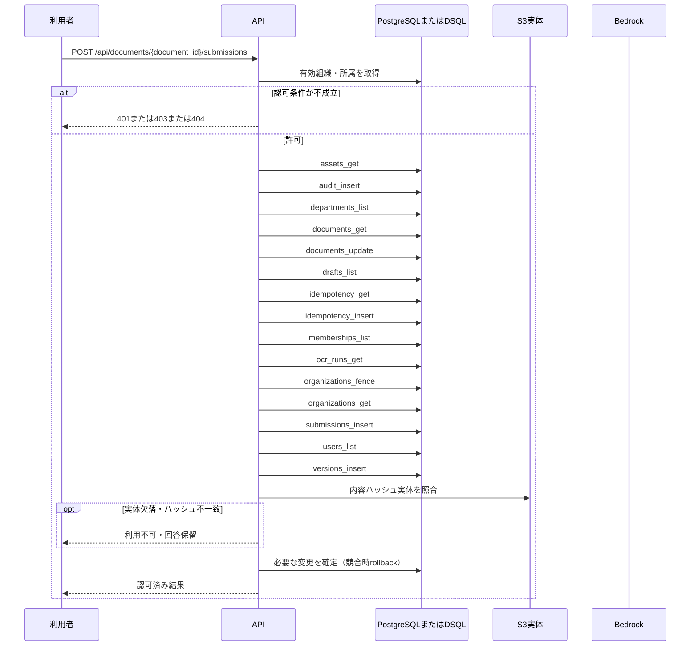

<!-- 実装から生成。直接編集しない。入力SHA256: 4c18ae62a9b9de513581947abfc60f1ec45b9f631019a142a812724b4695a84b -->

# 版を確定して承認申請 — シーケンス

章構成: [lazunex API帳票](https://github.com/tsuji-tomonori/lazunex/tree/096e1e580ab1c0670c57e4febad2bd9fdd4698ee/docs/spec/40.apis)。

**制御順序（関数内の行順）**

| 関数 | 行 | 要素 | 条件・早期終了・例外 |
| --- | --- | --- | --- |
| kotorelay.context.Context.document | 90 | Return | doc |
| kotorelay.context.Context.idempotent_result | 129 | If | not rows |
| kotorelay.context.Context.idempotent_result | 130 | Return | None |
| kotorelay.context.Context.idempotent_result | 137 | Return | record.response |
| kotorelay.context.new_id | 22 | Return | str(uuid4()) |
| kotorelay.context.now | 18 | Return | datetime.now(UTC) |
| kotorelay.context.stable_id | 26 | Return | str(uuid5(NAMESPACE_URL, 'kotorelay:' + value)) |
| kotorelay.errors.require | 13 | If | not condition |
| kotorelay.errors.require | 14 | Raise | Raise |
| kotorelay.objects.digest | 17 | Return | hashlib.sha256(data).hexdigest() |
| kotorelay.operations.documents.functions.submit | 200 | If | cached |
| kotorelay.operations.documents.functions.submit | 201 | Return | q.VersionsRow.model_validate_json(cached) |
| kotorelay.operations.documents.functions.submit | 205 | For | For |
| kotorelay.operations.documents.functions.submit | 260 | Return | version |
| kotorelay.operations.documents.router.submit_version | 56 | Return | f.submit(ctx, str(document_id), data, str(key)) |
