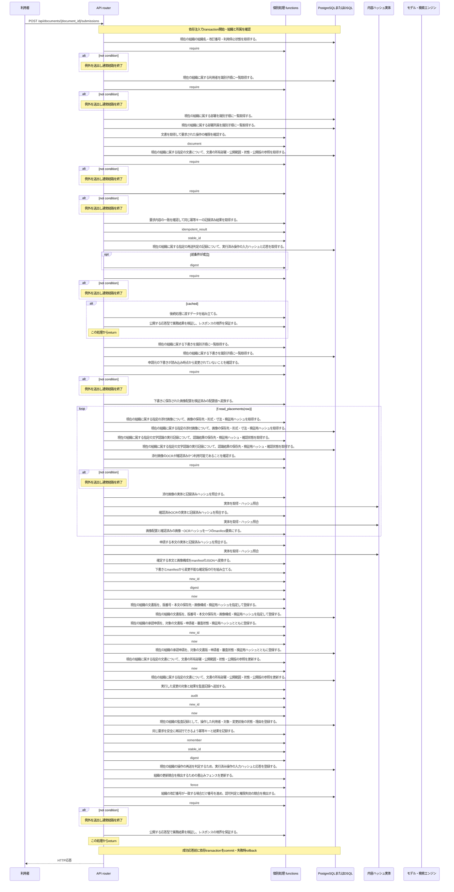

<!-- 実装から生成。直接編集しない。入力SHA256: 1c655589065a087f66d0ae05a6e0b777b889337ba2d8cca7542a2988c7248164 -->

# 版を確定して承認申請 — シーケンス

章構成: [lazunex API帳票](https://github.com/tsuji-tomonori/lazunex/tree/096e1e580ab1c0670c57e4febad2bd9fdd4698ee/docs/spec/40.apis)。

**制御順序（関数内の行順）**

| 関数 | 行 | 要素 | 条件・早期終了・例外 |
| --- | --- | --- | --- |
| kotorelay.context.Context.document | 111 | Return | doc |
| kotorelay.context.Context.idempotent_result | 153 | If | not rows |
| kotorelay.context.Context.idempotent_result | 154 | Return | None |
| kotorelay.context.Context.idempotent_result | 161 | Return | record.response |
| kotorelay.context.new_id | 23 | Return | str(uuid4()) |
| kotorelay.context.now | 19 | Return | datetime.now(UTC) |
| kotorelay.context.stable_id | 27 | Return | str(uuid5(NAMESPACE_URL, 'kotorelay:' + value)) |
| kotorelay.errors.require | 13 | If | not condition |
| kotorelay.errors.require | 14 | Raise | Raise |
| kotorelay.objects.digest | 17 | Return | hashlib.sha256(data).hexdigest() |
| kotorelay.operations.documents.submit_version.functions.assets_get | 48 | Return | q.assets_get(ctx.db, q.AssetsGetParams(organization_id=ctx.org, id=placement.asset_id)) |
| kotorelay.operations.documents.submit_version.functions.build_manifest_image | 171 | Return | ManifestImage(placement=placement, image_hash=image_hash, ocr_hash=ocr_hash) |
| kotorelay.operations.documents.submit_version.functions.build_submit_version | 31 | Return | models.VersionsRow.model_validate_json(cached) |
| kotorelay.operations.documents.submit_version.functions.build_version | 84 | Return | models.VersionsRow(id=new_id(), organization_id=ctx.org, document_id=doc.id, number=doc.next_version, title=doc.title, body_key=row.body_key, body_hash=row.body_hash, manifest=manifest, manifest_hash=digest(manifest.encode()), created_by=ctx.user.id, created_at=now()) |
| kotorelay.operations.documents.submit_version.functions.check_concurrent_access | 161 | Return | ctx.fence() |
| kotorelay.operations.documents.submit_version.functions.document_doc | 21 | Return | ctx.document(str(document_id), 'author') |
| kotorelay.operations.documents.submit_version.functions.documents_update | 130 | Return | q.documents_update(ctx.db, q.DocumentsUpdateParams.model_validate(doc.model_copy(update={'next_version': doc.next_version + 1, 'revision': doc.revision + 1, 'updated_at': now()}), from_attributes=True)) |
| kotorelay.operations.documents.submit_version.functions.drafts_list | 36 | Return | q.drafts_list(ctx.db, q.DraftsListParams(organization_id=ctx.org)) |
| kotorelay.operations.documents.submit_version.functions.find_previous_result | 26 | Return | ctx.idempotent_result(str(key), 'submit', request) |
| kotorelay.operations.documents.submit_version.functions.ocr_runs_get | 55 | Return | q.ocr_runs_get(ctx.db, q.OcrRunsGetParams(organization_id=ctx.org, id=placement.ocr_run_id)) |
| kotorelay.operations.documents.submit_version.functions.read_placements | 166 | Return | [Placement.model_validate(value) for value in json.loads(row.placements)] |
| kotorelay.operations.documents.submit_version.functions.record_submit_version_audit | 149 | Return | ctx.audit('submit', doc.id, version.id, 'draft', 'pending') |
| kotorelay.operations.documents.submit_version.functions.remember_submit_version_result | 156 | Return | ctx.remember(str(key), 'submit', request, version.model_dump_json()) |
| kotorelay.operations.documents.submit_version.functions.require_confirmed_ocr | 62 | Return | require(ocr.confirmed and ocr.status == 'ready', 'ocr_unconfirmed', 409) |
| kotorelay.operations.documents.submit_version.functions.serialize_manifest | 176 | Return | Manifest(body_hash=body_hash, images=images).model_dump_json() |
| kotorelay.operations.documents.submit_version.functions.submissions_insert | 110 | Return | q.submissions_insert(ctx.db, q.SubmissionsInsertParams(id=new_id(), organization_id=ctx.org, document_id=doc.id, version_id=version.id, requested_by=ctx.user.id, status='pending', manifest_hash=version.manifest_hash, decided_by=None, reason='', created_at=now(), decided_at=None)) |
| kotorelay.operations.documents.submit_version.functions.validate_draft_revision | 41 | Return | require(row.revision == data.revision, 'conflict', 409) |
| kotorelay.operations.documents.submit_version.functions.verify_body | 77 | Return | ctx.objects.get(row.body_key, row.body_hash) |
| kotorelay.operations.documents.submit_version.functions.verify_image | 67 | Return | ctx.objects.get(asset.object_key, asset.sha256) |
| kotorelay.operations.documents.submit_version.functions.verify_ocr | 72 | Return | ctx.objects.get(ocr.result_key, ocr.result_hash) |
| kotorelay.operations.documents.submit_version.functions.versions_insert | 101 | Return | q.versions_insert(ctx.db, q.VersionsInsertParams.model_validate(version, from_attributes=True)) |
| kotorelay.operations.documents.submit_version.response_builders.build_response | 10 | Return | TypeAdapter(ResponseData).validate_python(value) |
| kotorelay.operations.documents.submit_version.router.submit_version | 33 | If | cached |
| kotorelay.operations.documents.submit_version.router.submit_version | 34 | Return | build_response(f.build_submit_version(cached)) |
| kotorelay.operations.documents.submit_version.router.submit_version | 38 | For | For |
| kotorelay.operations.documents.submit_version.router.submit_version | 54 | Return | build_response(version) |
