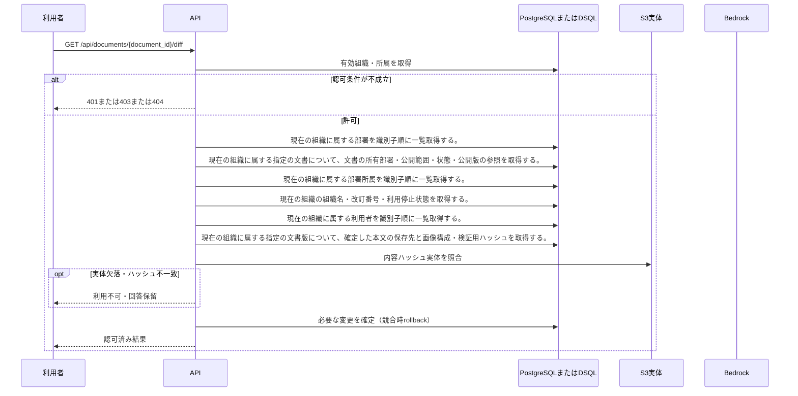

<!-- 実装から生成。直接編集しない。入力SHA256: 987c18a693c5fa5c9f59f732c65771f1c047c0829e22a5d72b689276aae93c56 -->

# 版IDを指定して本文差分を比較 — シーケンス

章構成: [lazunex API帳票](https://github.com/tsuji-tomonori/lazunex/tree/096e1e580ab1c0670c57e4febad2bd9fdd4698ee/docs/spec/40.apis)。

**制御順序（関数内の行順）**

| 関数 | 行 | 要素 | 条件・早期終了・例外 |
| --- | --- | --- | --- |
| kotorelay.context.Context.document | 91 | Return | doc |
| kotorelay.context.Context.version | 97 | If | not self.permission(doc.department_id, 'draft') |
| kotorelay.context.Context.version | 101 | Return | version |
| kotorelay.errors.require | 13 | If | not condition |
| kotorelay.errors.require | 14 | Raise | Raise |
| kotorelay.objects.digest | 17 | Return | hashlib.sha256(data).hexdigest() |
| kotorelay.operations.documents.version_diff.functions.diff | 20 | Return | {'left': left, 'right': right, 'diff': '\n'.join(lines)} |
| kotorelay.operations.documents.version_diff.response_builders.build_response | 10 | Return | TypeAdapter(ResponseData).validate_python(value) |
| kotorelay.operations.documents.version_diff.router.version_diff | 23 | Return | build_response(f.diff(ctx, str(document_id), str(left), str(right))) |
