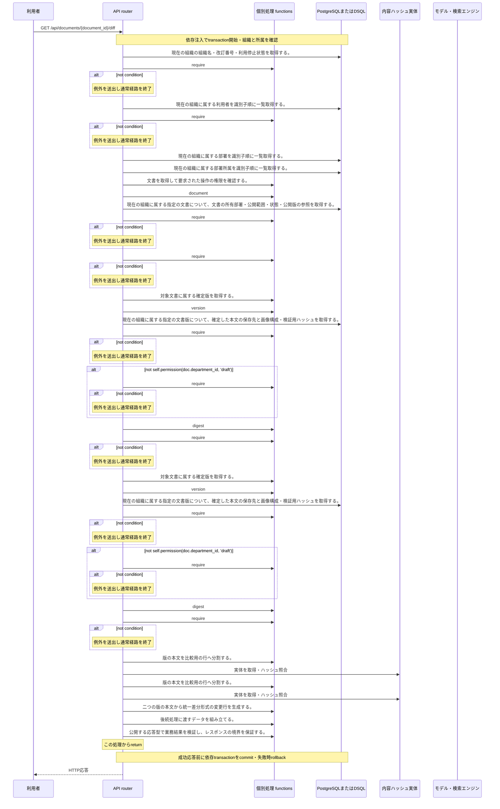

<!-- 実装から生成。直接編集しない。入力SHA256: 1c655589065a087f66d0ae05a6e0b777b889337ba2d8cca7542a2988c7248164 -->

# 版IDを指定して本文差分を比較 — シーケンス

章構成: [lazunex API帳票](https://github.com/tsuji-tomonori/lazunex/tree/096e1e580ab1c0670c57e4febad2bd9fdd4698ee/docs/spec/40.apis)。

**制御順序（関数内の行順）**

| 関数 | 行 | 要素 | 条件・早期終了・例外 |
| --- | --- | --- | --- |
| kotorelay.context.Context.document | 111 | Return | doc |
| kotorelay.context.Context.version | 117 | If | not self.permission(doc.department_id, 'draft') |
| kotorelay.context.Context.version | 121 | Return | version |
| kotorelay.errors.require | 13 | If | not condition |
| kotorelay.errors.require | 14 | Raise | Raise |
| kotorelay.objects.digest | 17 | Return | hashlib.sha256(data).hexdigest() |
| kotorelay.operations.documents.version_diff.functions.build_version_diff | 43 | Return | {'left': str(left), 'right': str(right), 'diff': '\n'.join(lines)} |
| kotorelay.operations.documents.version_diff.functions.compare_bodies | 50 | Return | list(difflib.unified_diff(left_lines, right_lines, fromfile=left, tofile=right, lineterm='')) |
| kotorelay.operations.documents.version_diff.functions.document_doc | 14 | Return | ctx.document(str(document_id), 'draft') |
| kotorelay.operations.documents.version_diff.functions.load_left_lines | 33 | Return | ctx.objects.get(a.body_key).decode().splitlines() |
| kotorelay.operations.documents.version_diff.functions.load_left_version | 21 | Return | ctx.version(doc, str(left)) |
| kotorelay.operations.documents.version_diff.functions.load_right_lines | 38 | Return | ctx.objects.get(b.body_key).decode().splitlines() |
| kotorelay.operations.documents.version_diff.functions.load_right_version | 28 | Return | ctx.version(doc, str(right)) |
| kotorelay.operations.documents.version_diff.response_builders.build_response | 10 | Return | TypeAdapter(ResponseData).validate_python(value) |
| kotorelay.operations.documents.version_diff.router.version_diff | 33 | Return | build_response(f.build_version_diff(left, right, lines)) |
