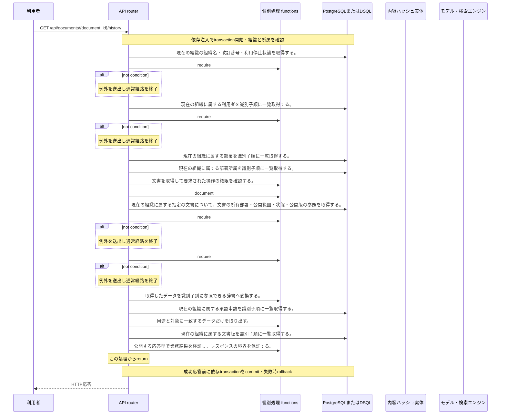

<!-- 実装から生成。直接編集しない。入力SHA256: 1c655589065a087f66d0ae05a6e0b777b889337ba2d8cca7542a2988c7248164 -->

# 担当文書の版履歴 — シーケンス

章構成: [lazunex API帳票](https://github.com/tsuji-tomonori/lazunex/tree/096e1e580ab1c0670c57e4febad2bd9fdd4698ee/docs/spec/40.apis)。

**制御順序（関数内の行順）**

| 関数 | 行 | 要素 | 条件・早期終了・例外 |
| --- | --- | --- | --- |
| kotorelay.context.Context.document | 111 | Return | doc |
| kotorelay.errors.require | 13 | If | not condition |
| kotorelay.errors.require | 14 | Raise | Raise |
| kotorelay.operations.documents.version_history.functions.document_doc | 14 | Return | ctx.document(str(document_id), 'draft') |
| kotorelay.operations.documents.version_history.functions.map_submissions | 19 | Return | {s.version_id: s for s in q.submissions_list(ctx.db, q.SubmissionsListParams(organization_id=ctx.org))} |
| kotorelay.operations.documents.version_history.functions.select_version_history | 31 | Return | [{'version': v, 'submission': submissions.get(v.id)} for v in sorted(q.versions_list(ctx.db, q.VersionsListParams(organization_id=ctx.org)), key=lambda v: v.number, reverse=True) if v.document_id == doc.id] |
| kotorelay.operations.documents.version_history.response_builders.build_response | 10 | Return | TypeAdapter(ResponseData).validate_python(value) |
| kotorelay.operations.documents.version_history.router.version_history | 27 | Return | build_response(f.select_version_history(submissions, doc, ctx)) |
