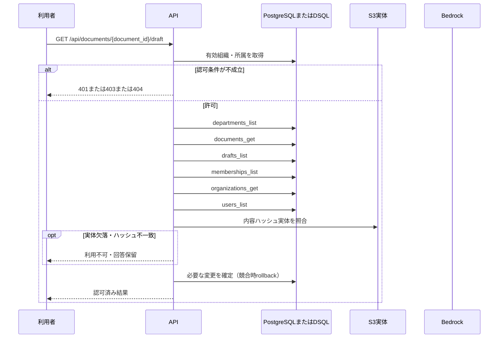

<!-- 実装から生成。直接編集しない。入力SHA256: f4209c4ed7b292c6ed57aa300cf25000f8931a1f59b1fb43cfeb436b1d949dbe -->

# 下書きを取得 — sequence

## 制御順序（関数内の行順）

| 関数 | 行 | 要素 | 条件・早期終了・例外 |
| --- | --- | --- | --- |
| kotorelay.context.Context.document | 90 | Return | doc |
| kotorelay.errors.require | 13 | If | not condition |
| kotorelay.errors.require | 14 | Raise | Raise |
| kotorelay.operations.documents.functions.draft | 84 | Return | {'document': doc, 'body': ctx.objects.get(row.body_key, row.body_hash).decode(), 'revision': row.revision, 'placements': json.loads(row.placements)} |
| kotorelay.operations.documents.router.get_draft | 35 | Return | f.draft(ctx, str(document_id)) |
