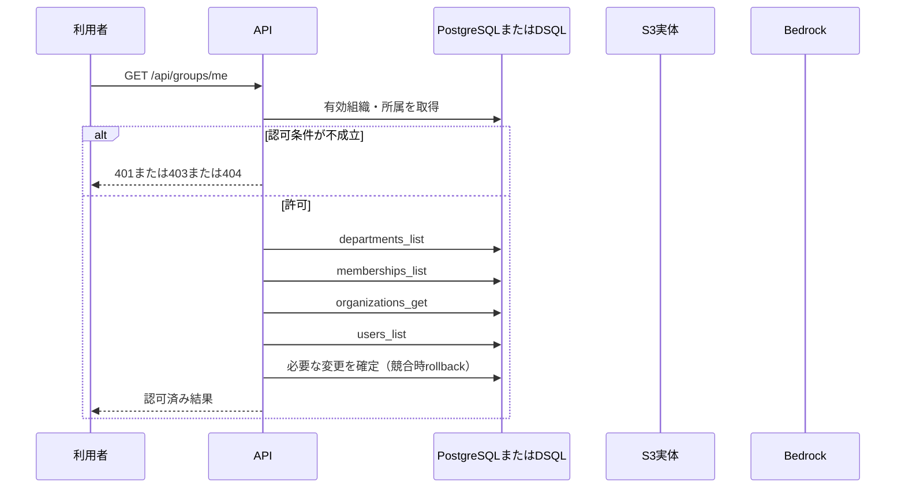

<!-- 実装から生成。直接編集しない。入力SHA256: e3cb305ddf380bd9917bab7f5404c8ac54c8511b8d91b58e7192aa0d5991c3cf -->

# 本人と現在の所属権限を取得 — sequence

## 制御順序（関数内の行順）

| 関数 | 行 | 要素 | 条件・早期終了・例外 |
| --- | --- | --- | --- |
| kotorelay.context.Context.member | 56 | Return | any((m.department_id == department_id for m in self.memberships)) |
| kotorelay.errors.require | 13 | If | not condition |
| kotorelay.errors.require | 14 | Raise | Raise |
| kotorelay.operations.groups.functions.identity | 10 | Return | {'user': ctx.user, 'memberships': ctx.memberships, 'departments': [d for d in q.departments_list(ctx.db, ctx.org) if ctx.member(d.id)], 'directory': [d for d in q.departments_list(ctx.db, ctx.org) if d.active], 'mode': ctx.settings.mode} |
| kotorelay.operations.groups.router.get_identity | 17 | Return | f.identity(ctx) |
