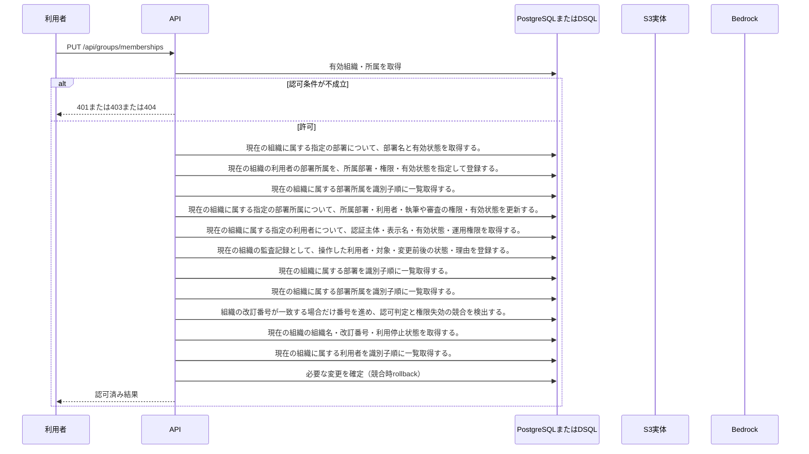

<!-- 実装から生成。直接編集しない。入力SHA256: 987c18a693c5fa5c9f59f732c65771f1c047c0829e22a5d72b689276aae93c56 -->

# 部署の所属権限を変更 — シーケンス

章構成: [lazunex API帳票](https://github.com/tsuji-tomonori/lazunex/tree/096e1e580ab1c0670c57e4febad2bd9fdd4698ee/docs/spec/40.apis)。

**制御順序（関数内の行順）**

| 関数 | 行 | 要素 | 条件・早期終了・例外 |
| --- | --- | --- | --- |
| kotorelay.context.Context.permission | 60 | For | For |
| kotorelay.context.Context.permission | 61 | If | m.department_id == department_id |
| kotorelay.context.Context.permission | 62 | Return | {'author': m.can_author, 'review': m.can_review, 'manage': m.leader, 'draft': m.can_author or m.can_review}.get(operation, False) |
| kotorelay.context.Context.permission | 68 | Return | False |
| kotorelay.context.new_id | 23 | Return | str(uuid4()) |
| kotorelay.context.now | 19 | Return | datetime.now(UTC) |
| kotorelay.errors.require | 13 | If | not condition |
| kotorelay.errors.require | 14 | Raise | Raise |
| kotorelay.operations.groups.change_membership.functions.change | 24 | If | rows |
| kotorelay.operations.groups.change_membership.functions.change | 30 | Return | row |
| kotorelay.operations.groups.change_membership.response_builders.build_response | 10 | Return | TypeAdapter(ResponseData).validate_python(value) |
| kotorelay.operations.groups.change_membership.router.change_membership | 23 | Return | build_response(f.change(ctx, data)) |
