<!-- 実装から生成。直接編集しない。入力SHA256: a4642be092686b22c6cb0bbcfdd011c0a0c93352fc1191e08d5c7dfccac4e973 -->

# 部署の所属権限を変更 — シーケンス

章構成: [lazunex API帳票](https://github.com/tsuji-tomonori/lazunex/tree/096e1e580ab1c0670c57e4febad2bd9fdd4698ee/docs/spec/40.apis)。

```mermaid
sequenceDiagram
    participant U as 利用者
    participant A as API router
    participant F as 個別処理 functions
    participant L as 型付き運用ログ
    participant D as PostgreSQLまたはDSQL
    participant S as 内容ハッシュ実体
    participant M as モデル・検索エンジン
    U->>A: PUT /api/groups/memberships
    opt 認証に失敗した場合
    break エラー応答を返して終了
    A->>L: KR_HTTP_REJECTED
    A-->>U: HTTP 401 / ログインが必要です。
    end
    end
    opt リクエストの入力形式が不正な場合
    break エラー応答を返して終了
    A->>L: KR_HTTP_REJECTED
    A-->>U: HTTP 422 / 入力形式を確認してください。
    end
    end
    A->>D: 依存注入でtransaction開始・組織と所属を確認
    opt DB接続で競合が発生した場合
    break エラー応答を返して終了
    A->>L: KR_HTTP_REJECTED
    A-->>U: HTTP 409 / 競合しました。再読込してください。
    end
    end
    opt DB接続でDBを利用できない場合
    break エラー応答を返して終了
    A->>L: KR_HTTP_FAILED
    A-->>U: HTTP 503 / 一時的に利用できません。
    end
    end
    A->>D: 現在の組織の組織名・改訂番号・利用停止状態を取得する。
    opt SQL実行で競合が発生した場合
    break エラー応答を返して終了
    A->>L: KR_HTTP_REJECTED
    A-->>U: HTTP 409 / 競合しました。再読込してください。
    end
    end
    opt SQL実行でDBを利用できない場合
    break エラー応答を返して終了
    A->>L: KR_HTTP_FAILED
    A-->>U: HTTP 503 / 一時的に利用できません。
    end
    end
    opt 検証不成立：有効な組織と利用者を確認し、最新の所属を読み込む。
    break エラー応答を返して終了
    A->>L: KR_HTTP_REJECTED
    A-->>U: HTTP 401 / ログインが必要です。
    end
    end
    A->>D: 現在の組織に属する利用者を識別子順に一覧取得する。
    opt SQL実行で競合が発生した場合
    break エラー応答を返して終了
    A->>L: KR_HTTP_REJECTED
    A-->>U: HTTP 409 / 競合しました。再読込してください。
    end
    end
    opt SQL実行でDBを利用できない場合
    break エラー応答を返して終了
    A->>L: KR_HTTP_FAILED
    A-->>U: HTTP 503 / 一時的に利用できません。
    end
    end
    opt 検証不成立：有効な組織と利用者を確認し、最新の所属を読み込む。
    break エラー応答を返して終了
    A->>L: KR_HTTP_REJECTED
    A-->>U: HTTP 401 / ログインが必要です。
    end
    end
    A->>D: 現在の組織に属する部署を識別子順に一覧取得する。
    opt SQL実行で競合が発生した場合
    break エラー応答を返して終了
    A->>L: KR_HTTP_REJECTED
    A-->>U: HTTP 409 / 競合しました。再読込してください。
    end
    end
    opt SQL実行でDBを利用できない場合
    break エラー応答を返して終了
    A->>L: KR_HTTP_FAILED
    A-->>U: HTTP 503 / 一時的に利用できません。
    end
    end
    A->>D: 現在の組織に属する部署所属を識別子順に一覧取得する。
    opt SQL実行で競合が発生した場合
    break エラー応答を返して終了
    A->>L: KR_HTTP_REJECTED
    A-->>U: HTTP 409 / 競合しました。再読込してください。
    end
    end
    opt SQL実行でDBを利用できない場合
    break エラー応答を返して終了
    A->>L: KR_HTTP_FAILED
    A-->>U: HTTP 503 / 一時的に利用できません。
    end
    end
    A->>F: 部署管理者または運用者による所属変更であることを確認する。
    A->>F: 指定した部署で要求された操作を実行できる。
    opt 検証不成立：部署管理者または運用者による所属変更であることを確認する。
    break エラー応答を返して終了
    A->>L: KR_HTTP_REJECTED
    A-->>U: HTTP 403 / この操作は許可されていません。
    end
    end
    A->>F: 変更対象の利用者が同じ組織に存在することを確認する。
    A->>D: 現在の組織に属する指定の利用者について、認証主体・表示名・有効状態・運用権限を取得する。
    opt SQL実行で競合が発生した場合
    break エラー応答を返して終了
    A->>L: KR_HTTP_REJECTED
    A-->>U: HTTP 409 / 競合しました。再読込してください。
    end
    end
    opt SQL実行でDBを利用できない場合
    break エラー応答を返して終了
    A->>L: KR_HTTP_FAILED
    A-->>U: HTTP 503 / 一時的に利用できません。
    end
    end
    opt 検証不成立：変更対象の利用者が同じ組織に存在することを確認する。
    break エラー応答を返して終了
    A->>L: KR_HTTP_REJECTED
    A-->>U: HTTP 404 / 対象を利用できません。
    end
    end
    A->>F: 変更対象の部署が同じ組織に存在することを確認する。
    A->>D: 現在の組織に属する指定の部署について、部署名と有効状態を取得する。
    opt SQL実行で競合が発生した場合
    break エラー応答を返して終了
    A->>L: KR_HTTP_REJECTED
    A-->>U: HTTP 409 / 競合しました。再読込してください。
    end
    end
    opt SQL実行でDBを利用できない場合
    break エラー応答を返して終了
    A->>L: KR_HTTP_FAILED
    A-->>U: HTTP 503 / 一時的に利用できません。
    end
    end
    opt 検証不成立：変更対象の部署が同じ組織に存在することを確認する。
    break エラー応答を返して終了
    A->>L: KR_HTTP_REJECTED
    A-->>U: HTTP 404 / 対象を利用できません。
    end
    end
    A->>F: 用途と対象に一致するデータだけを取り出す。
    A->>D: 現在の組織に属する部署所属を識別子順に一覧取得する。
    opt SQL実行で競合が発生した場合
    break エラー応答を返して終了
    A->>L: KR_HTTP_REJECTED
    A-->>U: HTTP 409 / 競合しました。再読込してください。
    end
    end
    opt SQL実行でDBを利用できない場合
    break エラー応答を返して終了
    A->>L: KR_HTTP_FAILED
    A-->>U: HTTP 503 / 一時的に利用できません。
    end
    end
    A->>F: 後続処理に渡すデータを組み立てる。
    A->>F: 対象利用者の部署所属が既に登録されている。
    alt 対象利用者の部署所属が既に登録されている。
    else 条件不成立
    A->>F: new_id
    end
    A->>F: 対象利用者の部署所属が既に登録されている。
    alt 対象利用者の部署所属が既に登録されている。
    A->>F: 現在の組織に属する指定の部署所属について、所属部署・利用者・執筆や審査の権限・有効状態を更新する。
    A->>D: 現在の組織に属する指定の部署所属について、所属部署・利用者・執筆や審査の権限・有効状態を更新する。
    opt SQL実行で競合が発生した場合
    break エラー応答を返して終了
    A->>L: KR_HTTP_REJECTED
    A-->>U: HTTP 409 / 競合しました。再読込してください。
    end
    end
    opt SQL実行でDBを利用できない場合
    break エラー応答を返して終了
    A->>L: KR_HTTP_FAILED
    A-->>U: HTTP 503 / 一時的に利用できません。
    end
    end
    else 条件不成立
    A->>F: 現在の組織の利用者の部署所属を、所属部署・権限・有効状態を指定して登録する。
    A->>D: 現在の組織の利用者の部署所属を、所属部署・権限・有効状態を指定して登録する。
    opt SQL実行で競合が発生した場合
    break エラー応答を返して終了
    A->>L: KR_HTTP_REJECTED
    A-->>U: HTTP 409 / 競合しました。再読込してください。
    end
    end
    opt SQL実行でDBを利用できない場合
    break エラー応答を返して終了
    A->>L: KR_HTTP_FAILED
    A-->>U: HTTP 503 / 一時的に利用できません。
    end
    end
    end
    A->>F: 実行した変更の対象と結果を監査記録へ追加する。
    A->>F: audit
    A->>F: new_id
    A->>F: now
    A->>D: 現在の組織の監査記録として、操作した利用者・対象・変更前後の状態・理由を登録する。
    opt SQL実行で競合が発生した場合
    break エラー応答を返して終了
    A->>L: KR_HTTP_REJECTED
    A-->>U: HTTP 409 / 競合しました。再読込してください。
    end
    end
    opt SQL実行でDBを利用できない場合
    break エラー応答を返して終了
    A->>L: KR_HTTP_FAILED
    A-->>U: HTTP 503 / 一時的に利用できません。
    end
    end
    A->>F: 組織の更新競合を検出するための書込みフェンスを更新する。
    A->>F: 処理中に組織の状態が変更されていないことを確認する。
    A->>D: 組織の改訂番号が一致する場合だけ番号を進め、認可判定と権限失効の競合を検出する。
    opt SQL実行で競合が発生した場合
    break エラー応答を返して終了
    A->>L: KR_HTTP_REJECTED
    A-->>U: HTTP 409 / 競合しました。再読込してください。
    end
    end
    opt SQL実行でDBを利用できない場合
    break エラー応答を返して終了
    A->>L: KR_HTTP_FAILED
    A-->>U: HTTP 503 / 一時的に利用できません。
    end
    end
    opt 検証不成立：処理中に組織の状態が変更されていないことを確認する。
    break エラー応答を返して終了
    A->>L: KR_HTTP_REJECTED
    A-->>U: HTTP 409 / 他の操作で更新されました。最新の状態を確認してください。
    end
    end
    A->>F: 公開する応答型で業務結果を検証し、レスポンスの境界を保証する。
    break 応答を返して終了
    A->>D: transactionをcommit
    opt commitで競合が発生した場合
    break エラー応答を返して終了
    A->>L: KR_HTTP_REJECTED
    A-->>U: HTTP 409 / 競合しました。再読込してください。
    end
    end
    opt commitでDBを利用できない場合
    break エラー応答を返して終了
    A->>L: KR_HTTP_FAILED
    A-->>U: HTTP 503 / 一時的に利用できません。
    end
    end
    A-->>U: HTTP 200 / models.MembershipsRow
    end
```

**例外応答一覧（HTTP境界へ到達した場合）**

| HTTP | code | message | 相関ID |
| --- | --- | --- | --- |
| 401 | unauthenticated | ログインが必要です。 | request_id |
| 403 | forbidden | この操作は許可されていません。 | request_id |
| 404 | not_found | 対象を利用できません。 | request_id |
| 409 | conflict | 他の操作で更新されました。最新の状態を確認してください。 | request_id |
| 409 | conflict | 競合しました。再読込してください。 | request_id |
| 422 | invalid_input | 入力形式を確認してください。 | request_id |
| 503 | unavailable | 一時的に利用できません。 | request_id |

**制御順序（関数内の行順）**

| 関数 | 行 | 要素 | 条件・早期終了・例外 |
| --- | --- | --- | --- |
| kotorelay.context.Context.permission | 83 | For | For |
| kotorelay.context.Context.permission | 84 | If | m.department_id == department_id |
| kotorelay.context.Context.permission | 85 | Return | {'author': m.can_author, 'review': m.can_review, 'manage': m.leader, 'draft': m.can_author or m.can_review}.get(operation, False) |
| kotorelay.context.Context.permission | 91 | Return | False |
| kotorelay.context.new_id | 24 | Return | str(uuid4()) |
| kotorelay.context.now | 20 | Return | datetime.now(UTC) |
| kotorelay.errors.require | 13 | If | not condition |
| kotorelay.errors.require | 14 | Raise | Raise |
| kotorelay.operations.groups.change_membership.functions.build_row | 63 | Return | models.MembershipsRow(id=rows[0].id if has_existing_membership(rows) else new_id(), organization_id=ctx.org, **data.model_dump()) |
| kotorelay.operations.groups.change_membership.functions.check_concurrent_access | 95 | Return | ctx.fence() |
| kotorelay.operations.groups.change_membership.functions.has_existing_membership | 100 | Return | bool(rows) |
| kotorelay.operations.groups.change_membership.functions.memberships_insert | 79 | Return | q.memberships_insert(ctx.db, q.MembershipsInsertParams.model_validate(row, from_attributes=True)) |
| kotorelay.operations.groups.change_membership.functions.memberships_update | 72 | Return | q.memberships_update(ctx.db, q.MembershipsUpdateParams.model_validate(row, from_attributes=True)) |
| kotorelay.operations.groups.change_membership.functions.record_change_membership_audit | 88 | Return | ctx.audit('membership', before=str(rows[0].active) if rows else '', after=str(row.active)) |
| kotorelay.operations.groups.change_membership.functions.require_membership_management | 17 | Return | require(ctx.permission(data.department_id, 'manage') or ctx.user.operator, 'forbidden', 403) |
| kotorelay.operations.groups.change_membership.functions.require_target_department | 35 | Return | require(bool(q.departments_get(ctx.db, q.DepartmentsGetParams(organization_id=ctx.org, id=data.department_id))), 'not_found', 404) |
| kotorelay.operations.groups.change_membership.functions.require_target_user | 24 | Return | require(bool(q.users_get(ctx.db, q.UsersGetParams(organization_id=ctx.org, id=data.user_id))), 'not_found', 404) |
| kotorelay.operations.groups.change_membership.functions.select_rows | 50 | Return | [m for m in q.memberships_list(ctx.db, q.MembershipsListParams(organization_id=ctx.org)) if m.user_id == data.user_id and m.department_id == data.department_id] |
| kotorelay.operations.groups.change_membership.response_builders.build_response | 10 | Return | TypeAdapter(ResponseData).validate_python(value) |
| kotorelay.operations.groups.change_membership.router.change_membership | 30 | If | f.has_existing_membership(rows) |
| kotorelay.operations.groups.change_membership.router.change_membership | 36 | Return | build_response(row) |
