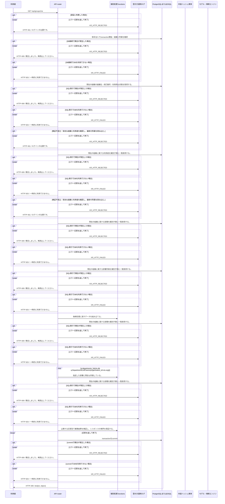

<!-- 実装から生成。直接編集しない。入力SHA256: a4642be092686b22c6cb0bbcfdd011c0a0c93352fc1191e08d5c7dfccac4e973 -->

# 本人と現在の所属権限を取得 — シーケンス

章構成: [lazunex API帳票](https://github.com/tsuji-tomonori/lazunex/tree/096e1e580ab1c0670c57e4febad2bd9fdd4698ee/docs/spec/40.apis)。

**例外応答一覧（HTTP境界へ到達した場合）**

| HTTP | code | message | 相関ID |
| --- | --- | --- | --- |
| 401 | unauthenticated | ログインが必要です。 | request_id |
| 409 | conflict | 競合しました。再読込してください。 | request_id |
| 422 | invalid_input | 入力形式を確認してください。 | request_id |
| 503 | unavailable | 一時的に利用できません。 | request_id |

**制御順序（関数内の行順）**

| 関数 | 行 | 要素 | 条件・早期終了・例外 |
| --- | --- | --- | --- |
| kotorelay.context.Context.member | 79 | Return | any((m.department_id == department_id for m in self.memberships)) |
| kotorelay.errors.require | 13 | If | not condition |
| kotorelay.errors.require | 14 | Raise | Raise |
| kotorelay.operations.groups.get_identity.functions.build_get_identity | 11 | Return | {'user': ctx.user, 'memberships': ctx.memberships, 'departments': [d for d in q.departments_list(ctx.db, q.DepartmentsListParams(organization_id=ctx.org)) if ctx.member(d.id)], 'directory': [d for d in q.departments_list(ctx.db, q.DepartmentsListParams(organization_id=ctx.org)) if d.active], 'mode': ctx.settings.mode} |
| kotorelay.operations.groups.get_identity.response_builders.build_response | 10 | Return | TypeAdapter(ResponseData).validate_python(value) |
| kotorelay.operations.groups.get_identity.router.get_identity | 23 | Return | build_response(f.build_get_identity(ctx)) |
