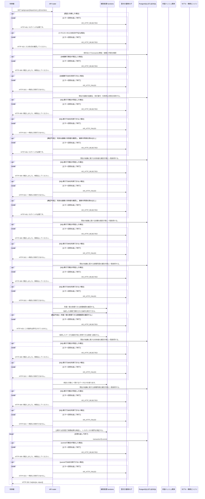

<!-- 実装から生成。直接編集しない。入力SHA256: f473ec4902a9e7cc973e702d4fbb05a99ce8c26a324da9a1f4592aab94dbd60c -->

# 自部署の所属を一覧 — シーケンス

章構成: [lazunex API帳票](https://github.com/tsuji-tomonori/lazunex/tree/096e1e580ab1c0670c57e4febad2bd9fdd4698ee/docs/spec/40.apis)。

**例外応答一覧（HTTP境界へ到達した場合）**

| HTTP | code | message | 相関ID |
| --- | --- | --- | --- |
| 401 | unauthenticated | ログインが必要です。 | request_id |
| 403 | forbidden | この操作は許可されていません。 | request_id |
| 409 | conflict | 競合しました。再読込してください。 | request_id |
| 422 | invalid_input | 入力形式を確認してください。 | request_id |
| 503 | unavailable | 一時的に利用できません。 | request_id |

**制御順序（関数内の行順）**

| 関数 | 行 | 要素 | 条件・早期終了・例外 |
| --- | --- | --- | --- |
| kotorelay.context.Context.permission | 83 | For | For |
| kotorelay.context.Context.permission | 84 | If | m.department_id == department_id |
| kotorelay.context.Context.permission | 85 | Return | {'author': m.can_author, 'review': m.can_review, 'manage': m.leader, 'draft': m.can_author or m.can_review}.get(operation, False) |
| kotorelay.context.Context.permission | 91 | Return | False |
| kotorelay.errors.require | 13 | If | not condition |
| kotorelay.errors.require | 14 | Raise | Raise |
| kotorelay.operations.groups.list_members.functions.map_users | 19 | Return | {u.id: u for u in q.users_list(ctx.db, q.UsersListParams(organization_id=ctx.org))} |
| kotorelay.operations.groups.list_members.functions.require_manager_permission | 14 | Return | require(ctx.permission(str(department_id), 'manage'), 'forbidden', 403) |
| kotorelay.operations.groups.list_members.functions.select_list_members | 26 | Return | [{'membership': m, 'display_name': users[m.user_id].display_name} for m in q.memberships_list(ctx.db, q.MembershipsListParams(organization_id=ctx.org)) if m.department_id == str(department_id)] |
| kotorelay.operations.groups.list_members.response_builders.build_response | 10 | Return | TypeAdapter(ResponseData).validate_python(value) |
| kotorelay.operations.groups.list_members.router.list_members | 27 | Return | build_response(f.select_list_members(users, ctx, department_id)) |
