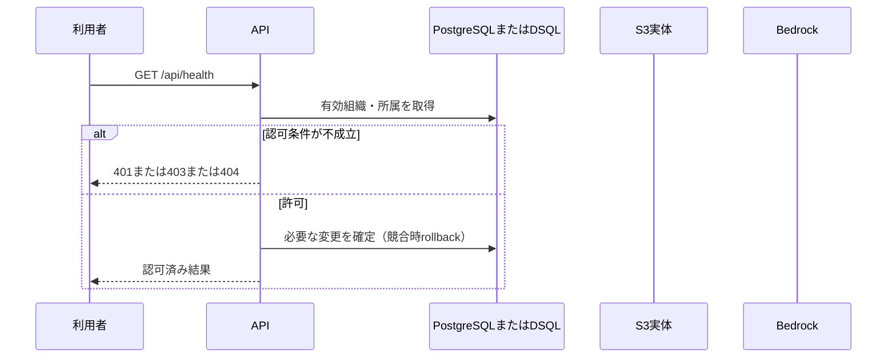

<!-- 実装から生成。直接編集しない。入力SHA256: e3cb305ddf380bd9917bab7f5404c8ac54c8511b8d91b58e7192aa0d5991c3cf -->

# 死活確認 — sequence

## 制御順序（関数内の行順）

| 関数 | 行 | 要素 | 条件・早期終了・例外 |
| --- | --- | --- | --- |
| kotorelay.operations.system.router.health | 10 | Return | {'status': 'ok', 'product': 'KotoRelay'} |
