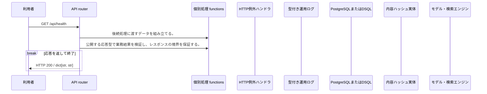

<!-- 実装から生成。直接編集しない。入力SHA256: dc958b6e6841a9f29856eb932e8271e37a6d4416a3266624301c411c89949f81 -->

# 死活確認 — シーケンス

章構成: [lazunex API帳票](https://github.com/tsuji-tomonori/lazunex/tree/096e1e580ab1c0670c57e4febad2bd9fdd4698ee/docs/spec/40.apis)。

**例外応答一覧（HTTP境界へ到達した場合）**

| HTTP | code | message | 相関ID |
| --- | --- | --- | --- |

**制御順序（関数内の行順）**

| 関数 | 行 | 要素 | 条件・早期終了・例外 |
| --- | --- | --- | --- |
| kotorelay.operations.system.health.functions.build_health | 8 | Return | {'status': 'ok', 'product': 'KotoRelay'} |
| kotorelay.operations.system.health.response_builders.build_response | 10 | Return | TypeAdapter(ResponseData).validate_python(value) |
| kotorelay.operations.system.health.router.health | 23 | Return | build_response(f.build_health()) |
