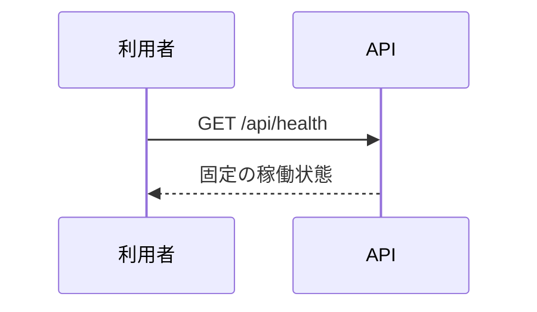

<!-- 実装から生成。直接編集しない。入力SHA256: 4c18ae62a9b9de513581947abfc60f1ec45b9f631019a142a812724b4695a84b -->

# 死活確認 — シーケンス

章構成: [lazunex API帳票](https://github.com/tsuji-tomonori/lazunex/tree/096e1e580ab1c0670c57e4febad2bd9fdd4698ee/docs/spec/40.apis)。

**制御順序（関数内の行順）**

| 関数 | 行 | 要素 | 条件・早期終了・例外 |
| --- | --- | --- | --- |
| kotorelay.operations.system.router.health | 10 | Return | {'status': 'ok', 'product': 'KotoRelay'} |
