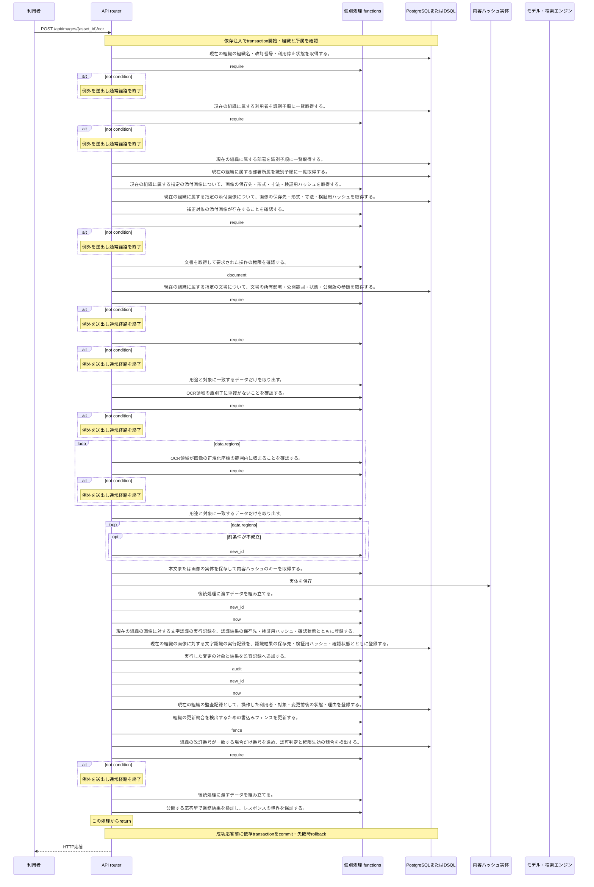

<!-- 実装から生成。直接編集しない。入力SHA256: 1c655589065a087f66d0ae05a6e0b777b889337ba2d8cca7542a2988c7248164 -->

# OCRを訂正し新しいrunを保存 — シーケンス

章構成: [lazunex API帳票](https://github.com/tsuji-tomonori/lazunex/tree/096e1e580ab1c0670c57e4febad2bd9fdd4698ee/docs/spec/40.apis)。

**制御順序（関数内の行順）**

| 関数 | 行 | 要素 | 条件・早期終了・例外 |
| --- | --- | --- | --- |
| kotorelay.context.Context.document | 111 | Return | doc |
| kotorelay.context.new_id | 23 | Return | str(uuid4()) |
| kotorelay.context.now | 19 | Return | datetime.now(UTC) |
| kotorelay.errors.require | 13 | If | not condition |
| kotorelay.errors.require | 14 | Raise | Raise |
| kotorelay.operations.images.correct_ocr.functions.assets_get | 18 | Return | q.assets_get(ctx.db, q.AssetsGetParams(organization_id=ctx.org, id=str(asset_id))) |
| kotorelay.operations.images.correct_ocr.functions.build_correct_ocr | 108 | Return | {'ocr_run': run, 'ocr': result} |
| kotorelay.operations.images.correct_ocr.functions.build_run | 73 | Return | models.OcrRunsRow(id=new_id(), organization_id=ctx.org, document_id=asset.document_id, asset_id=asset.id, result_key=key, result_hash=key, engine=result.engine, status='ready', confirmed=data.confirmed, created_at=now()) |
| kotorelay.operations.images.correct_ocr.functions.check_concurrent_access | 101 | Return | ctx.fence() |
| kotorelay.operations.images.correct_ocr.functions.document_correct_ocr | 28 | Return | ctx.document(asset.document_id, 'author') |
| kotorelay.operations.images.correct_ocr.functions.ocr_runs_insert | 89 | Return | q.ocr_runs_insert(ctx.db, q.OcrRunsInsertParams.model_validate(run, from_attributes=True)) |
| kotorelay.operations.images.correct_ocr.functions.put_key | 62 | Return | ctx.objects.put(result.model_dump_json().encode(), 'application/json') |
| kotorelay.operations.images.correct_ocr.functions.record_correct_ocr_audit | 96 | Return | ctx.audit('ocr_correction', asset.document_id) |
| kotorelay.operations.images.correct_ocr.functions.require_asset | 23 | Return | require(bool(assets)) |
| kotorelay.operations.images.correct_ocr.functions.select_ids | 33 | Return | [r.region_id for r in data.regions if r.region_id is not None] |
| kotorelay.operations.images.correct_ocr.functions.select_result | 52 | Return | [r.model_copy(update={'region_id': r.region_id or new_id(), 'source': 'human', 'confidence': None}) for r in data.regions] |
| kotorelay.operations.images.correct_ocr.functions.validate_region_bounds | 43 | Return | require(region.x + region.width <= 1.000001 and region.y + region.height <= 1.000001, 'invalid_region', 422) |
| kotorelay.operations.images.correct_ocr.functions.validate_region_ids | 38 | Return | require(len(ids) == len(set(ids)), 'invalid_region', 422) |
| kotorelay.operations.images.correct_ocr.response_builders.build_response | 10 | Return | TypeAdapter(ResponseData).validate_python(value) |
| kotorelay.operations.images.correct_ocr.router.correct_ocr | 33 | For | For |
| kotorelay.operations.images.correct_ocr.router.correct_ocr | 46 | Return | build_response(f.build_correct_ocr(run, result)) |
