<!-- 実装から生成。直接編集しない。入力SHA256: 0ce2ee5ffefd1f44a0c3da213ceff59dfb82649c9add5715e204664ffd05fd84 -->

# 現在の認可で画像を配信 — シーケンス

章構成: [lazunex API帳票](https://github.com/tsuji-tomonori/lazunex/tree/096e1e580ab1c0670c57e4febad2bd9fdd4698ee/docs/spec/40.apis)。

```mermaid
sequenceDiagram
    participant U as 利用者
    participant A as API router
    participant F as 個別処理 functions
    participant E as HTTP例外ハンドラ
    participant L as 型付き運用ログ
    participant D as PostgreSQLまたはDSQL
    participant S as 内容ハッシュ実体
    participant M as モデル・検索エンジン
    U->>A: GET /api/images/{asset_id}
    Note over A,D: 依存注入でtransaction開始・組織と所属を確認
    A->>D: 現在の組織の組織名・改訂番号・利用停止状態を取得する。
    opt 検証不成立：bool(organizations) and (not organizations[0].suspended)
    break エラー応答を返して終了（後続の正常処理は実行しない）
    A->>E: Problemまたは依存先例外をHTTP応答へ変換・transactionはrollback
    E->>L: KR_HTTP_REJECTED / 業務条件または入力検証によりリクエストを拒否しました。
    E-->>U: HTTP 401 / {code： "unauthenticated", message： "ログインが必要です。", request_id： 相関ID}
    end
    end
    A->>D: 現在の組織に属する利用者を識別子順に一覧取得する。
    opt 検証不成立：len(users) == 1
    break エラー応答を返して終了（後続の正常処理は実行しない）
    A->>E: Problemまたは依存先例外をHTTP応答へ変換・transactionはrollback
    E->>L: KR_HTTP_REJECTED / 業務条件または入力検証によりリクエストを拒否しました。
    E-->>U: HTTP 401 / {code： "unauthenticated", message： "ログインが必要です。", request_id： 相関ID}
    end
    end
    A->>D: 現在の組織に属する部署を識別子順に一覧取得する。
    A->>D: 現在の組織に属する部署所属を識別子順に一覧取得する。
    A->>F: 画像の所有文書と指定版の閲覧権限を確認して実体情報を返す。
    A->>D: 現在の組織に属する指定の添付画像について、画像の保存先・形式・寸法・検証用ハッシュを取得する。
    opt 検証不成立：bool(assets)
    break エラー応答を返して終了（後続の正常処理は実行しない）
    A->>E: Problemまたは依存先例外をHTTP応答へ変換・transactionはrollback
    E->>L: KR_HTTP_REJECTED / 業務条件または入力検証によりリクエストを拒否しました。
    E-->>U: HTTP 404 / {code： "not_found", message： "対象を利用できません。", request_id： 相関ID}
    end
    end
    alt version_id is None
    A->>F: document
    A->>D: 現在の組織に属する指定の文書について、文書の所有部署・公開範囲・状態・公開版の参照を取得する。
    opt 検証不成立：bool(rows)
    break エラー応答を返して終了（後続の正常処理は実行しない）
    A->>E: Problemまたは依存先例外をHTTP応答へ変換・transactionはrollback
    E->>L: KR_HTTP_REJECTED / 業務条件または入力検証によりリクエストを拒否しました。
    E-->>U: HTTP 404 / {code： "not_found", message： "対象を利用できません。", request_id： 相関ID}
    end
    end
    opt 検証不成立：allowed
    break エラー応答を返して終了（後続の正常処理は実行しない）
    A->>E: Problemまたは依存先例外をHTTP応答へ変換・transactionはrollback
    E->>L: KR_HTTP_REJECTED / 業務条件または入力検証によりリクエストを拒否しました。
    E-->>U: HTTP 404 / {code： "not_found", message： "対象を利用できません。", request_id： 相関ID}
    end
    end
    else 条件不成立
    A->>D: 現在の組織に属する指定の文書について、文書の所有部署・公開範囲・状態・公開版の参照を取得する。
    opt 検証不成立：bool(docs) and docs[0].status != 'deleted'
    break エラー応答を返して終了（後続の正常処理は実行しない）
    A->>E: Problemまたは依存先例外をHTTP応答へ変換・transactionはrollback
    E->>L: KR_HTTP_REJECTED / 業務条件または入力検証によりリクエストを拒否しました。
    E-->>U: HTTP 404 / {code： "not_found", message： "対象を利用できません。", request_id： 相関ID}
    end
    end
    A->>F: can_read
    opt 前条件が不成立
    A->>F: permission
    end
    opt 検証不成立：ctx.can_read(doc) or ctx.permission(doc.department_id, 'draft')
    break エラー応答を返して終了（後続の正常処理は実行しない）
    A->>E: Problemまたは依存先例外をHTTP応答へ変換・transactionはrollback
    E->>L: KR_HTTP_REJECTED / 業務条件または入力検証によりリクエストを拒否しました。
    E-->>U: HTTP 404 / {code： "not_found", message： "対象を利用できません。", request_id： 相関ID}
    end
    end
    A->>F: version
    A->>D: 現在の組織に属する指定の文書版について、確定した本文の保存先と画像構成・検証用ハッシュを取得する。
    opt 検証不成立：bool(rows) and rows[0].document_id == doc.id
    break エラー応答を返して終了（後続の正常処理は実行しない）
    A->>E: Problemまたは依存先例外をHTTP応答へ変換・transactionはrollback
    E->>L: KR_HTTP_REJECTED / 業務条件または入力検証によりリクエストを拒否しました。
    E-->>U: HTTP 404 / {code： "not_found", message： "対象を利用できません。", request_id： 相関ID}
    end
    end
    alt not self.permission(doc.department_id, 'draft')
    opt 検証不成立：self.can_read(doc) and doc.latest_version_id == version.id
    break エラー応答を返して終了（後続の正常処理は実行しない）
    A->>E: Problemまたは依存先例外をHTTP応答へ変換・transactionはrollback
    E->>L: KR_HTTP_REJECTED / 業務条件または入力検証によりリクエストを拒否しました。
    E-->>U: HTTP 404 / {code： "not_found", message： "対象を利用できません。", request_id： 相関ID}
    end
    end
    end
    A->>F: digest
    opt 検証不成立：digest(version.manifest.encode()) == version.manifest_hash
    break エラー応答を返して終了（後続の正常処理は実行しない）
    A->>E: Problemまたは依存先例外をHTTP応答へ変換・transactionはrollback
    E->>L: KR_HTTP_FAILED / 処理を完了できずエラー応答を返しました。
    E-->>U: HTTP 503 / {code： "integrity", message： "保存内容の整合性を確認できません。", request_id： 相関ID}
    end
    end
    opt 検証不成立：any((i.placement.asset_id == asset.id and i.image_hash == asset.sha256 for i in manifest.images))
    break エラー応答を返して終了（後続の正常処理は実行しない）
    A->>E: Problemまたは依存先例外をHTTP応答へ変換・transactionはrollback
    E->>L: KR_HTTP_REJECTED / 業務条件または入力検証によりリクエストを拒否しました。
    E-->>U: HTTP 404 / {code： "not_found", message： "対象を利用できません。", request_id： 相関ID}
    end
    end
    end
    A->>F: 記録された保存先から実体を取得してハッシュを照合する。
    A->>S: 実体を取得・ハッシュ照合
    A->>F: 認可済み画像bytesをPNGの応答として組み立てる。
    Note over A: この処理からreturn
    Note over A,D: 成功応答前に依存transactionをcommit・失敗時rollback
    A-->>U: HTTP 200 / Response
    Note over A,U: 共通例外経路（成功後に実行する追加処理ではない）
    opt 入力検証の失敗（RequestValidationError）
    break エラー応答を返して終了（後続の正常処理は実行しない）
    A->>E: Problemまたは依存先例外をHTTP応答へ変換・transactionはrollback
    E->>L: KR_HTTP_REJECTED / 業務条件または入力検証によりリクエストを拒否しました。
    E-->>U: HTTP 422 / {code： "invalid_input", message： "入力形式を確認してください。", request_id： 相関ID}
    end
    end
    opt SQL実行またはcommitの競合（psycopg.Error）
    break エラー応答を返して終了（後続の正常処理は実行しない）
    A->>E: Problemまたは依存先例外をHTTP応答へ変換・transactionはrollback
    E->>L: KR_HTTP_REJECTED / 業務条件または入力検証によりリクエストを拒否しました。
    E-->>U: HTTP 409 / {code： "conflict", message： "競合しました。再読込してください。", request_id： 相関ID}
    end
    end
    opt DB接続・外部サービスの失敗（捕捉して継続する場合を除く）
    break エラー応答を返して終了（後続の正常処理は実行しない）
    A->>E: Problemまたは依存先例外をHTTP応答へ変換・transactionはrollback
    E->>L: KR_HTTP_FAILED / 処理を完了できずエラー応答を返しました。
    E-->>U: HTTP 503 / {code： "unavailable", message： "一時的に利用できません。", request_id： 相関ID}
    end
    end
```

**例外応答一覧（HTTP境界へ到達した場合）**

| HTTP | code | message | 相関ID |
| --- | --- | --- | --- |
| 401 | unauthenticated | ログインが必要です。 | request_id |
| 404 | not_found | 対象を利用できません。 | request_id |
| 409 | conflict | 競合しました。再読込してください。 | request_id |
| 422 | invalid_input | 入力形式を確認してください。 | request_id |
| 503 | integrity | 保存内容の整合性を確認できません。 | request_id |
| 503 | unavailable | 一時的に利用できません。 | request_id |

**制御順序（関数内の行順）**

| 関数 | 行 | 要素 | 条件・早期終了・例外 |
| --- | --- | --- | --- |
| kotorelay.context.Context.can_read | 89 | If | doc.status != 'active' or not self.memberships |
| kotorelay.context.Context.can_read | 90 | Return | False |
| kotorelay.context.Context.can_read | 91 | If | doc.visibility == 'organization' |
| kotorelay.context.Context.can_read | 92 | Return | True |
| kotorelay.context.Context.can_read | 93 | If | self.member(doc.department_id) |
| kotorelay.context.Context.can_read | 94 | Return | True |
| kotorelay.context.Context.can_read | 95 | Return | doc.visibility == 'selected' and any((self.member(department) for department in json.loads(doc.shared_departments))) |
| kotorelay.context.Context.document | 111 | Return | doc |
| kotorelay.context.Context.permission | 78 | For | For |
| kotorelay.context.Context.permission | 79 | If | m.department_id == department_id |
| kotorelay.context.Context.permission | 80 | Return | {'author': m.can_author, 'review': m.can_review, 'manage': m.leader, 'draft': m.can_author or m.can_review}.get(operation, False) |
| kotorelay.context.Context.permission | 86 | Return | False |
| kotorelay.context.Context.version | 117 | If | not self.permission(doc.department_id, 'draft') |
| kotorelay.context.Context.version | 121 | Return | version |
| kotorelay.errors.require | 13 | If | not condition |
| kotorelay.errors.require | 14 | Raise | Raise |
| kotorelay.objects.digest | 17 | Return | hashlib.sha256(data).hexdigest() |
| kotorelay.operations.images.get_image.functions.get_get_image | 11 | Return | ctx.objects.get(asset.object_key, asset.sha256) |
| kotorelay.operations.images.get_image.response_builders.build_response | 10 | Return | Response(value, media_type='image/png') |
| kotorelay.operations.images.get_image.router.get_image | 29 | Return | build_response(f.get_get_image(asset, ctx)) |
| kotorelay.operations.images.shared.functions.authorize_asset | 17 | If | version_id is None |
| kotorelay.operations.images.shared.functions.authorize_asset | 34 | Return | asset |
