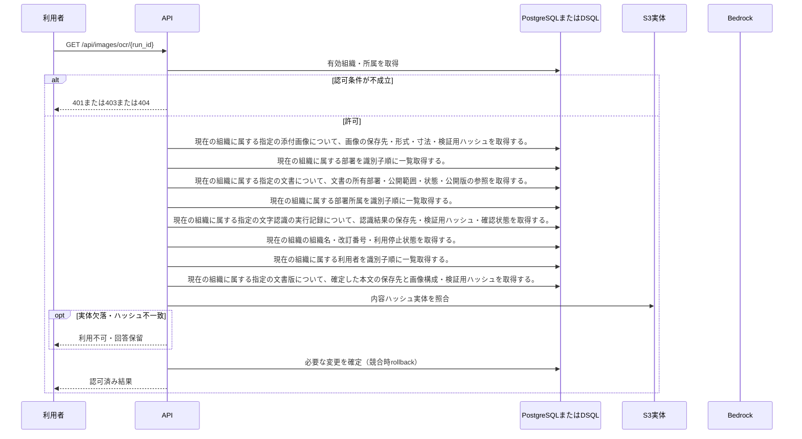

<!-- 実装から生成。直接編集しない。入力SHA256: 31de213f242d3d7bf0d4f5957d4ef327aaacb2267a973d8e0adce1f1531ac7e1 -->

# 認可されたOCR領域を取得 — シーケンス

章構成: [lazunex API帳票](https://github.com/tsuji-tomonori/lazunex/tree/096e1e580ab1c0670c57e4febad2bd9fdd4698ee/docs/spec/40.apis)。

**制御順序（関数内の行順）**

| 関数 | 行 | 要素 | 条件・早期終了・例外 |
| --- | --- | --- | --- |
| kotorelay.context.Context.can_read | 70 | If | doc.status != 'active' or not self.memberships |
| kotorelay.context.Context.can_read | 71 | Return | False |
| kotorelay.context.Context.can_read | 72 | If | doc.visibility == 'organization' |
| kotorelay.context.Context.can_read | 73 | Return | True |
| kotorelay.context.Context.can_read | 74 | If | self.member(doc.department_id) |
| kotorelay.context.Context.can_read | 75 | Return | True |
| kotorelay.context.Context.can_read | 76 | Return | doc.visibility == 'selected' and any((self.member(department) for department in json.loads(doc.shared_departments))) |
| kotorelay.context.Context.document | 90 | Return | doc |
| kotorelay.context.Context.permission | 59 | For | For |
| kotorelay.context.Context.permission | 60 | If | m.department_id == department_id |
| kotorelay.context.Context.permission | 61 | Return | {'author': m.can_author, 'review': m.can_review, 'manage': m.leader, 'draft': m.can_author or m.can_review}.get(operation, False) |
| kotorelay.context.Context.permission | 67 | Return | False |
| kotorelay.context.Context.version | 96 | If | not self.permission(doc.department_id, 'draft') |
| kotorelay.context.Context.version | 100 | Return | version |
| kotorelay.context.stable_id | 26 | Return | str(uuid5(NAMESPACE_URL, 'kotorelay:' + value)) |
| kotorelay.errors.require | 13 | If | not condition |
| kotorelay.errors.require | 14 | Raise | Raise |
| kotorelay.objects.digest | 17 | Return | hashlib.sha256(data).hexdigest() |
| kotorelay.operations.images.functions.authorize_asset | 161 | If | version_id is None |
| kotorelay.operations.images.functions.authorize_asset | 176 | Return | asset |
| kotorelay.operations.images.functions.ocr | 189 | If | version_id |
| kotorelay.operations.images.functions.ocr | 200 | Return | result.model_copy(update={'confirmed': run.confirmed, 'regions': [r.model_copy(update={'region_id': r.region_id or stable_id(run.id + ':' + str(i))}) for i, r in enumerate(result.regions)]}) |
| kotorelay.operations.images.router.get_ocr | 44 | Return | f.ocr(ctx, str(run_id), str(version_id) if version_id else None) |
