<!-- 実装から生成。直接編集しない。入力SHA256: dc958b6e6841a9f29856eb932e8271e37a6d4416a3266624301c411c89949f81 -->

# 認可されたOCR領域を取得 — シーケンス

章構成: [lazunex API帳票](https://github.com/tsuji-tomonori/lazunex/tree/096e1e580ab1c0670c57e4febad2bd9fdd4698ee/docs/spec/40.apis)。

```mermaid
sequenceDiagram
    participant U as 利用者
    participant A as API router
    participant F as 個別処理 functions
    participant E as HTTP例外ハンドラ
    participant L as 型付き運用ログ
    participant D as PostgreSQLまたはDSQL
    participant S as 内容ハッシュ実体
    participant M as モデル・検索エンジン
    U->>A: GET /api/images/ocr/{run_id}
    Note over A,D: 依存注入でtransaction開始・組織と所属を確認
    A->>D: 現在の組織の組織名・改訂番号・利用停止状態を取得する。
    opt 検証不成立：有効な組織と利用者を確認し、最新の所属を読み込む。
    break エラー応答を返して終了（後続の正常処理は実行しない）
    A->>E: Problemまたは依存先例外をHTTP応答へ変換・transactionはrollback
    E->>L: KR_HTTP_REJECTED / 業務条件または入力検証によりリクエストを拒否しました。
    E-->>U: HTTP 401 / ログインが必要です。
    end
    end
    A->>D: 現在の組織に属する利用者を識別子順に一覧取得する。
    opt 検証不成立：有効な組織と利用者を確認し、最新の所属を読み込む。
    break エラー応答を返して終了（後続の正常処理は実行しない）
    A->>E: Problemまたは依存先例外をHTTP応答へ変換・transactionはrollback
    E->>L: KR_HTTP_REJECTED / 業務条件または入力検証によりリクエストを拒否しました。
    E-->>U: HTTP 401 / ログインが必要です。
    end
    end
    A->>D: 現在の組織に属する部署を識別子順に一覧取得する。
    A->>D: 現在の組織に属する部署所属を識別子順に一覧取得する。
    A->>F: 現在の組織に属する指定の文字認識の実行記録について、認識結果の保存先・検証用ハッシュ・確認状態を取得する。
    A->>D: 現在の組織に属する指定の文字認識の実行記録について、認識結果の保存先・検証用ハッシュ・確認状態を取得する。
    A->>F: OCR実行記録が存在することを確認する。
    opt 検証不成立：OCR実行記録が存在することを確認する。
    break エラー応答を返して終了（後続の正常処理は実行しない）
    A->>E: Problemまたは依存先例外をHTTP応答へ変換・transactionはrollback
    E->>L: KR_HTTP_REJECTED / 業務条件または入力検証によりリクエストを拒否しました。
    E-->>U: HTTP 404 / 対象を利用できません。
    end
    end
    A->>F: 表示する版が指定されている。
    A->>F: 画像の所有文書と指定版の閲覧権限を確認して実体情報を返す。
    A->>D: 現在の組織に属する指定の添付画像について、画像の保存先・形式・寸法・検証用ハッシュを取得する。
    opt 検証不成立：画像の所有文書と指定版の閲覧権限を確認して実体情報を返す。
    break エラー応答を返して終了（後続の正常処理は実行しない）
    A->>E: Problemまたは依存先例外をHTTP応答へ変換・transactionはrollback
    E->>L: KR_HTTP_REJECTED / 業務条件または入力検証によりリクエストを拒否しました。
    E-->>U: HTTP 404 / 対象を利用できません。
    end
    end
    A->>F: 版の指定がなく、下書きの画像として権限を確認する。
    alt 版の指定がなく、下書きの画像として権限を確認する。
    A->>F: 対象の文書が存在し、要求された操作を実行できることを確認する。
    A->>D: 現在の組織に属する指定の文書について、文書の所有部署・公開範囲・状態・公開版の参照を取得する。
    opt 検証不成立：対象の文書が存在し、要求された操作を実行できることを確認する。
    break エラー応答を返して終了（後続の正常処理は実行しない）
    A->>E: Problemまたは依存先例外をHTTP応答へ変換・transactionはrollback
    E->>L: KR_HTTP_REJECTED / 業務条件または入力検証によりリクエストを拒否しました。
    E-->>U: HTTP 404 / 対象を利用できません。
    end
    end
    A->>F: 文書の閲覧権限を確認する操作である。
    alt 文書の閲覧権限を確認する操作である。
    A->>F: 現在の所属と公開範囲で文書を閲覧できる。
    A->>F: 指定した部署に現在も所属している。
    opt 前条件が成立
    loop json.loads(doc.shared_departments)
    A->>F: 指定した部署に現在も所属している。
    end
    end
    else 条件不成立
    opt 前条件が成立
    A->>F: 指定した部署で要求された操作を実行できる。
    end
    end
    opt 検証不成立：対象の文書が存在し、要求された操作を実行できることを確認する。
    break エラー応答を返して終了（後続の正常処理は実行しない）
    A->>E: Problemまたは依存先例外をHTTP応答へ変換・transactionはrollback
    E->>L: KR_HTTP_REJECTED / 業務条件または入力検証によりリクエストを拒否しました。
    E-->>U: HTTP 404 / 対象を利用できません。
    end
    end
    else 条件不成立
    A->>D: 現在の組織に属する指定の文書について、文書の所有部署・公開範囲・状態・公開版の参照を取得する。
    opt 検証不成立：画像の所有文書と指定版の閲覧権限を確認して実体情報を返す。
    break エラー応答を返して終了（後続の正常処理は実行しない）
    A->>E: Problemまたは依存先例外をHTTP応答へ変換・transactionはrollback
    E->>L: KR_HTTP_REJECTED / 業務条件または入力検証によりリクエストを拒否しました。
    E-->>U: HTTP 404 / 対象を利用できません。
    end
    end
    A->>F: 現在の所属と公開範囲で文書を閲覧できる。
    A->>F: 指定した部署に現在も所属している。
    opt 前条件が成立
    loop json.loads(doc.shared_departments)
    A->>F: 指定した部署に現在も所属している。
    end
    end
    opt 前条件が不成立
    A->>F: 指定した部署で要求された操作を実行できる。
    end
    opt 検証不成立：画像の所有文書と指定版の閲覧権限を確認して実体情報を返す。
    break エラー応答を返して終了（後続の正常処理は実行しない）
    A->>E: Problemまたは依存先例外をHTTP応答へ変換・transactionはrollback
    E->>L: KR_HTTP_REJECTED / 業務条件または入力検証によりリクエストを拒否しました。
    E-->>U: HTTP 404 / 対象を利用できません。
    end
    end
    A->>F: 文書の版が存在し、閲覧権限と実体の整合性が有効なことを確認する。
    A->>D: 現在の組織に属する指定の文書版について、確定した本文の保存先と画像構成・検証用ハッシュを取得する。
    opt 検証不成立：文書の版が存在し、閲覧権限と実体の整合性が有効なことを確認する。
    break エラー応答を返して終了（後続の正常処理は実行しない）
    A->>E: Problemまたは依存先例外をHTTP応答へ変換・transactionはrollback
    E->>L: KR_HTTP_REJECTED / 業務条件または入力検証によりリクエストを拒否しました。
    E-->>U: HTTP 404 / 対象を利用できません。
    end
    end
    A->>F: 指定した部署で要求された操作を実行できる。
    alt 不成立：（指定した部署で要求された操作を実行できる。）
    A->>F: 現在の所属と公開範囲で文書を閲覧できる。
    A->>F: 指定した部署に現在も所属している。
    opt 前条件が成立
    loop json.loads(doc.shared_departments)
    A->>F: 指定した部署に現在も所属している。
    end
    end
    opt 検証不成立：文書の版が存在し、閲覧権限と実体の整合性が有効なことを確認する。
    break エラー応答を返して終了（後続の正常処理は実行しない）
    A->>E: Problemまたは依存先例外をHTTP応答へ変換・transactionはrollback
    E->>L: KR_HTTP_REJECTED / 業務条件または入力検証によりリクエストを拒否しました。
    E-->>U: HTTP 404 / 対象を利用できません。
    end
    end
    end
    A->>F: digest
    opt 検証不成立：文書の版が存在し、閲覧権限と実体の整合性が有効なことを確認する。
    break エラー応答を返して終了（後続の正常処理は実行しない）
    A->>E: Problemまたは依存先例外をHTTP応答へ変換・transactionはrollback
    E->>L: KR_HTTP_FAILED / 処理を完了できずエラー応答を返しました。
    E-->>U: HTTP 503 / 保存内容の整合性を確認できません。
    end
    end
    opt 検証不成立：画像の所有文書と指定版の閲覧権限を確認して実体情報を返す。
    break エラー応答を返して終了（後続の正常処理は実行しない）
    A->>E: Problemまたは依存先例外をHTTP応答へ変換・transactionはrollback
    E->>L: KR_HTTP_REJECTED / 業務条件または入力検証によりリクエストを拒否しました。
    E-->>U: HTTP 404 / 対象を利用できません。
    end
    end
    end
    A->>F: 表示する版が指定されている。
    alt 表示する版が指定されている。
    A->>F: 現在の組織に属する指定の文書について、文書の所有部署・公開範囲・状態・公開版の参照を取得する。
    A->>D: 現在の組織に属する指定の文書について、文書の所有部署・公開範囲・状態・公開版の参照を取得する。
    A->>F: 対象文書に属する確定版を取得する。
    A->>F: 文書の版が存在し、閲覧権限と実体の整合性が有効なことを確認する。
    A->>D: 現在の組織に属する指定の文書版について、確定した本文の保存先と画像構成・検証用ハッシュを取得する。
    opt 検証不成立：文書の版が存在し、閲覧権限と実体の整合性が有効なことを確認する。
    break エラー応答を返して終了（後続の正常処理は実行しない）
    A->>E: Problemまたは依存先例外をHTTP応答へ変換・transactionはrollback
    E->>L: KR_HTTP_REJECTED / 業務条件または入力検証によりリクエストを拒否しました。
    E-->>U: HTTP 404 / 対象を利用できません。
    end
    end
    A->>F: 指定した部署で要求された操作を実行できる。
    alt 不成立：（指定した部署で要求された操作を実行できる。）
    A->>F: 現在の所属と公開範囲で文書を閲覧できる。
    A->>F: 指定した部署に現在も所属している。
    opt 前条件が成立
    loop json.loads(doc.shared_departments)
    A->>F: 指定した部署に現在も所属している。
    end
    end
    opt 検証不成立：文書の版が存在し、閲覧権限と実体の整合性が有効なことを確認する。
    break エラー応答を返して終了（後続の正常処理は実行しない）
    A->>E: Problemまたは依存先例外をHTTP応答へ変換・transactionはrollback
    E->>L: KR_HTTP_REJECTED / 業務条件または入力検証によりリクエストを拒否しました。
    E-->>U: HTTP 404 / 対象を利用できません。
    end
    end
    end
    A->>F: digest
    opt 検証不成立：文書の版が存在し、閲覧権限と実体の整合性が有効なことを確認する。
    break エラー応答を返して終了（後続の正常処理は実行しない）
    A->>E: Problemまたは依存先例外をHTTP応答へ変換・transactionはrollback
    E->>L: KR_HTTP_FAILED / 処理を完了できずエラー応答を返しました。
    E-->>U: HTTP 503 / 保存内容の整合性を確認できません。
    end
    end
    A->>F: 指定版のmanifestに同じOCR実行とハッシュが含まれることを確認する。
    opt 検証不成立：指定版のmanifestに同じOCR実行とハッシュが含まれることを確認する。
    break エラー応答を返して終了（後続の正常処理は実行しない）
    A->>E: Problemまたは依存先例外をHTTP応答へ変換・transactionはrollback
    E->>L: KR_HTTP_REJECTED / 業務条件または入力検証によりリクエストを拒否しました。
    E-->>U: HTTP 404 / 対象を利用できません。
    end
    end
    end
    A->>F: 後続処理に渡すデータを組み立てる。
    A->>S: 実体を取得・ハッシュ照合
    A->>F: 後続処理に渡すデータを組み立てる。
    loop enumerate(result.regions)
    opt 前条件が不成立
    A->>F: stable_id
    end
    end
    A->>F: 公開する応答型で業務結果を検証し、レスポンスの境界を保証する。
    break 応答を返して終了
    Note over A,D: 成功応答前にtransactionをcommit・競合時rollback
    A-->>U: HTTP 200 / OcrResult
    end
    Note over A,U: 共通例外経路（成功後に実行する追加処理ではない）
    opt 入力検証の失敗（RequestValidationError）
    break エラー応答を返して終了（後続の正常処理は実行しない）
    A->>E: Problemまたは依存先例外をHTTP応答へ変換・transactionはrollback
    E->>L: KR_HTTP_REJECTED / 業務条件または入力検証によりリクエストを拒否しました。
    E-->>U: HTTP 422 / 入力形式を確認してください。
    end
    end
    opt SQL実行またはcommitの競合（psycopg.Error）
    break エラー応答を返して終了（後続の正常処理は実行しない）
    A->>E: Problemまたは依存先例外をHTTP応答へ変換・transactionはrollback
    E->>L: KR_HTTP_REJECTED / 業務条件または入力検証によりリクエストを拒否しました。
    E-->>U: HTTP 409 / 競合しました。再読込してください。
    end
    end
    opt DB接続・外部サービスの失敗（捕捉して継続する場合を除く）
    break エラー応答を返して終了（後続の正常処理は実行しない）
    A->>E: Problemまたは依存先例外をHTTP応答へ変換・transactionはrollback
    E->>L: KR_HTTP_FAILED / 処理を完了できずエラー応答を返しました。
    E-->>U: HTTP 503 / 一時的に利用できません。
    end
    end
```

**例外応答一覧（HTTP境界へ到達した場合）**

| HTTP | code | message | 相関ID |
| --- | --- | --- | --- |
| 401 | unauthenticated | ログインが必要です。 | request_id |
| 404 | not_found | 対象を利用できません。 | request_id |
| 409 | conflict | 競合しました。再読込してください。 | request_id |
| 422 | invalid_input | 入力形式を確認してください。 | request_id |
| 503 | integrity | 保存内容の整合性を確認できません。 | request_id |
| 503 | unavailable | 一時的に利用できません。 | request_id |

**制御順序（関数内の行順）**

| 関数 | 行 | 要素 | 条件・早期終了・例外 |
| --- | --- | --- | --- |
| kotorelay.context.Context.can_read | 95 | If | doc.status != 'active' or not self.memberships |
| kotorelay.context.Context.can_read | 96 | Return | False |
| kotorelay.context.Context.can_read | 97 | If | doc.visibility == 'organization' |
| kotorelay.context.Context.can_read | 98 | Return | True |
| kotorelay.context.Context.can_read | 99 | If | self.member(doc.department_id) |
| kotorelay.context.Context.can_read | 100 | Return | True |
| kotorelay.context.Context.can_read | 101 | Return | doc.visibility == 'selected' and any((self.member(department) for department in json.loads(doc.shared_departments))) |
| kotorelay.context.Context.document | 118 | Return | doc |
| kotorelay.context.Context.permission | 83 | For | For |
| kotorelay.context.Context.permission | 84 | If | m.department_id == department_id |
| kotorelay.context.Context.permission | 85 | Return | {'author': m.can_author, 'review': m.can_review, 'manage': m.leader, 'draft': m.can_author or m.can_review}.get(operation, False) |
| kotorelay.context.Context.permission | 91 | Return | False |
| kotorelay.context.Context.version | 125 | If | not self.permission(doc.department_id, 'draft') |
| kotorelay.context.Context.version | 129 | Return | version |
| kotorelay.context.stable_id | 28 | Return | str(uuid5(NAMESPACE_URL, 'kotorelay:' + value)) |
| kotorelay.errors.require | 13 | If | not condition |
| kotorelay.errors.require | 14 | Raise | Raise |
| kotorelay.objects.digest | 17 | Return | hashlib.sha256(data).hexdigest() |
| kotorelay.operations.images.get_ocr.functions.build_get_ocr | 59 | Return | result.model_copy(update={'confirmed': run.confirmed, 'regions': [r.model_copy(update={'region_id': r.region_id or stable_id(run.id + ':' + str(i))}) for i, r in enumerate(result.regions)]}) |
| kotorelay.operations.images.get_ocr.functions.build_result | 52 | Return | OcrResult.model_validate_json(ctx.objects.get(run.result_key, run.result_hash)) |
| kotorelay.operations.images.get_ocr.functions.documents_get | 28 | Return | q.documents_get(ctx.db, q.DocumentsGetParams(organization_id=ctx.org, id=asset.document_id)) |
| kotorelay.operations.images.get_ocr.functions.has_requested_version | 72 | Return | bool(version_id) |
| kotorelay.operations.images.get_ocr.functions.ocr_runs_get | 18 | Return | q.ocr_runs_get(ctx.db, q.OcrRunsGetParams(organization_id=ctx.org, id=str(run_id))) |
| kotorelay.operations.images.get_ocr.functions.require_ocr_run | 23 | Return | require(bool(rows)) |
| kotorelay.operations.images.get_ocr.functions.validate_version_ocr | 42 | Return | require(any((i.placement.ocr_run_id == run.id and i.ocr_hash == run.result_hash for i in Manifest.model_validate_json(version.manifest).images))) |
| kotorelay.operations.images.get_ocr.functions.version_version | 37 | Return | ctx.version(doc, str(version_id)) |
| kotorelay.operations.images.get_ocr.response_builders.build_response | 10 | Return | TypeAdapter(ResponseData).validate_python(value) |
| kotorelay.operations.images.get_ocr.router.get_ocr | 34 | If | f.has_requested_version(version_id) |
| kotorelay.operations.images.get_ocr.router.get_ocr | 39 | Return | build_response(f.build_get_ocr(result, run)) |
| kotorelay.operations.images.shared.functions.authorize_asset | 19 | If | has_no_requested_version(version_id) |
| kotorelay.operations.images.shared.functions.authorize_asset | 36 | Return | asset |
| kotorelay.operations.images.shared.functions.has_no_requested_version | 41 | Return | version_id is None |
| kotorelay.operations.system.authorization.functions.is_read_operation | 6 | Return | operation == 'read' |
