<!-- 実装から生成。直接編集しない。入力SHA256: 7ce322b2bb5c68dab4c51499ae55d5e49bae34d22b47e21dd6264975362b5d49 -->

# 画像を添付して位置付きOCRを実行 — シーケンス

章構成: [lazunex API帳票](https://github.com/tsuji-tomonori/lazunex/tree/096e1e580ab1c0670c57e4febad2bd9fdd4698ee/docs/spec/40.apis)。

```mermaid
sequenceDiagram
    participant U as 利用者
    participant A as API router
    participant F as 個別処理 functions
    participant E as HTTP例外ハンドラ
    participant L as 型付き運用ログ
    participant D as PostgreSQLまたはDSQL
    participant S as 内容ハッシュ実体
    participant M as モデル・検索エンジン
    U->>A: POST /api/images/documents/{document_id}
    Note over A,D: 依存注入でtransaction開始・組織と所属を確認
    A->>D: 現在の組織の組織名・改訂番号・利用停止状態を取得する。
    opt 検証不成立：bool(organizations) and (not organizations[0].suspended)
    break エラー応答を返して終了（後続の正常処理は実行しない）
    A->>E: Problemまたは依存先例外をHTTP応答へ変換・transactionはrollback
    E->>L: KR_HTTP_REJECTED / 業務条件または入力検証によりリクエストを拒否しました。
    E-->>U: HTTP 401 / {code： "unauthenticated", message： "ログインが必要です。", request_id： 相関ID}
    end
    end
    A->>D: 現在の組織に属する利用者を識別子順に一覧取得する。
    opt 検証不成立：len(users) == 1
    break エラー応答を返して終了（後続の正常処理は実行しない）
    A->>E: Problemまたは依存先例外をHTTP応答へ変換・transactionはrollback
    E->>L: KR_HTTP_REJECTED / 業務条件または入力検証によりリクエストを拒否しました。
    E-->>U: HTTP 401 / {code： "unauthenticated", message： "ログインが必要です。", request_id： 相関ID}
    end
    end
    A->>D: 現在の組織に属する部署を識別子順に一覧取得する。
    A->>D: 現在の組織に属する部署所属を識別子順に一覧取得する。
    A->>F: 文書を取得して要求された操作の権限を確認する。
    A->>F: document
    A->>D: 現在の組織に属する指定の文書について、文書の所有部署・公開範囲・状態・公開版の参照を取得する。
    opt 検証不成立：bool(rows)
    break エラー応答を返して終了（後続の正常処理は実行しない）
    A->>E: Problemまたは依存先例外をHTTP応答へ変換・transactionはrollback
    E->>L: KR_HTTP_REJECTED / 業務条件または入力検証によりリクエストを拒否しました。
    E-->>U: HTTP 404 / {code： "not_found", message： "対象を利用できません。", request_id： 相関ID}
    end
    end
    opt 検証不成立：allowed
    break エラー応答を返して終了（後続の正常処理は実行しない）
    A->>E: Problemまたは依存先例外をHTTP応答へ変換・transactionはrollback
    E->>L: KR_HTTP_REJECTED / 業務条件または入力検証によりリクエストを拒否しました。
    E-->>U: HTTP 404 / {code： "not_found", message： "対象を利用できません。", request_id： 相関ID}
    end
    end
    A->>F: 用途と対象に一致するデータだけを取り出す。
    A->>D: 現在の組織に属する添付画像を識別子順に一覧取得する。
    A->>F: 文書へ追加できる画像枚数の上限を確認する。
    opt 検証不成立：len(assets) < ctx.settings.max_document_images
    break エラー応答を返して終了（後続の正常処理は実行しない）
    A->>E: Problemまたは依存先例外をHTTP応答へ変換・transactionはrollback
    E->>L: KR_HTTP_REJECTED / 業務条件または入力検証によりリクエストを拒否しました。
    E-->>U: HTTP 422 / {code： "limit", message： "利用上限に達しました。", request_id： 相関ID}
    end
    end
    A->>F: normalize_image
    opt 検証不成立：0 < len(data) <= max_bytes
    break エラー応答を返して終了（後続の正常処理は実行しない）
    A->>E: Problemまたは依存先例外をHTTP応答へ変換・transactionはrollback
    E->>L: KR_HTTP_REJECTED / 業務条件または入力検証によりリクエストを拒否しました。
    E-->>U: HTTP 422 / {code： "invalid_image", message： "PNG/JPEGの許可サイズ内の画像を指定してください。", request_id： 相関ID}
    end
    end
    rect rgb(245, 247, 250)
    Note over A: 例外を捕捉する処理範囲
    opt 検証不成立：source.format in {'PNG', 'JPEG'} and source.width * source.height <= max_pixels and (max(source.width, source.height) <= 8000)
    break エラー応答を返して終了（後続の正常処理は実行しない）
    A->>E: Problemまたは依存先例外をHTTP応答へ変換・transactionはrollback
    E->>L: KR_HTTP_REJECTED / 業務条件または入力検証によりリクエストを拒否しました。
    E-->>U: HTTP 422 / {code： "invalid_image", message： "PNG/JPEGの許可サイズ内の画像を指定してください。", request_id： 相関ID}
    end
    end
    opt 検証不成立：len(value) <= max_bytes
    break エラー応答を返して終了（後続の正常処理は実行しない）
    A->>E: Problemまたは依存先例外をHTTP応答へ変換・transactionはrollback
    E->>L: KR_HTTP_REJECTED / 業務条件または入力検証によりリクエストを拒否しました。
    E-->>U: HTTP 422 / {code： "invalid_image", message： "PNG/JPEGの許可サイズ内の画像を指定してください。", request_id： 相関ID}
    end
    end
    end
    opt 例外発生：(UnidentifiedImageError, OSError, Image.DecompressionBombError)
    break エラー応答を返して終了（後続の正常処理は実行しない）
    A->>E: Problemまたは依存先例外をHTTP応答へ変換・transactionはrollback
    E->>L: KR_HTTP_REJECTED / 業務条件または入力検証によりリクエストを拒否しました。
    E-->>U: HTTP 422 / {code： "invalid_image", message： "画像を読み取れません。", request_id： 相関ID}
    end
    end
    A->>F: 本文または画像の実体を保存して内容ハッシュのキーを取得する。
    A->>S: 実体を保存
    A->>F: 後続処理に渡すデータを組み立てる。
    A->>F: new_id
    A->>F: now
    A->>F: 現在の組織の文書に添付した画像の保存先・形式・寸法・検証用ハッシュを登録する。
    A->>D: 現在の組織の文書に添付した画像の保存先・形式・寸法・検証用ハッシュを登録する。
    A->>F: run_ocr
    rect rgb(245, 247, 250)
    Note over A: 例外を捕捉する処理範囲
    end
    opt 例外発生：(OSError, subprocess.TimeoutExpired, subprocess.CalledProcessError)
    A->>L: KR_OCR_FAILED / OCRエンジンの実行が失敗しました。
    Note over A,U: 後続の保存が成功すればHTTP 201、応答ocr.status=failed、ocr.regions=[]。
    end
    loop csv.DictReader(io.StringIO(result.stdout.decode()), delimiter='\t')
    alt text
    A->>F: new_id
    end
    end
    A->>F: 本文または画像の実体を保存して内容ハッシュのキーを取得する。
    A->>S: 実体を保存
    A->>F: 後続処理に渡すデータを組み立てる。
    A->>F: new_id
    A->>F: now
    A->>F: 現在の組織の画像に対する文字認識の実行記録を、認識結果の保存先・検証用ハッシュ・確認状態とともに登録する。
    A->>D: 現在の組織の画像に対する文字認識の実行記録を、認識結果の保存先・検証用ハッシュ・確認状態とともに登録する。
    A->>F: 組織の更新競合を検出するための書込みフェンスを更新する。
    A->>F: fence
    A->>D: 組織の改訂番号が一致する場合だけ番号を進め、認可判定と権限失効の競合を検出する。
    opt 検証不成立：q.organizations_fence(self.db, q.OrganizationsFenceParams.model_validate(self.organization, from_attributes=True)) == 1
    break エラー応答を返して終了（後続の正常処理は実行しない）
    A->>E: Problemまたは依存先例外をHTTP応答へ変換・transactionはrollback
    E->>L: KR_HTTP_REJECTED / 業務条件または入力検証によりリクエストを拒否しました。
    E-->>U: HTTP 409 / {code： "conflict", message： "他の操作で更新されました。最新の状態を確認してください。", request_id： 相関ID}
    end
    end
    A->>F: 後続処理に渡すデータを組み立てる。
    A->>F: 公開する応答型で業務結果を検証し、レスポンスの境界を保証する。
    Note over A: この処理からreturn
    Note over A,D: 成功応答前に依存transactionをcommit・失敗時rollback
    A-->>U: HTTP 201 / dict[str, object]
    Note over A,U: 共通例外経路（成功後に実行する追加処理ではない）
    opt 入力検証の失敗（RequestValidationError）
    break エラー応答を返して終了（後続の正常処理は実行しない）
    A->>E: Problemまたは依存先例外をHTTP応答へ変換・transactionはrollback
    E->>L: KR_HTTP_REJECTED / 業務条件または入力検証によりリクエストを拒否しました。
    E-->>U: HTTP 422 / {code： "invalid_input", message： "入力形式を確認してください。", request_id： 相関ID}
    end
    end
    opt SQL実行またはcommitの競合（psycopg.Error）
    break エラー応答を返して終了（後続の正常処理は実行しない）
    A->>E: Problemまたは依存先例外をHTTP応答へ変換・transactionはrollback
    E->>L: KR_HTTP_REJECTED / 業務条件または入力検証によりリクエストを拒否しました。
    E-->>U: HTTP 409 / {code： "conflict", message： "競合しました。再読込してください。", request_id： 相関ID}
    end
    end
    opt DB接続・外部サービスの失敗（捕捉して継続する場合を除く）
    break エラー応答を返して終了（後続の正常処理は実行しない）
    A->>E: Problemまたは依存先例外をHTTP応答へ変換・transactionはrollback
    E->>L: KR_HTTP_FAILED / 処理を完了できずエラー応答を返しました。
    E-->>U: HTTP 503 / {code： "unavailable", message： "一時的に利用できません。", request_id： 相関ID}
    end
    end
```

**例外応答一覧（HTTP境界へ到達した場合）**

| HTTP | code | message | 相関ID |
| --- | --- | --- | --- |
| 401 | unauthenticated | ログインが必要です。 | request_id |
| 404 | not_found | 対象を利用できません。 | request_id |
| 409 | conflict | 他の操作で更新されました。最新の状態を確認してください。 | request_id |
| 409 | conflict | 競合しました。再読込してください。 | request_id |
| 422 | invalid_image | PNG/JPEGの許可サイズ内の画像を指定してください。 | request_id |
| 422 | invalid_image | 画像を読み取れません。 | request_id |
| 422 | invalid_input | 入力形式を確認してください。 | request_id |
| 422 | limit | 利用上限に達しました。 | request_id |
| 503 | unavailable | 一時的に利用できません。 | request_id |

**制御順序（関数内の行順）**

| 関数 | 行 | 要素 | 条件・早期終了・例外 |
| --- | --- | --- | --- |
| kotorelay.context.Context.document | 111 | Return | doc |
| kotorelay.context.new_id | 23 | Return | str(uuid4()) |
| kotorelay.context.now | 19 | Return | datetime.now(UTC) |
| kotorelay.errors.require | 13 | If | not condition |
| kotorelay.errors.require | 14 | Raise | Raise |
| kotorelay.operational_logging.continuation_context | 150 | Return | OperationalLogContext(request_id=REQUEST_ID.get(), exception_type=type(error).__name__, status=None, code=(error.code if isinstance(error, Problem) else 'external_failure') if message_id == MessageId.INDEX_FAILED else None, message=CATALOG[message_id].response) |
| kotorelay.operations.images.upload_image.functions.assets_insert | 131 | Return | q.assets_insert(ctx.db, q.AssetsInsertParams.model_validate(asset, from_attributes=True)) |
| kotorelay.operations.images.upload_image.functions.build_asset | 115 | Return | models.AssetsRow(id=new_id(), organization_id=ctx.org, document_id=doc.id, object_key=key, sha256=key, media_type='image/png', width=width, height=height, size=len(value), created_at=now()) |
| kotorelay.operations.images.upload_image.functions.build_run | 147 | Return | models.OcrRunsRow(id=new_id(), organization_id=ctx.org, document_id=doc.id, asset_id=asset.id, result_key=result_key, result_hash=result_key, engine=result.engine, status=result.status, confirmed=False, created_at=now()) |
| kotorelay.operations.images.upload_image.functions.build_upload_image | 177 | Return | {'asset': asset, 'ocr_run': run, 'ocr': result} |
| kotorelay.operations.images.upload_image.functions.check_concurrent_access | 170 | Return | ctx.fence() |
| kotorelay.operations.images.upload_image.functions.document_doc | 84 | Return | ctx.document(str(document_id), 'author') |
| kotorelay.operations.images.upload_image.functions.enforce_attachment_limit | 98 | Return | require(len(assets) < ctx.settings.max_document_images, 'limit', 422) |
| kotorelay.operations.images.upload_image.functions.normalize_image | 26 | Try | Try |
| kotorelay.operations.images.upload_image.functions.normalize_image | 42 | Return | (value, image.width, image.height) |
| kotorelay.operations.images.upload_image.functions.normalize_image | 43 | ExceptHandler | (UnidentifiedImageError, OSError, Image.DecompressionBombError) |
| kotorelay.operations.images.upload_image.functions.normalize_image | 44 | Raise | Raise |
| kotorelay.operations.images.upload_image.functions.ocr_runs_insert | 163 | Return | q.ocr_runs_insert(ctx.db, q.OcrRunsInsertParams.model_validate(run, from_attributes=True)) |
| kotorelay.operations.images.upload_image.functions.put_key | 103 | Return | ctx.objects.put(value, 'image/png') |
| kotorelay.operations.images.upload_image.functions.put_result_key | 136 | Return | ctx.objects.put(result.model_dump_json().encode(), 'application/json') |
| kotorelay.operations.images.upload_image.functions.run_ocr | 51 | Try | Try |
| kotorelay.operations.images.upload_image.functions.run_ocr | 58 | ExceptHandler | (OSError, subprocess.TimeoutExpired, subprocess.CalledProcessError) |
| kotorelay.operations.images.upload_image.functions.run_ocr | 62 | Return | OcrResult(regions=[], engine='tesseract-jpn-eng-v1', status='failed') |
| kotorelay.operations.images.upload_image.functions.run_ocr | 64 | For | For |
| kotorelay.operations.images.upload_image.functions.run_ocr | 66 | If | text |
| kotorelay.operations.images.upload_image.functions.run_ocr | 79 | Return | OcrResult(regions=regions, engine='tesseract-jpn-eng-v1', status='ready') |
| kotorelay.operations.images.upload_image.functions.select_assets | 89 | Return | [a for a in q.assets_list(ctx.db, q.AssetsListParams(organization_id=ctx.org)) if a.document_id == doc.id] |
| kotorelay.operations.images.upload_image.response_builders.build_response | 10 | Return | TypeAdapter(ResponseData).validate_python(value) |
| kotorelay.operations.images.upload_image.router.upload_image | 42 | Return | build_response(f.build_upload_image(asset, run, result)) |
