<!-- 実装から生成。直接編集しない。入力SHA256: f473ec4902a9e7cc973e702d4fbb05a99ce8c26a324da9a1f4592aab94dbd60c -->

# 画像を添付して位置付きOCRを実行 — シーケンス

章構成: [lazunex API帳票](https://github.com/tsuji-tomonori/lazunex/tree/096e1e580ab1c0670c57e4febad2bd9fdd4698ee/docs/spec/40.apis)。

```mermaid
sequenceDiagram
    participant U as 利用者
    participant A as API router
    participant F as 個別処理 functions
    participant L as 型付き運用ログ
    participant D as PostgreSQLまたはDSQL
    participant S as 内容ハッシュ実体
    participant M as モデル・検索エンジン
    U->>A: POST /api/images/documents/{document_id}
    opt 認証に失敗した場合
    break エラー応答を返して終了
    A->>L: KR_HTTP_REJECTED
    A-->>U: HTTP 401 / ログインが必要です。
    end
    end
    opt リクエストの入力形式が不正な場合
    break エラー応答を返して終了
    A->>L: KR_HTTP_REJECTED
    A-->>U: HTTP 422 / 入力形式を確認してください。
    end
    end
    A->>D: 依存注入でtransaction開始・組織と所属を確認
    opt DB接続で競合が発生した場合
    break エラー応答を返して終了
    A->>L: KR_HTTP_REJECTED
    A-->>U: HTTP 409 / 競合しました。再読込してください。
    end
    end
    opt DB接続でDBを利用できない場合
    break エラー応答を返して終了
    A->>L: KR_HTTP_FAILED
    A-->>U: HTTP 503 / 一時的に利用できません。
    end
    end
    A->>D: 現在の組織の組織名・改訂番号・利用停止状態を取得する。
    opt SQL実行で競合が発生した場合
    break エラー応答を返して終了
    A->>L: KR_HTTP_REJECTED
    A-->>U: HTTP 409 / 競合しました。再読込してください。
    end
    end
    opt SQL実行でDBを利用できない場合
    break エラー応答を返して終了
    A->>L: KR_HTTP_FAILED
    A-->>U: HTTP 503 / 一時的に利用できません。
    end
    end
    opt 検証不成立：有効な組織と利用者を確認し、最新の所属を読み込む。
    break エラー応答を返して終了
    A->>L: KR_HTTP_REJECTED
    A-->>U: HTTP 401 / ログインが必要です。
    end
    end
    A->>D: 現在の組織に属する利用者を識別子順に一覧取得する。
    opt SQL実行で競合が発生した場合
    break エラー応答を返して終了
    A->>L: KR_HTTP_REJECTED
    A-->>U: HTTP 409 / 競合しました。再読込してください。
    end
    end
    opt SQL実行でDBを利用できない場合
    break エラー応答を返して終了
    A->>L: KR_HTTP_FAILED
    A-->>U: HTTP 503 / 一時的に利用できません。
    end
    end
    opt 検証不成立：有効な組織と利用者を確認し、最新の所属を読み込む。
    break エラー応答を返して終了
    A->>L: KR_HTTP_REJECTED
    A-->>U: HTTP 401 / ログインが必要です。
    end
    end
    A->>D: 現在の組織に属する部署を識別子順に一覧取得する。
    opt SQL実行で競合が発生した場合
    break エラー応答を返して終了
    A->>L: KR_HTTP_REJECTED
    A-->>U: HTTP 409 / 競合しました。再読込してください。
    end
    end
    opt SQL実行でDBを利用できない場合
    break エラー応答を返して終了
    A->>L: KR_HTTP_FAILED
    A-->>U: HTTP 503 / 一時的に利用できません。
    end
    end
    A->>D: 現在の組織に属する部署所属を識別子順に一覧取得する。
    opt SQL実行で競合が発生した場合
    break エラー応答を返して終了
    A->>L: KR_HTTP_REJECTED
    A-->>U: HTTP 409 / 競合しました。再読込してください。
    end
    end
    opt SQL実行でDBを利用できない場合
    break エラー応答を返して終了
    A->>L: KR_HTTP_FAILED
    A-->>U: HTTP 503 / 一時的に利用できません。
    end
    end
    A->>F: 文書を取得して要求された操作の権限を確認する。
    A->>F: 対象の文書が存在し、要求された操作を実行できることを確認する。
    A->>D: 現在の組織に属する指定の文書について、文書の所有部署・公開範囲・状態・公開版の参照を取得する。
    opt SQL実行で競合が発生した場合
    break エラー応答を返して終了
    A->>L: KR_HTTP_REJECTED
    A-->>U: HTTP 409 / 競合しました。再読込してください。
    end
    end
    opt SQL実行でDBを利用できない場合
    break エラー応答を返して終了
    A->>L: KR_HTTP_FAILED
    A-->>U: HTTP 503 / 一時的に利用できません。
    end
    end
    opt 検証不成立：対象の文書が存在し、要求された操作を実行できることを確認する。
    break エラー応答を返して終了
    A->>L: KR_HTTP_REJECTED
    A-->>U: HTTP 404 / 対象を利用できません。
    end
    end
    A->>F: 文書の閲覧権限を確認する操作である。
    alt 文書の閲覧権限を確認する操作である。
    A->>F: 現在の所属と公開範囲で文書を閲覧できる。
    A->>F: 指定した部署に現在も所属している。
    opt 前条件が成立
    loop json.loads(doc.shared_departments)
    A->>F: 指定した部署に現在も所属している。
    end
    end
    else 条件不成立
    opt 前条件が成立
    A->>F: 指定した部署で要求された操作を実行できる。
    end
    end
    opt 検証不成立：対象の文書が存在し、要求された操作を実行できることを確認する。
    break エラー応答を返して終了
    A->>L: KR_HTTP_REJECTED
    A-->>U: HTTP 404 / 対象を利用できません。
    end
    end
    A->>F: 用途と対象に一致するデータだけを取り出す。
    A->>D: 現在の組織に属する添付画像を識別子順に一覧取得する。
    opt SQL実行で競合が発生した場合
    break エラー応答を返して終了
    A->>L: KR_HTTP_REJECTED
    A-->>U: HTTP 409 / 競合しました。再読込してください。
    end
    end
    opt SQL実行でDBを利用できない場合
    break エラー応答を返して終了
    A->>L: KR_HTTP_FAILED
    A-->>U: HTTP 503 / 一時的に利用できません。
    end
    end
    A->>F: 文書へ追加できる画像枚数の上限を確認する。
    opt 検証不成立：文書へ追加できる画像枚数の上限を確認する。
    break エラー応答を返して終了
    A->>L: KR_HTTP_REJECTED
    A-->>U: HTTP 422 / 利用上限に達しました。
    end
    end
    A->>F: 入力画像の形式と寸法を検証し、安全なPNGへ正規化する。
    opt 検証不成立：入力画像の形式と寸法を検証し、安全なPNGへ正規化する。
    break エラー応答を返して終了
    A->>L: KR_HTTP_REJECTED
    A-->>U: HTTP 422 / PNG/JPEGの許可サイズ内の画像を指定してください。
    end
    end
    rect rgb(245, 247, 250)
    Note over A: 例外を捕捉する処理範囲
    A->>F: 画像を読み取り・検証・変換する
    opt 画像の読取・変換が失敗した場合
    break エラー応答を返して終了
    A->>L: KR_HTTP_REJECTED
    A-->>U: HTTP 422 / 画像を読み取れません。
    end
    end
    opt 検証不成立：入力画像の形式と寸法を検証し、安全なPNGへ正規化する。
    break エラー応答を返して終了
    A->>L: KR_HTTP_REJECTED
    A-->>U: HTTP 422 / PNG/JPEGの許可サイズ内の画像を指定してください。
    end
    end
    A->>F: 画像を読み取り・検証・変換する
    opt 画像の読取・変換が失敗した場合
    break エラー応答を返して終了
    A->>L: KR_HTTP_REJECTED
    A-->>U: HTTP 422 / 画像を読み取れません。
    end
    end
    A->>F: 画像を読み取り・検証・変換する
    opt 画像の読取・変換が失敗した場合
    break エラー応答を返して終了
    A->>L: KR_HTTP_REJECTED
    A-->>U: HTTP 422 / 画像を読み取れません。
    end
    end
    A->>F: 画像を読み取り・検証・変換する
    opt 画像の読取・変換が失敗した場合
    break エラー応答を返して終了
    A->>L: KR_HTTP_REJECTED
    A-->>U: HTTP 422 / 画像を読み取れません。
    end
    end
    A->>F: 画像を読み取り・検証・変換する
    opt 画像の読取・変換が失敗した場合
    break エラー応答を返して終了
    A->>L: KR_HTTP_REJECTED
    A-->>U: HTTP 422 / 画像を読み取れません。
    end
    end
    opt 検証不成立：入力画像の形式と寸法を検証し、安全なPNGへ正規化する。
    break エラー応答を返して終了
    A->>L: KR_HTTP_REJECTED
    A-->>U: HTTP 422 / PNG/JPEGの許可サイズ内の画像を指定してください。
    end
    end
    end
    A->>F: 本文または画像の実体を保存して内容ハッシュのキーを取得する。
    A->>S: 実体を保存
    opt 実体の入出力が失敗した場合
    break エラー応答を返して終了
    A->>L: KR_HTTP_FAILED
    A-->>U: HTTP 503 / 一時的に利用できません。
    end
    end
    opt 実体サービスが失敗した場合
    break エラー応答を返して終了
    A->>L: KR_HTTP_FAILED
    A-->>U: HTTP 503 / 一時的に利用できません。
    end
    end
    A->>F: 後続処理に渡すデータを組み立てる。
    A->>F: new_id
    A->>F: now
    A->>F: 現在の組織の文書に添付した画像の保存先・形式・寸法・検証用ハッシュを登録する。
    A->>D: 現在の組織の文書に添付した画像の保存先・形式・寸法・検証用ハッシュを登録する。
    opt SQL実行で競合が発生した場合
    break エラー応答を返して終了
    A->>L: KR_HTTP_REJECTED
    A-->>U: HTTP 409 / 競合しました。再読込してください。
    end
    end
    opt SQL実行でDBを利用できない場合
    break エラー応答を返して終了
    A->>L: KR_HTTP_FAILED
    A-->>U: HTTP 503 / 一時的に利用できません。
    end
    end
    A->>F: OCR providerを呼び出して領域とconfidenceを正規化する。
    rect rgb(245, 247, 250)
    Note over A: 例外を捕捉する処理範囲
    A->>M: OCRを実行する
    opt OCRの起動・実行が失敗した場合
    A->>L: KR_OCR_FAILED / OCRエンジンの実行が失敗しました。
    Note over A,U: 後続の保存が成功すればHTTP 201、応答ocr.status=failed、ocr.regions=[]。
    Note over F,A: 失敗結果を呼出し元へ返し、この個別処理を終了する
    end
    opt OCRが時間切れの場合
    A->>L: KR_OCR_FAILED / OCRエンジンの実行が失敗しました。
    Note over A,U: 後続の保存が成功すればHTTP 201、応答ocr.status=failed、ocr.regions=[]。
    Note over F,A: 失敗結果を呼出し元へ返し、この個別処理を終了する
    end
    opt OCRが異常終了した場合
    A->>L: KR_OCR_FAILED / OCRエンジンの実行が失敗しました。
    Note over A,U: 後続の保存が成功すればHTTP 201、応答ocr.status=failed、ocr.regions=[]。
    Note over F,A: 失敗結果を呼出し元へ返し、この個別処理を終了する
    end
    end
    loop csv.DictReader(io.StringIO(result.stdout.decode()), delimiter='\t')
    A->>F: OCRの行に空白以外の認識文字が含まれている。
    alt OCRの行に空白以外の認識文字が含まれている。
    A->>F: new_id
    end
    end
    A->>F: 本文または画像の実体を保存して内容ハッシュのキーを取得する。
    A->>S: 実体を保存
    opt 実体の入出力が失敗した場合
    break エラー応答を返して終了
    A->>L: KR_HTTP_FAILED
    A-->>U: HTTP 503 / 一時的に利用できません。
    end
    end
    opt 実体サービスが失敗した場合
    break エラー応答を返して終了
    A->>L: KR_HTTP_FAILED
    A-->>U: HTTP 503 / 一時的に利用できません。
    end
    end
    A->>F: 後続処理に渡すデータを組み立てる。
    A->>F: new_id
    A->>F: now
    A->>F: 現在の組織の画像に対する文字認識の実行記録を、認識結果の保存先・検証用ハッシュ・確認状態とともに登録する。
    A->>D: 現在の組織の画像に対する文字認識の実行記録を、認識結果の保存先・検証用ハッシュ・確認状態とともに登録する。
    opt SQL実行で競合が発生した場合
    break エラー応答を返して終了
    A->>L: KR_HTTP_REJECTED
    A-->>U: HTTP 409 / 競合しました。再読込してください。
    end
    end
    opt SQL実行でDBを利用できない場合
    break エラー応答を返して終了
    A->>L: KR_HTTP_FAILED
    A-->>U: HTTP 503 / 一時的に利用できません。
    end
    end
    A->>F: 組織の更新競合を検出するための書込みフェンスを更新する。
    A->>F: 処理中に組織の状態が変更されていないことを確認する。
    A->>D: 組織の改訂番号が一致する場合だけ番号を進め、認可判定と権限失効の競合を検出する。
    opt SQL実行で競合が発生した場合
    break エラー応答を返して終了
    A->>L: KR_HTTP_REJECTED
    A-->>U: HTTP 409 / 競合しました。再読込してください。
    end
    end
    opt SQL実行でDBを利用できない場合
    break エラー応答を返して終了
    A->>L: KR_HTTP_FAILED
    A-->>U: HTTP 503 / 一時的に利用できません。
    end
    end
    opt 検証不成立：処理中に組織の状態が変更されていないことを確認する。
    break エラー応答を返して終了
    A->>L: KR_HTTP_REJECTED
    A-->>U: HTTP 409 / 他の操作で更新されました。最新の状態を確認してください。
    end
    end
    A->>F: 後続処理に渡すデータを組み立てる。
    A->>F: 公開する応答型で業務結果を検証し、レスポンスの境界を保証する。
    break 応答を返して終了
    A->>D: transactionをcommit
    opt commitで競合が発生した場合
    break エラー応答を返して終了
    A->>L: KR_HTTP_REJECTED
    A-->>U: HTTP 409 / 競合しました。再読込してください。
    end
    end
    opt commitでDBを利用できない場合
    break エラー応答を返して終了
    A->>L: KR_HTTP_FAILED
    A-->>U: HTTP 503 / 一時的に利用できません。
    end
    end
    A-->>U: HTTP 201 / dict[str, object]
    end
```

**例外応答一覧（HTTP境界へ到達した場合）**

| HTTP | code | message | 相関ID |
| --- | --- | --- | --- |
| 401 | unauthenticated | ログインが必要です。 | request_id |
| 404 | not_found | 対象を利用できません。 | request_id |
| 409 | conflict | 他の操作で更新されました。最新の状態を確認してください。 | request_id |
| 409 | conflict | 競合しました。再読込してください。 | request_id |
| 422 | invalid_image | PNG/JPEGの許可サイズ内の画像を指定してください。 | request_id |
| 422 | invalid_image | 画像を読み取れません。 | request_id |
| 422 | invalid_input | 入力形式を確認してください。 | request_id |
| 422 | limit | 利用上限に達しました。 | request_id |
| 503 | unavailable | 一時的に利用できません。 | request_id |

**制御順序（関数内の行順）**

| 関数 | 行 | 要素 | 条件・早期終了・例外 |
| --- | --- | --- | --- |
| kotorelay.context.Context.document | 118 | Return | doc |
| kotorelay.context.new_id | 24 | Return | str(uuid4()) |
| kotorelay.context.now | 20 | Return | datetime.now(UTC) |
| kotorelay.errors.require | 13 | If | not condition |
| kotorelay.errors.require | 14 | Raise | Raise |
| kotorelay.operational_logging.continuation_context | 150 | Return | OperationalLogContext(request_id=REQUEST_ID.get(), exception_type=type(error).__name__, status=None, code=(error.code if isinstance(error, Problem) else 'external_failure') if message_id == MessageId.INDEX_FAILED else None, message=CATALOG[message_id].response) |
| kotorelay.operations.images.upload_image.functions.assets_insert | 133 | Return | q.assets_insert(ctx.db, q.AssetsInsertParams.model_validate(asset, from_attributes=True)) |
| kotorelay.operations.images.upload_image.functions.build_asset | 117 | Return | models.AssetsRow(id=new_id(), organization_id=ctx.org, document_id=doc.id, object_key=key, sha256=key, media_type='image/png', width=width, height=height, size=len(value), created_at=now()) |
| kotorelay.operations.images.upload_image.functions.build_run | 149 | Return | models.OcrRunsRow(id=new_id(), organization_id=ctx.org, document_id=doc.id, asset_id=asset.id, result_key=result_key, result_hash=result_key, engine=result.engine, status=result.status, confirmed=False, created_at=now()) |
| kotorelay.operations.images.upload_image.functions.build_upload_image | 179 | Return | {'asset': asset, 'ocr_run': run, 'ocr': result} |
| kotorelay.operations.images.upload_image.functions.check_concurrent_access | 172 | Return | ctx.fence() |
| kotorelay.operations.images.upload_image.functions.document_doc | 86 | Return | ctx.document(str(document_id), 'author') |
| kotorelay.operations.images.upload_image.functions.enforce_attachment_limit | 100 | Return | require(len(assets) < ctx.settings.max_document_images, 'limit', 422) |
| kotorelay.operations.images.upload_image.functions.has_recognized_text | 184 | Return | bool(text) |
| kotorelay.operations.images.upload_image.functions.normalize_image | 27 | Try | Try |
| kotorelay.operations.images.upload_image.functions.normalize_image | 43 | Return | (value, image.width, image.height) |
| kotorelay.operations.images.upload_image.functions.normalize_image | 44 | ExceptHandler | (UnidentifiedImageError, OSError, Image.DecompressionBombError) |
| kotorelay.operations.images.upload_image.functions.normalize_image | 45 | Raise | Raise |
| kotorelay.operations.images.upload_image.functions.ocr_runs_insert | 165 | Return | q.ocr_runs_insert(ctx.db, q.OcrRunsInsertParams.model_validate(run, from_attributes=True)) |
| kotorelay.operations.images.upload_image.functions.put_key | 105 | Return | ctx.objects.put(value, 'image/png') |
| kotorelay.operations.images.upload_image.functions.put_result_key | 138 | Return | ctx.objects.put(result.model_dump_json().encode(), 'application/json') |
| kotorelay.operations.images.upload_image.functions.run_ocr | 53 | Try | Try |
| kotorelay.operations.images.upload_image.functions.run_ocr | 60 | ExceptHandler | (OSError, subprocess.TimeoutExpired, subprocess.CalledProcessError) |
| kotorelay.operations.images.upload_image.functions.run_ocr | 64 | Return | OcrResult(regions=[], engine='tesseract-jpn-eng-v1', status='failed') |
| kotorelay.operations.images.upload_image.functions.run_ocr | 66 | For | For |
| kotorelay.operations.images.upload_image.functions.run_ocr | 68 | If | has_recognized_text(text) |
| kotorelay.operations.images.upload_image.functions.run_ocr | 81 | Return | OcrResult(regions=regions, engine='tesseract-jpn-eng-v1', status='ready') |
| kotorelay.operations.images.upload_image.functions.select_assets | 91 | Return | [a for a in q.assets_list(ctx.db, q.AssetsListParams(organization_id=ctx.org)) if a.document_id == doc.id] |
| kotorelay.operations.images.upload_image.response_builders.build_response | 10 | Return | TypeAdapter(ResponseData).validate_python(value) |
| kotorelay.operations.images.upload_image.router.upload_image | 42 | Return | build_response(f.build_upload_image(asset, run, result)) |
| kotorelay.operations.system.authorization.functions.is_read_operation | 6 | Return | operation == 'read' |
