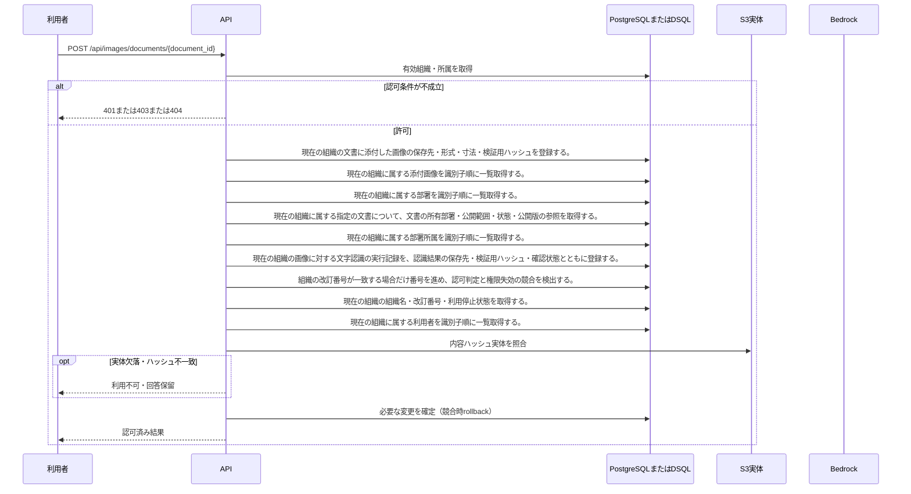

<!-- 実装から生成。直接編集しない。入力SHA256: 31de213f242d3d7bf0d4f5957d4ef327aaacb2267a973d8e0adce1f1531ac7e1 -->

# 画像を添付して位置付きOCRを実行 — シーケンス

章構成: [lazunex API帳票](https://github.com/tsuji-tomonori/lazunex/tree/096e1e580ab1c0670c57e4febad2bd9fdd4698ee/docs/spec/40.apis)。

**制御順序（関数内の行順）**

| 関数 | 行 | 要素 | 条件・早期終了・例外 |
| --- | --- | --- | --- |
| kotorelay.context.Context.document | 90 | Return | doc |
| kotorelay.context.new_id | 22 | Return | str(uuid4()) |
| kotorelay.context.now | 18 | Return | datetime.now(UTC) |
| kotorelay.errors.require | 13 | If | not condition |
| kotorelay.errors.require | 14 | Raise | Raise |
| kotorelay.operations.images.functions.normalize_image | 21 | Try | Try |
| kotorelay.operations.images.functions.normalize_image | 37 | Return | (value, image.width, image.height) |
| kotorelay.operations.images.functions.normalize_image | 38 | ExceptHandler | (UnidentifiedImageError, OSError, Image.DecompressionBombError) |
| kotorelay.operations.images.functions.normalize_image | 39 | Raise | Raise |
| kotorelay.operations.images.functions.run_ocr | 46 | Try | Try |
| kotorelay.operations.images.functions.run_ocr | 53 | ExceptHandler | (OSError, subprocess.TimeoutExpired, subprocess.CalledProcessError) |
| kotorelay.operations.images.functions.run_ocr | 54 | Return | OcrResult(regions=[], engine='tesseract-jpn-eng-v1', status='failed') |
| kotorelay.operations.images.functions.run_ocr | 56 | For | For |
| kotorelay.operations.images.functions.run_ocr | 58 | If | text |
| kotorelay.operations.images.functions.run_ocr | 71 | Return | OcrResult(regions=regions, engine='tesseract-jpn-eng-v1', status='ready') |
| kotorelay.operations.images.functions.upload | 111 | Return | {'asset': asset, 'ocr_run': run, 'ocr': result} |
| kotorelay.operations.images.router.upload_image | 22 | Return | f.upload(ctx, str(document_id), file.file.read(ctx.settings.max_image_bytes + 1)) |
