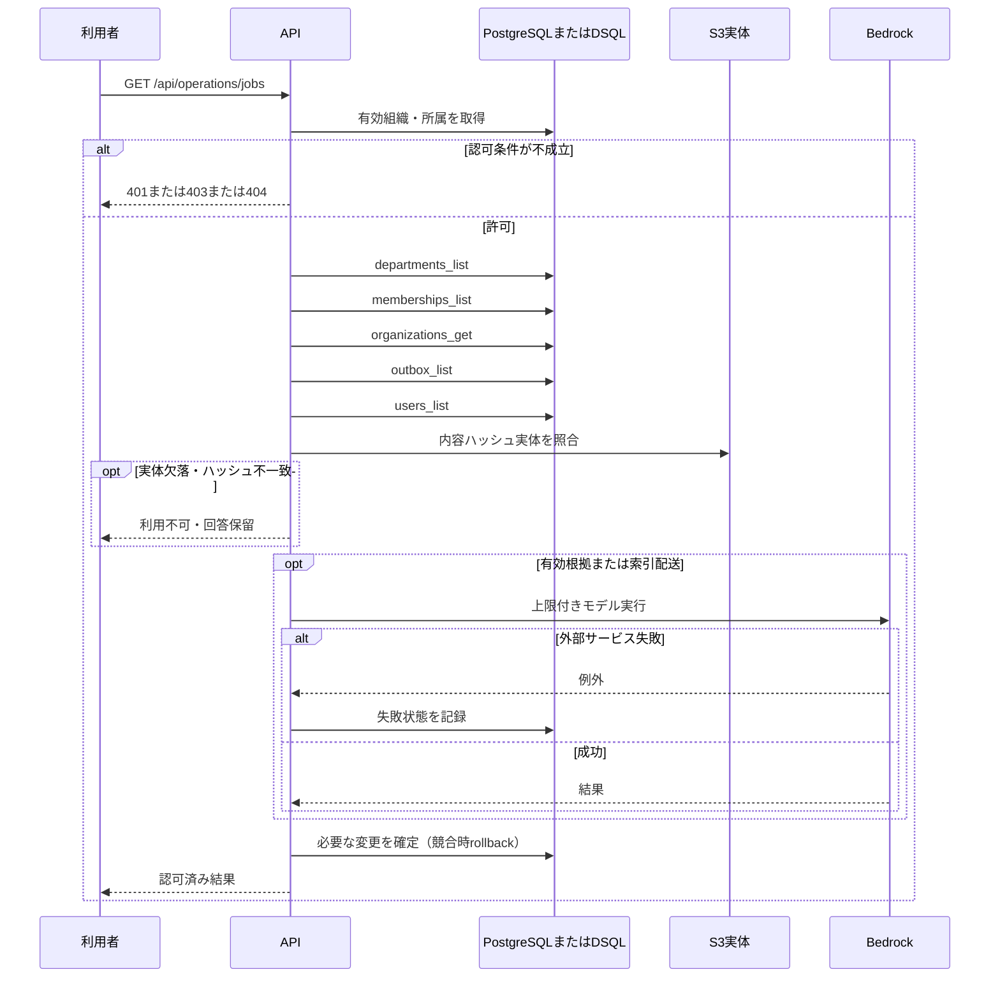

<!-- 実装から生成。直接編集しない。入力SHA256: f4209c4ed7b292c6ed57aa300cf25000f8931a1f59b1fb43cfeb436b1d949dbe -->

# 反映ジョブと失敗理由を確認 — sequence

## 制御順序（関数内の行順）

| 関数 | 行 | 要素 | 条件・早期終了・例外 |
| --- | --- | --- | --- |
| kotorelay.errors.require | 13 | If | not condition |
| kotorelay.errors.require | 14 | Raise | Raise |
| kotorelay.operations.indexing.functions.jobs | 200 | Return | q.outbox_list(ctx.db, ctx.org) |
| kotorelay.operations.indexing.router.list_jobs | 16 | Return | f.jobs(ctx) |
