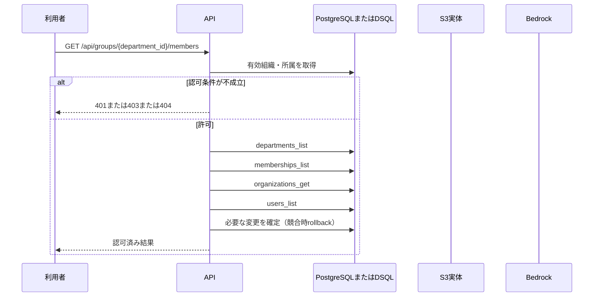

<!-- 実装から生成。直接編集しない。入力SHA256: e3cb305ddf380bd9917bab7f5404c8ac54c8511b8d91b58e7192aa0d5991c3cf -->

# 自部署の所属を一覧 — sequence

## 制御順序（関数内の行順）

| 関数 | 行 | 要素 | 条件・早期終了・例外 |
| --- | --- | --- | --- |
| kotorelay.context.Context.permission | 59 | For | For |
| kotorelay.context.Context.permission | 60 | If | m.department_id == department_id |
| kotorelay.context.Context.permission | 61 | Return | {'author': m.can_author, 'review': m.can_review, 'manage': m.leader, 'draft': m.can_author or m.can_review}.get(operation, False) |
| kotorelay.context.Context.permission | 67 | Return | False |
| kotorelay.errors.require | 13 | If | not condition |
| kotorelay.errors.require | 14 | Raise | Raise |
| kotorelay.operations.groups.functions.members | 22 | Return | [{'membership': m, 'display_name': users[m.user_id].display_name} for m in q.memberships_list(ctx.db, ctx.org) if m.department_id == department_id] |
| kotorelay.operations.groups.router.list_members | 22 | Return | f.members(ctx, str(department_id)) |
