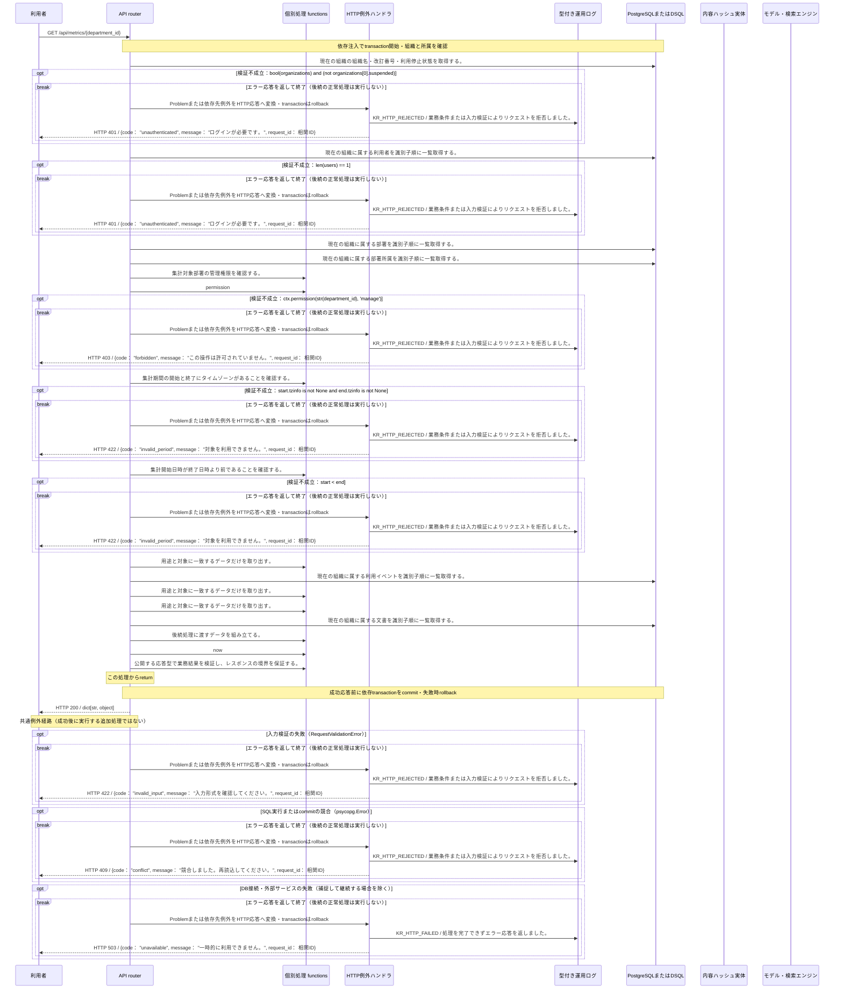

<!-- 実装から生成。直接編集しない。入力SHA256: 0ce2ee5ffefd1f44a0c3da213ceff59dfb82649c9add5715e204664ffd05fd84 -->

# 部署の利用数と文書貢献を集計 — シーケンス

章構成: [lazunex API帳票](https://github.com/tsuji-tomonori/lazunex/tree/096e1e580ab1c0670c57e4febad2bd9fdd4698ee/docs/spec/40.apis)。

**例外応答一覧（HTTP境界へ到達した場合）**

| HTTP | code | message | 相関ID |
| --- | --- | --- | --- |
| 401 | unauthenticated | ログインが必要です。 | request_id |
| 403 | forbidden | この操作は許可されていません。 | request_id |
| 409 | conflict | 競合しました。再読込してください。 | request_id |
| 422 | invalid_input | 入力形式を確認してください。 | request_id |
| 422 | invalid_period | 対象を利用できません。 | request_id |
| 503 | unavailable | 一時的に利用できません。 | request_id |

**制御順序（関数内の行順）**

| 関数 | 行 | 要素 | 条件・早期終了・例外 |
| --- | --- | --- | --- |
| kotorelay.context.Context.permission | 78 | For | For |
| kotorelay.context.Context.permission | 79 | If | m.department_id == department_id |
| kotorelay.context.Context.permission | 80 | Return | {'author': m.can_author, 'review': m.can_review, 'manage': m.leader, 'draft': m.can_author or m.can_review}.get(operation, False) |
| kotorelay.context.Context.permission | 86 | Return | False |
| kotorelay.context.now | 19 | Return | datetime.now(UTC) |
| kotorelay.errors.require | 13 | If | not condition |
| kotorelay.errors.require | 14 | Raise | Raise |
| kotorelay.operations.metrics.department_metrics.functions.build_department_metrics | 66 | Return | {'department_id': str(department_id), 'timezone': 'Asia/Tokyo', 'generated_at': now().astimezone(ZoneInfo('Asia/Tokyo')), 'start': start, 'end': end, 'questions': sum((e.kind == 'question' for e in consumed)), 'views': sum((e.kind == 'view' for e in consumed)), 'unique_viewers': len({e.user_id for e in consumed if e.kind == 'view'}), 'outcomes': {status: sum((e.kind == 'outcome' and e.outcome == status for e in consumed)) for status in ['answered', 'held', 'failed', 'cancelled']}, 'documents': [{'id': d.id, 'title': d.title, 'views': sum((e.kind == 'view' and e.document_id == d.id for e in events)), 'contributions': len({e.answer_id for e in events if e.kind == 'contribution' and e.document_id == d.id})} for d in docs]} |
| kotorelay.operations.metrics.department_metrics.functions.require_manager_permission | 17 | Return | require(ctx.permission(str(department_id), 'manage'), 'forbidden', 403) |
| kotorelay.operations.metrics.department_metrics.functions.require_period_timezone | 22 | Return | require(start.tzinfo is not None and end.tzinfo is not None, 'invalid_period', 422) |
| kotorelay.operations.metrics.department_metrics.functions.select_consumed | 45 | Return | [e for e in events if e.department_id == str(department_id)] |
| kotorelay.operations.metrics.department_metrics.functions.select_docs | 50 | Return | [d for d in q.documents_list(ctx.db, q.DocumentsListParams(organization_id=ctx.org)) if d.department_id == str(department_id)] |
| kotorelay.operations.metrics.department_metrics.functions.select_events | 34 | Return | [e for e in q.events_list(ctx.db, q.EventsListParams(organization_id=ctx.org)) if start <= e.created_at < end] |
| kotorelay.operations.metrics.department_metrics.functions.validate_period_order | 27 | Return | require(start < end, 'invalid_period', 422) |
| kotorelay.operations.metrics.department_metrics.response_builders.build_response | 10 | Return | TypeAdapter(ResponseData).validate_python(value) |
| kotorelay.operations.metrics.department_metrics.router.department_metrics | 34 | Return | build_response(f.build_department_metrics(start, end, department_id, docs, consumed, events)) |
