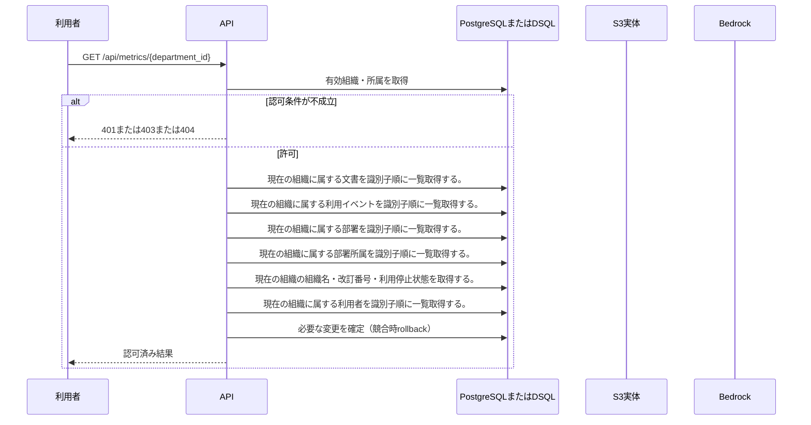

<!-- 実装から生成。直接編集しない。入力SHA256: 987c18a693c5fa5c9f59f732c65771f1c047c0829e22a5d72b689276aae93c56 -->

# 部署の利用数と文書貢献を集計 — シーケンス

章構成: [lazunex API帳票](https://github.com/tsuji-tomonori/lazunex/tree/096e1e580ab1c0670c57e4febad2bd9fdd4698ee/docs/spec/40.apis)。

**制御順序（関数内の行順）**

| 関数 | 行 | 要素 | 条件・早期終了・例外 |
| --- | --- | --- | --- |
| kotorelay.context.Context.permission | 60 | For | For |
| kotorelay.context.Context.permission | 61 | If | m.department_id == department_id |
| kotorelay.context.Context.permission | 62 | Return | {'author': m.can_author, 'review': m.can_review, 'manage': m.leader, 'draft': m.can_author or m.can_review}.get(operation, False) |
| kotorelay.context.Context.permission | 68 | Return | False |
| kotorelay.context.now | 19 | Return | datetime.now(UTC) |
| kotorelay.errors.require | 13 | If | not condition |
| kotorelay.errors.require | 14 | Raise | Raise |
| kotorelay.operations.metrics.department_metrics.functions.summary | 20 | Return | {'department_id': department_id, 'timezone': 'Asia/Tokyo', 'generated_at': now().astimezone(ZoneInfo('Asia/Tokyo')), 'start': start, 'end': end, 'questions': sum((e.kind == 'question' for e in consumed)), 'views': sum((e.kind == 'view' for e in consumed)), 'unique_viewers': len({e.user_id for e in consumed if e.kind == 'view'}), 'outcomes': {status: sum((e.kind == 'outcome' and e.outcome == status for e in consumed)) for status in ['answered', 'held', 'failed', 'cancelled']}, 'documents': [{'id': d.id, 'title': d.title, 'views': sum((e.kind == 'view' and e.document_id == d.id for e in events)), 'contributions': len({e.answer_id for e in events if e.kind == 'contribution' and e.document_id == d.id})} for d in docs]} |
| kotorelay.operations.metrics.department_metrics.response_builders.build_response | 10 | Return | TypeAdapter(ResponseData).validate_python(value) |
| kotorelay.operations.metrics.department_metrics.router.department_metrics | 26 | Return | build_response(f.summary(ctx, str(department_id), start, end)) |
