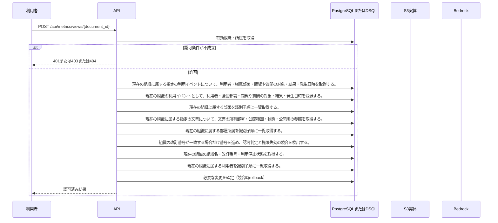

<!-- 実装から生成。直接編集しない。入力SHA256: 987c18a693c5fa5c9f59f732c65771f1c047c0829e22a5d72b689276aae93c56 -->

# 実閲覧を一意IDで記録 — シーケンス

章構成: [lazunex API帳票](https://github.com/tsuji-tomonori/lazunex/tree/096e1e580ab1c0670c57e4febad2bd9fdd4698ee/docs/spec/40.apis)。

**制御順序（関数内の行順）**

| 関数 | 行 | 要素 | 条件・早期終了・例外 |
| --- | --- | --- | --- |
| kotorelay.context.Context.document | 91 | Return | doc |
| kotorelay.context.Context.member | 57 | Return | any((m.department_id == department_id for m in self.memberships)) |
| kotorelay.context.now | 19 | Return | datetime.now(UTC) |
| kotorelay.context.stable_id | 27 | Return | str(uuid5(NAMESPACE_URL, 'kotorelay:' + value)) |
| kotorelay.errors.require | 13 | If | not condition |
| kotorelay.errors.require | 14 | Raise | Raise |
| kotorelay.operations.metrics.record_view.functions.view | 18 | If | previous |
| kotorelay.operations.metrics.record_view.functions.view | 26 | Return | {'recorded': False} |
| kotorelay.operations.metrics.record_view.functions.view | 42 | Return | {'recorded': True} |
| kotorelay.operations.metrics.record_view.response_builders.build_response | 10 | Return | TypeAdapter(ResponseData).validate_python(value) |
| kotorelay.operations.metrics.record_view.router.record_view | 24 | Return | build_response(f.view(ctx, str(document_id), data)) |
