<!-- 実装から生成。直接編集しない。入力SHA256: ac3b8a89c10fb6f4c0a9456ea4fb59251414105722d4188a0beaca0d8b493f26 -->

# 実閲覧を一意IDで記録 — シーケンス

章構成: [lazunex API帳票](https://github.com/tsuji-tomonori/lazunex/tree/096e1e580ab1c0670c57e4febad2bd9fdd4698ee/docs/spec/40.apis)。

```mermaid
sequenceDiagram
    participant U as 利用者
    participant A as API router
    participant F as 個別処理 functions
    participant L as 型付き運用ログ
    participant D as PostgreSQLまたはDSQL
    participant S as 内容ハッシュ実体
    participant M as モデル・検索エンジン
    U->>A: POST /api/metrics/views/{document_id}
    opt 認証に失敗した場合
    break エラー応答を返して終了
    A->>L: KR_HTTP_REJECTED
    A-->>U: HTTP 401 / ログインが必要です。
    end
    end
    opt リクエストの入力形式が不正な場合
    break エラー応答を返して終了
    A->>L: KR_HTTP_REJECTED
    A-->>U: HTTP 422 / 入力形式を確認してください。
    end
    end
    A->>D: 依存注入でtransaction開始・組織と所属を確認
    opt DB接続で競合が発生した場合
    break エラー応答を返して終了
    A->>L: KR_HTTP_REJECTED
    A-->>U: HTTP 409 / 競合しました。再読込してください。
    end
    end
    opt DB接続でDBを利用できない場合
    break エラー応答を返して終了
    A->>L: KR_HTTP_FAILED
    A-->>U: HTTP 503 / 一時的に利用できません。
    end
    end
    A->>D: 現在の組織の組織名・改訂番号・利用停止状態を取得する。
    opt SQL実行で競合が発生した場合
    break エラー応答を返して終了
    A->>L: KR_HTTP_REJECTED
    A-->>U: HTTP 409 / 競合しました。再読込してください。
    end
    end
    opt SQL実行でDBを利用できない場合
    break エラー応答を返して終了
    A->>L: KR_HTTP_FAILED
    A-->>U: HTTP 503 / 一時的に利用できません。
    end
    end
    opt 検証不成立：有効な組織と利用者を確認し、最新の所属を読み込む。
    break エラー応答を返して終了
    A->>L: KR_HTTP_REJECTED
    A-->>U: HTTP 401 / ログインが必要です。
    end
    end
    A->>D: 現在の組織に属する利用者を識別子順に一覧取得する。
    opt SQL実行で競合が発生した場合
    break エラー応答を返して終了
    A->>L: KR_HTTP_REJECTED
    A-->>U: HTTP 409 / 競合しました。再読込してください。
    end
    end
    opt SQL実行でDBを利用できない場合
    break エラー応答を返して終了
    A->>L: KR_HTTP_FAILED
    A-->>U: HTTP 503 / 一時的に利用できません。
    end
    end
    opt 検証不成立：有効な組織と利用者を確認し、最新の所属を読み込む。
    break エラー応答を返して終了
    A->>L: KR_HTTP_REJECTED
    A-->>U: HTTP 401 / ログインが必要です。
    end
    end
    A->>D: 現在の組織に属する部署を識別子順に一覧取得する。
    opt SQL実行で競合が発生した場合
    break エラー応答を返して終了
    A->>L: KR_HTTP_REJECTED
    A-->>U: HTTP 409 / 競合しました。再読込してください。
    end
    end
    opt SQL実行でDBを利用できない場合
    break エラー応答を返して終了
    A->>L: KR_HTTP_FAILED
    A-->>U: HTTP 503 / 一時的に利用できません。
    end
    end
    A->>D: 現在の組織に属する部署所属を識別子順に一覧取得する。
    opt SQL実行で競合が発生した場合
    break エラー応答を返して終了
    A->>L: KR_HTTP_REJECTED
    A-->>U: HTTP 409 / 競合しました。再読込してください。
    end
    end
    opt SQL実行でDBを利用できない場合
    break エラー応答を返して終了
    A->>L: KR_HTTP_FAILED
    A-->>U: HTTP 503 / 一時的に利用できません。
    end
    end
    A->>F: 文書を取得して要求された操作の権限を確認する。
    A->>F: 対象の文書が存在し、要求された操作を実行できることを確認する。
    A->>D: 現在の組織に属する指定の文書について、文書の所有部署・公開範囲・状態・公開版の参照を取得する。
    opt SQL実行で競合が発生した場合
    break エラー応答を返して終了
    A->>L: KR_HTTP_REJECTED
    A-->>U: HTTP 409 / 競合しました。再読込してください。
    end
    end
    opt SQL実行でDBを利用できない場合
    break エラー応答を返して終了
    A->>L: KR_HTTP_FAILED
    A-->>U: HTTP 503 / 一時的に利用できません。
    end
    end
    opt 検証不成立：対象の文書が存在し、要求された操作を実行できることを確認する。
    break エラー応答を返して終了
    A->>L: KR_HTTP_REJECTED
    A-->>U: HTTP 404 / 対象を利用できません。
    end
    end
    A->>F: 文書の閲覧権限を確認する操作である。
    alt 文書の閲覧権限を確認する操作である。
    A->>F: 現在の所属と公開範囲で文書を閲覧できる。
    A->>F: 指定した部署に現在も所属している。
    opt 前条件が成立
    loop json.loads(doc.shared_departments)
    A->>F: 指定した部署に現在も所属している。
    end
    end
    else 条件不成立
    opt 前条件が成立
    A->>F: 指定した部署で要求された操作を実行できる。
    end
    end
    opt 検証不成立：対象の文書が存在し、要求された操作を実行できることを確認する。
    break エラー応答を返して終了
    A->>L: KR_HTTP_REJECTED
    A-->>U: HTTP 404 / 対象を利用できません。
    end
    end
    A->>F: 閲覧対象に公開中の承認版が存在することを確認する。
    opt 検証不成立：閲覧対象に公開中の承認版が存在することを確認する。
    break エラー応答を返して終了
    A->>L: KR_HTTP_REJECTED
    A-->>U: HTTP 404 / 対象を利用できません。
    end
    end
    A->>F: 閲覧の帰属先部署への所属を確認する。
    A->>F: 指定した部署に現在も所属している。
    opt 検証不成立：閲覧の帰属先部署への所属を確認する。
    break エラー応答を返して終了
    A->>L: KR_HTTP_REJECTED
    A-->>U: HTTP 403 / この操作は許可されていません。
    end
    end
    A->>F: stable_id
    A->>F: 現在の組織に属する指定の利用イベントについて、利用者・帰属部署・閲覧や質問の対象・結果・発生日時を取得する。
    A->>D: 現在の組織に属する指定の利用イベントについて、利用者・帰属部署・閲覧や質問の対象・結果・発生日時を取得する。
    opt SQL実行で競合が発生した場合
    break エラー応答を返して終了
    A->>L: KR_HTTP_REJECTED
    A-->>U: HTTP 409 / 競合しました。再読込してください。
    end
    end
    opt SQL実行でDBを利用できない場合
    break エラー応答を返して終了
    A->>L: KR_HTTP_FAILED
    A-->>U: HTTP 503 / 一時的に利用できません。
    end
    end
    A->>F: 同じ閲覧イベントが既に記録されている。
    alt 同じ閲覧イベントが既に記録されている。
    A->>F: 同じ冪等キーの閲覧対象と帰属部署が一致することを確認する。
    opt 検証不成立：同じ冪等キーの閲覧対象と帰属部署が一致することを確認する。
    break エラー応答を返して終了
    A->>L: KR_HTTP_REJECTED
    A-->>U: HTTP 409 / 同じ操作IDが異なる内容で使用されています。
    end
    end
    A->>F: 後続処理に渡すデータを組み立てる。
    A->>F: 公開する応答型で業務結果を検証し、レスポンスの境界を保証する。
    break 応答を返して終了
    A->>D: transactionをcommit
    opt commitで競合が発生した場合
    break エラー応答を返して終了
    A->>L: KR_HTTP_REJECTED
    A-->>U: HTTP 409 / 競合しました。再読込してください。
    end
    end
    opt commitでDBを利用できない場合
    break エラー応答を返して終了
    A->>L: KR_HTTP_FAILED
    A-->>U: HTTP 503 / 一時的に利用できません。
    end
    end
    A-->>U: HTTP 200 / dict[str, bool]
    end
    end
    A->>F: 現在の組織の利用イベントとして、利用者・帰属部署・閲覧や質問の対象・結果・発生日時を登録する。
    A->>F: now
    A->>D: 現在の組織の利用イベントとして、利用者・帰属部署・閲覧や質問の対象・結果・発生日時を登録する。
    opt SQL実行で競合が発生した場合
    break エラー応答を返して終了
    A->>L: KR_HTTP_REJECTED
    A-->>U: HTTP 409 / 競合しました。再読込してください。
    end
    end
    opt SQL実行でDBを利用できない場合
    break エラー応答を返して終了
    A->>L: KR_HTTP_FAILED
    A-->>U: HTTP 503 / 一時的に利用できません。
    end
    end
    A->>F: 組織の更新競合を検出するための書込みフェンスを更新する。
    A->>F: 処理中に組織の状態が変更されていないことを確認する。
    A->>D: 組織の改訂番号が一致する場合だけ番号を進め、認可判定と権限失効の競合を検出する。
    opt SQL実行で競合が発生した場合
    break エラー応答を返して終了
    A->>L: KR_HTTP_REJECTED
    A-->>U: HTTP 409 / 競合しました。再読込してください。
    end
    end
    opt SQL実行でDBを利用できない場合
    break エラー応答を返して終了
    A->>L: KR_HTTP_FAILED
    A-->>U: HTTP 503 / 一時的に利用できません。
    end
    end
    opt 検証不成立：処理中に組織の状態が変更されていないことを確認する。
    break エラー応答を返して終了
    A->>L: KR_HTTP_REJECTED
    A-->>U: HTTP 409 / 他の操作で更新されました。最新の状態を確認してください。
    end
    end
    A->>F: 後続処理に渡すデータを組み立てる。
    A->>F: 公開する応答型で業務結果を検証し、レスポンスの境界を保証する。
    break 応答を返して終了
    A->>D: transactionをcommit
    opt commitで競合が発生した場合
    break エラー応答を返して終了
    A->>L: KR_HTTP_REJECTED
    A-->>U: HTTP 409 / 競合しました。再読込してください。
    end
    end
    opt commitでDBを利用できない場合
    break エラー応答を返して終了
    A->>L: KR_HTTP_FAILED
    A-->>U: HTTP 503 / 一時的に利用できません。
    end
    end
    A-->>U: HTTP 200 / dict[str, bool]
    end
```

**例外応答一覧（HTTP境界へ到達した場合）**

| HTTP | code | message | 相関ID |
| --- | --- | --- | --- |
| 401 | unauthenticated | ログインが必要です。 | request_id |
| 403 | forbidden | この操作は許可されていません。 | request_id |
| 404 | not_found | 対象を利用できません。 | request_id |
| 409 | conflict | 他の操作で更新されました。最新の状態を確認してください。 | request_id |
| 409 | conflict | 競合しました。再読込してください。 | request_id |
| 409 | idempotency_conflict | 同じ操作IDが異なる内容で使用されています。 | request_id |
| 422 | invalid_input | 入力形式を確認してください。 | request_id |
| 503 | unavailable | 一時的に利用できません。 | request_id |

**制御順序（関数内の行順）**

| 関数 | 行 | 要素 | 条件・早期終了・例外 |
| --- | --- | --- | --- |
| kotorelay.context.Context.document | 118 | Return | doc |
| kotorelay.context.Context.member | 79 | Return | any((m.department_id == department_id for m in self.memberships)) |
| kotorelay.context.now | 20 | Return | datetime.now(UTC) |
| kotorelay.context.stable_id | 28 | Return | str(uuid5(NAMESPACE_URL, 'kotorelay:' + value)) |
| kotorelay.errors.require | 13 | If | not condition |
| kotorelay.errors.require | 14 | Raise | Raise |
| kotorelay.operations.metrics.record_view.functions.build_record_view | 52 | Return | {'recorded': False} |
| kotorelay.operations.metrics.record_view.functions.build_record_view_2 | 85 | Return | {'recorded': True} |
| kotorelay.operations.metrics.record_view.functions.check_concurrent_access | 80 | Return | ctx.fence() |
| kotorelay.operations.metrics.record_view.functions.document_doc | 17 | Return | ctx.document(str(document_id)) |
| kotorelay.operations.metrics.record_view.functions.events_get | 34 | Return | q.events_get(ctx.db, q.EventsGetParams(organization_id=ctx.org, id=event_id)) |
| kotorelay.operations.metrics.record_view.functions.events_insert | 62 | Return | q.events_insert(ctx.db, q.EventsInsertParams(id=event_id, organization_id=ctx.org, user_id=ctx.user.id, department_id=data.department_id, document_id=doc.id, answer_id=None, kind='view', outcome='viewed', created_at=now())) |
| kotorelay.operations.metrics.record_view.functions.has_previous_view | 90 | Return | bool(rows) |
| kotorelay.operations.metrics.record_view.functions.require_consuming_membership | 29 | Return | require(ctx.member(data.department_id), 'forbidden', 403) |
| kotorelay.operations.metrics.record_view.functions.require_published_version | 22 | Return | require(bool(doc.latest_version_id)) |
| kotorelay.operations.metrics.record_view.functions.validate_repeated_view | 41 | Return | require(previous[0].document_id == doc.id and previous[0].department_id == data.department_id and (previous[0].kind == 'view'), 'idempotency_conflict', 409) |
| kotorelay.operations.metrics.record_view.response_builders.build_response | 10 | Return | TypeAdapter(ResponseData).validate_python(value) |
| kotorelay.operations.metrics.record_view.router.record_view | 32 | If | f.has_previous_view(previous) |
| kotorelay.operations.metrics.record_view.router.record_view | 34 | Return | build_response(f.build_record_view()) |
| kotorelay.operations.metrics.record_view.router.record_view | 37 | Return | build_response(f.build_record_view_2()) |
| kotorelay.operations.system.authorization.functions.is_read_operation | 6 | Return | operation == 'read' |
