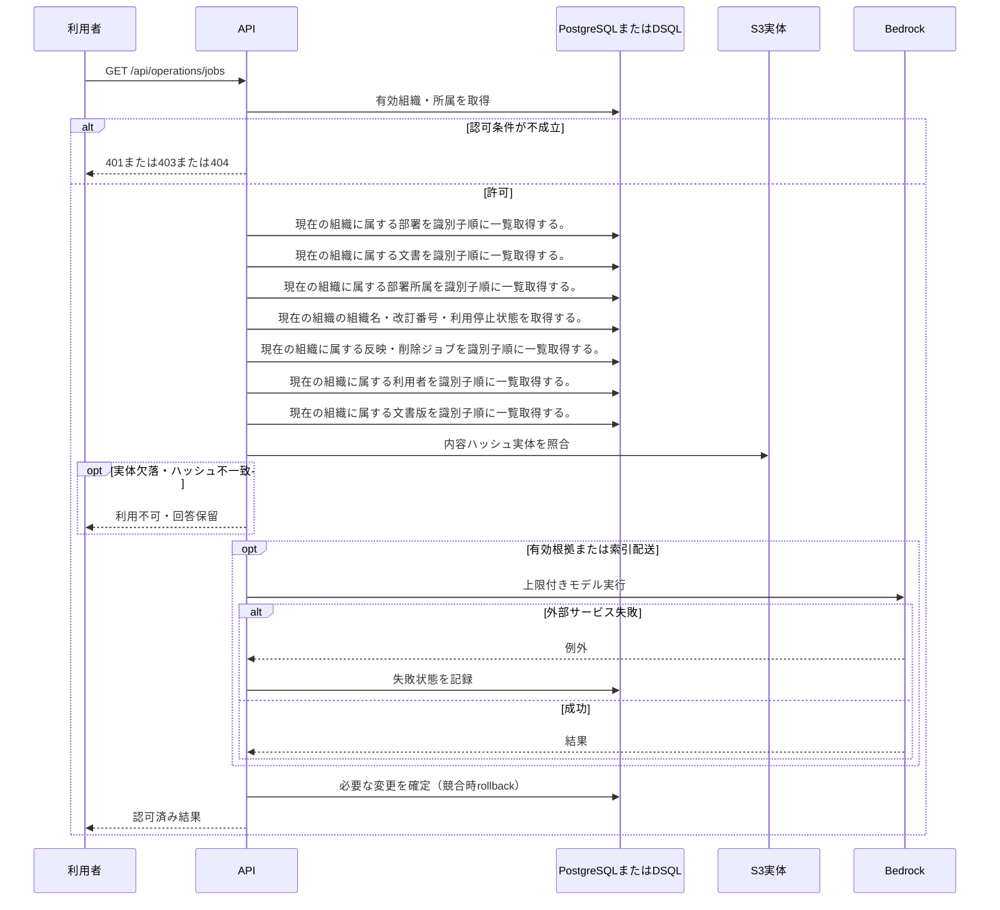

<!-- 実装から生成。直接編集しない。入力SHA256: 31de213f242d3d7bf0d4f5957d4ef327aaacb2267a973d8e0adce1f1531ac7e1 -->

# 反映ジョブと失敗理由を確認 — シーケンス

章構成: [lazunex API帳票](https://github.com/tsuji-tomonori/lazunex/tree/096e1e580ab1c0670c57e4febad2bd9fdd4698ee/docs/spec/40.apis)。

**制御順序（関数内の行順）**

| 関数 | 行 | 要素 | 条件・早期終了・例外 |
| --- | --- | --- | --- |
| kotorelay.errors.require | 13 | If | not condition |
| kotorelay.errors.require | 14 | Raise | Raise |
| kotorelay.operations.indexing.functions.job_details | 207 | Return | [dict(row.model_dump(), title=docs[row.document_id].title, version_number=versions[row.version_id].number if row.version_id else None) for row in rows] |
| kotorelay.operations.indexing.functions.jobs | 200 | Return | q.outbox_list(ctx.db, ctx.org) |
| kotorelay.operations.indexing.router.list_jobs | 16 | Return | f.job_details(ctx) if details else [row.model_dump() for row in f.jobs(ctx)] |
