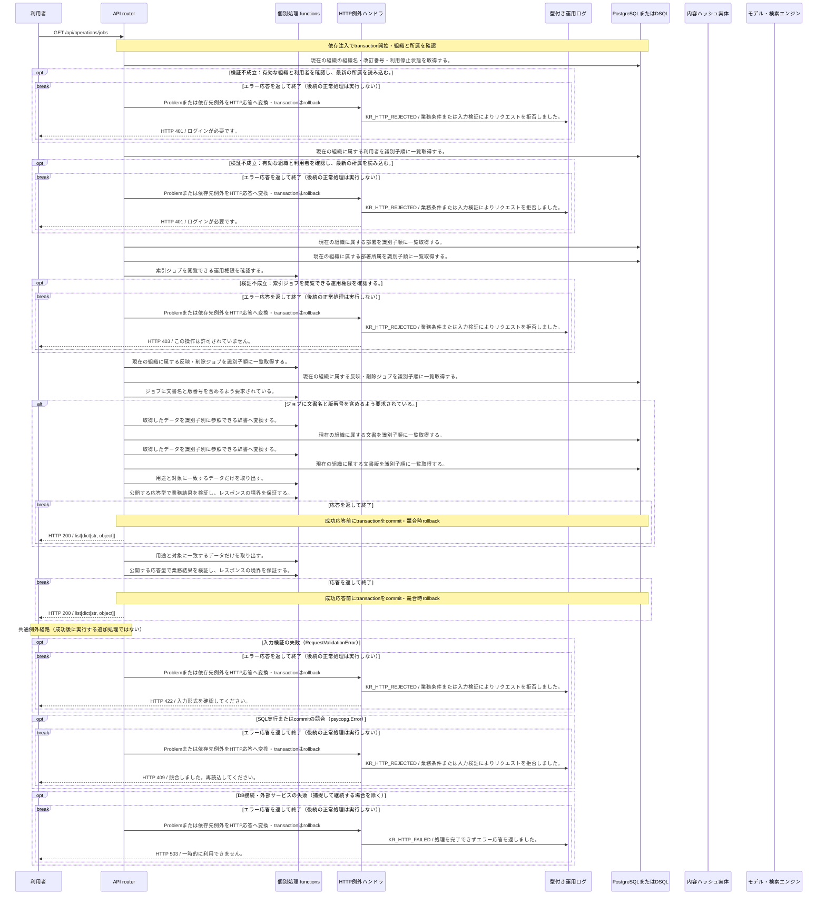

<!-- 実装から生成。直接編集しない。入力SHA256: dc958b6e6841a9f29856eb932e8271e37a6d4416a3266624301c411c89949f81 -->

# 反映ジョブと失敗理由を確認 — シーケンス

章構成: [lazunex API帳票](https://github.com/tsuji-tomonori/lazunex/tree/096e1e580ab1c0670c57e4febad2bd9fdd4698ee/docs/spec/40.apis)。

**例外応答一覧（HTTP境界へ到達した場合）**

| HTTP | code | message | 相関ID |
| --- | --- | --- | --- |
| 401 | unauthenticated | ログインが必要です。 | request_id |
| 403 | forbidden | この操作は許可されていません。 | request_id |
| 409 | conflict | 競合しました。再読込してください。 | request_id |
| 422 | invalid_input | 入力形式を確認してください。 | request_id |
| 503 | unavailable | 一時的に利用できません。 | request_id |

**制御順序（関数内の行順）**

| 関数 | 行 | 要素 | 条件・早期終了・例外 |
| --- | --- | --- | --- |
| kotorelay.errors.require | 13 | If | not condition |
| kotorelay.errors.require | 14 | Raise | Raise |
| kotorelay.operations.indexing.list_jobs.functions.map_docs | 28 | Return | {d.id: d for d in q.documents_list(ctx.db, q.DocumentsListParams(organization_id=ctx.org))} |
| kotorelay.operations.indexing.list_jobs.functions.map_versions | 35 | Return | {v.id: v for v in q.versions_list(ctx.db, q.VersionsListParams(organization_id=ctx.org))} |
| kotorelay.operations.indexing.list_jobs.functions.outbox_list | 23 | Return | q.outbox_list(ctx.db, q.OutboxListParams(organization_id=ctx.org)) |
| kotorelay.operations.indexing.list_jobs.functions.requests_details | 56 | Return | details |
| kotorelay.operations.indexing.list_jobs.functions.require_operator | 18 | Return | require(ctx.user.operator, 'forbidden', 403) |
| kotorelay.operations.indexing.list_jobs.functions.select_job_details | 44 | Return | [dict(row.model_dump(), title=docs[row.document_id].title, version_number=versions[row.version_id].number if row.version_id else None) for row in rows] |
| kotorelay.operations.indexing.list_jobs.functions.select_list_jobs | 13 | Return | [row.model_dump() for row in rows] |
| kotorelay.operations.indexing.list_jobs.response_builders.build_response | 10 | Return | TypeAdapter(ResponseData).validate_python(value) |
| kotorelay.operations.indexing.list_jobs.router.list_jobs | 27 | If | f.requests_details(details) |
| kotorelay.operations.indexing.list_jobs.router.list_jobs | 30 | Return | build_response(f.select_job_details(rows, docs, versions)) |
| kotorelay.operations.indexing.list_jobs.router.list_jobs | 31 | Return | build_response(f.select_list_jobs(rows)) |
