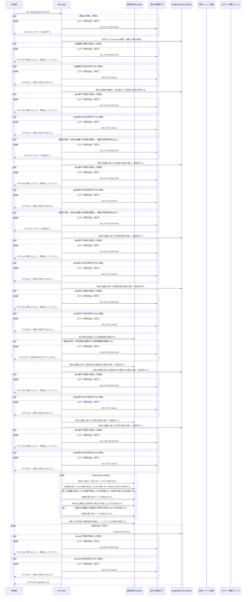

<!-- 実装から生成。直接編集しない。入力SHA256: f473ec4902a9e7cc973e702d4fbb05a99ce8c26a324da9a1f4592aab94dbd60c -->

# 正本と索引の不一致を確認 — シーケンス

章構成: [lazunex API帳票](https://github.com/tsuji-tomonori/lazunex/tree/096e1e580ab1c0670c57e4febad2bd9fdd4698ee/docs/spec/40.apis)。

**例外応答一覧（HTTP境界へ到達した場合）**

| HTTP | code | message | 相関ID |
| --- | --- | --- | --- |
| 401 | unauthenticated | ログインが必要です。 | request_id |
| 403 | forbidden | この操作は許可されていません。 | request_id |
| 409 | conflict | 競合しました。再読込してください。 | request_id |
| 422 | invalid_input | 入力形式を確認してください。 | request_id |
| 503 | unavailable | 一時的に利用できません。 | request_id |

**制御順序（関数内の行順）**

| 関数 | 行 | 要素 | 条件・早期終了・例外 |
| --- | --- | --- | --- |
| kotorelay.errors.require | 13 | If | not condition |
| kotorelay.errors.require | 14 | Raise | Raise |
| kotorelay.operations.indexing.reconcile_index.functions.build_reconcile_index | 32 | Return | {'document_id': doc.id, 'reason': '旧版または停止済みの断片が残留'} |
| kotorelay.operations.indexing.reconcile_index.functions.build_reconcile_index_2 | 46 | Return | {'document_id': doc.id, 'reason': '最新承認版が未反映'} |
| kotorelay.operations.indexing.reconcile_index.functions.chunks_list | 17 | Return | q.chunks_list(ctx.db, q.ChunksListParams(organization_id=ctx.org)) |
| kotorelay.operations.indexing.reconcile_index.functions.documents_list | 22 | Return | q.documents_list(ctx.db, q.DocumentsListParams(organization_id=ctx.org)) |
| kotorelay.operations.indexing.reconcile_index.functions.has_outdated_chunks | 51 | Return | any((chunk.version_id != doc.latest_version_id or doc.status != 'active' for chunk in current)) |
| kotorelay.operations.indexing.reconcile_index.functions.needs_index_repair | 37 | Return | bool(doc.status == 'active' and doc.latest_version_id and (not any((c.version_id == doc.latest_version_id and c.ready for c in current)))) |
| kotorelay.operations.indexing.reconcile_index.functions.require_operator | 12 | Return | require(ctx.user.operator, 'forbidden', 403) |
| kotorelay.operations.indexing.reconcile_index.functions.select_current | 27 | Return | [c for c in chunks if c.document_id == doc.id] |
| kotorelay.operations.indexing.reconcile_index.response_builders.build_response | 10 | Return | TypeAdapter(ResponseData).validate_python(value) |
| kotorelay.operations.indexing.reconcile_index.router.reconcile_index | 26 | For | For |
| kotorelay.operations.indexing.reconcile_index.router.reconcile_index | 28 | If | f.has_outdated_chunks(current, doc) |
| kotorelay.operations.indexing.reconcile_index.router.reconcile_index | 30 | If | f.needs_index_repair(doc, current) |
| kotorelay.operations.indexing.reconcile_index.router.reconcile_index | 32 | Return | build_response(differences) |
