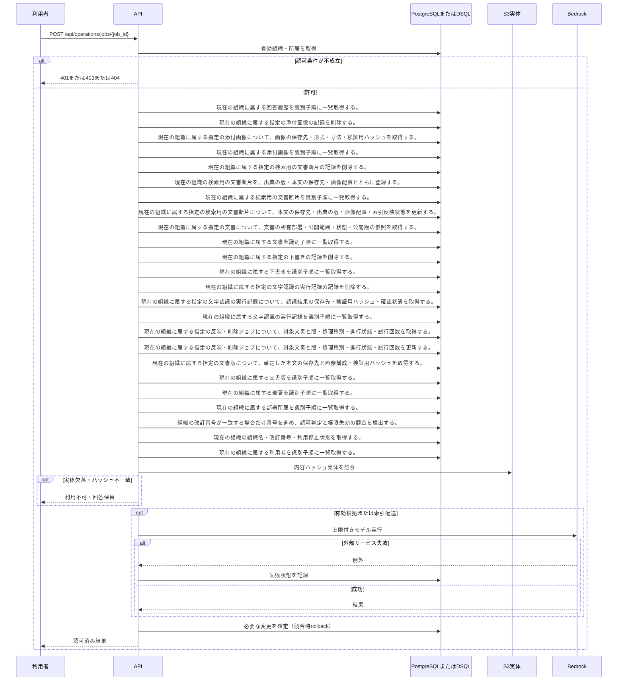

<!-- 実装から生成。直接編集しない。入力SHA256: 987c18a693c5fa5c9f59f732c65771f1c047c0829e22a5d72b689276aae93c56 -->

# 反映ジョブを再処理 — シーケンス

章構成: [lazunex API帳票](https://github.com/tsuji-tomonori/lazunex/tree/096e1e580ab1c0670c57e4febad2bd9fdd4698ee/docs/spec/40.apis)。

**制御順序（関数内の行順）**

| 関数 | 行 | 要素 | 条件・早期終了・例外 |
| --- | --- | --- | --- |
| kotorelay.context.now | 19 | Return | datetime.now(UTC) |
| kotorelay.context.stable_id | 27 | Return | str(uuid5(NAMESPACE_URL, 'kotorelay:' + value)) |
| kotorelay.errors.require | 13 | If | not condition |
| kotorelay.errors.require | 14 | Raise | Raise |
| kotorelay.operations.indexing.retry_job.functions.retry | 13 | Return | process(ctx, engine, job_id) |
| kotorelay.operations.indexing.retry_job.response_builders.build_response | 10 | Return | TypeAdapter(ResponseData).validate_python(value) |
| kotorelay.operations.indexing.retry_job.router.retry_job | 24 | Return | build_response(f.retry(ctx, rt.engine, str(job_id))) |
| kotorelay.operations.indexing.shared.functions.build_index | 41 | If | doc.latest_version_id != job.version_id or not job.version_id |
| kotorelay.operations.indexing.shared.functions.build_index | 42 | Return | 'obsolete' |
| kotorelay.operations.indexing.shared.functions.build_index | 49 | For | For |
| kotorelay.operations.indexing.shared.functions.build_index | 51 | If | len(stale) > 100 |
| kotorelay.operations.indexing.shared.functions.build_index | 52 | Return | 'pending' |
| kotorelay.operations.indexing.shared.functions.build_index | 53 | If | doc.status != 'active' |
| kotorelay.operations.indexing.shared.functions.build_index | 54 | Return | 'done' |
| kotorelay.operations.indexing.shared.functions.build_index | 61 | For | For |
| kotorelay.operations.indexing.shared.functions.build_index | 67 | For | For |
| kotorelay.operations.indexing.shared.functions.build_index | 73 | For | For |
| kotorelay.operations.indexing.shared.functions.build_index | 88 | If | chunk.id in previous |
| kotorelay.operations.indexing.shared.functions.build_index | 94 | For | For |
| kotorelay.operations.indexing.shared.functions.build_index | 97 | Return | 'done' |
| kotorelay.operations.indexing.shared.functions.process | 171 | If | job.status in {'done', 'obsolete'} |
| kotorelay.operations.indexing.shared.functions.process | 172 | Return | job |
| kotorelay.operations.indexing.shared.functions.process | 173 | Try | Try |
| kotorelay.operations.indexing.shared.functions.process | 182 | ExceptHandler | Problem |
| kotorelay.operations.indexing.shared.functions.process | 186 | ExceptHandler | (OSError, BotoCoreError, ClientError) |
| kotorelay.operations.indexing.shared.functions.process | 196 | Return | updated |
| kotorelay.operations.indexing.shared.functions.purge | 102 | If | doc.status != 'deleted' |
| kotorelay.operations.indexing.shared.functions.purge | 103 | Return | 'obsolete' |
| kotorelay.operations.indexing.shared.functions.purge | 104 | If | (now() - job.created_at).total_seconds() < ctx.settings.retention_days * 86400 |
| kotorelay.operations.indexing.shared.functions.purge | 105 | Return | 'retained' |
| kotorelay.operations.indexing.shared.functions.purge | 131 | For | For |
| kotorelay.operations.indexing.shared.functions.purge | 132 | For | For |
| kotorelay.operations.indexing.shared.functions.purge | 133 | If | row.document_id == doc.id |
| kotorelay.operations.indexing.shared.functions.purge | 135 | If | row.document_id in live |
| kotorelay.operations.indexing.shared.functions.purge | 137 | For | For |
| kotorelay.operations.indexing.shared.functions.purge | 143 | For | For |
| kotorelay.operations.indexing.shared.functions.purge | 147 | For | For |
| kotorelay.operations.indexing.shared.functions.purge | 149 | If | len(target_chunks) > 100 |
| kotorelay.operations.indexing.shared.functions.purge | 150 | Return | 'pending' |
| kotorelay.operations.indexing.shared.functions.purge | 152 | For | For |
| kotorelay.operations.indexing.shared.functions.purge | 154 | If | len(target_runs) > 100 |
| kotorelay.operations.indexing.shared.functions.purge | 155 | Return | 'pending' |
| kotorelay.operations.indexing.shared.functions.purge | 156 | For | For |
| kotorelay.operations.indexing.shared.functions.purge | 157 | If | asset.document_id == doc.id |
| kotorelay.operations.indexing.shared.functions.purge | 159 | For | For |
| kotorelay.operations.indexing.shared.functions.purge | 160 | If | draft.document_id == doc.id |
| kotorelay.operations.indexing.shared.functions.purge | 162 | Return | 'done' |
| kotorelay.operations.indexing.shared.functions.split_chunks | 21 | For | For |
| kotorelay.operations.indexing.shared.functions.split_chunks | 22 | If | line.startswith('#') or len(buffer) + len(line) > 1200 |
| kotorelay.operations.indexing.shared.functions.split_chunks | 23 | If | buffer.strip() |
| kotorelay.operations.indexing.shared.functions.split_chunks | 26 | If | line.startswith('#') |
| kotorelay.operations.indexing.shared.functions.split_chunks | 28 | For | For |
| kotorelay.operations.indexing.shared.functions.split_chunks | 30 | If | len(buffer) + len(part) > 1200 and buffer.strip() |
| kotorelay.operations.indexing.shared.functions.split_chunks | 34 | If | buffer.strip() |
| kotorelay.operations.indexing.shared.functions.split_chunks | 36 | Return | chunks |
